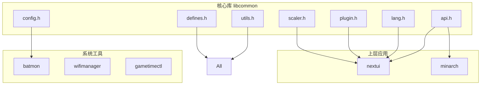
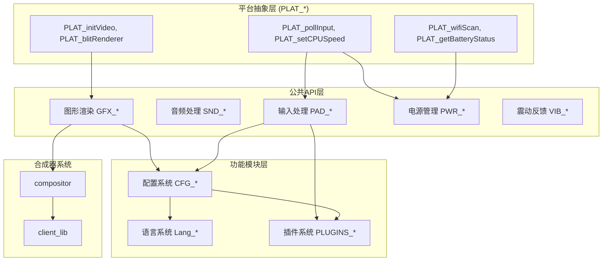
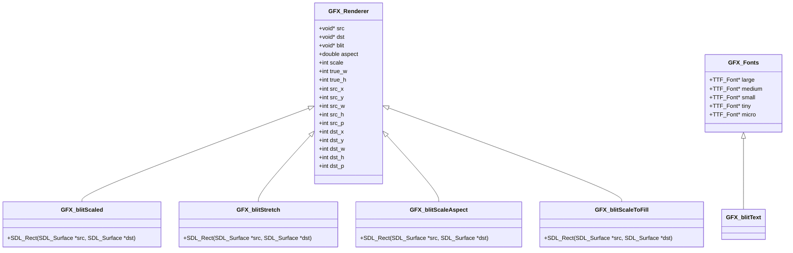
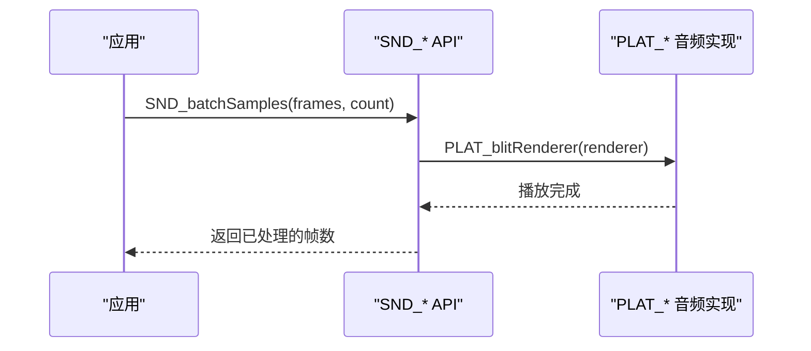
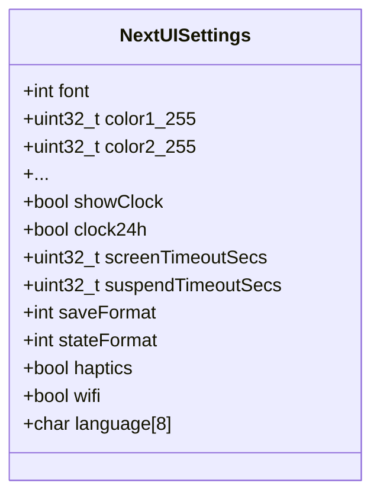
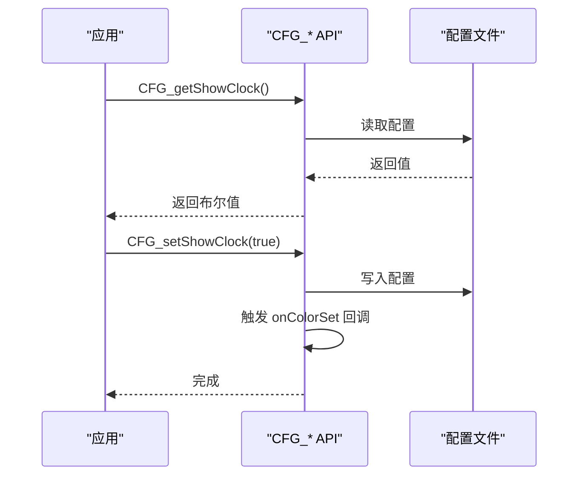
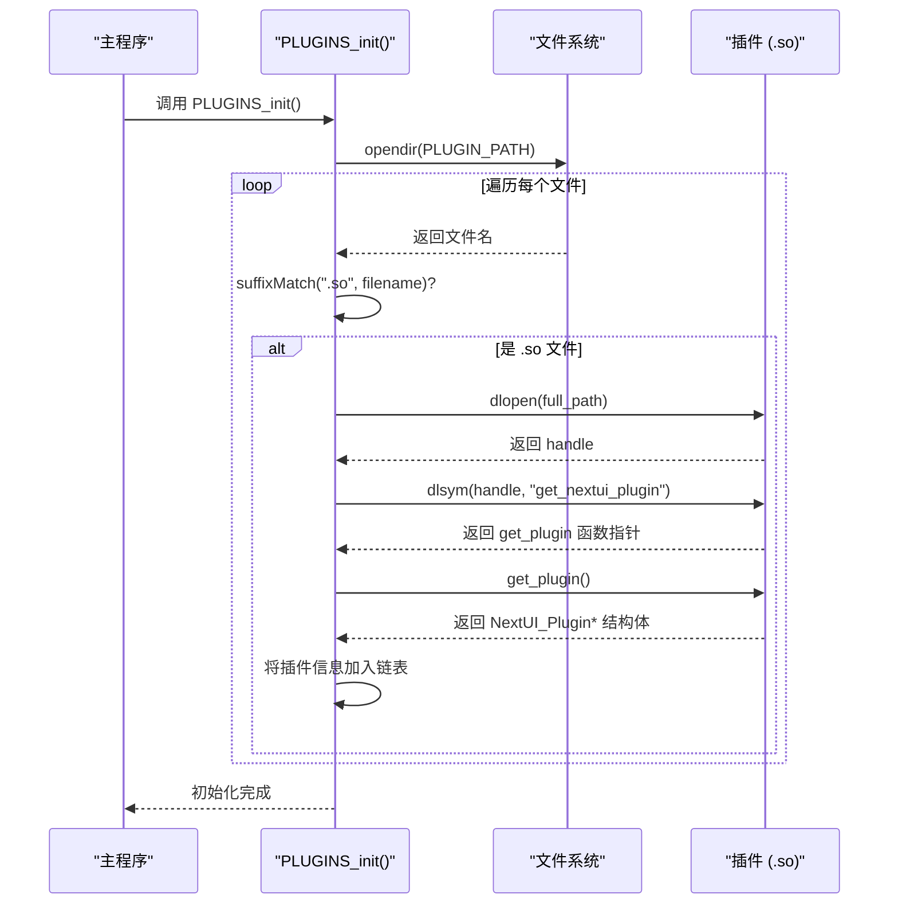
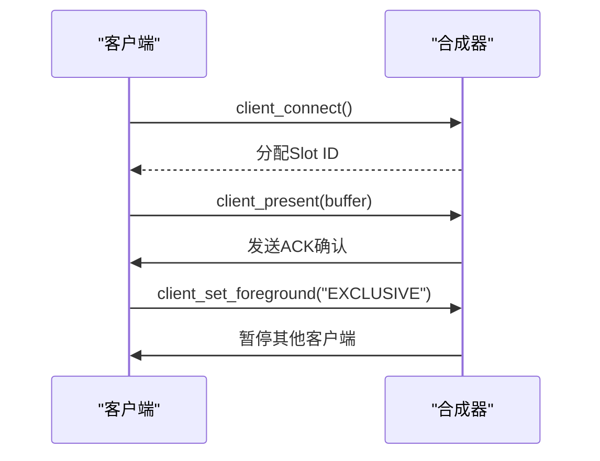

<docs>
# API参考

<cite>
**本文档中引用的文件**   
- [api.h](file://workspace/lib/libcommon/api.h)
- [config.h](file://workspace/lib/libcommon/config.h)
- [lang.h](file://workspace/lib/libcommon/lang.h)
- [lang.c](file://workspace/lib/libcommon/lang.c)
- [plugin.h](file://workspace/lib/libcommon/plugin.h)
- [plugin.c](file://workspace/lib/libcommon/plugin.c)
- [defines.h](file://workspace/lib/libcommon/defines.h)
- [utils.h](file://workspace/lib/libcommon/utils.h)
- [scaler.h](file://workspace/lib/libcommon/scaler.h)
- [sysui.h](file://workspace/lib/libcommon/sysui.h) - *在最近的提交中更新*
- [api.c](file://workspace/lib/libcommon/api.c) - *在最近的提交中更新*
- [sysui.c](file://workspace/lib/libcommon/sysui.c) - *SysUI系统实现*
- [platform.h](file://workspace/lib/libcommon/platform.h) - *平台输入定义*
- [network.cpp](file://workspace/plugins/network/network.cpp) - *网络插件示例*
- [client_lib.h](file://workspace/system/compositor/client_lib/client_lib.h) - *重构为基于句柄的API*
- [protocol.h](file://workspace/system/compositor/protocol.h) - *新增消息类型和ION缓冲区支持*
- [client_lib.c](file://workspace/system/compositor/client_lib/client_lib.c) - *客户端库实现*
- [compositor.c](file://workspace/system/compositor/compositor.c) - *合成器主程序*
</cite>

## 更新摘要
**已做更改**   
- 新增“合成器客户端API”章节，详细介绍了重构后的基于句柄的客户端API，包括`client_connect`、`client_present`等核心函数。
- 新增“合成器协议”章节，说明了协议中新增的消息类型（`MSG_TYPE_BUFFER_RELEASED`）和对零拷贝ION缓冲区的支持。
- 更新了“架构概述”章节，将新的合成器系统（compositor）整合进整体架构图中。
- 在“详细组件分析”中新增了“合成器系统分析”部分，描述了其工作流程和核心功能。
- 增强了源代码跟踪系统，为所有新分析的文件添加了更新注释。

## 目录
1. [简介](#简介)
2. [项目结构](#项目结构)
3. [核心组件](#核心组件)
4. [架构概述](#架构概述)
5. [详细组件分析](#详细组件分析)
6. [依赖分析](#依赖分析)
7. [性能考虑](#性能考虑)
8. [故障排除指南](#故障排除指南)
9. [结论](#结论)

## 简介
本文档为NextUI的libcommon库提供全面的API参考。文档覆盖了`api.h`、`config.h`、`lang.h`和`plugin.h`四个核心头文件中定义的所有公共接口。每个API都提供了详细的函数签名、参数描述、返回值说明、使用示例和线程安全信息。文档旨在为开发者提供一个清晰、易于查找的参考，帮助他们快速理解和使用NextUI的底层功能。

## 项目结构
NextUI项目采用模块化设计，其核心功能被封装在`workspace/lib/libcommon`目录下的库中。该库通过提供一组抽象的API，为上层应用（如`nextui`）和系统工具（如`batmon`、`wifimanager`）提供统一的服务。



**Diagram sources**
- [api.h](file://workspace/lib/libcommon/api.h)
- [config.h](file://workspace/lib/libcommon/config.h)
- [lang.h](file://workspace/lib/libcommon/lang.h)
- [plugin.h](file://workspace/lib/libcommon/plugin.h)

## 核心组件
libcommon库的核心由四个主要子系统构成：图形与音频API（`api.h`）、配置管理（`config.h`）、语言国际化（`lang.h`）和插件系统（`plugin.h`）。这些组件共同构成了NextUI用户界面和系统功能的基础。

**Section sources**
- [api.h](file://workspace/lib/libcommon/api.h)
- [config.h](file://workspace/lib/libcommon/config.h)
- [lang.h](file://workspace/lib/libcommon/lang.h)
- [plugin.h](file://workspace/lib/libcommon/plugin.h)

## 架构概述
libcommon库的架构是一个典型的分层设计。最底层是平台抽象层（PLAT_*），它封装了不同硬件平台（如trimui）的特定实现。中间层是公共API层（GFX_*、SND_*、PAD_*等），它为上层应用提供统一、易用的接口。最上层是功能模块，如配置、语言和插件系统，它们利用底层API来实现更高级的功能。此外，系统中新增了独立的合成器（compositor）系统，用于管理多个客户端的显示。



**Diagram sources**
- [api.h](file://workspace/lib/libcommon/api.h#L50-L763)
- [config.h](file://workspace/lib/libcommon/config.h#L27-L226)
- [lang.c](file://workspace/lib/libcommon/lang.c#L0-L105)
- [plugin.c](file://workspace/lib/libcommon/plugin.c#L0-L100)
- [compositor.c](file://workspace/system/compositor/compositor.c#L0-L800) - *合成器主逻辑*
- [client_lib.h](file://workspace/system/compositor/client_lib/client_lib.h#L0-L95) - *客户端API*

## 详细组件分析

### 图形、音频与输入系统分析
`api.h`文件定义了libcommon库最核心的API，涵盖了图形渲染、音频处理和输入管理。

#### 图形渲染API
图形API围绕`GFX_Renderer`结构体和一系列`GFX_*`宏展开。`GFX_Renderer`结构体定义了渲染源、目标和缩放参数。`GFX_*`宏则通过调用`PLAT_*`函数来实现具体功能，实现了平台无关性。



**Diagram sources**
- [api.h](file://workspace/lib/libcommon/api.h#L100-L250)

**Section sources**
- [api.h](file://workspace/lib/libcommon/api.h#L50-L500)

#### 音频处理API
音频API提供了一个简单的批处理接口。`SND_batchSamples`函数用于将音频帧提交给底层音频系统进行播放。该API设计简洁，适用于嵌入式设备的实时音频流处理。



**Diagram sources**
- [api.h](file://workspace/lib/libcommon/api.h#L250-L300)

#### 输入处理API
输入API通过`PAD_Context`结构体来管理手柄输入状态。`PAD_poll`函数负责轮询当前输入，而`PAD_justPressed`等函数则提供了对“刚刚按下”、“刚刚释放”等瞬时状态的便捷查询。

```mermaid
flowchart TD
Start([开始轮询]) --> Poll[PLAT_pollInput()]
Poll --> Update[更新 pad 结构体]
Update --> Check[检查按钮状态]
Check --> JustPressed{"PAD_justPressed(btn)?"}
JustPressed --> |是| HandlePressed[处理按下事件]
JustPressed --> |否| JustReleased{"PAD_justReleased(btn)?"}
JustReleased --> |是| HandleReleased[处理释放事件]
JustReleased --> |否| End([结束])
HandlePressed --> End
HandleReleased --> End
```

**Diagram sources**
- [api.h](file://workspace/lib/libcommon/api.h#L300-L350)

### 配置系统分析
`config.h`文件定义了NextUI的配置系统，它允许开发者读取和修改用户设置。

#### 数据结构
`NextUISettings`结构体是配置系统的核心，它包含了所有可配置的选项，如主题颜色、UI显示选项、电源设置等。



**Diagram sources**
- [config.h](file://workspace/lib/libcommon/config.h#L27-L60)

#### API函数
配置系统提供了一组`CFG_get*`和`CFG_set*`函数，用于安全地访问和修改配置项。例如，`CFG_getColor(int id)`用于获取指定ID的颜色值，`CFG_setColor(int id, uint32_t color)`用于设置颜色。



**Diagram sources**
- [config.h](file://workspace/lib/libcommon/config.h#L60-L226)

**Section sources**
- [config.h](file://workspace/lib/libcommon/config.h#L27-L226)

### 语言国际化系统分析
`lang.h`和`lang.c`文件共同实现了NextUI的语言国际化功能。

#### 工作流程
语言系统的工作流程非常清晰：`Lang_Init(const char* lang_code)`函数负责加载指定语言代码（如"en"或"zh"）的`.ini`文件，`Lang_GetString(const char* key)`函数则根据键名查找并返回对应的翻译字符串。

```mermaid
flowchart TD
A[调用 Lang_Init("zh")] --> B[构建文件路径: .system/lang/zh.ini]
B --> C{文件是否存在?}
C --> |是| D[打开文件并逐行解析]
D --> E[将键值对存入 g_lang_entries 数组]
E --> F[初始化完成]
C --> |否| G[打印警告，使用默认语言]
F --> H[调用 Lang_GetString("MENU_HOME")]
H --> I[在 g_lang_entries 中搜索 "MENU_HOME"]
I --> J{找到?}
J --> |是| K[返回 "首页"]
J --> |否| L[返回键名 "MENU_HOME" (便于调试)]
```

**Diagram sources**
- [lang.c](file://workspace/lib/libcommon/lang.c#L0-L105)

**Section sources**
- [lang.h](file://workspace/lib/libcommon/lang.h)
- [lang.c](file://workspace/lib/libcommon/lang.c#L0-L105)

### 插件系统分析
`plugin.h`和`plugin.c`文件定义了NextUI的插件系统，允许动态加载和管理功能插件。

#### 架构与流程
插件系统在启动时扫描`SYSTEM_PATH/plugins`目录，查找以`.so`为后缀的共享库文件。对于每个找到的插件，系统会尝试调用其`get_nextui_plugin`符号来获取插件信息，并将插件信息存入一个链表中。



**Diagram sources**
- [plugin.c](file://workspace/lib/libcommon/plugin.c#L0-L100)

**Section sources**
- [plugin.h](file://workspace/lib/libcommon/plugin.h)
- [plugin.c](file://workspace/lib/libcommon/plugin.c#L0-L100)

### 合成器系统分析
根据最新的代码提交，系统引入了一个新的合成器（compositor）系统，用于管理多个客户端应用的显示。该系统通过一个基于句柄的客户端API和一个增强的协议进行通信。

#### 合成器客户端API
合成器客户端API提供了一套基于句柄的函数，用于客户端与合成器进行交互。

| 函数 | 参数 | 描述 |
| :--- | :--- | :--- |
| `client_connect` | `int slot_hint, const char* app_name, ClientType type` | 连接到合成器并建立新的客户端会话。返回一个`ClientConnection`句柄。 |
| `client_disconnect` | `ClientConnection* handle` | 断开与合成器的连接，并释放所有相关资源。 |
| `client_get_render_buffer` | `ClientConnection* handle` | 获取一个可写的缓冲区，供客户端进行渲染。 |
| `client_present` | `ClientConnection* handle, uint8_t* buffer_ptr` | 将渲染好的缓冲区提交给合成器进行显示。 |
| `client_set_foreground` | `ClientConnection* handle, const char* mode` | 将当前客户端设置为前台，模式可以是"NORMAL"或"EXCLUSIVE"。 |
| `client_set_overlay_region` | `ClientConnection* handle, int overlay_index, int x, int y, int width, int height` | 将当前客户端设置为一个指定区域的叠加层。 |
| `client_clear_overlay_index` | `ClientConnection* handle, int overlay_index` | 清除一个指定的叠加层。 |

**Section sources**
- [client_lib.h](file://workspace/system/compositor/client_lib/client_lib.h#L23-L84) - *客户端API定义*
- [client_lib.c](file://workspace/system/compositor/client_lib/client_lib.c#L50-L296) - *客户端API实现*

#### 合成器协议
合成器协议定义了客户端与合成器之间通信的消息格式。协议头文件`protocol.h`已更新以支持新的功能。



**Diagram sources**
- [protocol.h](file://workspace/system/compositor/protocol.h#L0-L101) - *协议定义*
- [compositor.c](file://workspace/system/compositor/compositor.c#L0-L800) - *协议处理逻辑*

### SysUI系统分析
根据最近的代码提交，SysUI系统已被重构为一个独立的、可复用的UI框架，供主应用和插件使用。`SysUI_Init`、`SysUI_Update`和`SysUI_Render`等API是此系统的核心。

#### SysUI API 概述
SysUI系统提供了一套完整的UI管理API，用于处理系统级的浮层显示、输入事件和状态栏渲染。

| 函数 | 参数 | 描述 |
| :--- | :--- | :--- |
| `SysUI_Init` | `SDL_Surface* screen, GFX_Fonts* fonts` | 初始化SysUI系统，传入主屏幕表面和字体集。 |
| `SysUI_Update` | `void` | 处理输入事件。如果系统浮层（如音量、亮度）正在被操作，返回true，表示输入已被消费。 |
| `SysUI_Render` | `void` | 渲染顶部和底部状态栏。 |
| `SysUI_SetTitle` | `const char* title` | 设置顶部状态栏的标题。 |
| `SysUI_SetFullscreen` | `bool fullscreen` | 设置全屏模式，隐藏状态栏。 |
| `SysUI_SetBottomHints` | `const char* l_btn, const char* l_hint, ...` | 设置底部状态栏的按钮提示。 |
| `SysUI_ShowOverlay` | `SysUI_OverlayType type, int value, int min, int max` | 显示指定类型的浮层（如音量条）。 |

**Section sources**
- [sysui.h](file://workspace/lib/libcommon/sysui.h) - *在最近的提交中更新*

#### `SysUI_Update` 函数分析
该函数是SysUI系统的核心逻辑，负责处理与系统功能相关的输入。它会检查`BTN_MOD_BRIGHTNESS`（L3键）和`BTN_MOD_COLORTEMP`（R3键）是否被按下，以及`BTN_MOD_PLUS`（+键）和`BTN_MOD_MINUS`（-键）是否被重复按下。根据这些输入，它会激活相应的浮层（亮度、色温或音量），并返回一个布尔值，指示输入是否已被系统消费。

```
bool SysUI_Update(void) {
    // 检查静音状态变化
    if (静音状态改变) {
        激活音量浮层;
        return true; // 输入已被消费
    }

    // 检查功能键和调节键
    if (亮度键被按下 || 色温键被按下 || 调节键被按下) {
        重置浮层显示计时器;
        根据按键设置浮层类型;
    } else {
        // 无相关操作，根据浮层类型决定是否隐藏
        if (浮层是亮度或色温) {
            立即隐藏;
        } else {
            超时后隐藏;
        }
    }

    // 返回是否正在与系统交互
    return (正在按功能键 || 刚刚调节数值 || 状态刚改变);
}
```

**