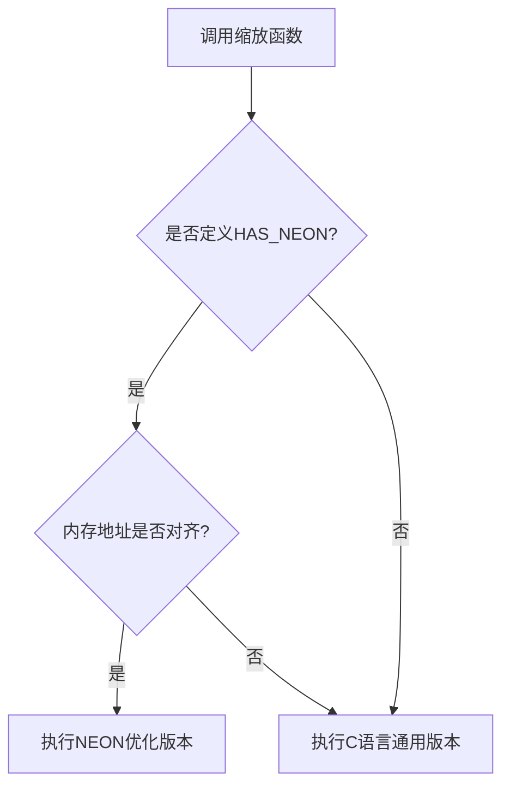
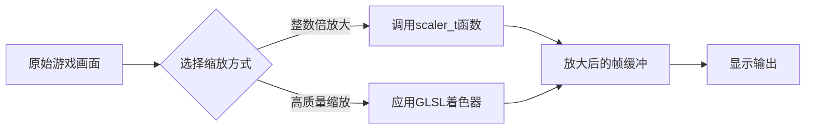

# 图像缩放API

<cite>
**本文档中引用的文件**  
- [scaler.h](file://workspace/lib/libcommon/scaler.h)
- [scaler.c](file://workspace/lib/libcommon/scaler.c)
- [bicubic.glsl](file://build/BASE/Shaders/glsl/bicubic.glsl)
- [pixel_art_AA.glsl](file://build/BASE/Shaders/glsl/pixel_art_AA.glsl)
- [sharp-bilinear.glsl](file://build/BASE/Shaders/glsl/sharp-bilinear.glsl)
- [lcd3x.glsl](file://build/BASE/Shaders/glsl/lcd3x.glsl)
- [retro-v2.glsl](file://build/BASE/Shaders/glsl/retro-v2.glsl)
</cite>

## 目录
1. [简介](#简介)
2. [核心接口与数据结构](#核心接口与数据结构)
3. [支持的缩放算法类型](#支持的缩放算法类型)
4. [缩放上下文与内存管理](#缩放上下文与内存管理)
5. [着色器集成与渲染管线](#着色器集成与渲染管线)
6. [性能分析与调优建议](#性能分析与调优建议)
7. [结论](#结论)

## 简介
本文档系统化地记录了 `scaler.h` 头文件所提供的图像缩放算法接口。该接口主要针对ARMv7架构设备（如RG35XX）进行了优化，提供了基于NEON指令集的高性能整数缩放器和C语言实现的通用缩放器。文档详细说明了支持的算法类型、缩放上下文的创建与配置流程、输入输出缓冲区的内存管理要求，并结合GLSL着色器展示了在渲染管线中的集成方法。同时，分析了不同算法的性能特征、视觉效果差异及适用场景，为开发者提供性能调优建议。

## 核心接口与数据结构

`scaler.h` 定义了图像缩放的核心接口和数据结构。

### 缩放函数指针类型
```c
typedef void (*scaler_t)(void* __restrict src, void* __restrict dst, uint32_t sw, uint32_t sh, uint32_t sp, uint32_t dw, uint32_t dh, uint32_t dp);
```
`scaler_t` 是一个函数指针类型，代表了所有缩放函数的统一接口。它定义了缩放操作所需的所有参数。

### 缩放函数参数说明
- **src**: 源图像数据缓冲区的起始地址。
- **dst**: 目标图像数据缓冲区的起始地址。
- **sw**: 源图像的宽度（像素）。
- **sh**: 源图像的高度（像素）。
- **sp**: 源图像的行间距（字节）。如果为0，则使用 `sw * bpp`（bpp为每像素字节数）。
- **dw**: 目标图像的宽度（像素）。
- **dh**: 目标图像的高度（像素）。
- **dp**: 目标图像的行间距（字节）。如果为0，则使用 `dw * bpp`。

**Section sources**
- [scaler.h](file://workspace/lib/libcommon/scaler.h#L10-L25)

## 支持的缩放算法类型

系统提供了多种缩放算法，主要分为两大类：基于NEON指令集的高性能缩放器和通用C语言缩放器。

### 整数倍缩放算法
这是最核心的算法类别，通过简单的像素复制实现整数倍放大，计算效率极高。

#### NEON优化缩放器
当硬件支持NEON指令集（`HAS_NEON`宏定义）且内存地址对齐时，优先使用这些函数。它们利用SIMD指令并行处理多个像素，性能远超C语言实现。
- **scale1x_n16 / scale1x_n32**: 1倍缩放（即复制），支持16bpp和32bpp。
- **scale2x_n16 / scale2x_n32**: 2倍缩放，水平和垂直方向均放大2倍。
- **scale3x_n16 / scale3x_n32**: 3倍缩放。
- **scale4x_n16 / scale4x_n32**: 4倍缩放。
- **scale5x_n16 / scale5x_n32**: 5倍缩放。
- **scale6x_n16 / scale6x_n32**: 6倍缩放。

#### C语言通用缩放器
当不满足NEON执行条件时，自动降级到C语言实现。这些函数逻辑清晰，可读性强。
- **scale1x_c16 / scale1x_c32**: C语言实现的1倍缩放。
- **scale2x_c16 / scale2x_c32**: C语言实现的2倍缩放。
- **scale3x_c16 / scale3x_c32**: C语言实现的3倍缩放。
- **scale4x_c16 / scale4x_c32**: C语言实现的4倍缩放。
- **scale5x_c16 / scale5x_c32**: C语言实现的5倍缩放。
- **scale6x_c16 / scale6x_c32**: C语言实现的6倍缩放。



**Diagram sources**
- [scaler.h](file://workspace/lib/libcommon/scaler.h#L30-L140)
- [scaler.c](file://workspace/lib/libcommon/scaler.c#L200-L800)

**Section sources**
- [scaler.h](file://workspace/lib/libcommon/scaler.h#L30-L140)
- [scaler.c](file://workspace/lib/libcommon/scaler.c#L200-L800)

### 像素艺术专用算法
这些算法专为复古像素游戏设计，旨在保持原始像素的锐利边缘，避免模糊。

#### scale2x_grid 和 scale3x_grid
这两个函数是经典的像素艺术缩放算法（如Scale2x/Scale3x）的实现。它们通过分析源像素周围的3x3邻域，智能地生成新的像素，从而在放大时保持斜线和曲线的清晰度，避免出现锯齿或模糊。

**Section sources**
- [scaler.h](file://workspace/lib/libcommon/scaler.h#L170-L171)

### 双线性插值算法
虽然 `scaler.h` 本身未直接提供双线性插值函数，但项目中的GLSL着色器实现了此算法。

#### sharp-bilinear.glsl
该着色器实现了一种“锐化双线性”算法。其核心思想是先进行Nx的最近邻放大，然后再进行双线性拉伸。这种预放大的方式使得最终图像比纯双线性插值更锐利，减少了模糊感。

```glsl
// sharp-bilinear.glsl 核心逻辑
float scale = (AUTO_PRESCALE > 0.5) ? floor(outsize.y / InputSize.y + 0.01) : SHARP_BILINEAR_PRE_SCALE;
float region_range = 0.5 - 0.5 / scale;
vec2 center_dist = s - 0.5;
vec2 f = (center_dist - clamp(center_dist, -region_range, region_range)) * scale + 0.5;
vec2 mod_texel = texel_floored + f;
FragColor = vec4(COMPAT_TEXTURE(Source, mod_texel / SourceSize.xy).rgb, 1.0);
```

**Section sources**
- [sharp-bilinear.glsl](file://build/BASE/Shaders/glsl/sharp-bilinear.glsl#L30-L50)

### 双三次插值算法
同样，双三次插值由GLSL着色器实现，提供高质量的平滑缩放。

#### bicubic.glsl
该着色器实现了Mitchell-Netravali双三次插值算法。它使用一个4x4的像素邻域进行加权平均，权重由一个基于B和C系数的三次函数计算得出。这种算法能产生非常平滑的图像，但计算量较大，适用于需要高质量缩放的场景。

```glsl
// bicubic.glsl 核心权重函数
float weight(float x) {
    float ax = abs(x);
    if (ax < 1.0) {
        return (pow(x, 2.0) * ((12.0 - 9.0 * B - 6.0 * C) * ax + (-18.0 + 12.0 * B + 6.0 * C)) + (6.0 - 2.0 * B)) / 6.0;
    } else if ((ax >= 1.0) && (ax < 2.0)) {
        return (pow(x, 2.0) * ((-B - 6.0 * C) * ax + (6.0 * B + 30.0 * C)) + (-12.0 * B - 48.0 * C) * ax + (8.0 * B + 24.0 * C)) / 6.0;
    } else {
        return 0.0;
    }
}
```

**Section sources**
- [bicubic.glsl](file://build/BASE/Shaders/glsl/bicubic.glsl#L80-L105)

### 像素艺术抗锯齿算法
#### pixel_art_AA.glsl
这是一个专为像素艺术设计的抗锯齿着色器。它通过检测像素边缘的特定模式（如L形、R形、对角线等），并对这些边缘像素进行半透明混合，从而在不破坏整体像素风格的前提下，平滑掉锯齿边缘。

```glsl
// pixel_art_AA.glsl 边缘检测模式
float L = (D == B && B == C && E != D && B !=A) ? 1.0 : 0.0; // L形边缘
float R = (A == B && A == F && E != F && B !=C) ? 1.0 : 0.0; // R形边缘
E = (L == 1.0 && lum(E)<lum(D)) ? (E+D)/2.0 : E; // 对L形边缘进行混合
```

**Section sources**
- [pixel_art_AA.glsl](file://build/BASE/Shaders/glsl/pixel_art_AA.glsl#L80-L100)

## 缩放上下文与内存管理

### 缩放上下文创建与销毁
`scaler.h` 的接口设计非常直接，不涉及显式的“上下文”创建和销毁。开发者直接调用具体的缩放函数即可。缩放函数本身是无状态的，因此无需管理上下文生命周期。

### 内存管理要求
内存管理是使用该API的关键。

#### 对齐要求
NEON优化的缩放器要求内存地址和行间距（stride）必须是4字节对齐的。对于16bpp（2字节/像素）的图像，这意味着源图像的宽度和行间距必须是偶数。如果输入数据不满足此要求，函数会自动降级到C语言实现，但性能会显著下降。

#### 缓冲区分配
开发者必须预先分配好足够大的目标缓冲区（`dst`）。目标缓冲区的大小必须至少为 `dh * dp` 字节。`dp` 参数允许指定自定义的行间距，这在处理非连续内存布局或特定图形API的纹理时非常有用。

#### 内存拷贝
对于1倍缩放（`scale1x`），当源和目标的行间距相等时，函数会直接调用 `memcpy` 或 `memcpy_neon` 进行整块内存拷贝，这是最高效的实现。

**Section sources**
- [scaler.h](file://workspace/lib/libcommon/scaler.h#L10-L25)
- [scaler.c](file://workspace/lib/libcommon/scaler.c#L20-L50)

## 着色器集成与渲染管线

### 集成流程
这些缩放函数和着色器通常集成在渲染管线的后处理阶段。



**Diagram sources**
- [scaler.h](file://workspace/lib/libcommon/scaler.h)
- [bicubic.glsl](file://build/BASE/Shaders/glsl/bicubic.glsl)
- [pixel_art_AA.glsl](file://build/BASE/Shaders/glsl/pixel_art_AA.glsl)

### 显示输出场景
在实际应用中，例如在 `NextUI` 系统中，渲染流程如下：
1.  **核心渲染**: 模拟器核心渲染出原始分辨率的游戏画面到一个帧缓冲区。
2.  **缩放处理**: 根据用户选择的缩放模式，调用相应的 `scaler_t` 函数或加载对应的GLSL着色器程序。
3.  **后处理**: 如果启用了着色器，GPU会执行着色器代码，对放大的画面进行滤波、抗锯齿等处理。
4.  **最终输出**: 处理后的画面被提交给显示系统，输出到屏幕上。

例如，`lcd3x.glsl` 着色器模拟了LCD屏幕的子像素结构，通过在特定频率上应用正弦波来增强色彩，从而在3倍放大时重现复古LCD屏幕的视觉效果。

**Section sources**
- [lcd3x.glsl](file://build/BASE/Shaders/glsl/lcd3x.glsl)
- [retro-v2.glsl](file://build/BASE/Shaders/glsl/retro-v2.glsl)

## 性能分析与调优建议

### 性能特征对比
| 算法类型 | 计算复杂度 | 视觉效果 | 适用场景 |
| :--- | :--- | :--- | :--- |
| **NEON整数倍缩放** | O(n) | 锐利，像素化 | 像素艺术游戏，追求性能 |
| **C语言整数倍缩放** | O(n) | 锐利，像素化 | 不满足NEON条件时的备选 |
| **sharp-bilinear** | O(1) per pixel | 较锐利，轻微模糊 | 通用2D游戏，平衡画质与性能 |
| **bicubic** | O(1) per pixel (4x4采样) | 非常平滑，可能过模糊 | 高分辨率纹理，追求高质量 |
| **pixel_art_AA** | O(1) per pixel (3x3采样) | 平滑边缘，保留像素风格 | 像素艺术游戏，需要抗锯齿 |

### 调优建议
1.  **优先使用NEON**: 确保源图像数据在内存中对齐，以充分利用NEON加速。
2.  **选择合适的算法**: 对于复古像素游戏，应选择 `scale2x`, `scale3x` 或 `pixel_art_AA` 等算法，避免使用 `bicubic` 导致画面模糊。
3.  **避免不必要的缩放**: 如果显示分辨率与游戏原生分辨率匹配，应使用1倍缩放或直接复制。
4.  **预计算参数**: 对于 `sharp-bilinear` 等着色器，如果 `AUTO_PRESCALE` 开启，确保 `InputSize` 和 `OutputSize` 参数正确传递，以便着色器能自动计算合适的预缩放因子。
5.  **内存布局优化**: 尽量使用连续的内存块，并确保行间距是4字节对齐的，以减少内存访问开销。

**Section sources**
- [scaler.c](file://workspace/lib/libcommon/scaler.c)
- [bicubic.glsl](file://build/BASE/Shaders/glsl/bicubic.glsl)
- [sharp-bilinear.glsl](file://build/BASE/Shaders/glsl/sharp-bilinear.glsl)

## 结论
`scaler.h` 提供了一套高效、灵活的图像缩放接口，特别针对嵌入式ARM设备进行了优化。通过结合NEON汇编优化的整数倍缩放器和功能丰富的GLSL着色器，系统能够在性能和画质之间提供多种选择。开发者应根据目标内容（如像素艺术或现代2D游戏）和硬件性能，选择最合适的缩放算法，以实现最佳的视觉效果和用户体验。