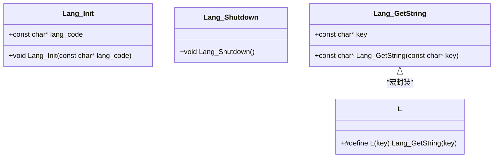
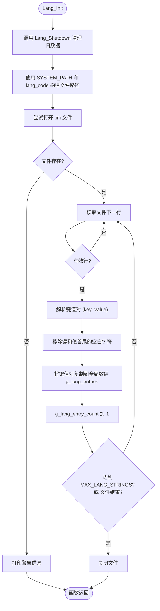

# 多语言支持API

<cite>
**本文档中引用的文件**   
- [lang.h](file://workspace/lib/libcommon/lang.h)
- [lang.c](file://workspace/lib/libcommon/lang.c)
- [defines.h](file://workspace/lib/libcommon/defines.h)
- [en.ini](file://skeleton/SYSTEM/lang/en.ini)
- [zh.ini](file://skeleton/SYSTEM/lang/zh.ini)
</cite>

## 目录
1. [简介](#简介)
2. [核心组件](#核心组件)
3. [架构概览](#架构概览)
4. [详细组件分析](#详细组件分析)
5. [依赖分析](#依赖分析)
6. [性能考量](#性能考量)
7. [故障排除指南](#故障排除指南)
8. [结论](#结论)

## 简介
本文档全面记录了NextUI项目中实现的多语言支持系统。该系统旨在为用户界面提供灵活的本地化功能，支持包括英语（en）和中文（zh）在内的多种语言。其核心设计围绕`lang.h`头文件中定义的简洁API展开，通过`Lang_Init`、`Lang_GetString`等函数，实现了语言包的加载、解析和文本检索。系统采用基于INI文件的键值对存储格式，将用户界面文本与代码逻辑分离，便于维护和扩展。尽管在当前代码库中未发现直接调用这些API的实例，但其设计清晰，具备完整的初始化、资源管理和字符串查找功能，为整个应用的国际化奠定了基础。

## 核心组件

多语言支持系统的核心由三个关键部分构成：**接口定义**、**实现逻辑**和**语言资源**。`lang.h`文件定义了公共API，为其他模块提供统一的调用入口。`lang.c`文件包含了具体的实现，负责解析INI文件、管理内存中的字符串缓存。而位于`SYSTEM/lang/`目录下的`en.ini`和`zh.ini`文件则是实际的语言资源，存储了所有可翻译的文本。

**Section sources**
- [lang.h](file://workspace/lib/libcommon/lang.h#L1-L38)
- [lang.c](file://workspace/lib/libcommon/lang.c#L1-L106)
- [en.ini](file://skeleton/SYSTEM/lang/en.ini#L1-L27)
- [zh.ini](file://skeleton/SYSTEM/lang/zh.ini#L1-L199)

## 架构概览

```mermaid
graph TB
subgraph "语言资源"
enIni["en.ini (英语)"]
zhIni["zh.ini (中文)"]
end
subgraph "多语言模块"
LangInit["Lang_Init(lang_code)"]
LangGet["Lang_GetString(key)"]
LangShutdown["Lang_Shutdown()"]
LMacro["L(key) 宏"]
end
subgraph "系统配置"
DefinesH["defines.h"]
end
DefinesH --> LangInit : "提供 SYSTEM_PATH"
LangInit --> enIni : "读取"
LangInit --> zhIni : "读取"
LangGet --> LangInit : "依赖已加载的数据"
LMacro --> LangGet : "封装调用"
```

**Diagram sources**
- [lang.h](file://workspace/lib/libcommon/lang.h#L1-L38)
- [lang.c](file://workspace/lib/libcommon/lang.c#L1-L106)
- [defines.h](file://workspace/lib/libcommon/defines.h#L1-L234)

## 详细组件分析

### 接口定义分析 (lang.h)

`lang.h`头文件定义了多语言系统对外暴露的全部接口，采用C语言的`extern "C"`语法以确保C++兼容性。其设计遵循了简洁和易用的原则。



**Diagram sources**
- [lang.h](file://workspace/lib/libcommon/lang.h#L1-L38)

**Section sources**
- [lang.h](file://workspace/lib/libcommon/lang.h#L1-L38)

#### **Lang_Init 函数**
该函数是多语言系统的初始化入口，负责加载指定语言的资源文件。
- **参数**: `lang_code` - 一个字符串，表示语言代码，如 "en" 或 "zh"。
- **功能**: 调用此函数会触发系统根据`SYSTEM_PATH`宏和`lang_code`构建完整的文件路径（例如 `/.system/lang/en.ini`），然后尝试打开并解析该INI文件。

#### **Lang_GetString 函数**
这是获取本地化文本的核心函数。
- **参数**: `key` - 一个唯一的字符串标识符，用于查找对应的翻译。
- **返回值**: 返回与`key`关联的翻译文本。如果在当前加载的语言包中找不到该`key`，函数将返回`key`本身，这一设计极大地便利了开发和调试，避免了因缺失翻译而导致的空字符串或程序崩溃。

#### **L 宏**
这是一个便捷宏，为`Lang_GetString`函数提供了更简洁的调用方式。在代码中，`L("menu_quit")`等同于`Lang_GetString("menu_quit")`，使代码更加紧凑和易读。

### 实现逻辑分析 (lang.c)

`lang.c`文件实现了`lang.h`中声明的所有功能，其内部设计清晰，主要依赖一个全局的静态数组来缓存加载的字符串。



**Diagram sources**
- [lang.c](file://workspace/lib/libcommon/lang.c#L1-L106)

**Section sources**
- [lang.c](file://workspace/lib/libcommon/lang.c#L1-L106)

#### **数据结构**
- **LangEntry**: 一个内部结构体，包含`char* key`和`char* value`两个指针，用于存储单个键值对。
- **g_lang_entries**: 一个大小为`MAX_LANG_STRINGS`（512）的`LangEntry`静态数组，作为内存中的字符串缓存。
- **g_lang_entry_count**: 一个整型静态变量，记录当前已加载的键值对数量。

#### **初始化流程 (Lang_Init)**
1.  **清理**: 首先调用`Lang_Shutdown`，释放之前所有已分配的内存，确保状态干净。
2.  **路径构建**: 使用`snprintf`函数，结合`SYSTEM_PATH`宏和传入的`lang_code`，构建INI文件的完整路径。
3.  **文件操作**: 尝试以只读模式打开文件。如果失败，会通过`fprintf`输出警告信息。
4.  **逐行解析**: 使用`fgets`循环读取文件的每一行。
5.  **过滤**: 跳过注释行（以`#`开头）、空行和INI节（以`[`开头）。
6.  **分割与清理**: 找到每行中的`=`字符，将其作为分隔符，将行分割为`key`和`value`。然后调用`trim_whitespace`函数移除两者首尾的空白字符（空格、制表符、换行符等）。
7.  **存储**: 使用`strdup`函数为`key`和`value`分配新的内存空间，并将它们的副本存储到`g_lang_entries`数组中，同时递增`g_lang_entry_count`。

#### **字符串检索流程 (Lang_GetString)**
该函数执行一个简单的线性搜索。
1.  **空值检查**: 如果传入的`key`为`NULL`，直接返回空字符串。
2.  **遍历查找**: 从`g_lang_entries`数组的索引0开始，逐个比较每个条目的`key`与传入的`key`是否相等（使用`strcmp`）。
3.  **返回结果**: 一旦找到匹配项，立即返回其对应的`value`指针。如果遍历完整个数组都未找到，则返回原始的`key`。

#### **内存管理**
- **Lang_Shutdown**: 该函数遍历`g_lang_entries`数组，释放每个条目中`key`和`value`指针所指向的动态内存，然后将`g_lang_entry_count`重置为0。这确保了在切换语言或程序退出时不会发生内存泄漏。

### 语言资源分析 (en.ini & zh.ini)

语言资源以INI文件格式存储，位于`SYSTEM/lang/`目录下。这是一种简单、易读的纯文本格式。

**Section sources**
- [en.ini](file://skeleton/SYSTEM/lang/en.ini#L1-L27)
- [zh.ini](file://skeleton/SYSTEM/lang/zh.ini#L1-L199)

#### **文件格式**
- **键值对**: 每行定义一个翻译，格式为`key=value`。`key`是代码中使用的唯一标识符，`value`是该语言下的翻译文本。
- **注释**: 以`#`开头的行被视为注释，会被解析器忽略。
- **示例**:
    ```
    menu_quit=退出
    option_screen_sharpness=画面锐化
    ```

#### **内容组织**
文件内容通过注释进行逻辑分组，例如`# Menu items`（菜单项）和`# Options`（选项）。`zh.ini`文件还包含了针对特定模拟器核心（如`gpsp`和`Snes9x`）的大量翻译条目，显示了系统支持深度本地化的能力。

## 依赖分析

多语言模块的实现依赖于项目中的其他几个关键部分。

```mermaid
graph LR
LangC["lang.c"] --> DefinesH["defines.h"] : "依赖"
LangC --> StdLib["C标准库"] : "依赖"
DefinesH --> PlatformH["platform.h"] : "包含"
DefinesH --> SystemPath["SYSTEM_PATH 宏"] : "定义"
```

**Diagram sources**
- [lang.c](file://workspace/lib/libcommon/lang.c#L1-L106)
- [defines.h](file://workspace/lib/libcommon/defines.h#L1-L234)

**Section sources**
- [lang.c](file://workspace/lib/libcommon/lang.c#L1-L106)
- [defines.h](file://workspace/lib/libcommon/defines.h#L1-L234)

- **defines.h**: `lang.c`文件包含了`defines.h`，其主要目的是获取`SYSTEM_PATH`宏的定义。该宏被用于构建语言文件的绝对路径。根据`defines.h`的内容，`SYSTEM_PATH`被定义为`SDCARD_PATH "/.system/"`，而`SDCARD_PATH`本身可能在编译时或通过环境变量确定。
- **C标准库**: 模块大量使用了`stdio.h`（文件操作）、`stdlib.h`（内存分配）、`string.h`（字符串操作）和`ctype.h`（字符处理）中的函数。

## 性能考量

该多语言系统的性能特征如下：
- **时间复杂度**: `Lang_GetString`函数的查找时间复杂度为O(n)，其中n是已加载的字符串数量。由于`MAX_LANG_STRINGS`被限制为512，对于这个规模的数据集，线性搜索是完全可以接受的，且实现简单，避免了哈希表等复杂数据结构的开销。
- **空间复杂度**: 系统会将所有翻译字符串加载到内存中，占用空间与语言包的大小成正比。这是一种以空间换时间的策略，确保了文本检索的极快速度。
- **初始化开销**: `Lang_Init`函数在启动时或切换语言时会进行文件I/O操作和内存分配，这是一次性的开销。对于嵌入式设备，应确保此操作在用户可接受的时间内完成。
- **缓存机制**: 整个`g_lang_entries`数组本质上就是一个缓存，避免了每次获取字符串时都去读取文件。

## 故障排除指南

在使用此多语言API时，可能会遇到以下问题：

**Section sources**
- [lang.c](file://workspace/lib/libcommon/lang.c#L1-L106)
- [lang.h](file://workspace/lib/libcommon/lang.h#L1-L38)

- **问题: 语言文件无法加载**
  - **症状**: 程序启动时控制台输出警告 "Warning: Could not open language file..."。
  - **原因**: 指定的`.ini`文件不存在于`SYSTEM_PATH/lang/`目录下。
  - **解决方案**: 
    1.  检查`SYSTEM_PATH`宏的定义是否正确，确保其指向了包含`lang`文件夹的目录。
    2.  确认`en.ini`或`zh.ini`文件确实存在于`<SYSTEM_PATH>/lang/`路径中。
    3.  （可选）在`Lang_Init`函数中，可以取消注释`if (strcmp(lang_code, "en") != 0) Lang_Init("en");`这行代码，实现当指定语言文件缺失时自动回退到英语。

- **问题: 返回的文本是键名本身**
  - **症状**: UI上显示的是`menu_quit`、`option_scaling`等而非翻译后的文本。
  - **原因**: 这是API的预期行为，表明在当前加载的语言包中，找不到与该`key`对应的翻译。
  - **解决方案**: 
    1.  检查`key`的拼写是否与语言文件中的完全一致（包括大小写）。
    2.  打开相应的`.ini`文件，确认该`key`已被定义。
    3.  如果是新功能，需要在所有支持的语言文件中添加该`key`的翻译。

- **问题: 内存泄漏**
  - **症状**: 长时间运行后，程序内存占用持续增长。
  - **原因**: 虽然`Lang_Shutdown`会释放内存，但如果在程序生命周期内频繁调用`Lang_Init`而没有在最后调用`Lang_Shutdown`，可能会导致中间状态的内存未被及时释放。
  - **解决方案**: 确保在程序退出前调用`Lang_Shutdown`，或者在每次切换语言时，`Lang_Init`内部的清理机制会处理掉旧的内存。

## 结论

NextUI的多语言支持API设计简洁、高效且易于集成。它通过清晰的头文件接口、基于INI文件的外部资源管理和内存缓存机制，为应用的国际化提供了坚实的基础。其核心函数`Lang_Init`、`Lang_GetString`和便捷宏`L`构成了一个完整的解决方案，能够满足加载、检索和切换语言的需求。尽管当前代码库中缺少直接的调用示例，但其模块化的设计和健壮的错误处理（如文件加载失败的警告和缺失翻译的回退）表明它已准备好被集成到UI组件中。开发者在使用时，只需在程序启动时调用`Lang_Init`，然后在需要显示文本的地方使用`L("key_name")`即可。该系统在性能和可维护性之间取得了良好的平衡，是嵌入式系统中实现多语言功能的一个优秀范例。