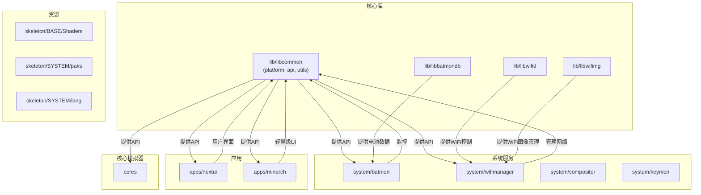
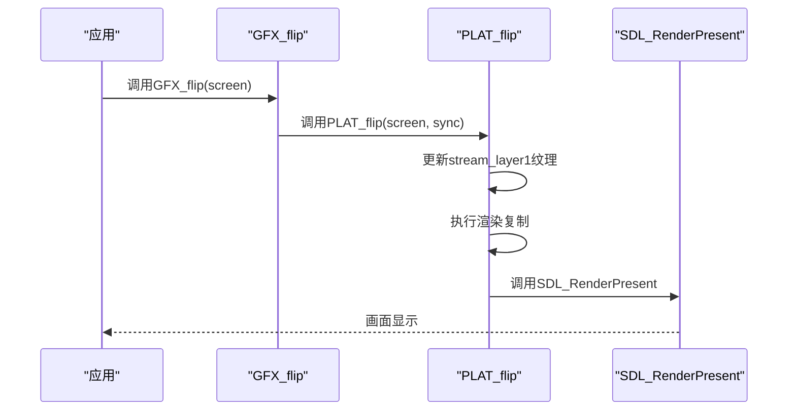
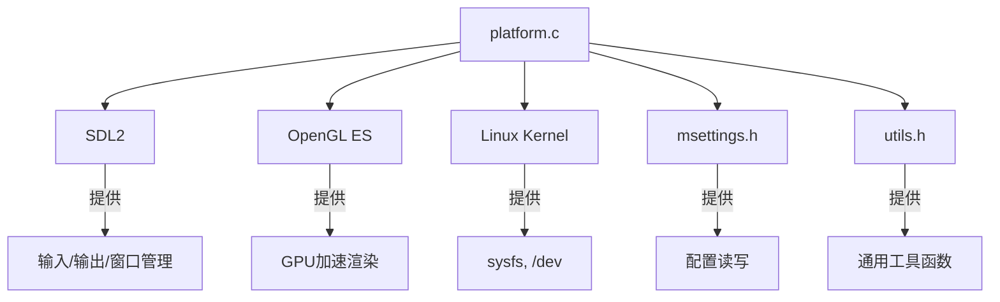

# 平台抽象API

<cite>
**本文档中引用的文件**   
- [platform.h](file://workspace/lib/libcommon/platform.h)
- [api.h](file://workspace/lib/libcommon/api.h)
- [platform.c](file://workspace/lib/libcommon/platform.c)
- [batmon.c](file://workspace/system/batmon/batmon.c)
- [wifimanager.c](file://workspace/system/wifimanager/daemon/wifi_daemon.c)
</cite>

## 目录
1. [引言](#引言)
2. [项目结构](#项目结构)
3. [核心组件](#核心组件)
4. [架构概述](#架构概述)
5. [详细组件分析](#详细组件分析)
6. [依赖分析](#依赖分析)
7. [性能考量](#性能考量)
8. [故障排除指南](#故障排除指南)
9. [结论](#结论)

## 引言
本文档深入解析了NextUI项目中的平台抽象层（Platform Abstraction Layer），该层是整个系统的核心，负责屏蔽底层硬件和操作系统的差异，为上层应用提供统一、稳定的运行环境。通过分析`platform.h`和`api.h`中的接口定义以及`platform.c`中的具体实现，我们将揭示其如何管理电源、输入、显示、网络等关键系统服务。文档将重点阐述电源状态查询、设备型号识别、存储介质检测和系统时间获取等API的设计与行为规范，并结合`batmon`和`wifimanager`等系统服务的实际调用案例，展示跨平台适配的实现机制与性能开销。

## 项目结构
NextUI项目采用分层和模块化的结构设计，清晰地分离了核心库、系统服务、应用和核心模拟器。这种结构确保了代码的可维护性和可扩展性。



**Diagram sources**
- [platform.h](file://workspace/lib/libcommon/platform.h)
- [api.h](file://workspace/lib/libcommon/api.h)

**Section sources**
- [platform.h](file://workspace/lib/libcommon/platform.h)
- [api.h](file://workspace/lib/libcommon/api.h)

## 核心组件
平台抽象层的核心在于`platform.h`中定义的接口和`platform.c`中的实现。这些组件共同构成了一个硬件与操作系统无关的API层。

**Section sources**
- [platform.h](file://workspace/lib/libcommon/platform.h)
- [platform.c](file://workspace/lib/libcommon/platform.c)

## 架构概述
平台抽象层的架构旨在通过一组清晰的接口（在`api.h`中定义）和一个具体的实现（在`platform.c`中），将上层应用与底层硬件细节隔离开来。`api.h`文件通过宏定义（如`GFX_init`）将通用的API调用映射到平台特定的函数（如`PLAT_initVideo`），从而实现了接口与实现的解耦。

```mermaid
graph LR
A[上层应用<br>(nextui, batmon)] --> |调用| B[通用API<br>(api.h)]
B --> |宏映射| C[平台特定实现<br>(platform.c)]
C --> |访问| D[操作系统/硬件<br>(Linux, SDL, sysfs)]
C --> |访问| E[系统文件<br>(/sys/class/power_supply)]
C --> |访问| F[网络服务<br>(wpa_supplicant)]
```

**Diagram sources**
- [api.h](file://workspace/lib/libcommon/api.h)
- [platform.c](file://workspace/lib/libcommon/platform.c)

## 详细组件分析
本节将深入分析平台抽象层的关键功能组件。

### 电源与电池管理分析
该组件负责提供设备的电源和电池状态信息，是`batmon`等系统服务的基础。

#### 电池状态查询
`platform.h`中定义了`PLAT_getBatteryStatus`和`PLAT_getBatteryStatusFine`两个函数，用于获取电池的充电状态和电量。`platform.c`中的实现通过读取Linux sysfs文件系统中的特定文件来获取这些信息。

```c
// platform.c 中的实现
void PLAT_getBatteryStatusFine(int *is_charging, int *charge) {
    *is_charging = getInt("/sys/class/power_supply/axp2202-usb/online");
    *charge = getInt("/sys/class/power_supply/axp2202-battery/capacity");
}
```
此函数直接访问`/sys/class/power_supply/`下的虚拟文件，这是一种在嵌入式Linux设备上获取硬件信息的标准方法。`batmon`服务会定期调用此API来更新UI上的电池图标。

**Section sources**
- [platform.h](file://workspace/lib/libcommon/platform.h#L130-L131)
- [platform.c](file://workspace/lib/libcommon/platform.c#L2370-L2375)
- [batmon.c](file://workspace/system/batmon/batmon.c)

### 网络连接管理分析
该组件负责管理设备的WiFi连接状态，为`wifimanager`服务提供底层支持。

#### WiFi状态获取
`platform.h`中定义了`PLAT_wifiConnected`、`PLAT_wifiConnection`等一系列函数。`platform.c`中的`PLAT_updateNetworkStatus`函数会调用`WIFI_connectionInfo`来更新一个全局的`struct WIFI_connection`结构体。

```c
// platform.c 中的实现
static struct WIFI_connection connection = { .valid = false };

void PLAT_updateNetworkStatus() {
    if(WIFI_enabled())
        WIFI_connectionInfo(&connection);
    else
        connection_reset(&connection);
}
```
`wifimanager`服务通过轮询这个`connection`结构体来判断当前的网络连接状态，并在UI中显示相应的信号强度图标。

**Section sources**
- [platform.h](file://workspace/lib/libcommon/platform.h#L190-L205)
- [platform.c](file://workspace/lib/libcommon/platform.c#L2360-L2368)
- [wifimanager.c](file://workspace/system/wifimanager/daemon/wifi_daemon.c)

### 显示与渲染管理分析
该组件是图形用户界面的核心，负责视频初始化、渲染和显示。

#### 视频初始化与渲染
`platform.c`中的`PLAT_initVideo`函数使用SDL2库创建了一个OpenGL上下文和多个渲染纹理（`target_layer1`, `stream_layer1`等）。`PLAT_flip`和`PLAT_GL_Swap`函数负责将渲染结果提交到屏幕。



**Diagram sources**
- [platform.c](file://workspace/lib/libcommon/platform.c#L1000-L1200)

**Section sources**
- [platform.c](file://workspace/lib/libcommon/platform.c#L1000-L1200)

## 依赖分析
平台抽象层的实现依赖于多个外部库和系统组件。



**Diagram sources**
- [platform.c](file://workspace/lib/libcommon/platform.c)
- [msettings.h](file://workspace/lib/libmsettings/msettings.h)
- [utils.h](file://workspace/lib/libcommon/utils.h)

## 性能考量
平台抽象层的设计对性能有显著影响。例如，`PLAT_GL_Swap`函数中使用了多线程来预加载效果和覆盖图纹理，这可以避免在主渲染线程中进行耗时的文件I/O操作，从而保持UI的流畅性。然而，频繁的`glTexImage2D`调用和复杂的着色器管线（由`nrofshaders`控制）可能会成为性能瓶颈，尤其是在低端硬件上。

## 故障排除指南
*   **电池图标不更新**：检查`/sys/class/power_supply/`路径下的文件是否存在且可读。确认`batmon`服务正在运行。
*   **WiFi无法连接**：检查`wpa_supplicant`服务是否正常启动。确认`PLAT_hasWifi`返回`true`。
*   **画面撕裂或卡顿**：检查VSync是否已启用。确认`PLAT_GL_Swap`中的`SDL_GL_SwapWindow`调用没有被阻塞。
*   **应用崩溃在`PLAT_initVideo`**：检查SDL2库是否正确安装。确认设备有足够的内存来创建渲染纹理。

**Section sources**
- [platform.c](file://workspace/lib/libcommon/platform.c)
- [batmon.c](file://workspace/system/batmon/batmon.c)
- [wifimanager.c](file://workspace/system/wifimanager/daemon/wifi_daemon.c)

## 结论
NextUI的平台抽象层是一个设计精良的中间件，它成功地将上层应用与底层硬件的复杂性隔离开来。通过提供一组清晰、稳定的API，它极大地简化了跨平台应用的开发。其基于SDL2和OpenGL ES的实现保证了良好的图形性能，而对sysfs的直接访问则确保了对硬件状态的精确控制。尽管存在一些潜在的性能优化空间，但整体架构是健壮且高效的，为整个NextUI生态系统提供了坚实的基础。