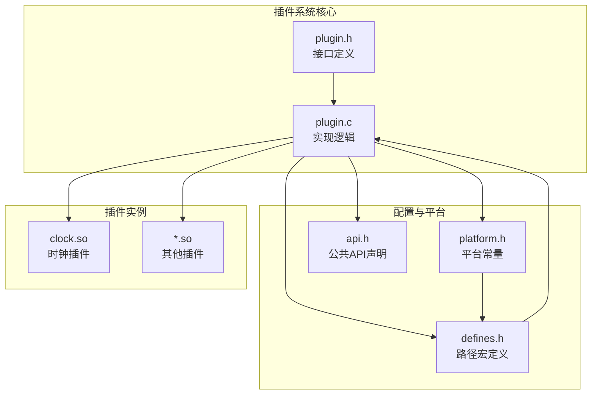
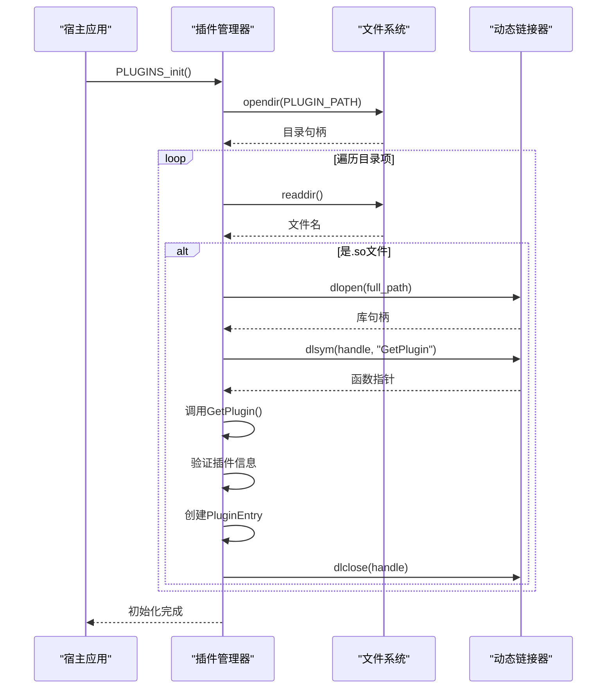
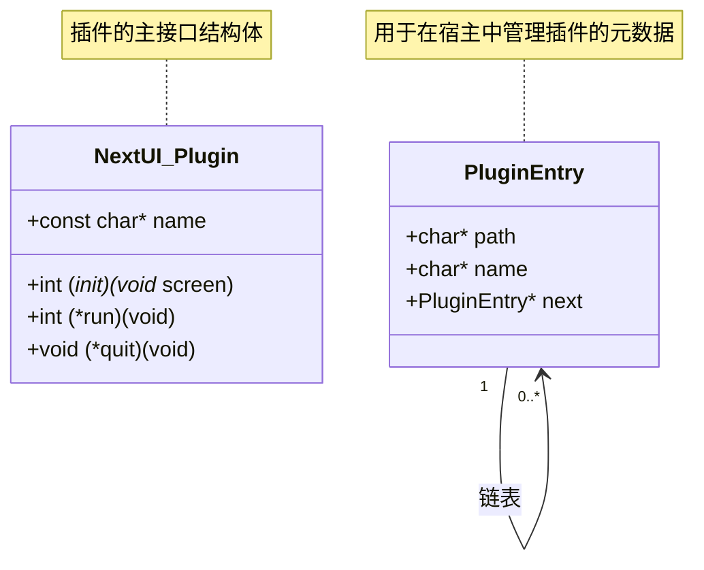
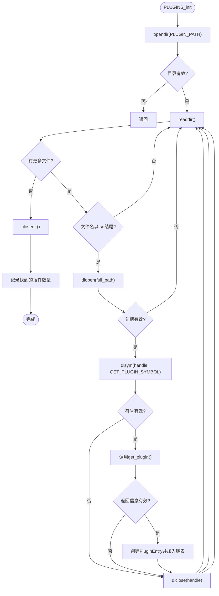
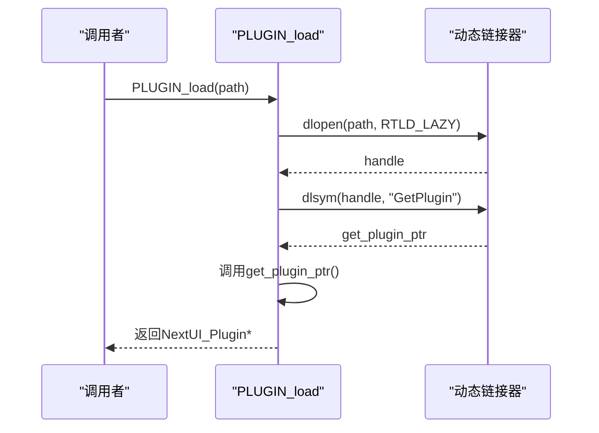
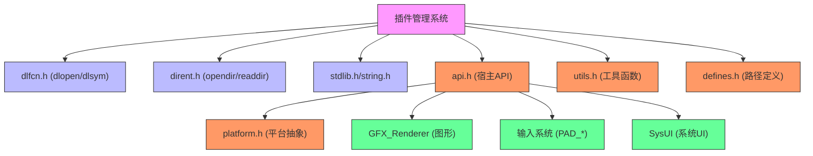

# 插件管理API

<cite>
**本文档中引用的文件**   
- [plugin.h](file://workspace/lib/libcommon/plugin.h)
- [plugin.c](file://workspace/lib/libcommon/plugin.c)
- [api.h](file://workspace/lib/libcommon/api.h)
- [defines.h](file://workspace/lib/libcommon/defines.h)
- [platform.h](file://workspace/lib/libcommon/platform.h)
- [clock.c](file://workspace/plugins/clock/clock.c)
</cite>

## 目录
1. [简介](#简介)
2. [项目结构](#项目结构)
3. [核心组件](#核心组件)
4. [架构概述](#架构概述)
5. [详细组件分析](#详细组件分析)
6. [依赖分析](#依赖分析)
7. [性能考虑](#性能考虑)
8. [故障排除指南](#故障排除指南)
9. [结论](#结论)

## 简介
本文档详细描述了NextUI系统中的插件管理API，该API提供了一套完整的动态插件加载、初始化、管理和调用机制。插件系统基于共享库（.so文件）实现，允许在运行时动态发现、加载和执行功能模块。文档涵盖了插件接口定义、生命周期管理、动态加载机制、核心数据结构以及开发自定义插件的完整示例。

## 项目结构
NextUI的插件系统主要由`libcommon`库中的`plugin.h`和`plugin.c`文件实现，相关配置和路径定义分散在`defines.h`和`platform.h`等头文件中。插件本身作为独立的共享库（.so文件）存放在特定目录下。



**Diagram sources**
- [plugin.h](file://workspace/lib/libcommon/plugin.h)
- [plugin.c](file://workspace/lib/libcommon/plugin.c)
- [defines.h](file://workspace/lib/libcommon/defines.h)
- [platform.h](file://workspace/lib/libcommon/platform.h)

**Section sources**
- [plugin.h](file://workspace/lib/libcommon/plugin.h)
- [plugin.c](file://workspace/lib/libcommon/plugin.c)
- [defines.h](file://workspace/lib/libcommon/defines.h)
- [platform.h](file://workspace/lib/libcommon/platform.h)

## 核心组件
插件系统的核心组件包括定义插件接口的`NextUI_Plugin`结构体、管理插件列表的`PluginEntry`链表，以及用于插件动态加载和符号解析的`dlopen`/`dlsym`机制。系统在启动时扫描指定目录，自动加载所有有效的插件，并通过统一的API进行调用。

**Section sources**
- [plugin.h](file://workspace/lib/libcommon/plugin.h#L4-L16)
- [plugin.c](file://workspace/lib/libcommon/plugin.c#L0-L100)

## 架构概述
NextUI插件系统采用经典的动态链接库加载模式。宿主应用在初始化时扫描插件目录，对每个`.so`文件尝试动态加载，并查找预定义的入口符号`GetPlugin`。成功解析后，获取插件的元信息并将其注册到全局链表中，供后续调用。



**Diagram sources**
- [plugin.c](file://workspace/lib/libcommon/plugin.c#L0-L67)

## 详细组件分析
本节深入分析插件系统的关键组件，包括数据结构、核心函数和插件开发示例。

### 插件接口与数据结构分析
插件系统的核心是`NextUI_Plugin`结构体，它定义了插件必须实现的生命周期函数和元数据。



**Diagram sources**
- [plugin.h](file://workspace/lib/libcommon/plugin.h#L4-L16)

#### NextUI_Plugin 结构体
该结构体定义了插件与宿主交互的公共接口，包含以下关键字段：

- **name**: 插件的名称，用于在UI中显示。
- **init**: 初始化函数，在插件首次加载时被调用，接收宿主的主屏幕表面指针。
- **run**: 主运行函数，插件的业务逻辑在此函数中执行，通常包含一个事件循环。
- **quit**: 清理函数，在插件退出时调用，用于释放资源。

**Section sources**
- [plugin.h](file://workspace/lib/libcommon/plugin.h#L11-L16)

#### PluginEntry 结构体
该结构体用于在宿主应用内部管理已加载的插件，形成一个单向链表。

- **path**: 插件共享库文件的完整路径。
- **name**: 插件的名称，从`NextUI_Plugin`结构体中复制而来。
- **next**: 指向链表中下一个`PluginEntry`的指针。

**Section sources**
- [plugin.h](file://workspace/lib/libcommon/plugin.h#L4-L8)

### 核心API函数分析
插件系统提供了四个核心API函数，用于插件的生命周期管理。

#### 插件初始化 (PLUGINS_init)
此函数在应用启动时调用，负责扫描插件目录并加载所有有效的插件。



**Diagram sources**
- [plugin.c](file://workspace/lib/libcommon/plugin.c#L0-L67)

**Section sources**
- [plugin.c](file://workspace/lib/libcommon/plugin.c#L0-L67)

#### 插件卸载 (PLUGINS_quit)
此函数在应用退出时调用，负责释放所有插件相关的内存资源。

```c
void PLUGINS_quit(void) {
    PluginEntry* current = plugin_list_head;
    while (current != NULL) {
        PluginEntry* next = current->next;
        free(current->path);
        free(current->name);
        free(current);
        current = next;
    }
    plugin_list_head = NULL;
}
```

**Section sources**
- [plugin.c](file://workspace/lib/libcommon/plugin.c#L69-L77)

#### 插件获取 (PLUGINS_get)
此函数返回指向插件链表头节点的指针，宿主应用通过遍历此链表来获取所有已加载插件的信息。

```c
PluginEntry* PLUGINS_get(void) {
    return plugin_list_head;
}
```

**Section sources**
- [plugin.c](file://workspace/lib/libcommon/plugin.c#L79-L81)

#### 插件加载 (PLUGIN_load)
此函数用于按需加载指定路径的单个插件，返回`NextUI_Plugin`结构体的指针。



**Diagram sources**
- [plugin.c](file://workspace/lib/libcommon/plugin.c#L83-L100)

**Section sources**
- [plugin.c](file://workspace/lib/libcommon/plugin.c#L83-L100)

### 自定义插件开发示例
以`clock.c`插件为例，展示如何开发一个完整的自定义插件。

#### 时钟插件 (clock.c) 分析
该插件实现了系统时钟和日期设置功能。

```c
// 定义插件的生命周期函数
static int plugin_init(void* main_screen) {
    // 初始化，获取屏幕指针
    screen = (SDL_Surface*)main_screen;
    // 初始化UI系统
    SysUI_Init(screen, &font);
    SysUI_SetTitle("Date and time");
    return 0;
}

static int plugin_run() {
    // 主运行循环
    while(!quit_plugin) {
        PAD_poll(); // 检查输入
        // 处理按键事件
        if (PAD_justPressed(BTN_A)) { save_changes = 1; quit_plugin = 1; }
        // ... 其他逻辑
        if (dirty) {
            // 重绘界面
            GFX_flip(screen);
            dirty = 0;
        } else {
            GFX_sync(); // 同步帧率
        }
    }
    return 0;
}

static void plugin_quit(void) {
    // 清理资源
    SysUI_Quit();
}

// 定义插件实例
static NextUI_Plugin clock_plugin = {
    .name = "Clock_plugin",
    .init = plugin_init,
    .run = plugin_run,
    .quit = plugin_quit,
};

// 入口点函数，必须命名为GetPlugin
NextUI_Plugin* GetPlugin(void) {
    return &clock_plugin;
}
```

**关键点**:
1.  **入口点**: 插件必须实现`GetPlugin`函数，返回指向`NextUI_Plugin`结构体的指针。
2.  **生命周期**: `init`、`run`、`quit`函数分别处理初始化、主逻辑和清理。
3.  **宿主API**: 插件通过`api.h`中声明的函数（如`PAD_poll`, `GFX_flip`, `SysUI_*`）与宿主交互。
4.  **编译**: 插件需编译为共享库（.so文件），并放置在`PLUGIN_PATH`目录下。

**Section sources**
- [clock.c](file://workspace/plugins/clock/clock.c#L0-L203)

## 依赖分析
插件系统依赖于多个核心库和平台特性。



**Diagram sources**
- [plugin.c](file://workspace/lib/libcommon/plugin.c)
- [api.h](file://workspace/lib/libcommon/api.h)
- [defines.h](file://workspace/lib/libcommon/defines.h)

**Section sources**
- [plugin.c](file://workspace/lib/libcommon/plugin.c)
- [api.h](file://workspace/lib/libcommon/api.h)
- [defines.h](file://workspace/lib/libcommon/defines.h)

## 性能考虑
插件系统在启动时进行一次性的目录扫描和符号解析，对运行时性能影响较小。主要性能开销在于`dlopen`和`dlsym`调用，但这些操作仅在初始化阶段执行。插件的`run`函数直接在宿主的主循环或独立线程中执行，其性能完全取决于插件自身的实现。

## 故障排除指南
- **插件未被加载**: 检查插件文件是否位于`/mnt/SDCARD/.system/plugins/`目录下，且文件名以`.so`结尾。
- **dlopen失败**: 确保插件编译时链接了所有必需的库，并且没有符号冲突。
- **dlsym失败**: 确认插件源码中实现了`GetPlugin`函数，且编译时未进行符号隐藏。
- **插件崩溃**: 检查插件代码中的内存管理和空指针访问，确保正确调用宿主API。

**Section sources**
- [plugin.c](file://workspace/lib/libcommon/plugin.c#L0-L100)
- [defines.h](file://workspace/lib/libcommon/defines.h#L24)
- [platform.h](file://workspace/lib/libcommon/platform.h#L136)

## 结论
NextUI的插件系统提供了一个简洁而强大的动态扩展机制。通过`plugin.h`中定义的标准化接口，开发者可以轻松创建功能丰富的插件。系统利用操作系统的动态链接能力，实现了插件的自动发现和加载。虽然当前系统没有实现复杂的沙箱或安全性检查，但其清晰的架构和完整的API为未来的功能扩展奠定了坚实的基础。