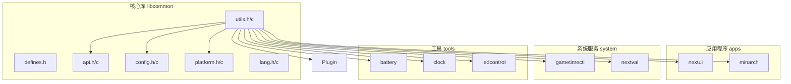
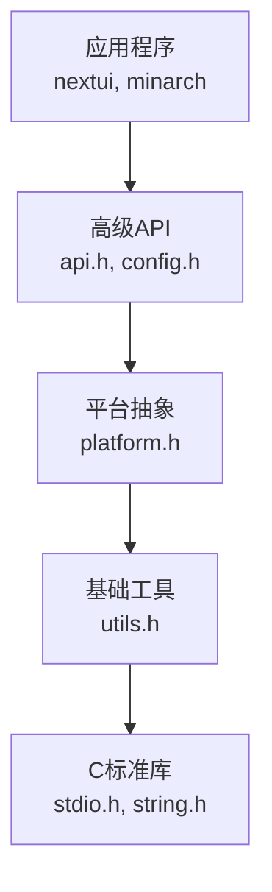
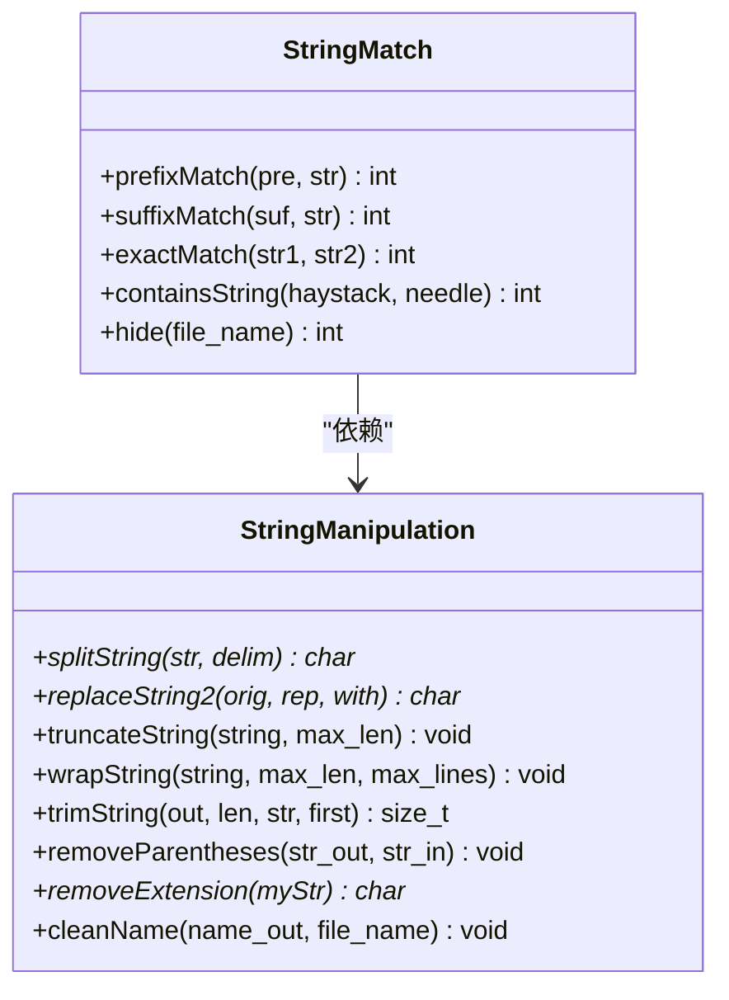
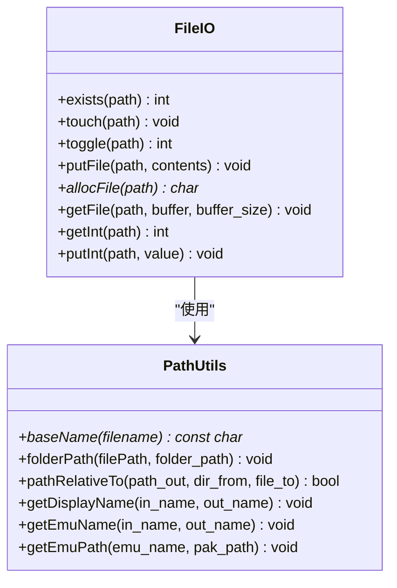
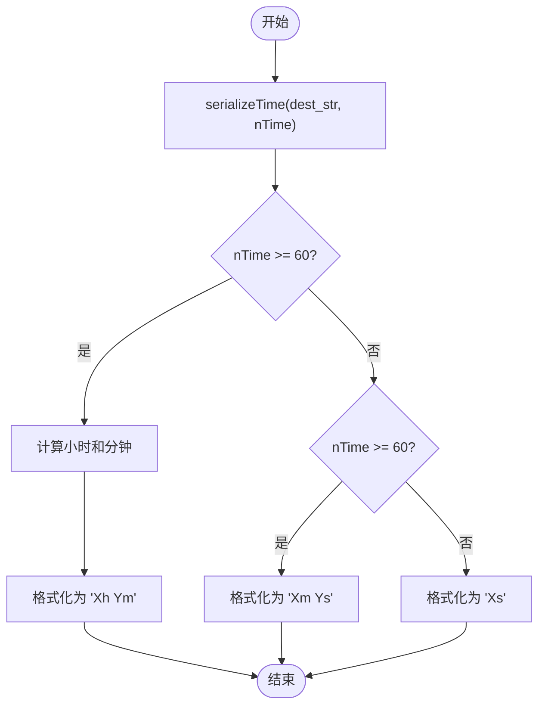
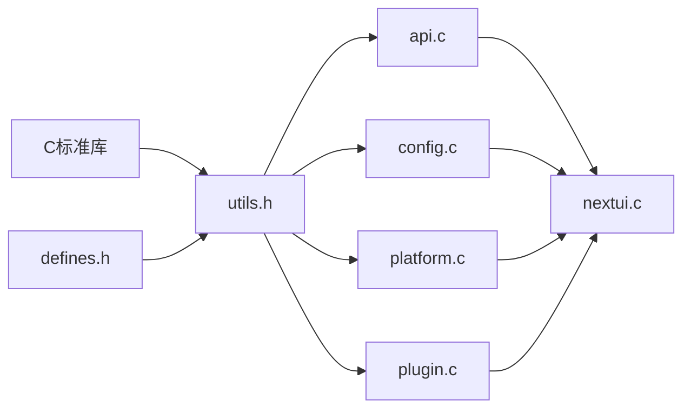

# 通用工具API

<cite>
**本文档中引用的文件**   
- [utils.h](file://workspace/lib/libcommon/utils.h)
- [utils.c](file://workspace/lib/libcommon/utils.c)
- [datastructures.c](file://workspace/apps/nextui/datastructures.c)
- [browser.c](file://workspace/apps/nextui/browser.c)
- [launcher.c](file://workspace/apps/nextui/launcher.c)
- [nextui.c](file://workspace/apps/nextui/nextui.c)
- [api.c](file://workspace/lib/libcommon/api.c)
- [config.c](file://workspace/lib/libcommon/config.c)
- [platform.c](file://workspace/lib/libcommon/platform.c)
- [plugin.c](file://workspace/lib/libcommon/plugin.c)
- [defines.h](file://workspace/lib/libcommon/defines.h)
- [lang.c](file://workspace/lib/libcommon/lang.c)
</cite>

## 目录
1. [简介](#简介)
2. [项目结构](#项目结构)
3. [核心组件](#核心组件)
4. [架构概述](#架构概述)
5. [详细组件分析](#详细组件分析)
6. [依赖分析](#依赖分析)
7. [性能考虑](#性能考虑)
8. [故障排除指南](#故障排除指南)
9. [结论](#结论)

## 简介
本文档旨在全面整理和文档化 `utils.h` 头文件中定义的各种实用函数。这些函数构成了 NextUI 项目的基础工具集，广泛应用于字符串处理、内存操作、路径解析、时间戳生成、日志输出等核心功能。通过深入分析每个函数的语义、边界条件、性能特性和实际用例，本指南为开发者提供了清晰的使用规范和最佳实践，特别强调了在日志记录、路径拼接和数据解析等场景下的正确用法，以及防御性编程的重要性。

## 项目结构
`utils.h` 及其对应的实现文件 `utils.c` 位于项目的 `workspace/lib/libcommon/` 目录下。该目录是 `libcommon` 库的核心，为整个 NextUI 应用程序及其相关工具和系统服务提供通用功能。`utils.h` 被项目中的多个模块广泛引用，包括主应用程序 (`nextui`)、启动器 (`launcher`)、数据结构 (`datastructures`)、API 层 (`api`)、配置 (`config`)、平台抽象 (`platform`) 和插件系统 (`plugin`)，这表明其作为基础工具库的关键地位。



**图源**
- [utils.h](file://workspace/lib/libcommon/utils.h)
- [utils.c](file://workspace/lib/libcommon/utils.c)

## 核心组件
`utils.h` 定义了超过 50 个实用函数，可分为以下几大类：
1.  **字符串处理**: 包括匹配 (`prefixMatch`, `suffixMatch`)、分割 (`splitString`)、替换 (`replaceString2`)、修剪 (`trimString`, `truncateString`) 和格式化 (`serializeTime`)。
2.  **文件与路径操作**: 涉及文件存在性检查 (`exists`)、文件读写 (`putFile`, `allocFile`)、路径解析 (`baseName`, `folderPath`, `pathRelativeTo`) 和文件系统操作 (`touch`, `toggle`)。
3.  **数据转换与解析**: 如字符串转整数 (`getInt`)、整数转字符串 (`putInt`)、时间序列化 (`serializeTime`)。
4.  **内存与数值操作**: 包含安全拷贝 (`strncpy`)、内存分配 (`calloc`) 和数值钳制 (`clamp`, `clampd`)。
5.  **特定领域工具**: 用于生成显示名称 (`getDisplayName`)、解析模拟器名称 (`getEmuName`) 和构建路径 (`getEmuPath`)。

这些函数共同构成了一个健壮、可重用的工具集，极大地简化了上层应用的开发。

**章节源**
- [utils.h](file://workspace/lib/libcommon/utils.h#L0-L50)
- [utils.c](file://workspace/lib/libcommon/utils.c#L0-L511)

## 架构概述
`libcommon` 库的设计遵循了分层架构原则。`utils.h` 处于最底层，提供最基础的 C 语言功能扩展。上层模块如 `api.h`、`config.h` 和 `platform.h` 依赖于 `utils.h` 来实现更高级别的功能。最终，应用程序 (`nextui`) 和系统工具通过调用这些上层模块的 API 来间接使用工具函数。这种设计实现了良好的关注点分离和代码复用。



**图源**
- [utils.h](file://workspace/lib/libcommon/utils.h)
- [api.c](file://workspace/lib/libcommon/api.c)
- [config.c](file://workspace/lib/libcommon/config.c)
- [platform.c](file://workspace/lib/libcommon/platform.c)

## 详细组件分析

### 字符串处理函数分析

#### 字符串匹配与搜索


**图源**
- [utils.h](file://workspace/lib/libcommon/utils.h#L5-L15)
- [utils.c](file://workspace/lib/libcommon/utils.c#L10-L150)

**`prefixMatch` 和 `suffixMatch` 函数**
这两个函数用于不区分大小写的前缀和后缀匹配。
- **语义说明**: `prefixMatch` 检查字符串 `str` 是否以 `pre` 开头，`suffixMatch` 检查 `str` 是否以 `suf` 结尾。两者均使用 `strncasecmp` 实现，忽略大小写。
- **边界条件**: `suffixMatch` 在计算偏移量时会检查 `offset >= 0`，防止负数偏移导致的内存越界。`exactMatch` 显式检查了 `NULL` 指针，体现了防御性编程。
- **性能特性**: 时间复杂度为 O(n)，其中 n 是前缀或后缀的长度。
- **使用示例**: 常用于文件类型判断，如 `suffixMatch(".pak", filename)` 来识别模拟器包。

**`splitString` 函数**
该函数用于根据分隔符分割字符串。
- **语义说明**: 在 `str` 中查找第一个 `delim`，将其替换为 `\0`，并返回分隔符之后的子字符串指针。**注意**：此函数会修改原字符串。
- **边界条件**: 如果分隔符未找到，返回 `NULL`。
- **性能特性**: 时间复杂度 O(n)，空间复杂度 O(1)，因为它不分配新内存。
- **使用示例**: 解析路径或配置项，如分割 `/path/to/file` 获取文件名。

**`replaceString2` 函数**
这是一个功能强大的字符串替换函数。
- **语义说明**: 创建一个新字符串，将 `orig` 中所有 `rep` 的实例替换为 `with`。原字符串 `orig` 不会被修改。
- **边界条件**: 对 `orig` 和 `rep` 进行了 `NULL` 检查，并防止 `rep` 为空字符串导致的无限循环。
- **性能特性**: 时间复杂度 O(n*m)，其中 n 是原字符串长度，m 是替换次数。需要动态分配内存，调用者必须使用 `free()` 释放。
- **使用示例**: 在构建命令行时，用实际路径替换模板中的占位符。

**`trimString` 函数**
这是处理字符串前后空白字符的核心函数。
- **语义说明**: 将 `str` 中的前导和尾随空白字符（包括空格、制表符、换行符、`{}` 和 `,`）移除，并将结果写入 `out` 缓冲区。
- **边界条件**: 支持 `first` 参数来控制是修剪第一个还是最后一个匹配项。对 `len` 为 0 的情况有特殊处理。使用 `STR_MAX` 宏定义缓冲区大小。
- **性能特性**: 时间复杂度 O(n)，单次遍历。
- **使用示例**: 清理用户输入或从文件中读取的配置值。

### 文件与路径操作函数分析

#### 文件系统交互


**图源**
- [utils.h](file://workspace/lib/libcommon/utils.h#L25-L45)
- [utils.c](file://workspace/lib/libcommon/utils.c#L412-L511)

**`exists` 和 `getFile` 函数**
这些是文件系统操作的基础。
- **语义说明**: `exists` 使用 `access(F_OK)` 检查文件是否存在。`getFile` 将文件内容读入指定大小的缓冲区，会进行边界检查以防止缓冲区溢出。
- **边界条件**: `getFile` 在读取前会检查文件大小是否超过缓冲区容量，并相应地截断。
- **性能特性**: 适用于读取小文件。`allocFile` 用于读取大文件，它会动态分配所需内存。
- **使用示例**: 检查配置文件是否存在，或读取保存的游戏状态。

**`getDisplayName` 函数**
此函数用于从文件路径生成用户友好的显示名称。
- **语义说明**: 从路径中提取文件名，移除扩展名、括号内的元数据，并清理多余的空格和特殊字符。
- **边界条件**: 处理了多种情况，如路径结尾、平台特定路径的隐藏等。在移除所有内容后，会恢复原始名称以防止空字符串。
- **性能特性**: 时间复杂度 O(n)，涉及多次字符串操作。
- **使用示例**: 在文件浏览器中显示游戏列表时，将 `GBA/Super Mario Advance (USA).gba` 显示为 `Super Mario Advance`。
- **实际用法**: 在 `datastructures.c` 的 `Entry_new` 函数中被调用，为新创建的条目生成名称。
```c
Entry* Entry_new(char* path, int type) {
    char display_name[256];
    getDisplayName(path, display_name); // 生成显示名称
    Entry* self = malloc(sizeof(Entry));
    self->name = strdup(display_name); // 使用显示名称
    // ...
    return self;
}
```
**章节源**
- [utils.c](file://workspace/lib/libcommon/utils.c#L309-L388)
- [datastructures.c](file://workspace/apps/nextui/datastructures.c#L110-L120)

### 时间与数值操作函数分析

#### 时间戳与数值钳制


**图源**
- [utils.h](file://workspace/lib/libcommon/utils.h#L20)
- [utils.c](file://workspace/lib/libcommon/utils.c#L250-L270)

**`serializeTime` 函数**
将秒数转换为人类可读的时间字符串。
- **语义说明**: 根据输入的秒数 `nTime`，生成如 `5m 30s` 或 `2h 15m` 的格式化字符串。
- **边界条件**: 处理了小于60秒、大于60秒但小于3600秒，以及大于3600秒的情况。
- **性能特性**: 时间复杂度 O(1)，计算简单。
- **使用示例**: 在游戏计时器或状态栏中显示已玩游戏时间。

**`clamp` 和 `clampd` 函数**
用于将数值限制在指定范围内。
- **语义说明**: 确保 `x` 的值不小于 `lower` 且不大于 `upper`。
- **实现**: 使用了 GNU C 扩展的 `({ ... })` 语句表达式来定义 `min` 和 `max` 宏，保证了类型安全和无副作用。
- **性能特性**: 时间复杂度 O(1)，常数时间操作。
- **使用示例**: 限制音量值在 `VOLUME_MIN` 和 `VOLUME_MAX` 之间，或限制屏幕亮度。

## 依赖分析
`utils.h` 是项目中被引用最广泛的头文件之一。通过搜索，我们发现它被 `apps`、`lib`、`system` 和 `tools` 目录下的 19 个 C 源文件所包含。这表明 `libcommon` 库中的工具函数是整个生态系统的基础。其依赖关系清晰：`utils.h` 依赖于 C 标准库和项目定义的 `defines.h`（提供 `MAX_PATH`、`STR_MAX` 等常量），而上层模块则依赖于 `utils.h` 来避免重复造轮子。



**图源**
- [utils.h](file://workspace/lib/libcommon/utils.h)
- [defines.h](file://workspace/lib/libcommon/defines.h)
- [nextui.c](file://workspace/apps/nextui/nextui.c)

## 性能考虑
大多数工具函数都经过了优化，以在嵌入式设备上高效运行。
- **内存分配**: `replaceString2` 和 `allocFile` 会进行动态内存分配，应谨慎使用并确保及时释放，避免内存泄漏。
- **字符串操作**: 函数如 `trimString` 和 `wrapString` 涉及多次内存拷贝，对于非常长的字符串可能会有性能影响。
- **文件I/O**: `getFile` 和 `putFile` 是同步操作，在处理大文件时可能会阻塞主线程。`getInt` 和 `putInt` 通过调用 `getFile` 和 `putFile` 实现，适用于简单的键值对存储。
- **数值计算**: `clamp` 系列函数使用宏实现，内联后无函数调用开销，性能极佳。

## 故障排除指南
在使用这些工具函数时，可能会遇到以下常见问题：

**问题1: `getDisplayName` 生成了意外的名称**
- **原因**: 输入路径格式不符合预期，或文件名中包含特殊字符。
- **解决方案**: 检查 `getDisplayName` 的实现，它会移除括号 `()` 和方括号 `[]` 内的内容。确保路径正确，并理解其清理逻辑。

**问题2: `replaceString2` 导致内存泄漏**
- **原因**: 忘记调用 `free()` 释放 `replaceString2` 返回的指针。
- **解决方案**: 严格遵守文档注释 `// caller must free`，在使用完返回的字符串后立即释放内存。

**问题3: `getFile` 读取内容不完整或截断**
- **原因**: 提供的 `buffer_size` 太小，无法容纳整个文件。
- **解决方案**: 确保缓冲区足够大，或改用 `allocFile` 来动态分配内存。

**问题4: `pathRelativeTo` 返回 `false`**
- **原因**: `dir_from` 或 `file_to` 路径不存在，或 `realpath` 调用失败。
- **解决方案**: 确保两个路径都存在且是有效的绝对路径或可解析的相对路径。

**章节源**
- [utils.c](file://workspace/lib/libcommon/utils.c#L389-L411)
- [utils.c](file://workspace/lib/libcommon/utils.c#L450-L460)

## 结论
`utils.h` 及其对应的 `utils.c` 文件是 NextUI 项目不可或缺的基石。它们提供了一套全面、健壮且经过实战检验的实用函数，极大地提升了代码的可维护性和开发效率。通过对这些函数的深入分析，我们不仅理解了它们的内部工作原理和性能特征，还掌握了在各种场景下的最佳实践。遵循本文档中的指导，开发者可以安全、高效地利用这些工具，构建出更稳定、更可靠的应用程序。