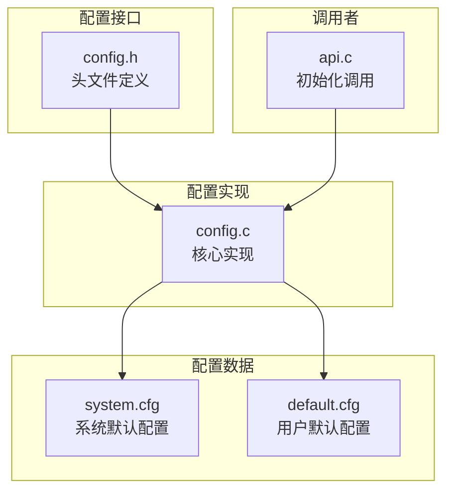
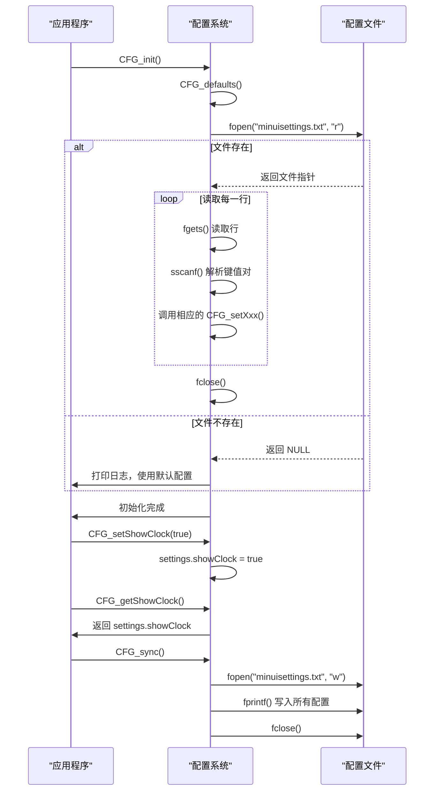
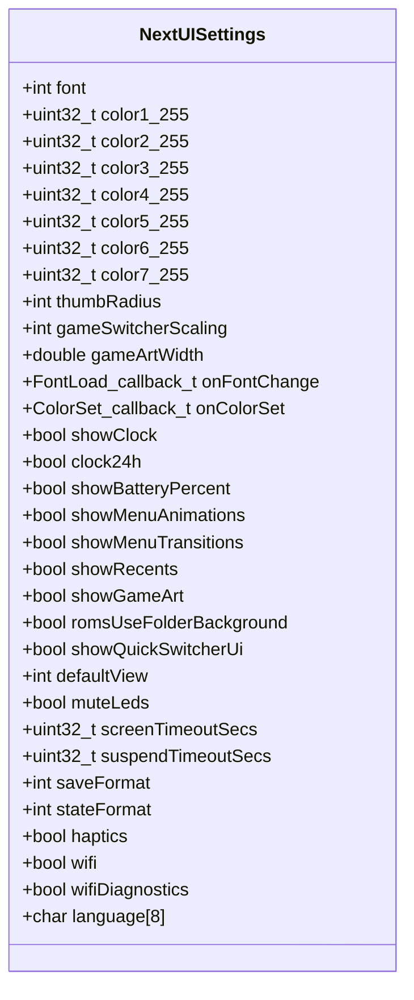
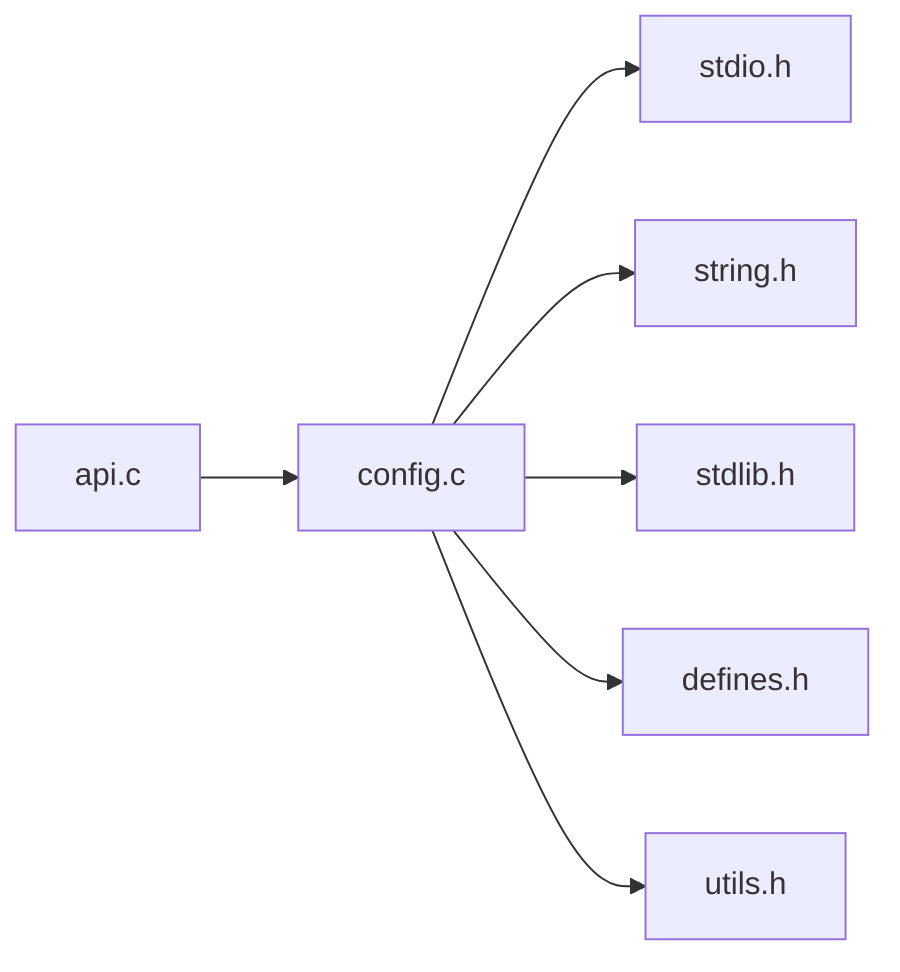

# 配置管理API

<cite>
**本文档中引用的文件**  
- [config.h](file://workspace/lib/libcommon/config.h)
- [config.c](file://workspace/lib/libcommon/config.c)
- [system.cfg](file://skeleton/SYSTEM/system.cfg)
- [default.cfg](file://build/EXTRAS/Emus/MGBA.pak/default.cfg)
- [api.c](file://workspace/lib/libcommon/api.c)
</cite>

## 目录
1. [简介](#简介)
2. [项目结构](#项目结构)
3. [核心组件](#核心组件)
4. [架构概述](#架构概述)
5. [详细组件分析](#详细组件分析)
6. [依赖分析](#依赖分析)
7. [性能考虑](#性能考虑)
8. [故障排除指南](#故障排除指南)
9. [结论](#结论)

## 简介
本文档深入文档化NextUI系统中的配置管理API，重点分析`config.h`中定义的配置读写接口。该系统为整个应用程序提供统一的配置管理服务，涵盖用户界面、电源管理、网络设置等多个方面。通过分析`config_t`结构体（在代码中为`NextUISettings`）的内部字段、内存布局与生命周期管理规则，本文将详细解释基于键值对的文本存储序列化格式与持久化机制。文档还将提供实际代码示例，展示如何在应用程序中安全地读取和更新系统或用户配置项，并涵盖默认值处理、类型转换安全、并发访问控制等关键问题。

## 项目结构
配置管理系统主要由`libcommon`库中的`config.h`和`config.c`文件实现，其配置数据则存储在系统目录下的`system.cfg`文件和各个模拟器包（.pak）中的`default.cfg`文件中。该系统采用单例模式，全局唯一的`settings`结构体实例负责管理所有配置状态。



**Diagram sources**
- [config.h](file://workspace/lib/libcommon/config.h)
- [config.c](file://workspace/lib/libcommon/config.c)
- [system.cfg](file://skeleton/SYSTEM/system.cfg)
- [default.cfg](file://build/EXTRAS/Emus/MGBA.pak/default.cfg)
- [api.c](file://workspace/lib/libcommon/api.c)

**Section sources**
- [config.h](file://workspace/lib/libcommon/config.h)
- [config.c](file://workspace/lib/libcommon/config.c)

## 核心组件
配置管理API的核心是`NextUISettings`结构体和围绕它的一系列操作函数。该结构体定义了应用程序的所有可配置选项，包括主题、UI行为、电源、网络等。`config_init`、`config_load`、`config_save`、`config_get`、`config_set`等函数提供了对这些配置项的统一访问接口。

**Section sources**
- [config.h](file://workspace/lib/libcommon/config.h#L100-L200)
- [config.c](file://workspace/lib/libcommon/config.c#L20-L50)

## 架构概述
配置系统的架构遵循简单的单例模式。在程序启动时，通过`CFG_init`函数进行初始化，该函数会首先加载默认配置，然后尝试从持久化文件中读取用户自定义的配置来覆盖默认值。所有的配置读写操作都通过一组`CFG_getXxx`和`CFG_setXxx`函数进行，这些函数内部操作全局的`settings`结构体实例。当配置发生更改时，可以通过`CFG_sync`函数将当前内存中的配置状态写回到文件中，实现持久化。



**Diagram sources**
- [config.c](file://workspace/lib/libcommon/config.c#L70-L200)
- [config.c](file://workspace/lib/libcommon/config.c#L600-L700)

## 详细组件分析
### NextUISettings 结构体分析
`NextUISettings`结构体是配置系统的核心数据结构，它将所有配置项组织在一个单一的、连续的内存块中。这种设计简化了内存管理和序列化过程。



**Diagram sources**
- [config.h](file://workspace/lib/libcommon/config.h#L100-L200)

#### 内存布局与生命周期
`NextUISettings`结构体的实例`settings`被定义为一个全局静态变量，其生命周期与整个程序相同。它在`config.c`文件中被初始化为全零（`{0}`），然后在`CFG_init`函数中通过`CFG_defaults`函数填充默认值。此后，其生命周期完全由`CFG_setXxx`和`CFG_getXxx`函数管理，直到程序结束。

**Section sources**
- [config.c](file://workspace/lib/libcommon/config.c#L20-L30)
- [config.c](file://workspace/lib/libcommon/config.c#L70-L90)

### 配置持久化机制分析
配置的持久化基于简单的键值对文本文件格式。系统使用`minuisettings.txt`文件来存储用户配置，该文件位于由`SHARED_USERDATA_PATH`环境变量指定的路径下。

#### 序列化格式
配置文件采用`key=value`的格式，每行一个配置项。例如：
```
font=1
color1=0xFFFFFF
showclock=1
screentimeout=60
language=en
```
这种格式易于人类阅读和编辑，也便于程序解析。

#### 加载流程
加载流程在`CFG_init`函数中实现。它首先调用`CFG_defaults`设置所有配置项的默认值，然后尝试打开`minuisettings.txt`文件。如果文件存在，它会逐行读取，使用`sscanf`解析每一行的键值对，并根据键名调用相应的`CFG_setXxx`函数来更新内存中的配置。这确保了即使配置文件中缺少某些项，它们也会保留默认值。

#### 保存流程
保存流程在`CFG_sync`函数中实现。它以写入模式打开`minuisettings.txt`文件，然后使用`fprintf`将`settings`结构体中的每一个字段按照`key=value`的格式写入文件。写入完成后关闭文件。值得注意的是，`artWidth`字段在保存时会乘以100并转换为整数，以避免在文本文件中处理浮点数。

**Section sources**
- [config.c](file://workspace/lib/libcommon/config.c#L100-L200)
- [config.c](file://workspace/lib/libcommon/config.c#L600-L700)

### 实际应用与代码示例
#### 初始化配置系统
配置系统通常在应用程序的主初始化函数中被调用。例如，在`api.c`文件中，`GFX_init`函数在初始化图形系统后，立即调用了`CFG_init`。

```c
// 来自 api.c
gfx.screen = PLAT_initVideo();
// ... 其他初始化 ...
CFG_init(GFX_loadSystemFont, GFX_updateColors); // 初始化配置系统
```
这里传递了两个回调函数，当字体或颜色配置更改时，系统会自动调用这些函数来更新图形资源。

#### 安全地读取和更新配置
以下代码示例展示了如何安全地读取和更新一个配置项。

```c
// 读取当前的时钟显示设置
bool currentShowClock = CFG_getShowClock();
printf("当前时钟显示状态: %s\n", currentShowClock ? "开启" : "关闭");

// 更新时钟显示设置
CFG_setShowClock(true);

// 读取更新后的设置以确认
bool newShowClock = CFG_getShowClock();
printf("更新后时钟显示状态: %s\n", newShowClock ? "开启" : "关闭");

// 将更改持久化到磁盘
CFG_sync();
```

#### 处理默认值和类型转换
系统通过`CFG_DEFAULT_*`宏定义了所有配置项的默认值。`CFG_defaults`函数利用这些宏来填充`NextUISettings`结构体。类型转换是安全的，因为`CFG_getXxx`和`CFG_setXxx`函数为每种数据类型（`int`、`bool`、`uint32_t`、`double`）都提供了专用的函数，避免了类型混淆。

#### 并发访问控制
当前的实现没有显式的并发访问控制（如互斥锁）。这意味着该API假设在单线程环境中使用，或者由调用者确保在多线程环境下的访问安全。这是一个潜在的竞态条件风险点。

**Section sources**
- [config.h](file://workspace/lib/libcommon/config.h)
- [config.c](file://workspace/lib/libcommon/config.c)
- [api.c](file://workspace/lib/libcommon/api.c#L344)

## 依赖分析
配置系统是`libcommon`库的一部分，被上层的`api.c`等模块所依赖。它依赖于标准C库（`stdio.h`, `string.h`等）进行文件I/O和字符串操作，同时也依赖于项目内的`defines.h`和`utils.h`等头文件。



**Diagram sources**
- [config.c](file://workspace/lib/libcommon/config.c#L1-L10)

## 性能考虑
该配置系统的性能开销主要在文件I/O操作上。`CFG_init`和`CFG_sync`函数在启动和关闭时各进行一次文件读写，对于整个程序的生命周期来说，这是可以接受的。频繁地调用`CFG_sync`会带来显著的性能下降，因此应避免在循环中调用。内存中的`CFG_getXxx`和`CFG_setXxx`操作是O(1)时间复杂度的直接内存访问，非常高效。

## 故障排除指南
- **问题：配置更改后没有生效**
  - **检查**：确保在更改配置后调用了`CFG_sync()`函数。
  - **检查**：确认`SHARED_USERDATA_PATH`环境变量已正确设置，并且程序有权限在该路径下创建和写入文件。
- **问题：程序启动时总是使用默认配置**
  - **检查**：检查`minuisettings.txt`文件是否存在以及其路径是否正确。
  - **检查**：查看程序日志，`CFG_init`函数在无法打开文件时会打印`[CFG] Unable to open settings file, loading defaults`。
- **问题：配置文件中的值与预期不符**
  - **检查**：注意某些字段（如`artWidth`）在保存时会进行转换（乘以100），读取时也会进行逆向转换。

**Section sources**
- [config.c](file://workspace/lib/libcommon/config.c#L150-L160)
- [config.c](file://workspace/lib/libcommon/config.c#L620-L630)

## 结论
NextUI的配置管理API提供了一个简洁、高效的机制来管理应用程序的设置。它通过一个中心化的`NextUISettings`结构体和一组清晰的`get/set`函数，实现了配置的统一访问。基于文本的持久化格式使其易于调试和手动修改。虽然缺少并发控制，但在其目标的单线程嵌入式环境中是合理的。开发者在使用时应遵循先`set`后`sync`的模式，以确保配置更改被正确持久化。