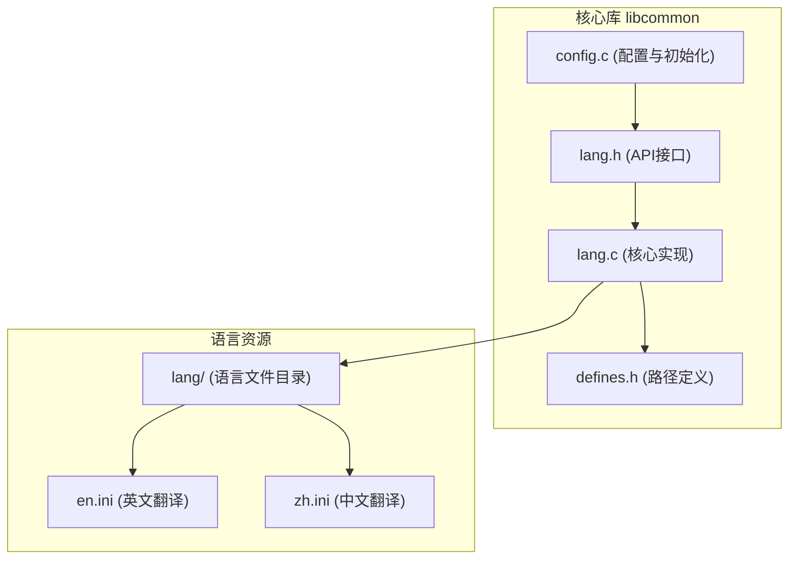
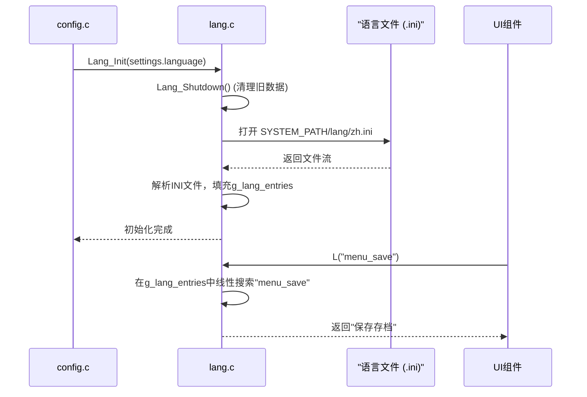
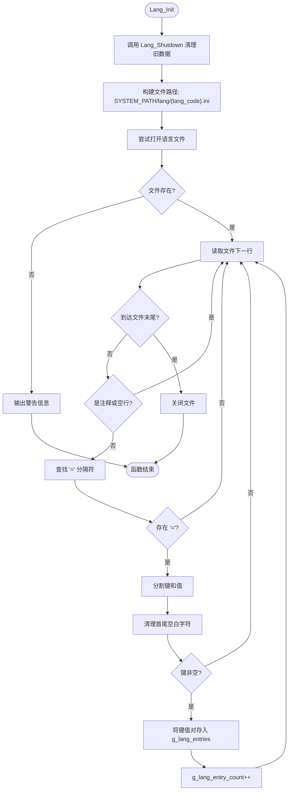
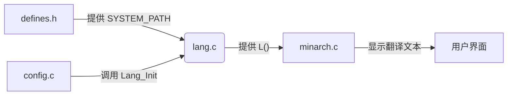

# 国际化语言API

<cite>
**本文档引用的文件**   
- [lang.h](file://workspace/lib/libcommon/lang.h)
- [lang.c](file://workspace/lib/libcommon/lang.c)
- [defines.h](file://workspace/lib/libcommon/defines.h)
- [config.c](file://workspace/lib/libcommon/config.c)
- [minarch.c](file://workspace/apps/minarch/minarch.c)
- [en.ini](file://skeleton/SYSTEM/lang/en.ini)
- [zh.ini](file://skeleton/SYSTEM/lang/zh.ini)
</cite>

## 目录
1. [简介](#简介)
2. [项目结构](#项目结构)
3. [核心组件](#核心组件)
4. [架构概述](#架构概述)
5. [详细组件分析](#详细组件分析)
6. [依赖分析](#依赖分析)
7. [性能考量](#性能考量)
8. [故障排除指南](#故障排除指南)
9. [结论](#结论)

## 简介
本文档全面记录了NextUI项目中`libcommon`模块提供的多语言支持功能。该系统实现了完整的国际化（i18n）和本地化（l10n）解决方案，允许用户界面根据用户选择的语言代码（如"en"、"zh"）动态显示相应的文本。系统通过加载INI格式的语言文件，将字符串键（key）映射到目标语言的翻译值（value），并提供了一套简洁的API供UI组件调用。其设计注重简洁性、可维护性和调试友好性，是整个系统实现多语言支持的核心。

## 项目结构
多语言支持功能主要分布在`libcommon`库中，其相关文件和资源遵循清晰的分层结构。核心API定义在头文件中，实现逻辑在源文件中，而实际的翻译内容则存储在独立的INI文件中，实现了代码与内容的分离。



**图示来源**
- [lang.h](file://workspace/lib/libcommon/lang.h)
- [lang.c](file://workspace/lib/libcommon/lang.c)
- [defines.h](file://workspace/lib/libcommon/defines.h)
- [en.ini](file://skeleton/SYSTEM/lang/en.ini)
- [zh.ini](file://skeleton/SYSTEM/lang/zh.ini)

**本节来源**
- [lang.h](file://workspace/lib/libcommon/lang.h)
- [lang.c](file://workspace/lib/libcommon/lang.c)
- [defines.h](file://workspace/lib/libcommon/defines.h)

## 核心组件
多语言系统的核心由`lang.h`中定义的三个主要函数构成：`Lang_Init`用于初始化和加载语言包，`Lang_GetString`用于根据键值获取翻译后的字符串，而`Lang_Shutdown`则负责在系统关闭时释放所有已分配的资源。此外，`L()`宏的引入极大地简化了代码中对翻译字符串的调用，使代码更加简洁易读。

**本节来源**
- [lang.h](file://workspace/lib/libcommon/lang.h#L15-L35)

## 架构概述
整个多语言系统的架构围绕一个全局的字符串缓存展开。当用户选择一种语言时，系统会从预定义的路径加载对应的`.ini`文件，解析其内容并将其存储在内存中的一个静态数组里。后续的字符串查找操作都直接在这个内存缓存中进行，避免了频繁的文件I/O操作，从而保证了运行时的高效性。配置模块（`config.c`）作为桥梁，负责在应用启动时读取用户的语言偏好并触发语言模块的初始化。



**图示来源**
- [lang.c](file://workspace/lib/libcommon/lang.c#L48-L105)
- [config.c](file://workspace/lib/libcommon/config.c#L252)
- [en.ini](file://skeleton/SYSTEM/lang/en.ini)
- [zh.ini](file://skeleton/SYSTEM/lang/zh.ini)

## 详细组件分析
### Lang_Init 函数分析
`Lang_Init`函数是多语言系统的入口点。它接收一个语言代码作为参数，负责加载并解析相应的语言文件。该函数首先调用`Lang_Shutdown`来释放之前加载的语言数据，确保内存不会泄漏。然后，它使用`SYSTEM_PATH`宏构建完整的文件路径，尝试打开指定的语言文件。如果文件打开失败，会输出警告信息，但不会中断程序执行。



**图示来源**
- [lang.c](file://workspace/lib/libcommon/lang.c#L48-L78)

**本节来源**
- [lang.c](file://workspace/lib/libcommon/lang.c#L48-L78)

### Lang_GetString 函数与 L() 宏分析
`Lang_GetString`函数是运行时获取翻译字符串的核心。它接收一个字符串键作为参数，在全局的`g_lang_entries`数组中进行线性搜索。由于数组大小被限制在512个条目以内，线性搜索的性能开销可以接受。如果找到了匹配的键，则返回其对应的翻译值；如果未找到，函数会返回原始的键本身。这一设计极大地便利了调试过程，开发者可以立即发现哪些字符串尚未被翻译。

`L()`宏是`Lang_GetString`的一个便捷封装，它使得在代码中插入翻译文本变得非常简洁，例如`L("menu_save")`。

```c
// 使用宏前
const char* text = Lang_GetString("menu_save");

// 使用宏后
const char* text = L("menu_save"); // 更加简洁
```

**本节来源**
- [lang.h](file://workspace/lib/libcommon/lang.h#L25-L35)
- [lang.c](file://workspace/lib/libcommon/lang.c#L94-L105)

### LangEntry 结构体与内存布局分析
`LangEntry`结构体是存储单个翻译条目的数据结构，定义在`lang.c`文件内部。它包含两个成员：`char* key`和`char* value`，分别指向动态分配的字符串内存。所有`LangEntry`实例被存储在一个名为`g_lang_entries`的静态数组中，该数组的大小由`MAX_LANG_STRINGS`（512）定义。同时，`g_lang_entry_count`变量记录了当前已加载的条目数量。

这种设计的优点是简单直接，易于实现和理解。其内存布局如下：
- **静态数组**: `g_lang_entries[512]` 在程序的静态数据区分配，大小固定。
- **动态字符串**: 每个`key`和`value`都通过`strdup`函数在堆上动态分配内存，并在`Lang_Shutdown`时被`free`释放。

```c
typedef struct {
    char* key;   // 指向堆上分配的字符串，如 "menu_save"
    char* value; // 指向堆上分配的字符串，如 "保存存档"
} LangEntry;

static LangEntry g_lang_entries[MAX_LANG_STRINGS]; // 静态数组
static int g_lang_entry_count = 0; // 当前条目计数
```

**本节来源**
- [lang.c](file://workspace/lib/libcommon/lang.c#L15-L20)

### 语言文件加载机制分析
语言文件采用标准的INI文件格式，具有良好的可读性和可维护性。文件中的每一行代表一个键值对，格式为`key=value`。系统在解析时会忽略以`#`开头的注释行、空行以及以`[`开头的节（section）标识行。解析过程包括：
1.  **读取行**: 使用`fgets`逐行读取文件。
2.  **分割键值**: 使用`strchr`查找第一个`=`字符，将其替换为`\0`以分割字符串。
3.  **清理空白**: 调用内部的`trim_whitespace`函数移除键和值首尾的空白字符（空格、制表符等）。
4.  **存储**: 使用`strdup`复制键和值字符串，并存入`g_lang_entries`数组。

**本节来源**
- [lang.c](file://workspace/lib/libcommon/lang.c#L79-L105)
- [en.ini](file://skeleton/SYSTEM/lang/en.ini)
- [zh.ini](file://skeleton/SYSTEM/lang/zh.ini)

### UI组件中的动态文本获取示例
多语言API在UI组件中被广泛使用。以`minarch.c`中的主菜单初始化为例，菜单项的文本不是硬编码的，而是通过`L()`宏动态获取的。这确保了整个UI能够根据当前语言设置自动切换。

```c
// 在 minarch.c 中初始化主菜单字符串
static void MainMenu_InitStrings(void) {
    menu.items[ITEM_CONT] = (char*)L("menu_continue"); // "继续游戏" 或 "Continue"
    menu.items[ITEM_SAVE]  = (char*)L("menu_save");     // "保存存档" 或 "Save State"
    menu.items[ITEM_LOAD]  = (char*)L("menu_load");     // "读取存档" 或 "Load State"
    menu.items[ITEM_OPTS]  = (char*)L("menu_options");  // "选项设置" 或 "Options"
    menu.items[ITEM_QUIT]  = (char*)L("menu_quit");     // "退出" 或 "Exit"
}
```

**本节来源**
- [minarch.c](file://workspace/apps/minarch/minarch.c#L5059-L5067)

### 缺失翻译的回退机制
系统内置了优雅的回退机制来处理缺失的翻译。当`Lang_GetString`函数在语言文件中找不到指定的键时，它不会返回`NULL`或一个错误提示，而是直接返回传入的键本身。例如，如果代码中调用了`L("non_existent_key")`，而`zh.ini`中没有这个键，那么函数将返回字符串`"non_existent_key"`。

这种设计有两大优势：
1.  **防止崩溃**: 避免了因`NULL`指针解引用导致的程序崩溃。
2.  **辅助调试**: 在UI上直接显示未翻译的键名，让开发者和测试人员能一目了然地发现哪些字符串需要补充翻译。

### 语言切换与资源管理
语言切换是通过再次调用`Lang_Init`函数实现的。当用户在设置中更改语言时，`CFG_setLanguage`函数会被调用，它会更新配置并立即执行`Lang_Init(new_lang_code)`。这个过程是安全的，因为`Lang_Init`的首步操作就是调用`Lang_Shutdown`，释放所有旧语言数据占用的内存，然后加载新语言的数据。这确保了内存不会泄漏，并且UI能够无缝地切换到新的语言。

```c
// 在 config.c 中，当语言设置被更改时
void CFG_setLanguage(const char* lang) {
    // ... 更新设置 ...
    Lang_Init(settings.language); // 重新初始化语言模块
}
```

**本节来源**
- [config.c](file://workspace/lib/libcommon/config.c#L277)

## 依赖分析
多语言系统依赖于项目中的几个关键组件。它通过`defines.h`中的`SYSTEM_PATH`宏来定位语言文件的物理路径。其初始化过程由`config.c`模块触发，该模块负责管理用户配置，包括语言偏好。最终，翻译后的字符串被`minarch`等UI应用层组件消费，用于构建用户界面。



**图示来源**
- [defines.h](file://workspace/lib/libcommon/defines.h#L10)
- [config.c](file://workspace/lib/libcommon/config.c#L252)
- [lang.c](file://workspace/lib/libcommon/lang.c)
- [minarch.c](file://workspace/apps/minarch/minarch.c)

**本节来源**
- [defines.h](file://workspace/lib/libcommon/defines.h)
- [config.c](file://workspace/lib/libcommon/config.c)
- [lang.c](file://workspace/lib/libcommon/lang.c)

## 性能考量
该多语言系统的性能表现良好，主要体现在以下几个方面：
- **内存缓存**: 所有翻译字符串在初始化时一次性加载到内存中，后续的`Lang_GetString`调用都是纯内存操作，速度极快。
- **简单查找**: 采用线性搜索算法，对于512个以内的条目，其平均时间复杂度在可接受范围内。
- **按需加载**: 只有在需要时才加载一种语言，避免了加载所有语言包造成的内存浪费。

潜在的优化点包括为`g_lang_entries`数组引入哈希表索引，以将查找时间复杂度从O(n)降低到O(1)，但这会增加实现的复杂性，对于当前的条目数量来说并非必要。

## 故障排除指南
在使用多语言系统时，可能会遇到以下常见问题：
- **问题**: UI上显示的是键名（如`menu_save`）而非翻译文本。
  - **原因**: 当前语言文件（如`zh.ini`）中缺少对应的键值对。
  - **解决方案**: 检查并编辑相应的`.ini`文件，添加缺失的翻译条目。
- **问题**: 启动时出现“Could not open language file”警告。
  - **原因**: 指定的语言代码对应的`.ini`文件不存在于`SYSTEM_PATH/lang/`目录下。
  - **解决方案**: 确认语言文件已正确放置，或检查`SYSTEM_PATH`的定义是否正确。
- **问题**: 语言切换后UI未更新。
  - **原因**: 可能是UI组件没有在语言切换后重新获取字符串，或者`CFG_setLanguage`未被正确调用。
  - **解决方案**: 确保UI的字符串初始化逻辑在语言切换后被重新执行。

**本节来源**
- [lang.c](file://workspace/lib/libcommon/lang.c#L62)
- [en.ini](file://skeleton/SYSTEM/lang/en.ini)
- [zh.ini](file://skeleton/SYSTEM/lang/zh.ini)

## 结论
NextUI的多语言支持系统是一个设计简洁、实现高效且易于维护的解决方案。它通过清晰的API、独立的语言资源文件和稳健的回退机制，成功地实现了用户界面的国际化。`Lang_Init`、`Lang_GetString`和`L()`宏构成了一个强大而易用的工具集，使得开发者可以轻松地为应用添加多语言支持。该系统的模块化设计也便于未来的扩展和优化。