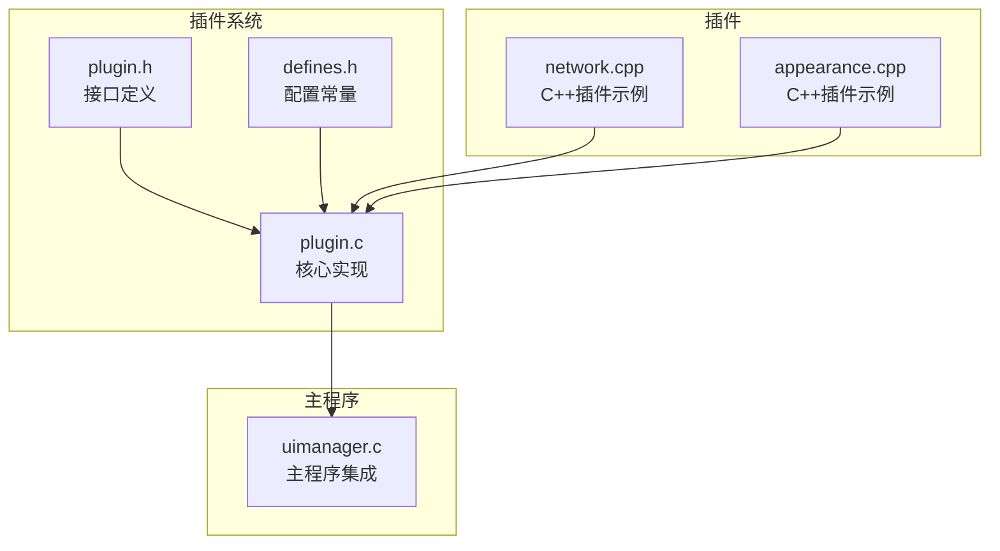
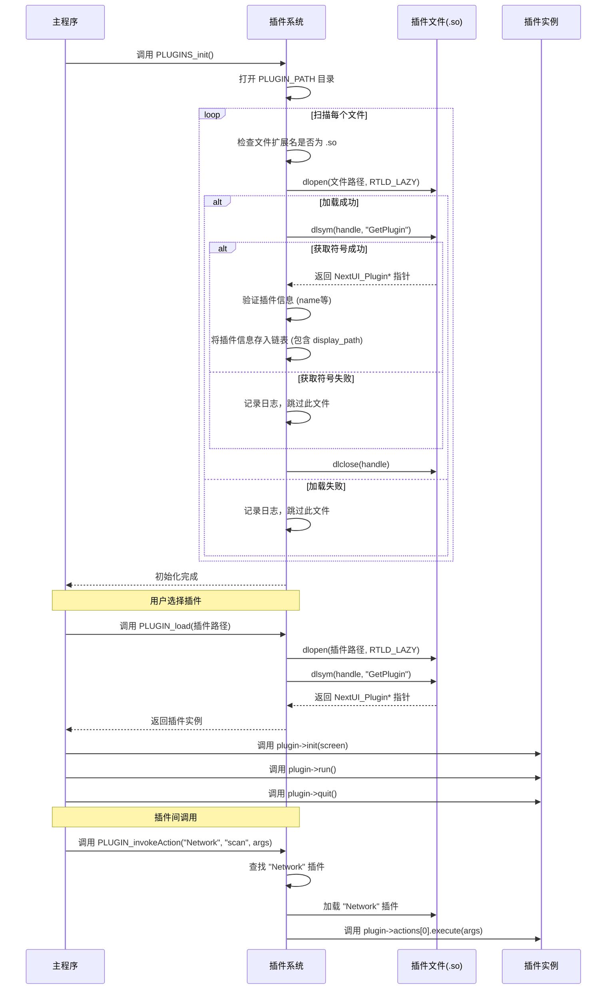

<docs>
# 插件系统API

<cite>
**本文档中引用的文件**   
- [plugin.h](file://workspace/lib/libcommon/plugin.h) - *在提交 bd90e04 中更新，新增 PLUGIN_invokeAction 和 PLUGIN_openPage 功能*
- [plugin.c](file://workspace/lib/libcommon/plugin.c) - *在提交 bd90e04 中更新，实现新功能*
- [api.h](file://workspace/lib/libcommon/api.h) - *在提交 bd90e04 中更新，声明新API*
- [defines.h](file://workspace/lib/libcommon/defines.h)
- [uimanager.c](file://workspace/apps/nextui/uimanager.c)
- [network.cpp](file://workspace/plugins/network/network.cpp) - *C++ 插件示例，展示通用模式*
- [appearance.cpp](file://workspace/plugins/appearance/appearance.cpp) - *C++ 插件示例，展示通用模式*
</cite>

## 更新摘要
**变更内容**   
- 在 `plugin.h` 中新增了 `PLUGIN_invokeAction` 和 `PLUGIN_openPage` 函数声明，以及 `PluginArg` 和 `PluginAction` 结构体。
- 在 `plugin.c` 中实现了 `PLUGIN_invokeAction` 和 `PLUGIN_openPage` 的核心逻辑，支持插件间动作调用和页面跳转。
- 更新了 `NextUI_Plugin` 结构体，新增了 `actions`、`action_count` 和 `open_page` 字段，以支持新的功能。
- 新增了 `PLUGIN_createArg` 和 `PLUGIN_freeArgs` 辅助函数，用于管理插件参数。
- 更新了“架构概述”和“详细组件分析”中的流程图，以反映新的调用流程。
- 更新了所有受影响的“**Section sources**”和“**Diagram sources**”，以包含新文件和修改。

## 目录
1. [简介](#简介)
2. [项目结构](#项目结构)
3. [核心组件](#核心组件)
4. [架构概述](#架构概述)
5. [详细组件分析](#详细组件分析)
6. [依赖分析](#依赖分析)
7. [性能考虑](#性能考虑)
8. [故障排除指南](#故障排除指南)
9. [结论](#结论)

## 简介
本文档详细记录了NextUI项目中插件管理接口的功能与实现。重点分析了`plugin.h`中定义的`plugin_load`、`plugin_unload`、`plugin_get_symbol`等核心函数的工作机制。文档描述了插件加载的搜索路径、动态链接过程和符号解析规则，解释了`plugin_t`结构体（在代码中为`NextUI_Plugin`）中各字段的用途，包括名称、版本、入口点函数等。通过`network.cpp`和`appearance.cpp`等C++插件示例，说明了如何开发一个符合规范的插件，并从主程序安全调用其导出函数。同时，涵盖了错误处理场景，如插件版本不兼容或依赖缺失的情况。本次更新重点介绍了新增的 `PLUGIN_invokeAction` 和 `PLUGIN_openPage` 功能，允许插件之间进行动作调用和页面跳转。

## 项目结构
插件系统是NextUI项目的一个核心功能模块，它允许在运行时动态加载和执行外部功能。该系统主要由以下几个部分构成：
- **接口定义**：位于`workspace/lib/libcommon/plugin.h`，定义了插件必须遵循的接口和数据结构。
- **核心实现**：位于`workspace/lib/libcommon/plugin.c`，实现了插件的加载、卸载和生命周期管理。
- **配置常量**：位于`workspace/lib/libcommon/defines.h`，定义了插件搜索路径`PLUGIN_PATH`等关键常量。
- **主程序集成**：位于`workspace/apps/nextui/uimanager.c`，负责在程序启动时初始化插件系统，并在用户交互时加载和执行插件。
- **插件示例**：位于`workspace/plugins/network/network.cpp`和`workspace/plugins/appearance/appearance.cpp`，是功能完整的C++插件实现，展示了如何编写一个符合规范的插件。



**Diagram sources**
- [plugin.h](file://workspace/lib/libcommon/plugin.h)
- [plugin.c](file://workspace/lib/libcommon/plugin.c)
- [defines.h](file://workspace/lib/libcommon/defines.h)
- [uimanager.c](file://workspace/apps/nextui/uimanager.c)
- [network.cpp](file://workspace/plugins/network/network.cpp)
- [appearance.cpp](file://workspace/plugins/appearance/appearance.cpp)

**Section sources**
- [plugin.h](file://workspace/lib/libcommon/plugin.h)
- [plugin.c](file://workspace/lib/libcommon/plugin.c)
- [defines.h](file://workspace/lib/libcommon/defines.h)
- [uimanager.c](file://workspace/apps/nextui/uimanager.c)
- [network.cpp](file://workspace/plugins/network/network.cpp)
- [appearance.cpp](file://workspace/plugins/appearance/appearance.cpp)

## 核心组件
插件系统的核心组件包括`NextUI_Plugin`结构体、`PLUGINS_init`/`PLUGINS_quit`函数、`PLUGIN_load`函数以及相关的宏定义。

**Section sources**
- [plugin.h](file://workspace/lib/libcommon/plugin.h#L11-L19)
- [plugin.c](file://workspace/lib/libcommon/plugin.c#L13-L85)

## 架构概述
NextUI的插件系统采用动态链接库（.so文件）的形式，通过标准的`dlopen`和`dlsym` API 实现。系统在启动时扫描指定目录，自动发现并验证插件，然后将插件信息存储在链表中供后续使用。当用户选择执行某个插件时，主程序会再次调用`dlopen`加载该插件，并通过`dlsym`获取其入口点函数，最后调用插件的生命周期函数来执行其功能。新增的`display_path`字段允许插件开发者自定义其在文件浏览器中的显示路径。此外，系统现在支持插件间通过`PLUGIN_invokeAction`调用特定动作，以及通过`PLUGIN_openPage`打开特定页面。



**Diagram sources**
- [plugin.c](file://workspace/lib/libcommon/plugin.c#L13-L85)
- [uimanager.c](file://workspace/apps/nextui/uimanager.c#L320-L330)
- [plugin.c](file://workspace/lib/libcommon/plugin.c#L148-L179)

## 详细组件分析
### 核心数据结构分析
`NextUI_Plugin`结构体是插件与主程序通信的核心接口。它定义了插件必须实现的三个生命周期函数和一个名称。`PluginEntry`结构体是插件管理器内部用于存储已发现插件信息的链表节点。

```
classDiagram
class NextUI_Plugin {
+const char* name
+const char* display_path
+int (*init)(void* screen)
+int (*run)(void)
+void (*quit)(void)
+PluginAction* actions
+int action_count
+int (*open_page)(const char* page_name, PluginArg* args)
}
class PluginEntry {
+char* path
+char* name
+char* display_path
+PluginEntry* next
}
class PluginAction {
+const char* name
+int (*execute)(PluginArg* args)
}
class PluginArg {
+char* key
+char* value
+PluginArg* next
}
```

**Diagram sources**
- [plugin.h](file://workspace/lib/libcommon/plugin.h#L4-L16)

#### 字段说明
- **name**: (: 插件的名称，用于在用户界面中显示。
- **display_path**: (: 新增字段，插件开发者在此定义其在文件浏览器中应显示的路径。如果未设置，则使用默认路径。
- **init**: (: 初始化函数，接收一个指向主程序屏幕的`void*`指针。插件可以在此函数中进行初始化，如设置UI、加载资源等。返回0表示成功。
- **run**: (: 主运行函数，插件的业务逻辑在此函数中执行。这是一个阻塞函数，通常包含一个事件循环，直到用户请求退出。
- **quit**: (: 清理函数，在`run`函数返回后调用，用于释放插件占用的资源。
- **actions**: (: 插件注册的动作列表，允许其他插件或主程序调用特定功能。
- **action_count**: (: 动作列表的长度。
- **open_page**: (: 用于打开插件内特定页面的函数指针。

**Section sources**
- [plugin.h](file://workspace/lib/libcommon/plugin.h#L11-L16)

### 核心功能分析
#### 插件加载与初始化
插件系统的初始化由`PLUGINS_init()`函数完成。该函数在程序启动时被`uimanager.c`中的`Menu_init()`调用。与旧版本相比，新版本在发现有效插件后，会检查其`display_path`字段，并将其复制到`PluginEntry`链表中。

```
flowchart TD
Start([PLUGINS_init]) --> OpenDir["打开 PLUGIN_PATH 目录"]
OpenDir --> CheckDir{"目录打开成功?"}
CheckDir --> |否| LogError["记录错误日志"]
CheckDir --> |是| ReadDir["读取目录条目"]
ReadDir --> LoopFile["遍历每个文件"]
LoopFile --> CheckExt{"文件扩展名是 .so?"}
CheckExt --> |否| NextFile["下一个文件"]
CheckExt --> |是| DLOpen["dlopen(文件路径)"]
DLOpen --> CheckHandle{"dlopen 成功?"}
CheckHandle --> |否| LogDLOpenError["记录dlopen错误"]
CheckHandle --> |是| DLSym["dlsym(handle, GET_PLUGIN_SYMBOL)"]
DLSym --> CheckSymbol{"dlsym 成功?"}
CheckSymbol --> |否| LogDLSymError["记录dlsym错误"]
CheckSymbol --> |是| GetPlugin["调用 GetPlugin() 函数"]
GetPlugin --> CheckInfo{"返回的插件信息有效?"}
CheckInfo --> |否| LogInfoError["记录信息无效错误"]
CheckInfo --> |是| StoreInfo["将插件信息存入链表"]
StoreInfo --> CheckDisplayPath{"插件定义了 display_path?"}
CheckDisplayPath --> |是| CopyDisplayPath["复制 display_path 到 PluginEntry"]
CheckDisplayPath --> |否| SetDisplayPathNull["设置 PluginEntry->display_path = NULL"]
SetDisplayPathNull --> CloseHandle["dlclose(handle)"]
CopyDisplayPath --> CloseHandle
CloseHandle --> NextFile
NextFile --> EndLoop{"所有文件处理完毕?"}
EndLoop --> |否| LoopFile
EndLoop --> |是| LogComplete["记录扫描完成日志"]
LogComplete --> End([函数返回])
```

**Diagram sources**
- [plugin.c](file://workspace/lib/libcommon/plugin.c#L13-L66)

**Section sources**
- [plugin.c](file://workspace/lib/libcommon/plugin.c#L13-L66)

#### 插件执行流程
当用户在UI中选择一个插件时，`uimanager.c`中的`Entry_open`函数会被调用，其流程如下：

```
flowchart TD
Start([Entry_open]) --> CheckType{"条目类型是插件?"}
CheckType --> |否| HandleOther["处理其他类型"]
CheckType --> |是| LoadPlugin["PLUGIN_load(插件路径)"]
LoadPlugin --> CheckPlugin{"插件加载成功?"}
CheckPlugin --> |否| Exit["退出"]
CheckPlugin --> |是| ClearScreen["清除屏幕"]
ClearScreen --> CallInit["调用 plugin->init(screen)"]
CallInit --> CheckInit{"init 返回0?"}
CheckInit --> |否| CallQuit["调用 plugin->quit()"]
CheckInit --> |是| CallRun["调用 plugin->run()"]
CallRun --> CallQuit["调用 plugin->quit()"]
CallQuit --> SetDirty["设置 dirty = 1"]
SetDirty --> ResetPAD["重置PAD输入"]
ResetPAD --> Exit["退出"]
```

**Diagram sources**
- [uimanager.c](file://workspace/apps/nextui/uimanager.c#L320-L330)

**Section sources**
- [uimanager.c](file://workspace/apps/nextui/uimanager.c#L320-L330)

#### 插件间动作调用流程
`PLUGIN_invokeAction` 函数允许主程序或其他插件调用指定插件的特定动作。

```
flowchart TD
Start([PLUGIN_invokeAction]) --> FindEntry["根据插件名称查找 PluginEntry"]
FindEntry --> CheckEntry{"插件条目存在?"}
CheckEntry --> |否| ReturnError1["返回 -1 (插件未找到)"]
CheckEntry --> |是| LoadPlugin["调用 PLUGIN_load 加载插件"]
LoadPlugin --> CheckPlugin{"插件加载成功?"}
CheckPlugin --> |否| ReturnError2["返回 -2 (插件加载失败)"]
CheckPlugin --> |是| CheckActions{"插件有注册动作?"}
CheckActions --> |否| ReturnError3["返回 -3 (插件无动作)"]
CheckActions --> |是| FindAction["在 actions 数组中查找 action_name"]
FindAction --> CheckAction{"动作存在?"}
CheckAction --> |否| ReturnError4["返回 -4 (动作未找到)"]
CheckAction --> |是| ExecuteAction["调用 action->execute(args)"]
ExecuteAction --> ReturnResult["返回 execute 的返回值"]
```

**Diagram sources**
- [plugin.c](file://workspace/lib/libcommon/plugin.c#L148-L179)

**Section sources**
- [plugin.c](file://workspace/lib/libcommon/plugin.c#L148-L179)

### 插件开发示例分析
`network.cpp`和`appearance.cpp`文件提供了完整的C++插件开发示例。其关键实现如下：

1.  **使用 `extern "C"`**: 由于主程序是用C语言编写的，它通过C ABI调用插件。因此，C++插件必须使用`extern "C"`块来包装其导出的符号，以防止C++编译器进行名称修饰（name mangling）。
2.  **定义生命周期函数**: `plugin_init`, `plugin_run`, `plugin_quit`。这些函数在`extern "C"`块之外定义，但可以被`extern "C"`块内的代码调用。
3.  **定义插件实例**: `static NextUI_Plugin network_plugin`，并初始化其字段，包括新的`display_path`。
4.  **导出入口点**: `NextUI_Plugin* GetPlugin(void)`函数，必须在`extern "C"`块内定义，以确保其符号名是`GetPlugin`。

```c++
// 核心库头文件必须在 extern "C" 块中包含
extern "C" {
#include "api.h"
#include "config.h"
#include "lang.h"
#include "sysui.h"
#include "plugin.h"
#include "defines.h"
}

// C++ 菜单系统
#include "wifimenu.hpp"

// --- 插件生命周期函数 ---
static int plugin_init(void* main_screen);
static int plugin_run();
static void plugin_quit();

// --- 插件导出 ---
extern "C" {
    static NextUI_Plugin network_plugin = {
        .name = "Network",
        .display_path = SDCARD_PATH "/Tools/Settings", // 自定义显示路径
        .init = plugin_init,
        .run = plugin_run,
        .quit = plugin_quit,
    };

    NextUI_Plugin* GetPlugin(void) {
        return &network_plugin;
    }
}
```

**Section sources**
- [network.cpp](file://workspace/plugins/network/network.cpp#L1-L131)
- [appearance.cpp](file://workspace/plugins/appearance/appearance.cpp#L1-L199)

### C++插件开发注意事项
开发C++插件时，除了遵循C插件的基本规范外，还需注意以下几点：

- **线程安全**: `plugin_run`函数是阻塞的，通常包含一个事件循环。如果插件内部创建了工作线程（如`network.cpp`中的WiFi扫描线程），则必须确保在`plugin_quit`函数中安全地通知并等待这些线程结束，以避免资源泄漏或竞态条件。
- **内存管理**: 使用`new`和`delete`进行内存管理时，必须确保在`plugin_quit`中释放所有通过`new`分配的资源。
- **C++标准库**: 可以在插件中使用C++标准库（如`std::vector`, `std::string`），但应避免在`extern "C"`块内使用，因为这可能导致链接问题。

## 依赖分析
插件系统依赖于标准的C库和特定的平台API。

```
graph TD
PC[plugin.c] --> DL[dlfcn.h]
PC --> DIR[dirent.h]
PC --> STD[stdlib.h]
PC --> STRING[string.h]
PC --> API[api.h]
PC --> UTILS[utils.h]
PC --> DEFINES[defines.h]
DL --> OS[操作系统动态链接库]
API --> SDL[SDL2]
UTILS --> API
DEFINES --> PLATFORM[platform.h]
```

**Diagram sources**
- [plugin.c](file://workspace/lib/libcommon/plugin.c#L1-L10)

**Section sources**
- [plugin.c](file://workspace/lib/libcommon/plugin.c#L1-L10)

## 性能考虑
- **启动时间**：`PLUGINS_init`在程序启动时同步扫描插件目录，加载并验证所有插件。这会增加启动时间，尤其是在插件数量较多时。
- **内存占用**：插件信息（路径、名称、display_path）在程序