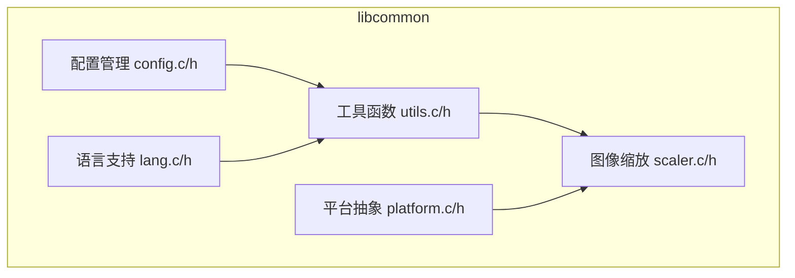
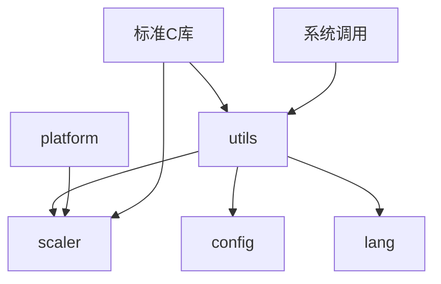

# 核心工具API

<cite>
**本文档中引用的文件**  
- [utils.h](file://workspace/lib/libcommon/utils.h)
- [utils.c](file://workspace/lib/libcommon/utils.c)
- [scaler.h](file://workspace/lib/libcommon/scaler.h)
- [scaler.c](file://workspace/lib/libcommon/scaler.c)
</cite>

## 目录
1. [简介](#简介)
2. [项目结构](#项目结构)
3. [核心组件](#核心组件)
4. [架构概述](#架构概述)
5. [详细组件分析](#详细组件分析)
6. [依赖分析](#依赖分析)
7. [性能考虑](#性能考虑)
8. [故障排除指南](#故障排除指南)
9. [结论](#结论)

## 简介
本文档旨在全面记录 `libcommon` 库中提供的通用工具函数和图像缩放功能。重点介绍 `utils.h` 中的字符串处理、内存操作和文件路径解析等辅助函数的使用方法，并详细说明 `scaler.h` 中定义的图像缩放算法接口，包括支持的算法类型（如双线性、最近邻）及其性能特征。文档还提供了实际调用示例，展示如何在渲染管线中集成这些工具函数，并解释了工具函数的线程安全性和内存分配行为，以及在嵌入式环境下的使用限制。

## 项目结构
`libcommon` 库位于 `workspace/lib/libcommon` 目录下，是整个项目的核心工具库。该库提供了多种通用功能，包括配置管理、语言支持、平台抽象、插件系统、系统UI以及最重要的工具函数和图像缩放功能。`utils.c` 和 `scaler.c` 文件分别实现了辅助函数和图像缩放算法，而 `utils.h` 和 `scaler.h` 则提供了相应的头文件接口。

**中文(中文)**
- [utils.h](file://workspace/lib/libcommon/utils.h)
- [utils.c](file://workspace/lib/libcommon/utils.c)
- [scaler.h](file://workspace/lib/libcommon/scaler.h)
- [scaler.c](file://workspace/lib/libcommon/scaler.c)

## 核心组件

`libcommon` 库的核心组件包括通用工具函数（`utils`）和图像缩放功能（`scaler`）。工具函数提供了字符串处理、文件操作、内存管理等基础服务，而图像缩放功能则提供了多种高效的图像放大算法，特别针对嵌入式设备进行了优化。

**中文(中文)**
- [utils.h](file://workspace/lib/libcommon/utils.h)
- [utils.c](file://workspace/lib/libcommon/utils.c)
- [scaler.h](file://workspace/lib/libcommon/scaler.h)
- [scaler.c](file://workspace/lib/libcommon/scaler.c)

## 架构概述

`libcommon` 的架构设计遵循模块化原则，将不同的功能分离到独立的源文件中。`utils` 模块负责提供通用的辅助功能，而 `scaler` 模块则专注于图像缩放。`scaler` 模块内部又分为C语言实现和NEON汇编优化实现，以在不同硬件平台上提供最佳性能。



**中文(中文)**
- [utils.h](file://workspace/lib/libcommon/utils.h)
- [utils.c](file://workspace/lib/libcommon/utils.c)
- [scaler.h](file://workspace/lib/libcommon/scaler.h)
- [scaler.c](file://workspace/lib/libcommon/scaler.c)

## 详细组件分析

### 工具函数分析

`utils.c` 文件提供了丰富的辅助函数，涵盖了字符串处理、文件操作、路径解析和时间格式化等多个方面。

#### 字符串与路径处理
`utils.c` 提供了多个用于处理文件路径和字符串的函数。`baseName` 函数返回路径中的文件名部分，`folderPath` 函数提取路径中的目录部分，`removeExtension` 函数移除文件的扩展名。`getDisplayName` 和 `getEmuName` 函数则用于从复杂的路径或文件名中提取用户友好的显示名称。

```c
const char *baseName(const char *filename) {
    char *p = strrchr(filename, '/');
    return p ? p + 1 : (char *)filename;
}

void folderPath(const char *path, char *result) {
    char pathCopy[256];  
    strcpy(pathCopy, path);
    char *lastSlash = strrchr(pathCopy, '/');  
    if (lastSlash != NULL) {
        *lastSlash = '\0';  
        strcpy(result, pathCopy); 
    } else {
        strcpy(result, ""); 
    }
}
```

**中文(中文)**
- [utils.c](file://workspace/lib/libcommon/utils.c#L250-L270)

#### 文件操作
`utils.c` 还提供了文件操作的便捷函数，如 `exists` 检查文件是否存在，`touch` 创建空文件，`putFile` 和 `getFile` 用于写入和读取文件内容，`allocFile` 分配内存并读取整个文件内容。这些函数简化了常见的文件I/O操作。

```c
int exists(char* path) {
    return access(path, F_OK)==0;
}

void putFile(char* path, char* contents) {
    FILE* file = fopen(path, "w");
    if (file) {
        fputs(contents, file);
        fclose(file);
    }
}
```

**中文(中文)**
- [utils.c](file://workspace/lib/libcommon/utils.c#L350-L370)

#### 内存与数值操作
`utils.c` 包含了内存和数值操作的函数，如 `getInt` 和 `putInt` 用于读写整数文件，`clamp` 和 `clampd` 用于限制数值范围。`allocFile` 函数使用 `calloc` 分配内存，确保了内存的初始化。

```c
int clamp(int x, int lower, int upper) {
    return min(upper, max(x, lower));
}
```

**中文(中文)**
- [utils.c](file://workspace/lib/libcommon/utils.c#L450-L470)

### 图像缩放功能分析

`scaler.c` 文件实现了多种图像缩放算法，包括 `scale3x`, `scale4x`, `scale5x`, `scale6x` 等，支持16位和32位颜色深度。这些算法通过简单的像素复制来实现图像放大，适用于像素艺术等需要保持清晰边缘的场景。

#### C语言实现
C语言实现的缩放算法逻辑清晰，易于理解。以 `scale3x_c32` 为例，它遍历源图像的每一行，将每个像素复制三次到目标图像的对应行，然后通过 `memcpy` 将该行复制 `ymul-1` 次，以完成垂直方向的放大。

```c
void scale3x_c32(void* __restrict src, void* __restrict dst, uint32_t sw, uint32_t sh, uint32_t sp, uint32_t dw, uint32_t dh, uint32_t dp, uint32_t ymul) {
    if (!sw||!sh||!ymul) return;
    uint32_t x, dx, pix, swl = sw*sizeof(uint32_t);
    if (!sp) { sp = swl; } swl*=3; if (!dp) { dp = swl; }
    for (; sh>0; sh--, src=(uint8_t*)src+sp) {
        uint32_t *s = (uint32_t* __restrict)src;
        uint32_t *d = (uint32_t* __restrict)dst;
        for (x=dx=0; x<sw; x++, dx+=3) {
            pix = s[x];
            d[dx] = pix; d[dx+1] = pix; d[dx+2] = pix;
        }
        void* __restrict dstsrc = dst; dst = (uint8_t*)dst+dp;
        for (uint32_t i=ymul-1; i>0; i--, dst=(uint8_t*)dst+dp) memcpy(dst, dstsrc, swl);
    }
}
```

**中文(中文)**
- [scaler.c](file://workspace/lib/libcommon/scaler.c#L250-L270)

#### NEON汇编优化
为了在ARM架构的嵌入式设备上获得最佳性能，`scaler.c` 提供了使用NEON指令集优化的版本。这些函数通过内联汇编直接操作NEON寄存器，利用SIMD（单指令多数据）特性，一次处理多个像素，极大地提高了缩放速度。例如，`scale2x1_n16` 函数使用 `vldmia` 和 `vstmia` 指令批量加载和存储数据，并使用 `vdup` 和 `vext` 指令进行像素复制和扩展。

```assembly
"1:	add lr, %0, %2		;"	// lr  = x64bytes offset
"	add r8, %0, %3		;"	// r8  = lineend offset
"	cmp %0, lr		;"
"	beq 3f			;"
"2:	vldmia %0!, {q8-q11}	;"	// 32 pixels 64 bytes
"	vdup.16 d0, d23[3]	;"
"	vdup.16 d1, d23[2]	;"
"	vext.16 d31, d1,d0,#2	;"
...
"	vstmia %1!, {q8-q15}	;"
"	bne 2b			;"
```

**中文(中文)**
- [scaler.c](file://workspace/lib/libcommon/scaler.c#L1000-L1030)

## 依赖分析

`libcommon` 库的内部组件之间存在清晰的依赖关系。`utils` 模块被 `scaler`、`config`、`lang` 等多个模块所依赖，提供了基础的工具函数。`scaler` 模块依赖于 `platform` 模块来判断是否支持NEON指令集。外部依赖主要来自标准C库（如 `stdio.h`, `string.h`）和系统调用（如 `access`, `open`）。



**中文(中文)**
- [utils.h](file://workspace/lib/libcommon/utils.h)
- [scaler.h](file://workspace/lib/libcommon/scaler.h)
- [platform.h](file://workspace/lib/libcommon/platform.h)

## 性能考虑

`libcommon` 库在性能方面进行了精心设计。对于图像缩放功能，提供了C语言实现和NEON汇编优化两个版本。在不支持NEON的设备上，会自动回退到C语言实现。NEON优化版本通过批量处理数据和利用SIMD指令，显著提升了处理速度。然而，这些优化也带来了代码复杂性和可移植性的代价。在嵌入式环境下，应优先使用NEON优化版本以获得最佳性能。

## 故障排除指南

在使用 `libcommon` 库时，可能会遇到以下问题：
- **NEON优化未生效**：确保编译时启用了NEON支持（如 `-mfpu=neon`），并确认目标设备支持NEON指令集。
- **内存分配失败**：`allocFile` 等函数会分配内存，需检查返回值是否为 `NULL`，并在使用后调用 `free` 释放内存。
- **路径解析错误**：确保输入的路径格式正确，特别是使用 `pathRelativeTo` 等函数时，路径必须是绝对路径或能被 `realpath` 解析。

**中文(中文)**
- [scaler.c](file://workspace/lib/libcommon/scaler.c#L600-L650)
- [utils.c](file://workspace/lib/libcommon/utils.c#L400-L420)

## 结论

`libcommon` 库为项目提供了强大而高效的通用工具和图像缩放功能。其模块化的设计和对性能的优化，使其非常适合在资源受限的嵌入式环境中使用。开发者应充分利用NEON优化的图像缩放算法来提升渲染性能，并谨慎处理内存分配和文件I/O操作，以确保应用的稳定性和可靠性。