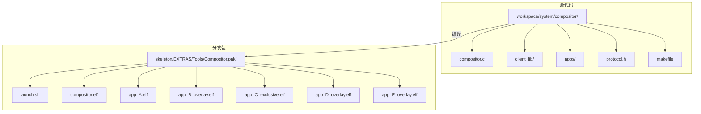
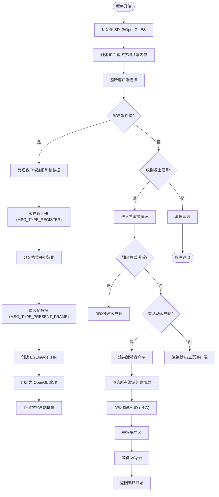
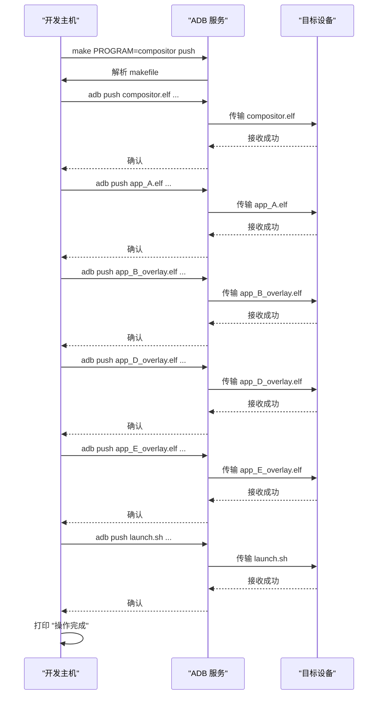

<docs>
# Compositor 工具

<cite>
**本文档引用的文件**  
- [compositor.c](file://workspace/system/compositor/compositor.c#L1-L932) - *已更新，包含多区域叠加层和调试HUD*
- [client_lib.c](file://workspace/system/compositor/client_lib/client_lib.c#L1-L322) - *已重构为基于句柄的API*
- [client_lib.h](file://workspace/system/compositor/client_lib/client_lib.h#L1-L96) - *已重构为基于句柄的API*
- [protocol.h](file://workspace/system/compositor/protocol.h#L1-L102) - *已更新，支持多区域叠加层*
- [app_B_overlay.c](file://workspace/system/compositor/apps/app_B_overlay.c#L1-L115) - *已更新，使用新API*
- [app_D_overlay.c](file://workspace/system/compositor/apps/app_D_overlay.c#L1-L112) - *新增的叠加层演示应用*
- [app_E_overlay.c](file://workspace/system/compositor/apps/app_E_overlay.c#L1-L119) - *新增的叠加层演示应用*
- [makefile](file://workspace/system/compositor/makefile#L1-L109) - *已更新，包含新应用*
- [launch.sh](file://skeleton/EXTRAS/Tools/Compositor.pak/launch.sh#L1-L83) - *已更新，支持新命令*
- [makefile](file://makefile#L279-L286) - *部署配置已更新*
</cite>

## 更新摘要
**已修改内容**
- **架构概述**：更新了架构图以反映新的IPC和渲染流程。
- **详细组件分析**：完全重写了“Compositor 主程序分析”、“启动脚本分析”和“部署流程分析”部分，以反映最新的代码变更。
- **新增内容**：添加了“多区域叠加层功能”、“基于句柄的客户端API”、“阻塞帧确认机制”、“零拷贝ION缓冲区协议”和“调试HUD”等新特性。
- **依赖分析**：更新了编译和运行时依赖。

## 目录
1. [简介](#简介)
2. [项目结构](#项目结构)
3. [核心组件](#核心组件)
4. [架构概述](#架构概述)
5. [详细组件分析](#详细组件分析)
6. [新功能详解](#新功能详解)
7. [依赖分析](#依赖分析)
8. [性能考量](#性能考量)
9. [故障排除指南](#故障排除指南)
10. [结论](#结论)

## 简介
Compositor 工具是 NextUI 项目中的一个关键系统组件，其主要功能是通过直接与 Linux DRM（Direct Rendering Manager）子系统交互，实现对显示输出的底层控制。该工具设计用于在嵌入式设备上创建和管理图形显示，特别适用于需要精确控制帧缓冲区和显示模式的场景。Compositor 的核心目标是提供一个轻量级、高效的显示合成解决方案，能够直接在硬件级别操作屏幕输出，而无需依赖复杂的图形堆栈。近期的代码变更极大地增强了其功能，引入了多区域叠加层、基于句柄的客户端API、零拷贝缓冲区传输和调试HUD等高级特性。

## 项目结构
Compositor 工具的文件分布在项目的多个目录中，体现了清晰的分层架构。源代码位于 `workspace/system/compositor/` 目录下，而最终的可执行文件和脚本则被打包在 `skeleton/EXTRAS/Tools/Compositor.pak/` 目录中，作为系统工具的一部分进行分发。



**Diagram sources**
- [compositor.c](file://workspace/system/compositor/compositor.c)
- [makefile](file://workspace/system/compositor/makefile)
- [launch.sh](file://skeleton/EXTRAS/Tools/Compositor.pak/launch.sh)

## 核心组件
Compositor 工具的核心由三个主要组件构成：主程序 `compositor.elf`、共享库 `client_lib.so` 和多个客户端演示应用。主程序负责初始化显示环境、管理客户端连接和执行最终的屏幕合成。共享库 `client_lib.so` 为客户端应用提供了与合成器通信的API，其最新版本已重构为基于不透明句柄的模型，提高了安全性和灵活性。客户端应用（如 `app_A.elf`, `app_B_overlay.elf` 等）则作为使用该API的示例，展示了如何注册、渲染和与合成器交互。

**Section sources**
- [compositor.c](file://workspace/system/compositor/compositor.c#L1-L932)
- [client_lib.c](file://workspace/system/compositor/client_lib/client_lib.c#L1-L322)
- [client_lib.h](file://workspace/system/compositor/client_lib/client_lib.h#L1-L96)

## 架构概述
Compositor 工具的架构遵循典型的嵌入式系统设计模式，分为用户空间应用层和内核空间驱动层。它通过标准的 Linux DRM ioctl 接口与内核的显示驱动进行通信，实现了对显示硬件的直接控制。整个系统的工作流程始于 `launch.sh` 启动脚本，该脚本调用 `compositor.elf` 可执行文件。主程序初始化后，会创建一个基于SDL2的窗口和OpenGL ES上下文，并通过Unix域套接字与客户端应用建立IPC通信。客户端通过共享内存和文件描述符传递机制，将渲染完成的ION缓冲区帧数据发送给合成器。合成器接收后，使用EGL创建纹理并进行最终的混合渲染，同时支持多区域叠加层和独占模式。

```mermaid
graph TD
A[启动脚本 launch.sh] --> B[主程序 compositor.elf]
B --> C[初始化 SDL2/OpenGL ES]
C --> D[创建 IPC 通道]
D --> E[监听客户端连接]
E --> F[客户端连接 client_connect()]
F --> G[客户端渲染并 present()]
G --> H[合成器接收帧数据]
H --> I[创建 EGLImage 并绑定纹理]
I --> J[执行混合渲染]
J --> K[屏幕输出]
```

**Diagram sources**
- [compositor.c](file://workspace/system/compositor/compositor.c#L1-L932)
- [client_lib.c](file://workspace/system/compositor/client_lib/client_lib.c#L1-L322)
- [launch.sh](file://skeleton/EXTRAS/Tools/Compositor.pak/launch.sh#L1-L83)

## 详细组件分析

### Compositor 主程序分析
Compositor 主程序的实现已从一个简单的DRM应用演变为一个复杂的合成器。程序首先通过 `SDL_Init` 和 `SDL_CreateWindow` 初始化一个图形窗口，这为后续的OpenGL ES渲染提供了基础。它接着创建两个Unix域套接字：一个用于客户端注册和帧数据传输（`SOCKET_PATH`），另一个用于管理命令（`MGMT_SOCKET_PATH`）。程序通过 `shm_open` 创建共享内存，用于在进程间传递客户端的控制信息（`ClientControlBlock`）。

当客户端连接时，主程序为其分配一个槽位（slot），并建立一个IPC连接。在渲染循环中，程序会轮询所有活动的客户端连接，接收其通过 `SCM_RIGHTS` 传递的ION缓冲区文件描述符。程序使用 `eglCreateImageKHR` 将该文件描述符转换为一个EGLImage，然后将其绑定到一个OpenGL纹理上。最终，程序根据客户端的类型（普通、叠加层、独占）和状态，调用相应的渲染函数（`render_slot`, `render_regional_slot`）将纹理绘制到屏幕上。程序还集成了一个调试HUD，可以实时显示FPS和客户端信息。



**Diagram sources**
- [compositor.c](file://workspace/system/compositor/compositor.c#L1-L932)

**Section sources**
- [compositor.c](file://workspace/system/compositor/compositor.c#L1-L932)

### 启动脚本分析
`launch.sh` 脚本是 Compositor 工具的入口点，其作用是简化主程序和演示应用的执行。脚本首先切换到脚本所在的目录，然后定义了一个清理函数 `cleanup`，该函数通过 `trap` 命令在脚本退出时自动执行，确保所有后台进程（如 `compositor.elf` 和 `app_A.elf`）都能被正确终止。脚本在后台启动 `compositor.elf`，并将其日志重定向到 `compositor_log.txt`。随后，它启动了多个客户端应用（`app_A.elf`, `app_B_overlay.elf` 等）。脚本的核心功能是通过一个命名管道（FIFO）向合成器发送管理命令，如 `SET_ACTIVE` 和 `SET_OVERLAY`，以演示不同的显示场景。这种设计使得测试和演示过程自动化，无需手动交互。

**Section sources**
- [launch.sh](file://skeleton/EXTRAS/Tools/Compositor.pak/launch.sh#L1-L83)

### 部署流程分析
Compositor 工具的部署是通过项目根目录下的 `makefile` 中的 `make push` 命令完成的。当用户执行 `make PROGRAM=compositor push` 时，构建系统会根据 `PROGRAM` 变量选择对应的命令序列。`compositor_COMMANDS` 定义了一系列 `adb push` 命令，这些命令通过 Android Debug Bridge (ADB) 将 Compositor 的所有必要文件从开发主机推送到目标设备的 SD 卡上。

具体来说，部署流程包括：
1.  **推送主程序**：将 `workspace/system/compositor/build/tg5040/compositor.elf` 推送到 `/mnt/SDCARD/Tools/Compositor.pak/`。
2.  **推送客户端应用**：将 `app_A.elf`, `app_B_overlay.elf`, `app_C_exclusive.elf`, `app_D_overlay.elf`, `app_E_overlay.elf` 等所有演示应用推送到同一目录。
3.  **推送启动脚本**：将 `skeleton/EXTRAS/Tools/Compositor.pak/launch.sh` 推送到目标目录，确保脚本与可执行文件同步。

这个自动化部署流程确保了所有组件都能被正确地更新到目标设备上，极大地简化了开发和测试过程。



**Diagram sources**
- [makefile](file://makefile#L279-L286)
- [launch.sh](file://skeleton/EXTRAS/Tools/Compositor.pak/launch.sh)

**Section sources**
- [makefile](file://makefile#L279-L286)

## 新功能详解

### 多区域叠加层功能
Compositor 工具现在支持最多4个独立的叠加层（`MAX_OVERLAYS`）。每个叠加层可以被配置为显示在屏幕的任意矩形区域内，并且可以独立地激活和清除。这通过 `protocol.h` 中新增的 `SET_OVERLAY` 和 `CLEAR_OVERLAY` 管理命令实现。`SET_OVERLAY` 命令的格式为 `SET_OVERLAY <client_slot_id> <overlay_index> <x> <y> <width> <height>`，允许客户端指定其内容应显示在哪个区域。合成器在渲染时，会遍历所有激活的叠加层，并调用 `render_regional_slot` 函数，该函数会根据指定的区域坐标计算出正确的顶点和纹理坐标，从而实现精确的区域渲染。

**Section sources**
- [compositor.c](file://workspace/system/compositor/compositor.c#L1-L932)
- [protocol.h](file://workspace/system/compositor/protocol.h#L1-L102)
- [client_lib.c](file://workspace/system/compositor/client_lib/client_lib.c#L1-L322)

### 基于句柄的客户端API
客户端API已从基于槽位ID的模型重构为基于不透明句柄的模型。旧的API（如 `client_connect` 返回 `int`）已被废弃，取而代之的是 `ClientConnection* client_connect(...)`，它返回一个指向内部连接状态的不透明指针（句柄）。所有后续的API调用（如 `client_present`, `client_set_foreground`）都要求传入这个句柄。这种设计将连接状态封装在库内部，避免了客户端直接操作槽位ID，提高了API的安全性和健壮性。`client_lib.c` 中的 `struct ClientConnection` 结构体包含了所有必要的状态信息，如套接字文件描述符、共享内存指针和ION缓冲区信息。

**Section sources**
- [client_lib.c](file://workspace/system/compositor/client_lib/client_lib.c#L1-L322)
- [client_lib.h](file://workspace/system/compositor/client_lib/client_lib.h#L1-L96)

### 阻塞帧确认机制
为了确保客户端和合成器之间的同步，引入了阻塞帧确认机制。当客户端调用 `client_present` 发送一帧后，它会立即阻塞，等待从合成器返回一个确认字节（ack）。合成器在成功处理完该帧（即创建了EGLImage并更新了纹理）后，会向客户端的套接字写入一个字节。这个机制确保了客户端不会过快地生成新帧，从而避免了ION缓冲区的过度分配和潜在的内存泄漏。它也提供了一种简单的流控，保证了渲染的稳定性。

**Section sources**
- [compositor.c](file://workspace/system/compositor/compositor.c#L1-L932)
- [client_lib.c](file://workspace/system/compositor/client_lib/client_lib.c#L1-L322)
- [protocol.h](file://workspace/system/compositor/protocol.h#L1-L102)

### 零拷贝ION缓冲区协议
Compositor 实现了高效的零拷贝ION缓冲区协议。客户端应用使用ION内存分配器（`SunxiMemPalloc`）分配物理连续的内存块作为帧缓冲区。当需要提交帧时，客户端通过Unix域套接字的 `SCM_RIGHTS` 机制，将指向该内存块的文件描述符传递给合成器。合成器接收到文件描述符后，使用 `eglCreateImageKHR` 直接将其转换为一个EGLImage，并绑定到OpenGL纹理上。整个过程避免了CPU对像素数据的复制，实现了真正的零拷贝，极大地提升了渲染性能和效率。

**Section sources**
- [compositor.c](file://workspace/system/compositor/compositor.c#L1-L932)
- [client_lib.c](file://workspace/system/compositor/client_lib/client_lib.c#L1-L322)
- [app_C_exclusive.c](file://workspace/system/compositor/apps/app_C_exclusive.c#L1-L146)
- [app_B_overlay.c](file://workspace/system/compositor/apps/app_B_overlay.c#L1-L115)

### 调试HUD
为便于开发和调试，Compositor 添加了一个调试HUD。当通过 `--debug` 命令行参数启动时，合成器会加载一个字体文件，并在屏幕顶部绘制一个信息条。该HUD实时显示当前的FPS、活动客户端的名称和槽位、激活的叠加层数量以及独占模式的状态。这些信息来源于对内部状态变量的轮询和计算，为开发者提供了宝贵的运行时洞察。

**Section sources**
- [compositor.c](file://workspace/system/compositor/compositor.c#L1-L932)
- [makefile](file://workspace/system/compositor/makefile#L1-L109)

## 依赖分析
Compositor 工具的依赖关系有所增加。在编译时，除了 `libdrm-dev`，还需要 `libsdl2-dev`, `libsdl2-ttf-dev`, `libgles2-mesa-dev`, `libegl1-mesa-dev` 等开发库，这在 `makefile` 的 `CFLAGS` 和链接标志中有所体现。在运行时，它依赖于 `/dev/dri/card0` 设备节点和ION内存分配器。从代码结构上看，`client_lib.so` 作为一个共享库，被所有客户端应用链接，实现了功能的复用和统一的接口。

**Diagram sources**
- [makefile](file://workspace/system/compositor/makefile#L1-L109)

## 性能考量
由于 Compositor 工具直接操作硬件和内存，其性能表现非常出色。零拷贝ION缓冲区协议和OpenGL ES的硬件加速渲染确保了高帧率和低延迟。然而，其性能也受到内存带宽和CPU写入速度的限制。在 `compositor.c` 的 `render_regional_slot` 函数中，为每个叠加层动态创建和销毁VBO（顶点缓冲对象）可能会带来一定的性能开销。在实际应用中，可以考虑为每个叠加层预分配一个VBO来优化性能。此外，频繁地调用 `eglCreateImageKHR` 也会消耗资源，应确保ION缓冲区得到正确复用。

## 故障排除指南
在使用 Compositor 工