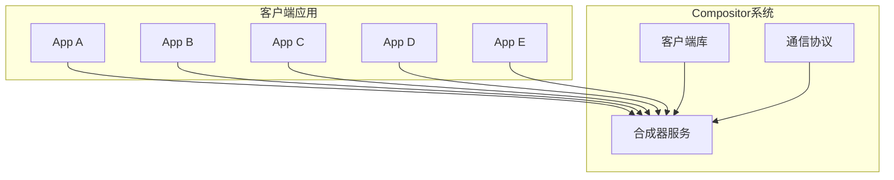
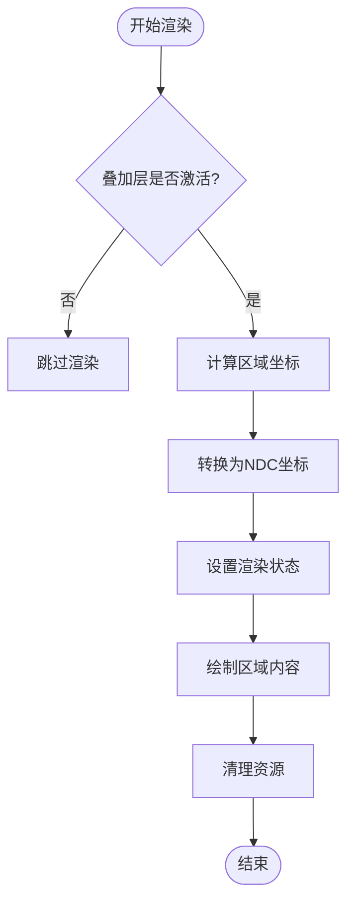
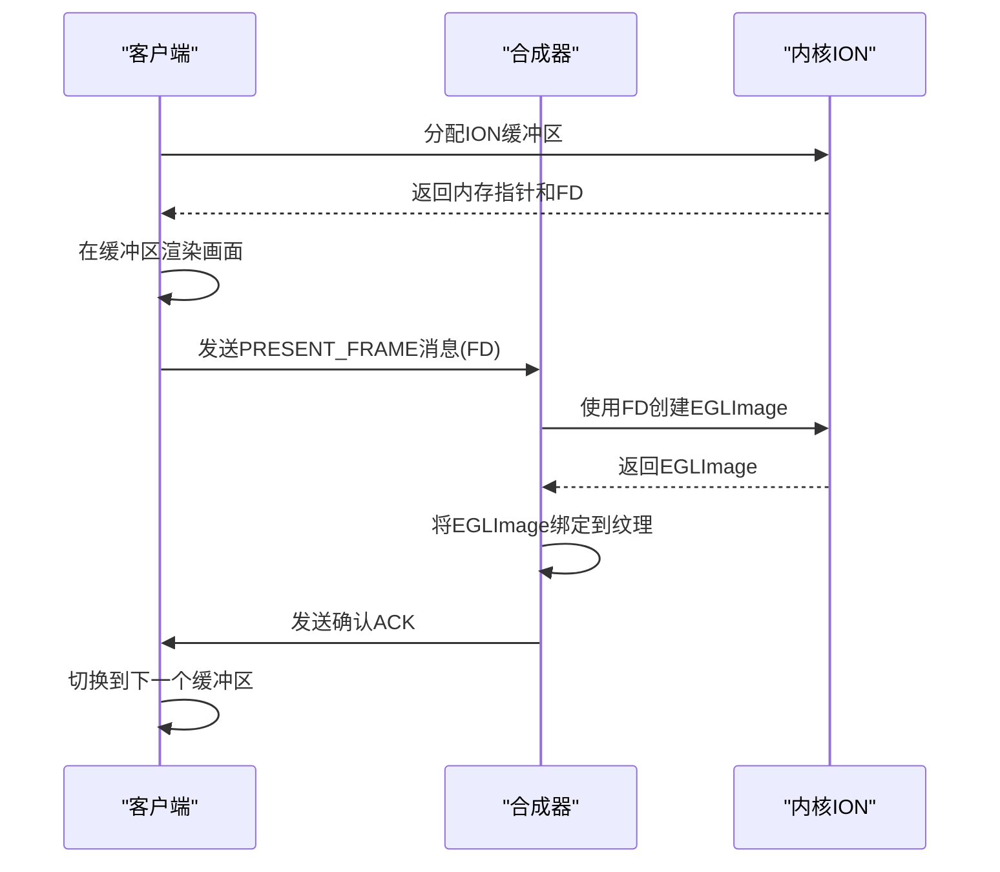
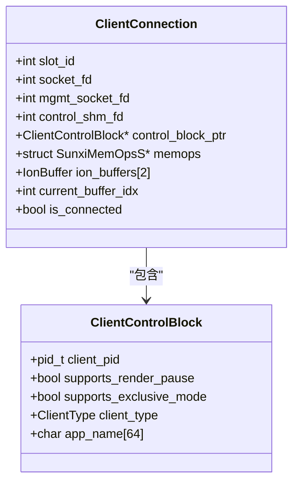
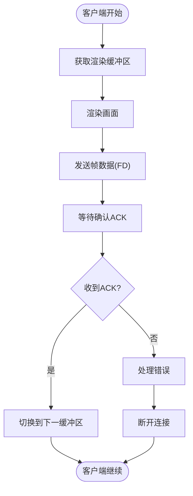
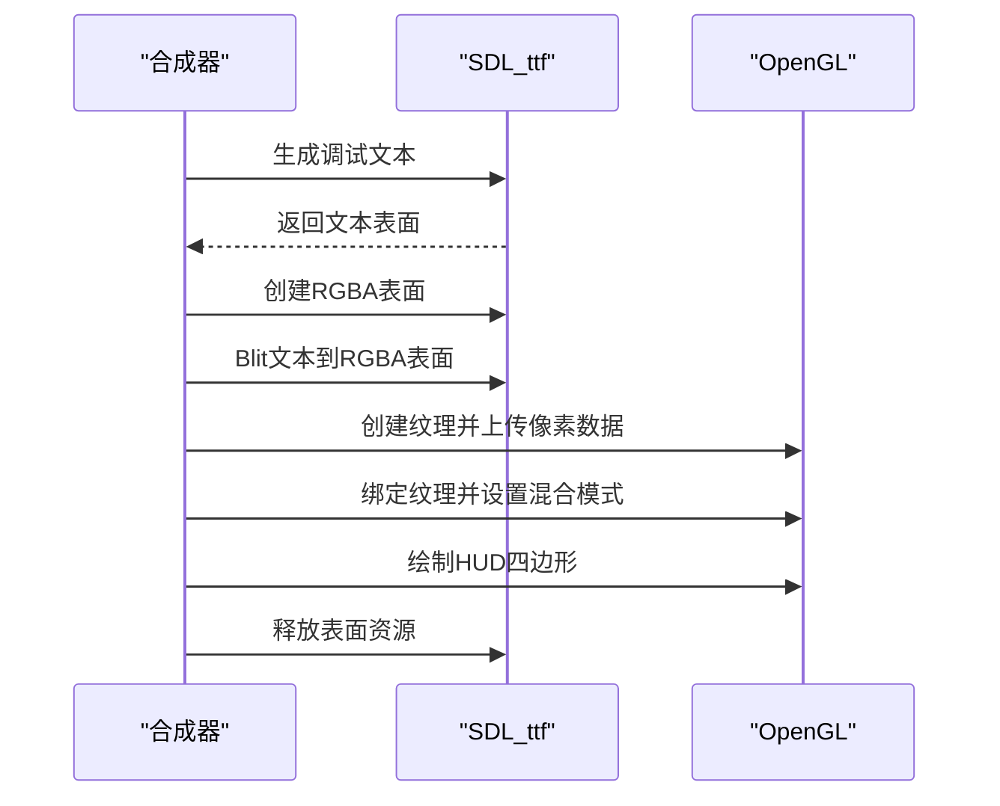
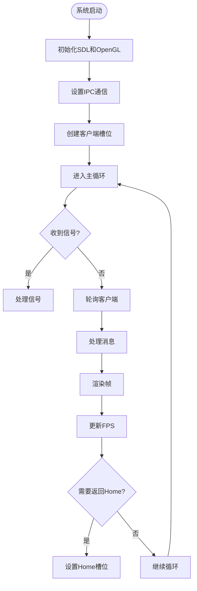
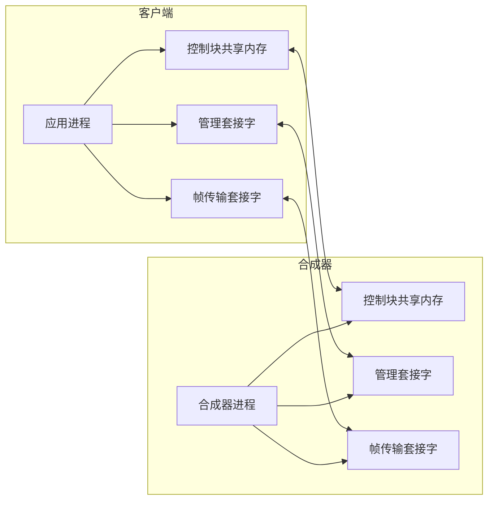

# Compositor 系统架构

<cite>
**本文档引用文件**  
- [compositor.c](file://workspace/system/compositor/compositor.c)
- [protocol.h](file://workspace/system/compositor/protocol.h)
- [client_lib.c](file://workspace/system/compositor/client_lib/client_lib.c)
- [client_lib.h](file://workspace/system/compositor/client_lib/client_lib.h)
- [app_A.c](file://workspace/system/compositor/apps/app_A.c)
- [app_B_overlay.c](file://workspace/system/compositor/apps/app_B_overlay.c)
- [app_C_exclusive.c](file://workspace/system/compositor/apps/app_C_exclusive.c)
- [app_D_overlay.c](file://workspace/system/compositor/apps/app_D_overlay.c)
- [app_E_overlay.c](file://workspace/system/compositor/apps/app_E_overlay.c)
- [README.md](file://workspace/system/compositor/README.md)
</cite>

## 目录
1. [系统概述](#系统概述)
2. [核心架构与组件](#核心架构与组件)
3. [多层合成与区域叠加](#多层合成与区域叠加)
4. [零拷贝ION缓冲区协议](#零拷贝ion缓冲区协议)
5. [基于句柄的客户端API](#基于句柄的客户端api)
6. [阻塞帧确认机制](#阻塞帧确认机制)
7. [调试HUD实现](#调试hud实现)
8. [系统启动与客户端管理](#系统启动与客户端管理)
9. [进程间通信(IPC)机制](#进程间通信ipc机制)
10. [客户端应用示例分析](#客户端应用示例分析)

## 系统概述

Compositor系统是一个基于客户端/服务器架构的图形合成器，旨在为嵌入式设备提供高效、灵活的UI管理环境。系统通过多层合成、零拷贝缓冲区传输和基于句柄的API，实现了高性能的图形渲染与管理。系统支持多种客户端类型，包括普通应用、叠加层和独占模式应用，并提供了调试HUD、进程间通信等高级功能。

**系统来源**
- [README.md](file://workspace/system/compositor/README.md#L1-L198)

## 核心架构与组件

Compositor系统由三个核心组件构成：合成器服务、客户端库和通信协议。合成器作为中心服务，负责管理所有客户端的连接、渲染和合成。客户端库为应用程序提供了与合成器交互的C语言API。通信协议定义了客户端与服务器之间数据交换的结构和规则。

**图示来源**
- [compositor.c](file://workspace/system/compositor/compositor.c#L0-L799)
- [client_lib.c](file://workspace/system/compositor/client_lib/client_lib.c#L0-L321)
- [protocol.h](file://workspace/system/compositor/protocol.h#L0-L101)

**本节来源**
- [README.md](file://workspace/system/compositor/README.md#L1-L198)

## 多层合成与区域叠加

系统支持多层合成和区域叠加功能，允许最多4个叠加层在屏幕的任意矩形区域内进行渲染。每个叠加层都有独立的坐标系和渲染区域，合成器负责将这些区域正确地合成到最终画面中。

### 区域叠加层渲染逻辑

区域叠加层的渲染逻辑基于"虚拟屏幕"与"窗口"的概念。每个客户端拥有一个与屏幕大小相同的虚拟画布，合成器则在这个画布上创建一个窗口，只显示指定区域的内容。这种设计使得客户端可以在统一的坐标系下进行渲染，而无需关心最终的显示位置。

**图示来源**
- [compositor.c](file://workspace/system/compositor/compositor.c#L250-L298)
- [app_B_overlay.c](file://workspace/system/compositor/apps/app_B_overlay.c#L30-L114)

**本节来源**
- [compositor.c](file://workspace/system/compositor/compositor.c#L250-L298)
- [app_B_overlay.c](file://workspace/system/compositor/apps/app_B_overlay.c#L30-L114)

## 零拷贝ION缓冲区协议

系统采用零拷贝ION缓冲区协议来实现高效的图形数据传输。该协议利用Linux的ION内存分配器，在内核空间分配物理连续的内存块，并通过文件描述符在进程间共享，避免了传统方式中的数据复制开销。

### ION缓冲区工作流程

**图示来源**
- [client_lib.c](file://workspace/system/compositor/client_lib/client_lib.c#L197-L248)
- [compositor.c](file://workspace/system/compositor/compositor.c#L500-L550)

**本节来源**
- [client_lib.c](file://workspace/system/compositor/client_lib/client_lib.c#L197-L248)
- [compositor.c](file://workspace/system/compositor/compositor.c#L500-L550)

## 基于句柄的客户端API

系统提供了一套基于句柄的客户端API，通过不透明的`ClientConnection`结构体来管理客户端连接。这种设计隐藏了底层实现细节，提高了API的安全性和可维护性。

### 核心API函数

| 函数名称 | 参数 | 返回值 | 说明 |
| :--- | :--- | :--- | :--- |
| `client_connect` | slot_hint, app_name, type | ClientConnection* | 连接到合成器并建立会话 |
| `client_disconnect` | handle | void | 断开连接并释放资源 |
| `client_get_render_buffer` | handle | uint8_t* | 获取可写入的渲染缓冲区 |
| `client_present` | handle, buffer_ptr | void | 提交渲染完成的缓冲区 |
| `client_get_slot_id` | handle | int | 获取分配的槽位ID |

**图示来源**
- [client_lib.h](file://workspace/system/compositor/client_lib/client_lib.h#L23-L91)
- [client_lib.c](file://workspace/system/compositor/client_lib/client_lib.c#L50-L165)

**本节来源**
- [client_lib.h](file://workspace/system/compositor/client_lib/client_lib.h#L23-L91)
- [client_lib.c](file://workspace/system/compositor/client_lib/client_lib.c#L50-L165)

## 阻塞帧确认机制

系统实现了阻塞帧确认机制，确保客户端只有在合成器成功处理帧数据后才会继续执行。这种机制保证了渲染的同步性和数据的一致性。

### 确认机制流程

**图示来源**
- [client_lib.c](file://workspace/system/compositor/client_lib/client_lib.c#L197-L248)
- [compositor.c](file://workspace/system/compositor/compositor.c#L500-L550)

**本节来源**
- [client_lib.c](file://workspace/system/compositor/client_lib/client_lib.c#L197-L248)
- [compositor.c](file://workspace/system/compositor/compositor.c#L500-L550)

## 调试HUD实现

系统内置了调试HUD功能，可以在画面上叠加显示FPS、活动客户端等调试信息。该功能通过SDL_ttf库渲染文本，并将其作为纹理绘制在最终画面之上。

### HUD渲染流程

**图示来源**
- [compositor.c](file://workspace/system/compositor/compositor.c#L303-L386)
- [README.md](file://workspace/system/compositor/README.md#L140-L155)

**本节来源**
- [compositor.c](file://workspace/system/compositor/compositor.c#L303-L386)
- [README.md](file://workspace/system/compositor/README.md#L140-L155)

## 系统启动与客户端管理

系统启动时会初始化SDL、OpenGL环境和IPC通信通道。客户端管理采用槽位机制，每个连接的客户端被分配到一个唯一的槽位，并通过状态机管理其生命周期。

### 系统启动流程

**图示来源**
- [compositor.c](file://workspace/system/compositor/compositor.c#L700-L799)
- [README.md](file://workspace/system/compositor/README.md#L157-L170)

**本节来源**
- [compositor.c](file://workspace/system/compositor/compositor.c#L700-L799)
- [README.md](file://workspace/system/compositor/README.md#L157-L170)

## 进程间通信(IPC)机制

系统采用多种IPC机制来实现客户端与合成器之间的通信，包括Unix域套接字、共享内存和文件描述符传递。

### IPC通信架构

**图示来源**
- [compositor.c](file://workspace/system/compositor/compositor.c#L400-L450)
- [client_lib.c](file://workspace/system/compositor/client_lib/client_lib.c#L100-L150)

**本节来源**
- [compositor.c](file://workspace/system/compositor/compositor.c#L400-L450)
- [client_lib.c](file://workspace/system/compositor/client_lib/client_lib.c#L100-L150)

## 客户端应用示例分析

系统提供了多个客户端应用示例，展示了不同使用场景下的实现方式。

### 应用A: 基础动画应用

App A是一个基础的动画应用，展示了最基本的客户端实现模式。它在连接到合成器后，持续渲染一个移动的方块，并通过`client_present`提交帧。

**本节来源**
- [app_A.c](file://workspace/system/compositor/apps/app_A.c#L0-L62)

### 应用B: 垂直移动叠加层

App B是一个叠加层应用，展示了如何在指定区域内渲染垂直移动的方块。它使用`client_set_overlay_region`将自己设置为右上角的叠加层。

**本节来源**
- [app_B_overlay.c](file://workspace/system/compositor/apps/app_B_overlay.c#L0-L114)

### 应用C: 可切换模式应用

App C是一个支持独占模式的应用，可以通过START按钮在普通模式和独占模式之间切换。它展示了`client_set_foreground` API的使用。

**本节来源**
- [app_C_exclusive.c](file://workspace/system/compositor/apps/app_C_exclusive.c#L0-L145)

### 应用D: 圆周运动叠加层

App D是一个叠加层应用，展示了如何在指定区域内渲染圆周运动的方块。它使用三角函数计算运动轨迹。

**本节来源**
- [app_D_overlay.c](file://workspace/system/compositor/apps/app_D_overlay.c#L0-L111)

### 应用E: 对角线移动叠加层

App E是一个叠加层应用，展示了如何在指定区域内渲染对角线移动的方块。它在左下角的区域内进行反弹运动。

**本节来源**
- [app_E_overlay.c](file://workspace/system/compositor/apps/app_E_overlay.c#L0-L118)