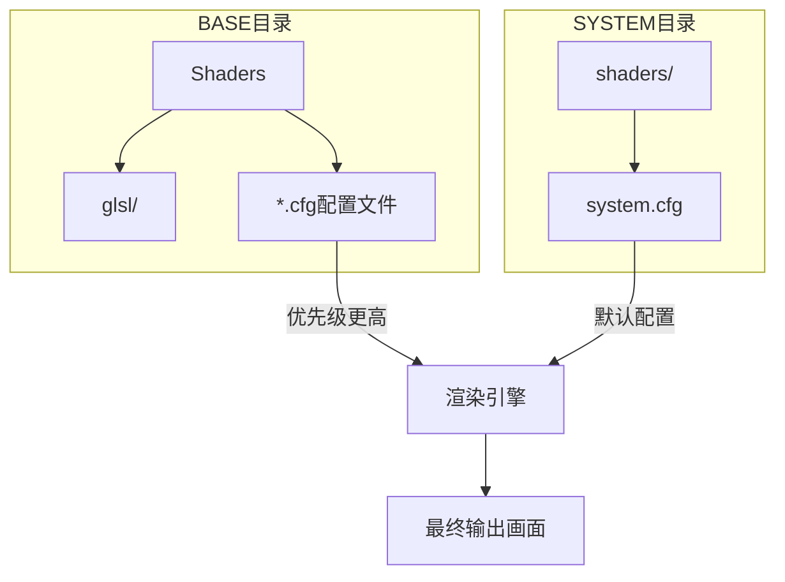
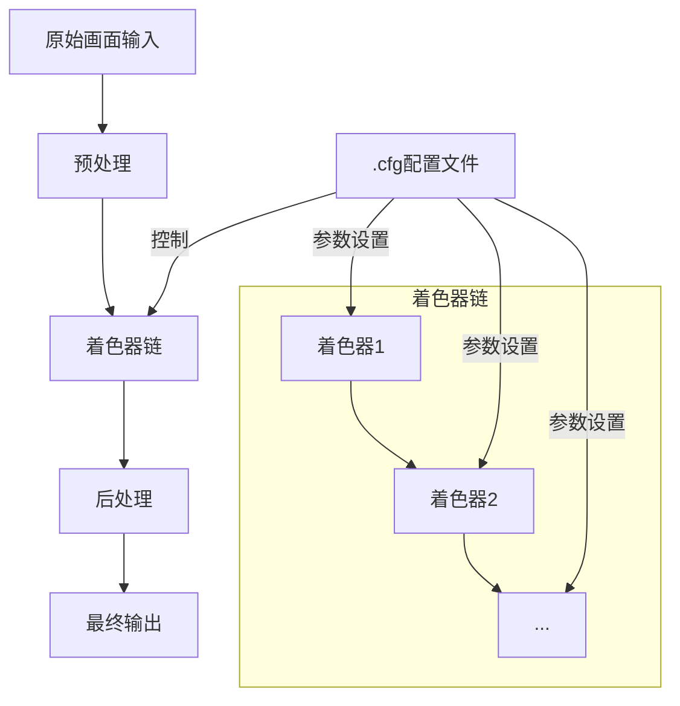
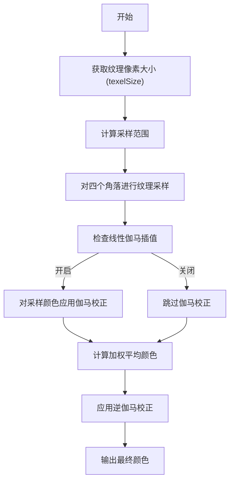
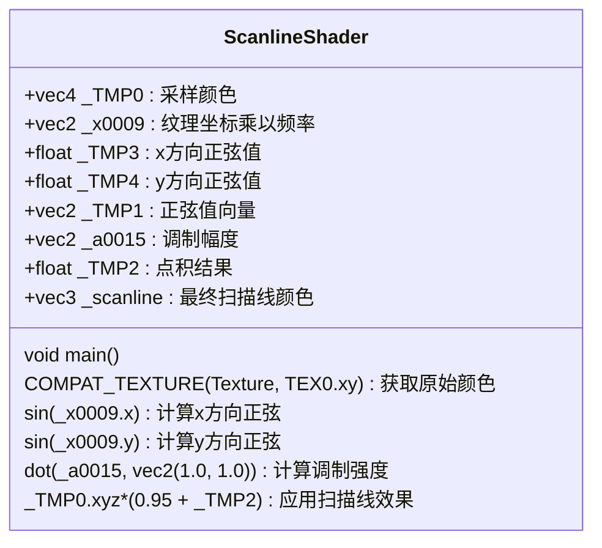
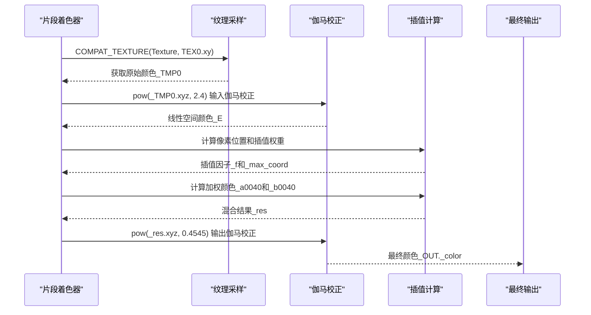
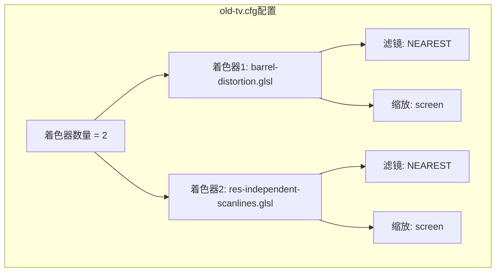
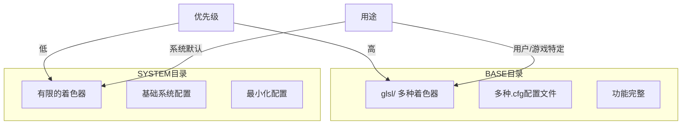
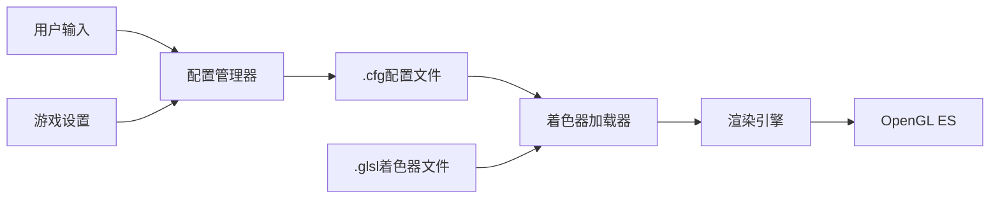
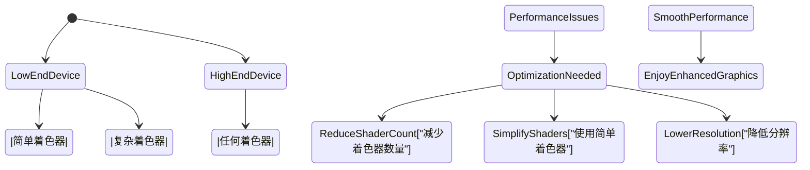
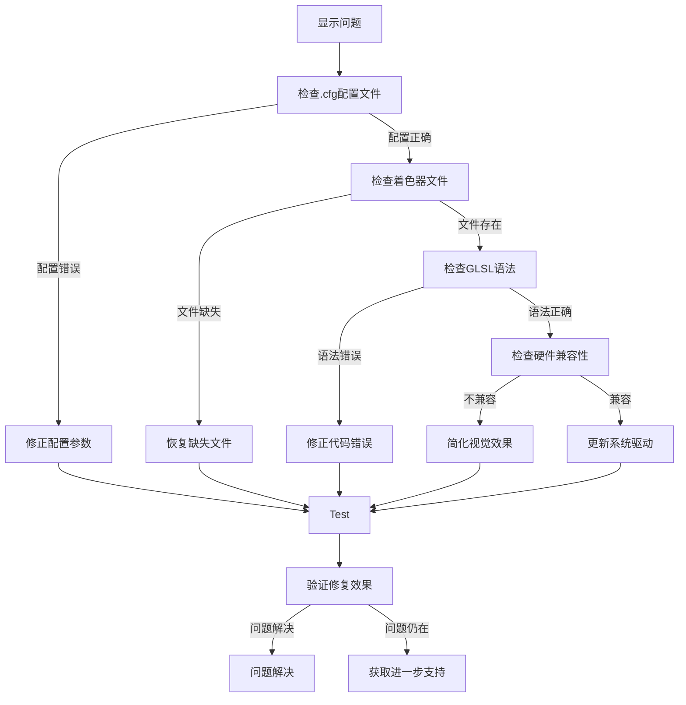

# 图形渲染与着色器

<cite>
**本文档中引用的文件**   
- [pixellate.glsl](file://skeleton/BASE/Shaders/glsl/pixellate.glsl)
- [scanline.glsl](file://skeleton/BASE/Shaders/glsl/scanline.glsl)
- [retro-v2.glsl](file://skeleton/BASE/Shaders/glsl/retro-v2.glsl)
- [real-gameboy.cfg](file://skeleton/BASE/Shaders/real-gameboy.cfg)
- [old-tv.cfg](file://skeleton/BASE/Shaders/old-tv.cfg)
- [system.cfg](file://skeleton/SYSTEM/system.cfg)
- [platform.c](file://workspace/lib/libcommon/platform.c)
- [minarch.c](file://workspace/apps/minarch/minarch.c)
</cite>

## 目录
1. [项目结构](#项目结构)
2. [核心组件](#核心组件)
3. [架构概述](#架构概述)
4. [详细组件分析](#详细组件分析)
5. [依赖分析](#依赖分析)
6. [性能考虑](#性能考虑)
7. [故障排除指南](#故障排除指南)

## 项目结构

NextUI的图形渲染系统主要由两大部分组成：**BASE** 和 **SYSTEM** 目录下的着色器文件。这些文件通过 `.cfg` 配置文件进行管理和应用。



**图源**
- [real-gameboy.cfg](file://skeleton/BASE/Shaders/real-gameboy.cfg)
- [system.cfg](file://skeleton/SYSTEM/system.cfg)

**本节来源**
- [skeleton/BASE/Shaders](file://skeleton/BASE/Shaders)
- [skeleton/SYSTEM](file://skeleton/SYSTEM)

## 核心组件

NextUI的图形渲染系统包含以下核心组件：

- **GLSL着色器文件**：实现各种视觉效果，如像素化、扫描线等。
- **.cfg配置文件**：定义着色器链和渲染参数。
- **渲染引擎**：加载并执行着色器链，处理图形输出。

这些组件协同工作，为模拟器提供丰富的视觉体验。

**本节来源**
- [pixellate.glsl](file://skeleton/BASE/Shaders/glsl/pixellate.glsl)
- [scanline.glsl](file://skeleton/BASE/Shaders/glsl/scanline.glsl)
- [platform.c](file://workspace/lib/libcommon/platform.c)

## 架构概述

NextUI的图形渲染架构采用模块化设计，支持灵活的着色器链配置。



**图源**
- [platform.c](file://workspace/lib/libcommon/platform.c#L2112-L2209)
- [minarch.c](file://workspace/apps/minarch/minarch.c#L2595-L2679)

## 详细组件分析

### 内置着色器分析

#### 像素化着色器 (pixellate.glsl)
该着色器通过计算像素区域的平均颜色来实现像素化效果。



**图源**
- [pixellate.glsl](file://skeleton/BASE/Shaders/glsl/pixellate.glsl#L50-L100)

**本节来源**
- [pixellate.glsl](file://skeleton/BASE/Shaders/glsl/pixellate.glsl)

#### 扫描线着色器 (scanline.glsl)
该着色器通过正弦函数调制亮度来模拟CRT显示器的扫描线效果。



**图源**
- [scanline.glsl](file://skeleton/BASE/Shaders/glsl/scanline.glsl#L80-L100)

**本节来源**
- [scanline.glsl](file://skeleton/BASE/Shaders/glsl/scanline.glsl)

#### retro-v2着色器
该着色器实现复杂的色彩校正和对比度增强效果。



**图源**
- [retro-v2.glsl](file://skeleton/BASE/Shaders/glsl/retro-v2.glsl#L80-L120)

**本节来源**
- [retro-v2.glsl](file://skeleton/BASE/Shaders/glsl/retro-v2.glsl)

### 渲染配置分析

#### real-gameboy.cfg配置文件
此配置文件为Game Boy游戏提供真实的视觉效果。

```mermaid
erDiagram
CONFIG ||--o{ SHADER_CHAIN : "包含"
CONFIG ||--o{ PALETTE : "使用"
class CONFIG {
minarch_nrofshaders: int
gambatte_gb_internal_palette: string
gambatte_gb_palette_twb64_2: string
gambatte_gb_colorization: string
}
class SHADER_CHAIN {
minarch_shader1: string
minarch_shader1_filter: string
minarch_shader1_upscale: string
minarch_shader2: string
minarch_shader2_filter: string
minarch_shader2_upscale: string
}
class PALETTE {
TWB64 - Pack 2: 调色板包
TWB64 163 - Classic LCD: 经典LCD调色板
}
CONFIG }|-- SHADER_CHAIN : "定义"
CONFIG }|-- PALETTE : "引用"
```

**图源**
- [real-gameboy.cfg](file://skeleton/BASE/Shaders/real-gameboy.cfg)

**本节来源**
- [real-gameboy.cfg](file://skeleton/BASE/Shaders/real-gameboy.cfg)

#### old-tv.cfg配置文件
此配置文件模拟老式电视的视觉效果。



**图源**
- [old-tv.cfg](file://skeleton/BASE/Shaders/old-tv.cfg)

**本节来源**
- [old-tv.cfg](file://skeleton/BASE/Shaders/old-tv.cfg)

### BASE与SYSTEM目录对比



**本节来源**
- [skeleton/BASE/Shaders](file://skeleton/BASE/Shaders)
- [skeleton/SYSTEM](file://skeleton/SYSTEM)

## 依赖分析

NextUI的图形渲染系统各组件之间的依赖关系如下：



**图源**
- [platform.c](file://workspace/lib/libcommon/platform.c#L594-L682)
- [minarch.c](file://workspace/apps/minarch/minarch.c#L2595-L2679)

**本节来源**
- [platform.c](file://workspace/lib/libcommon/platform.c)
- [minarch.c](file://workspace/apps/minarch/minarch.c)

## 性能考虑

### 着色器链性能影响

| 着色器数量 | 性能影响 | 适用场景 |
|-----------|---------|---------|
| 0-1个 | 低 | 基本显示 |
| 2-3个 | 中等 | 常规增强 |
| 4个以上 | 高 | 高级视觉效果 |

### 硬件兼容性



**本节来源**
- [platform.c](file://workspace/lib/libcommon/platform.c#L1831-L1875)
- [platform.c](file://workspace/lib/libcommon/platform.c#L2112-L2140)

## 故障排除指南

### 常见问题及解决方案



**本节来源**
- [platform.c](file://workspace/lib/libcommon/platform.c#L630-L682)
- [minarch.c](file://workspace/apps/minarch/minarch.c#L2754-L2800)