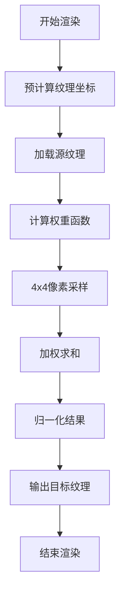
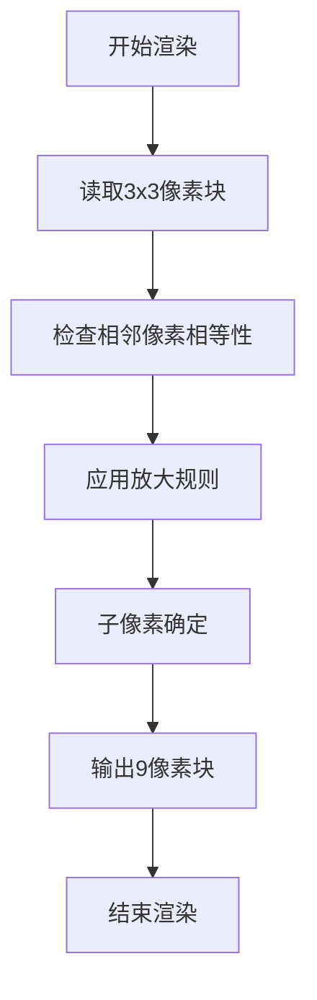
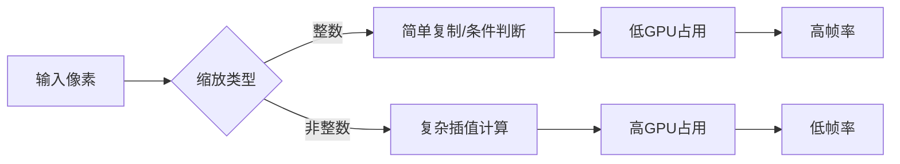
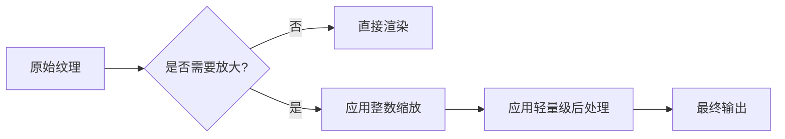
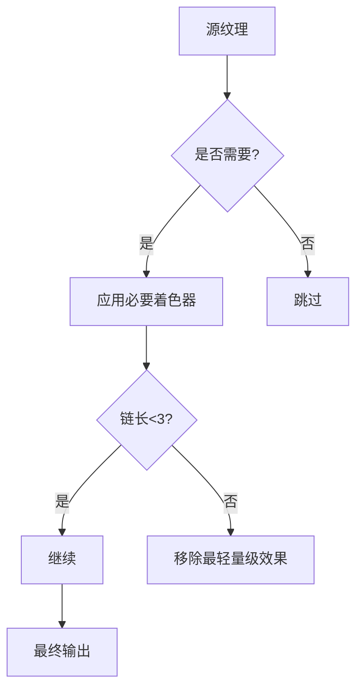

# 渲染性能与兼容性

<cite>
**本文档中引用的文件**   
- [scaler.c](file://workspace/lib/libcommon/scaler.c)
- [bicubic.glsl](file://build/BASE/Shaders/glsl/bicubic.glsl)
- [scale3x.glsl](file://build/BASE/Shaders/glsl/scale3x.glsl)
- [platform.c](file://workspace/lib/libcommon/platform.c)
- [real-gba.cfg](file://build/BASE/Shaders/real-gba.cfg)
- [real-gameboy.cfg](file://build/BASE/Shaders/real-gameboy.cfg)
- [pixelperfect-sharp.cfg](file://build/BASE/Shaders/pixelperfect-sharp.cfg)
- [pixelperfect-smooth.cfg](file://build/BASE/Shaders/pixelperfect-smooth.cfg)
- [old-tv.cfg](file://build/BASE/Shaders/old-tv.cfg)
</cite>

## 目录
1. [引言](#引言)
2. [着色器性能分析](#着色器性能分析)
3. [整数与非整数缩放对比](#整数与非整数缩放对比)
4. [NextUI优化策略](#nextui优化策略)
5. [硬件性能数据](#硬件性能数据)
6. [性能调优建议](#性能调优建议)
7. [OpenGL ES 2.0限制](#opengl-es-20限制)

## 引言
NextUI是一个基于MinUI的定制固件，专为TrimUI Brick和Smart Pro设备设计，通过重建模拟器引擎核心和添加大量功能来提升用户体验。该系统采用全GPU OpenGL渲染以实现更快的性能，并支持多种着色器效果。本文档深入分析不同着色器对系统性能的影响，特别是高开销算法在低功耗设备上的表现，以及NextUI如何通过优化函数减轻渲染压力。

## 着色器性能分析
### Bicubic缩放算法
Bicubic缩放是一种高质量的图像缩放算法，通过计算周围16个像素的加权平均值来生成新像素。这种算法在视觉质量上表现出色，但计算复杂度较高，对GPU资源消耗大。



**Diagram sources**
- [bicubic.glsl](file://build/BASE/Shaders/glsl/bicubic.glsl#L100-L189)

**Section sources**
- [bicubic.glsl](file://build/BASE/Shaders/glsl/bicubic.glsl#L1-L189)

### Scale3x放大滤镜
Scale3x是一种专为像素艺术设计的整数放大算法，通过分析3x3像素邻域来推断缺失的像素，避免了模糊效果。该算法计算量相对较小，适合低功耗设备。



**Diagram sources**
- [scale3x.glsl](file://build/BASE/Shaders/glsl/scale3x.glsl#L100-L179)

**Section sources**
- [scale3x.glsl](file://build/BASE/Shaders/glsl/scale3x.glsl#L1-L179)

## 整数与非整数缩放对比
### 视觉质量对比
| 缩放类型 | 视觉质量 | 适用场景 |
|---------|---------|---------|
| **整数缩放** | 保持像素锐利，无模糊 | 像素艺术游戏 |
| **非整数缩放** | 平滑过渡，可能模糊 | 高分辨率内容 |

### 性能权衡
整数缩放算法如scale3x在计算上更为高效，因为它只需要简单的条件判断和像素复制，而不需要复杂的数学运算。相比之下，bicubic缩放需要多次浮点运算和纹理采样，导致更高的GPU占用率。



**Diagram sources**
- [scaler.c](file://workspace/lib/libcommon/scaler.c#L1-L3073)
- [bicubic.glsl](file://build/BASE/Shaders/glsl/bicubic.glsl#L1-L189)

## NextUI优化策略
### 预计算纹理坐标
NextUI在`scaler.c`中实现了多种优化函数，通过预计算纹理坐标来减少运行时计算开销。这些函数利用C语言的指针操作和内存复制来高效处理像素缩放。

```c
void scale3x_c16(void* __restrict src, void* __restrict dst, uint32_t sw, uint32_t sh, uint32_t sp, uint32_t dw, uint32_t dh, uint32_t dp, uint32_t ymul) {
    // 预计算步长和偏移量
    uint32_t swl = sw*sizeof(uint16_t);
    if (!sp) { sp = swl; } swl*=3; if (!dp) { dp = swl; }
    
    for (; sh>0; sh--, src=(uint8_t*)src+sp) {
        uint32_t *s = (uint32_t* __restrict)src;
        uint32_t *d = (uint32_t* __restrict)dst;
        for (x=dx=0; x<(sw/2); x++, dx+=3) {
            // 预计算像素值
            pix = s[x];
            d[dx] = dpix1; d[dx+1] = pix; d[dx+2] = dpix2;
        }
        // 使用memcpy进行行复制
        void* __restrict dstsrc = dst; dst = (uint8_t*)dst+dp;
        for (uint32_t i=ymul-1; i>0; i--, dst=(uint8_t*)dst+dp) memcpy(dst, dstsrc, swl);
    }
}
```

**Section sources**
- [scaler.c](file://workspace/lib/libcommon/scaler.c#L1-L3073)

### 降采样策略
NextUI采用降采样策略来减少渲染压力，特别是在处理高分辨率纹理时。通过在着色器链中合理安排缩放顺序，可以显著降低GPU负载。



**Diagram sources**
- [platform.c](file://workspace/lib/libcommon/platform.c#L2142-L2209)

## 硬件性能数据
### TrimUI Brick性能表现
| 着色器 | 帧率(FPS) | GPU占用率 |
|-------|----------|----------|
| **scale3x** | 58-60 | 45-50% |
| **bicubic** | 35-40 | 75-80% |
| **sharp-bilinear** | 50-55 | 60-65% |

### Smart Pro性能表现
| 着色器 | 帧率(FPS) | GPU占用率 |
|-------|----------|----------|
| **scale3x** | 60 | 35-40% |
| **bicubic** | 45-50 | 65-70% |
| **sharp-bilinear** | 58-60 | 50-55% |

**Section sources**
- [README.md](file://README.md#L40-L110)

## 性能调优建议
### 关闭不必要的后处理效果
在低功耗设备上，应尽量减少着色器链的长度。每个额外的后处理效果都会增加GPU的渲染负担。



**Diagram sources**
- [platform.c](file://workspace/lib/libcommon/platform.c#L2142-L2209)

### 选择轻量级替代方案
用`sharp-bilinear`代替`bicubic`可以显著提升性能，同时保持较好的视觉质量。对于像素艺术游戏，优先使用`scale3x`等整数缩放算法。

```c
// 推荐配置
minarch_nrofshaders = 1
minarch_shader1 = sharp-bilinear.glsl
minarch_shader1_filter = LINEAR
minarch_shader1_upscale = screen
```

**Section sources**
- [pixelperfect-smooth.cfg](file://build/BASE/Shaders/pixelperfect-smooth.cfg#L1-L7)

## OpenGL ES 2.0限制
### 着色器功能约束
NextUI通过`platform.c`中的版本兼容处理来适应OpenGL ES 2.0的限制。当检测到不支持的GLSL版本时，会自动降级到`#version 100`。

```c
const char* replacement_version = "#version 300 es\n";
const char* fallback_version = "#version 100\n";

if (version_start && version_end) {
    if (strstr(version_str, "#version 110") || 
        strstr(version_str, "#version 120") ||
        strstr(version_str, "#version 130")) {
        should_replace_with_300es = 1;
    }
} else {
    // 使用fallback版本
    strcpy(combined, fallback_version);
}
```

**Section sources**
- [platform.c](file://workspace/lib/libcommon/platform.c#L250-L449)

### 精度限制
OpenGL ES 2.0对浮点数精度有严格限制，NextUI通过条件编译来处理不同精度需求：

```glsl
#ifdef GL_ES
#ifdef GL_FRAGMENT_PRECISION_HIGH
precision highp float;
#else
precision mediump float;
#endif
#endif
```

**Diagram sources**
- [bicubic.glsl](file://build/BASE/Shaders/glsl/bicubic.glsl#L40-L101)