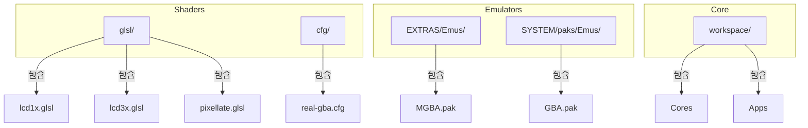
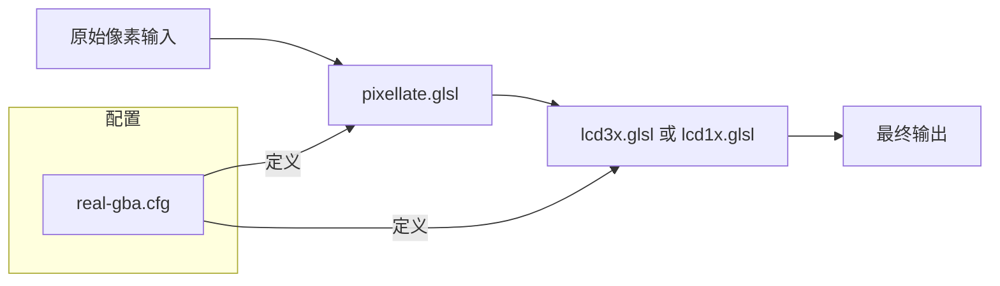
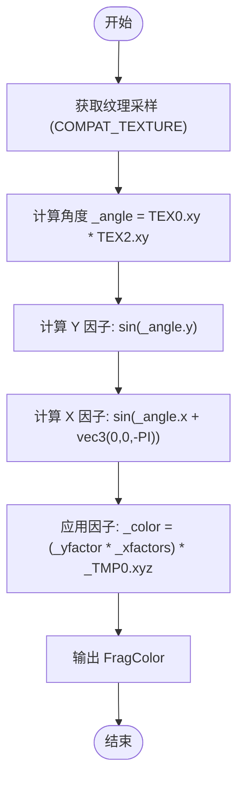
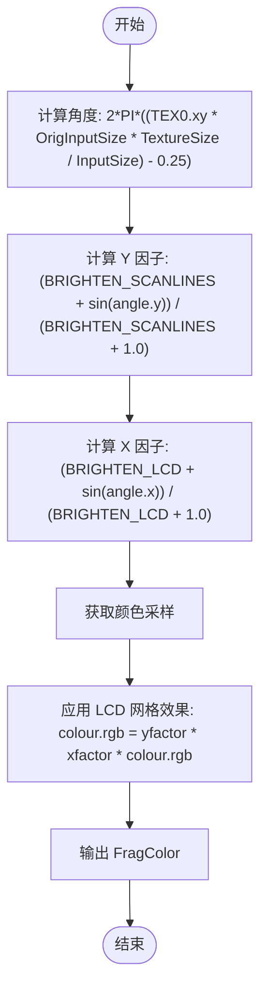
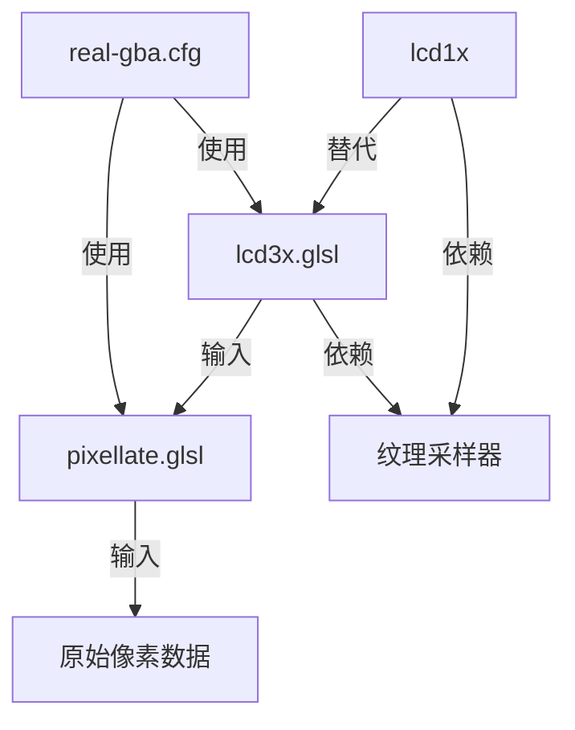

# LCD屏幕模拟着色器

<cite>
**本文档中引用的文件**  
- [lcd1x.glsl](file://skeleton/BASE/Shaders/glsl/lcd1x.glsl)
- [lcd3x.glsl](file://skeleton/BASE/Shaders/glsl/lcd3x.glsl)
- [real-gba.cfg](file://skeleton/BASE/Shaders/real-gba.cfg)
- [pixellate.glsl](file://skeleton/BASE/Shaders/glsl/pixellate.glsl)
</cite>

## 目录
1. [引言](#引言)
2. [项目结构](#项目结构)
3. [核心组件](#核心组件)
4. [架构概述](#架构概述)
5. [详细组件分析](#详细组件分析)
6. [依赖分析](#依赖分析)
7. [性能考虑](#性能考虑)
8. [故障排除指南](#故障排除指南)
9. [结论](#结论)

## 引言
本文档详细说明了 `lcd1x.glsl` 和 `lcd3x.glsl` 着色器如何精确模拟 Game Boy Advance 等设备的 LCD 子像素排列（RGB 条纹），包括水平方向的三色条纹渲染和亮度衰减模型。文档分析了着色器中对每个纹素（texel）进行子像素分解的算法，以及如何通过 UV 偏移实现正确的色彩混合。同时讨论了该着色器在非原生分辨率下的缩放补偿机制，并对比了 `lcd3x` 在高分辨率输出时的超采样优化。提供了与原始像素尺寸匹配的最佳实践，以及在宽屏设备上的适配方案。

## 项目结构
项目结构清晰地组织了着色器、配置文件和核心功能模块。主要结构如下：



**图示来源**  
- [lcd1x.glsl](file://skeleton/BASE/Shaders/glsl/lcd1x.glsl)
- [lcd3x.glsl](file://skeleton/BASE/Shaders/glsl/lcd3x.glsl)
- [real-gba.cfg](file://skeleton/BASE/Shaders/real-gba.cfg)

**本节来源**  
- [lcd1x.glsl](file://skeleton/BASE/Shaders/glsl/lcd1x.glsl)
- [lcd3x.glsl](file://skeleton/BASE/Shaders/glsl/lcd3x.glsl)
- [real-gba.cfg](file://skeleton/BASE/Shaders/real-gba.cfg)

## 核心组件
核心组件包括 `lcd1x.glsl`、`lcd3x.glsl` 和 `pixellate.glsl` 着色器，以及 `real-gba.cfg` 配置文件。这些组件共同实现了对 Game Boy Advance 屏幕效果的精确模拟。

**本节来源**  
- [lcd1x.glsl](file://skeleton/BASE/Shaders/glsl/lcd1x.glsl)
- [lcd3x.glsl](file://skeleton/BASE/Shaders/glsl/lcd3x.glsl)
- [pixellate.glsl](file://skeleton/BASE/Shaders/glsl/pixellate.glsl)
- [real-gba.cfg](file://skeleton/BASE/Shaders/real-gba.cfg)

## 架构概述
系统架构采用多级着色器管线，通过 `pixellate.glsl` 进行像素化处理，再通过 `lcd3x.glsl` 或 `lcd1x.glsl` 模拟 LCD 屏幕效果。配置文件 `real-gba.cfg` 定义了渲染管线的顺序和参数。



**图示来源**  
- [real-gba.cfg](file://skeleton/BASE/Shaders/real-gba.cfg)
- [pixellate.glsl](file://skeleton/BASE/Shaders/glsl/pixellate.glsl)
- [lcd3x.glsl](file://skeleton/BASE/Shaders/glsl/lcd3x.glsl)

## 详细组件分析

### lcd3x.glsl 子像素分解分析
`lcd3x.glsl` 着色器通过子像素分解算法精确模拟 RGB 条纹排列。其核心在于对每个纹素的 RGB 通道进行独立处理。



**图示来源**  
- [lcd3x.glsl](file://skeleton/BASE/Shaders/glsl/lcd3x.glsl#L100-L140)

**本节来源**  
- [lcd3x.glsl](file://skeleton/BASE/Shaders/glsl/lcd3x.glsl)

### lcd1x.glsl 亮度衰减模型分析
`lcd1x.glsl` 着色器通过正弦函数实现亮度衰减，模拟 LCD 网格效果。其关键在于 `OrigInputSize` 的使用和 0.25 像素偏移。



**图示来源**  
- [lcd1x.glsl](file://skeleton/BASE/Shaders/glsl/lcd1x.glsl#L100-L120)

**本节来源**  
- [lcd1x.glsl](file://skeleton/BASE/Shaders/glsl/lcd1x.glsl)

### pixellate.glsl 缩放补偿机制分析
`pixellate.glsl` 着色器在渲染管线中负责像素化和缩放补偿，确保在非原生分辨率下仍能保持像素的清晰度。

```mermaid
classDiagram
class PixellateShader {
+vec2 texelSize
+vec2 range
+vec2 border
+float totalArea
+vec3 averageColor
+main() void
}
PixellateShader -->|计算| Range : "range = vec2(abs(InputSize.x / (outsize.x * SourceSize.x)), ...)"
PixellateShader -->|采样| Texture : "COMPAT_TEXTURE(Source, ...)"
PixellateShader -->|插值| Average : "加权平均计算"
PixellateShader -->|输出| FragColor : "vec4(averageColor, 1.0)"
```

**图示来源**  
- [pixellate.glsl](file://skeleton/BASE/Shaders/glsl/pixellate.glsl#L100-L140)

**本节来源**  
- [pixellate.glsl](file://skeleton/BASE/Shaders/glsl/pixellate.glsl)

## 依赖分析
各组件之间的依赖关系如下：



**图示来源**  
- [real-gba.cfg](file://skeleton/BASE/Shaders/real-gba.cfg)
- [pixellate.glsl](file://skeleton/BASE/Shaders/glsl/pixellate.glsl)
- [lcd3x.glsl](file://skeleton/BASE/Shaders/glsl/lcd3x.glsl)
- [lcd1x.glsl](file://skeleton/BASE/Shaders/glsl/lcd1x.glsl)

**本节来源**  
- [real-gba.cfg](file://skeleton/BASE/Shaders/real-gba.cfg)
- [pixellate.glsl](file://skeleton/BASE/Shaders/glsl/pixellate.glsl)
- [lcd3x.glsl](file://skeleton/BASE/Shaders/glsl/lcd3x.glsl)
- [lcd1x.glsl](file://skeleton/BASE/Shaders/glsl/lcd1x.glsl)

## 性能考虑
- `lcd3x.glsl` 在高分辨率下使用超采样优化，通过向量运算一次性处理 RGB 通道。
- `lcd1x.glsl` 使用 `OrigInputSize` 确保在缩放时网格对齐正确，避免了动态计算的开销。
- `pixellate.glsl` 的插值算法在保持像素清晰度的同时，最小化了纹理采样次数。

## 故障排除指南
- **问题：LCD 网格不对齐**
  - **原因**：`OrigInputSize` 未正确设置
  - **解决方案**：确保配置文件中 `InputSize` 与原始分辨率匹配

- **问题：颜色分离不明显**
  - **原因**：`BRIGHTEN_LCD` 参数值过低
  - **解决方案**：将 `BRIGHTEN_LCD` 调整至 4.0-8.0 范围

- **问题：扫描线闪烁**
  - **原因**：`BRIGHTEN_SCANLINES` 与分辨率不匹配
  - **解决方案**：根据输出分辨率调整 `BRIGHTEN_SCANLINES` 参数

**本节来源**  
- [lcd1x.glsl](file://skeleton/BASE/Shaders/glsl/lcd1x.glsl)
- [lcd3x.glsl](file://skeleton/BASE/Shaders/glsl/lcd3x.glsl)

## 结论
`lcd1x.glsl` 和 `lcd3x.glsl` 着色器通过精确的子像素分解和亮度衰减模型，成功模拟了 Game Boy Advance 的 LCD 屏幕效果。`lcd3x.glsl` 通过向量运算实现高效的三色通道独立处理，而 `lcd1x.glsl` 则通过 `OrigInputSize` 确保了在不同缩放比例下的网格对齐。与 `pixellate.glsl` 结合使用，形成了完整的像素艺术渲染管线，为复古游戏模拟提供了高质量的视觉体验。