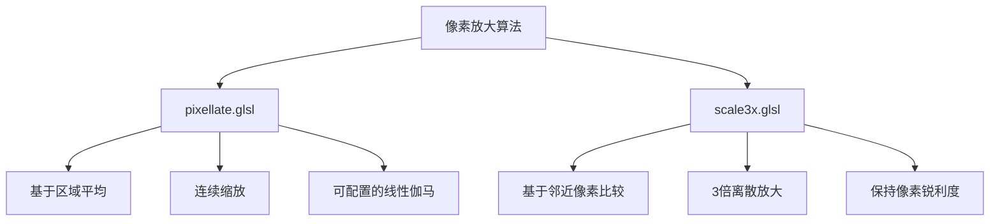

# 像素化着色器

<cite>
**本文档引用的文件**   
- [pixellate.glsl](file://skeleton/BASE/Shaders/glsl/pixellate.glsl#L0-L143)
- [scale3x.glsl](file://skeleton/BASE/Shaders/glsl/scale3x.glsl#L0-L178)
- [real-gba.cfg](file://skeleton/BASE/Shaders/real-gba.cfg#L0-L11)
- [pixel_art_AA.glsl](file://skeleton/BASE/Shaders/glsl/pixel_art_AA.glsl#L0-L162)
</cite>

## 目录
1. [引言](#引言)
2. [核心算法分析](#核心算法分析)
3. [pixellate着色器实现机制](#pixellate着色器实现机制)
4. [scale3x着色器实现机制](#scale3x着色器实现机制)
5. [配置与应用](#配置与应用)
6. [兼容性与冲突](#兼容性与冲突)
7. [性能与优化](#性能与优化)
8. [结论](#结论)

## 引言
像素化着色器是为复古游戏模拟器设计的关键视觉效果组件，旨在通过算法放大低分辨率像素艺术，同时保持其原始的锐利边缘和艺术风格。本文件深入分析`pixellate.glsl`和`scale3x.glsl`两种核心着色器的实现机制，探讨它们如何通过不同的邻近像素采样和权重计算策略来实现像素放大效果。分析将涵盖整数缩放算法、边缘处理逻辑、性能开销以及在不同设备上的配置建议。

## 核心算法分析
像素化着色器的核心在于如何将一个低分辨率输入纹理（source）映射到高分辨率输出屏幕（output）上，并决定每个输出像素的颜色。`pixellate.glsl`和`scale3x.glsl`采用了截然不同的方法：前者是一种基于区域平均的连续缩放算法，而后者是一种基于规则的离散放大算法。

### 算法对比概览


**图源**
- [pixellate.glsl](file://skeleton/BASE/Shaders/glsl/pixellate.glsl#L0-L143)
- [scale3x.glsl](file://skeleton/BASE/Shaders/glsl/scale3x.glsl#L0-L178)

## pixellate着色器实现机制
`pixellate.glsl`着色器通过计算每个输出像素所覆盖的输入像素区域，并对覆盖区域内的四个角点像素进行加权平均，来实现平滑的像素放大效果。

### 整数缩放与范围计算
该着色器首先计算输出像素与输入像素之间的缩放比例，以确定邻近像素的采样范围。
```glsl
// 计算缩放范围
vec2 range = vec2(abs(InputSize.x / (outsize.x * SourceSize.x)), abs(InputSize.y / (outsize.y * SourceSize.y)));
range = range / 2.0 * 0.999; // 将范围缩小至99.9%，确保采样点落在像素中心附近

// 根据当前纹理坐标和范围，确定一个矩形区域的四个顶点
float left   = vTexCoord.x - range.x;
float top    = vTexCoord.y + range.y;
float right  = vTexCoord.x + range.x;
float bottom = vTexCoord.y - range.y;
```
此计算确保了无论缩放比例如何，采样区域都严格对应于输入纹理中的整数像素网格。

**节源**
- [pixellate.glsl](file://skeleton/BASE/Shaders/glsl/pixellate.glsl#L110-L115)

### 邻近像素采样与权重计算
着色器从计算出的矩形区域的四个角点进行采样，获取四个邻近像素的颜色。
```glsl
// 采样四个角点的像素颜色
vec3 topLeftColor     = COMPAT_TEXTURE(Source, (floor(vec2(left, top)     / texelSize) + 0.5) * texelSize).rgb;
vec3 bottomRightColor = COMPAT_TEXTURE(Source, (floor(vec2(right, bottom) / texelSize) + 0.5) * texelSize).rgb;
vec3 bottomLeftColor  = COMPAT_TEXTURE(Source, (floor(vec2(left, bottom)  / texelSize) + 0.5) * texelSize).rgb;
vec3 topRightColor    = COMPAT_TEXTURE(Source, (floor(vec2(right, top)    / texelSize) + 0.5) * texelSize).rgb;
```
`floor(... / texelSize) + 0.5) * texelSize` 这一计算是关键，它将任意纹理坐标对齐到最近的输入像素中心。

### 边缘处理与最终颜色混合
着色器使用`clamp`和`floor`函数来确定一个“边界”点，该点将输出像素划分为四个子区域，每个子区域由一个角点像素主导。
```glsl
// 计算边界点，该点将输出像素划分为四个象限
vec2 border = clamp(floor((vTexCoord / texelSize) + vec2(0.5)) * texelSize, vec2(left, bottom), vec2(right, top));

// 计算总面积
float totalArea = 4.0 * range.x * range.y;

// 根据四个子区域的面积，对四个角点颜色进行加权平均
averageColor  = ((border.x - left)  * (top - border.y)    / totalArea) * topLeftColor;
averageColor += ((right - border.x) * (border.y - bottom) / totalArea) * bottomRightColor;
averageColor += ((border.x - left)  * (border.y - bottom) / totalArea) * bottomLeftColor;
averageColor += ((right - border.x) * (top - border.y)    / totalArea) * topRightColor;
```
这种基于面积的加权平均算法，使得颜色过渡在像素边界处是连续的，避免了硬边缘。

**节源**
- [pixellate.glsl](file://skeleton/BASE/Shaders/glsl/pixellate.glsl#L118-L134)

## scale3x着色器实现机制
`scale3x.glsl`着色器是一种经典的3倍放大算法，它通过分析中心像素E的8个邻近像素（A-I），并应用一系列预定义的规则来生成9个输出像素（E0-E8），从而在放大图像的同时保持边缘的锐利度。

### 3倍放大与子像素定位
该算法首先确定当前输出像素在3x3放大网格中的位置。
```glsl
// subpixel determination
float2 fp = floor(3.0 * frac(vTexCoord*SourceSize.xy));
```
`fp`的值（0, 1, 或 2）指示了当前像素是放大后3x3块中的哪一个。

### 边缘锐利度保持逻辑
`scale3x`的核心是其规则系统，它通过比较邻近像素是否相等来判断边缘。例如，`E0`的生成规则如下：
```glsl
// 读取3x3邻域的9个像素
float3 A = tex2D(decal, t1.xw).xyz;
float3 B = tex2D(decal, t1.yw).xyz;
// ... 其他像素

// 预先计算一些相等性检查，以简化规则
bool eqBD = eq(B,D), eqBF = eq(B,F), neqEA = neq(E,A), neqEC = neq(E,C);

// E0的规则：如果B和D相等，则E0=B，否则E0=E
float3 E0 = eqBD ? B : E;
```
这个简单的规则意味着，如果B和D颜色相同（通常发生在水平或垂直边缘上），则E0会继承B的颜色，从而将边缘向外“延伸”，防止在放大时出现模糊或锯齿。

### 完整的像素生成规则
以下是`scale3x`为3x3网格中每个位置定义的规则，这些规则共同作用以保持图像的锐利度：
```glsl
float3 E0 = eqBD ? B : E; // 左上角
float3 E1 = eqBD && neqEC || eqBF && neqEA ? B : E; // 上中
float3 E2 = eqBF ? B : E; // 右上角
float3 E3 = eqBD && neqEG || eqHD && neqEA ? D : E; // 左中
float3 E = E; // 中心，始终为E
float3 E5 = eqBF && neqEI || eqHF && neqEC ? F : E; // 右中
float3 E6 = eqHD ? H : E; // 左下角
float3 E7 = eqHD && neqEI || eqHF && neqEG ? H : E; // 下中
float3 E8 = eqHF ? H : E; // 右下角
```
最终的输出颜色由`fp`决定，选择E0-E8中的一个。

**节源**
- [scale3x.glsl](file://skeleton/BASE/Shaders/glsl/scale3x.glsl#L165-L172)

## 配置与应用
像素化着色器通常通过配置文件进行调用和参数设置，以适配不同的游戏系统。

### 在GBA游戏中的适配优化
`real-gba.cfg`配置文件展示了`pixellate.glsl`在GBA游戏模拟中的典型应用：
```cfg
minarch_nrofshaders = 2
minarch_shader1 = pixellate.glsl
minarch_shader1_filter = NEAREST
minarch_shader1_srctype = source
minarch_shader1_scaletype = source
minarch_shader1_upscale = screen
minarch_shader2 = lcd3x.glsl
minarch_shader2_filter = NEAREST
minarch_shader2_srctype = source
minarch_shader2_scaletype = source
minarch_shader2_upscale = screen
minarch_scale_filter = NEAREST
```
此配置首先应用`pixellate.glsl`进行基础的像素化放大，然后叠加`lcd3x.glsl`来模拟LCD屏幕的网格效果，从而为GBA游戏提供更真实的复古视觉体验。

**节源**
- [real-gba.cfg](file://skeleton/BASE/Shaders/real-gba.cfg#L0-L11)

### 不同屏幕密度的配置建议
对于不同屏幕密度的设备，应调整着色器链和缩放设置以获得最佳效果：
- **高PPI设备**：可以安全地使用多级着色器（如`pixellate`+`lcd3x`），因为高密度屏幕能更好地呈现细节。
- **低PPI设备**：建议使用单一的`pixellate.glsl`着色器，避免叠加过多效果导致视觉混乱。
- **通用建议**：将`minarch_scale_filter`设置为`NEAREST`，以确保在着色器处理前，原始像素不会被线性插值模糊。

## 兼容性与冲突
将像素化着色器与其他效果（如抗锯齿）组合使用时，可能会产生视觉冲突。

### 与抗锯齿着色器的潜在冲突
`pixel_art_AA.glsl`是一种抗锯齿着色器，它通过检测特定的像素模式（如斜角）并进行颜色混合来平滑边缘。当与`pixellate.glsl`组合使用时，会产生冲突：
1.  **顺序冲突**：如果`pixel_art_AA`在`pixellate`之前运行，其产生的半透明或混合像素会被`pixellate`当作普通像素进行放大，导致模糊的“光晕”效应。
2.  **目的冲突**：`pixellate`旨在保持像素的锐利和块状感，而`pixel_art_AA`旨在平滑边缘。这两种效果在视觉上是相互矛盾的。

```glsl
// pixel_art_AA.glsl 中的典型抗锯齿规则
float L = (D == B && B == C && E != D && B !=A) ? 1.0 : 0.0; // 检测左上角斜边
E = (L == 1.0 && lum(E)<lum(D)) ? (E+D)/2.0 : E; // 将中心像素E与D混合
```
这种混合操作会破坏像素艺术的清晰轮廓，与像素化着色器的目标背道而驰。

**节源**
- [pixel_art_AA.glsl](file://skeleton/BASE/Shaders/glsl/pixel_art_AA.glsl#L130-L145)

## 性能与优化
两种着色器在性能和视觉保真度上存在明显的权衡。

### 性能开销对比
- **pixellate.glsl**：性能开销较低。它每次片段着色器调用仅需4次纹理采样和一些简单的算术运算。其性能相对稳定，不依赖于图像内容。
- **scale3x.glsl**：性能开销较高。它需要9次纹理采样和大量的条件判断（`eq`和`neq`函数调用）。虽然现代GPU可以高效处理，但在低端设备上可能成为瓶颈。

### 视觉保真度权衡
- **pixellate.glsl**：提供平滑、连续的缩放效果，但在极端放大倍数下，由于加权平均，可能会让像素边缘显得略微“软”或模糊。
- **scale3x.glsl**：提供极高的视觉保真度，完美保持了像素的锐利边缘和原始艺术风格。但其3倍的固定放大比例不够灵活，且在处理复杂或非像素艺术图像时可能产生不自然的“拉伸”伪影。

**结论**：对于追求极致复古风格和锐利边缘的应用，`scale3x`是更好的选择；对于需要灵活缩放比例和更平滑效果的应用，`pixellate`更为合适。

## 结论
`pixellate.glsl`和`scale3x.glsl`代表了两种不同的像素放大哲学。`pixellate`通过数学上的区域平均实现了灵活、平滑的缩放，而`scale3x`则通过基于规则的邻近像素比较，忠实地再现了像素艺术的锐利边缘。开发者在选择时应根据目标平台的性能、所需的视觉风格以及是否与其他视觉效果（如抗锯齿）组合使用来做出权衡。正确的配置，如在`real-gba.cfg`中所示，可以将这些着色器有效地应用于特定的复古游戏模拟场景中。