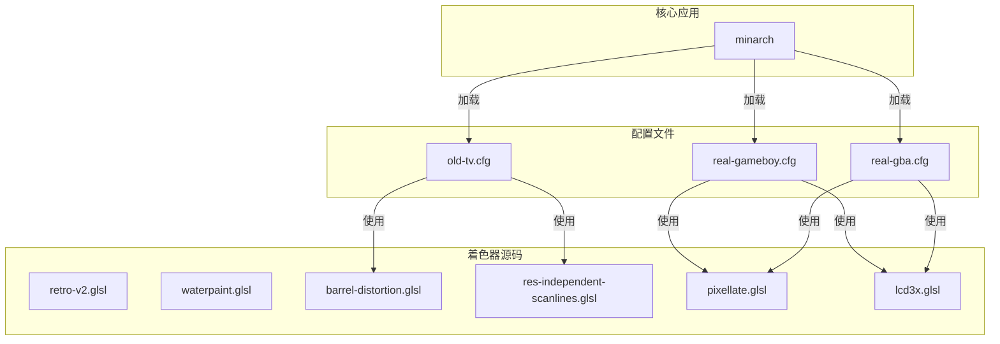
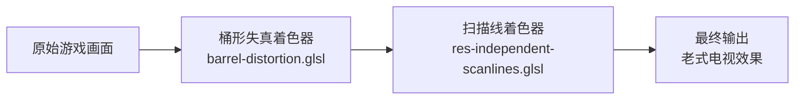
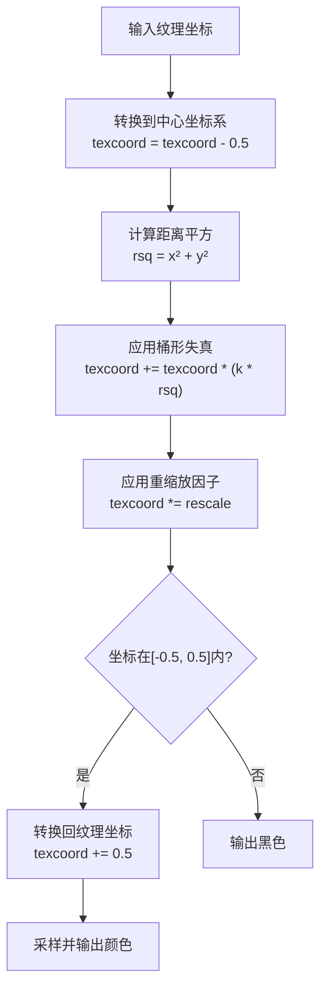
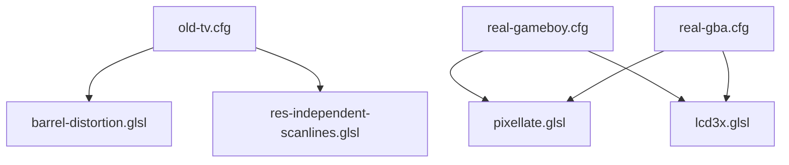

# 复古增强着色器

<cite>
**本文档引用的文件**   
- [retro-v2.glsl](file://skeleton/BASE/Shaders/glsl/retro-v2.glsl)
- [waterpaint.glsl](file://skeleton/BASE/Shaders/glsl/waterpaint.glsl)
- [barrel-distortion.glsl](file://skeleton/BASE/Shaders/glsl/barrel-distortion.glsl)
- [old-tv.cfg](file://skeleton/BASE/Shaders/old-tv.cfg)
- [res-independent-scanlines.glsl](file://skeleton/BASE/Shaders/glsl/res-independent-scanlines.glsl)
- [real-gameboy.cfg](file://skeleton/BASE/Shaders/real-gameboy.cfg)
- [real-gba.cfg](file://skeleton/BASE/Shaders/real-gba.cfg)
- [pixellate.glsl](file://skeleton/BASE/Shaders/glsl/pixellate.glsl)
- [lcd3x.glsl](file://skeleton/BASE/Shaders/glsl/lcd3x.glsl)
</cite>

## 目录
1. [引言](#引言)
2. [项目结构](#项目结构)
3. [核心组件分析](#核心组件分析)
4. [架构概览](#架构概览)
5. [详细组件分析](#详细组件分析)
6. [依赖关系分析](#依赖关系分析)
7. [性能优化策略](#性能优化策略)
8. [配置文件集成](#配置文件集成)
9. [结论](#结论)

## 引言
本文档系统阐述了NextUI项目中用于模拟复古显示效果的GLSL着色器技术。重点分析了`retro-v2.glsl`、`waterpaint.glsl`和`barrel-distortion.glsl`三个核心着色器的实现原理，以及它们如何通过配置文件（如`old-tv.cfg`）协同工作，以还原90年代游戏机和老式电视的视觉特性。文档旨在为开发者和爱好者提供一份详尽的技术参考，涵盖从色彩处理、几何变换到后处理算法的各个方面。

## 项目结构
项目采用模块化设计，核心着色器文件集中存放在`skeleton/BASE/Shaders/glsl/`目录下。这些`.glsl`文件是实现各种视觉效果的基础。配置文件（`.cfg`）位于同级的`Shaders/`目录中，用于定义着色器链的加载顺序和参数。系统通过`minarch`应用加载这些配置，将多个着色器按顺序应用，从而实现复杂的复合视觉效果。

**图示来源**
- [retro-v2.glsl](file://skeleton/BASE/Shaders/glsl/retro-v2.glsl)
- [barrel-distortion.glsl](file://skeleton/BASE/Shaders/glsl/barrel-distortion.glsl)
- [res-independent-scanlines.glsl](file://skeleton/BASE/Shaders/glsl/res-independent-scanlines.glsl)
- [old-tv.cfg](file://skeleton/BASE/Shaders/old-tv.cfg)
- [real-gameboy.cfg](file://skeleton/BASE/Shaders/real-gameboy.cfg)
- [real-gba.cfg](file://skeleton/BASE/Shaders/real-gba.cfg)

**本节来源**
- [skeleton/BASE/Shaders/glsl/](file://skeleton/BASE/Shaders/glsl/)
- [skeleton/BASE/Shaders/](file://skeleton/BASE/Shaders/)

## 核心组件分析
本节深入分析三个核心着色器：`retro-v2.glsl`、`waterpaint.glsl`和`barrel-distortion.glsl`，揭示它们如何通过GLSL代码实现特定的视觉效果。

**本节来源**
- [retro-v2.glsl](file://skeleton/BASE/Shaders/glsl/retro-v2.glsl#L0-L150)
- [waterpaint.glsl](file://skeleton/BASE/Shaders/glsl/waterpaint.glsl#L0-L216)
- [barrel-distortion.glsl](file://skeleton/BASE/Shaders/glsl/barrel-distortion.glsl#L0-L59)

## 架构概览
整个复古显示效果的实现依赖于一个“着色器链”（Shader Chain）架构。系统首先加载一个基础配置文件（如`old-tv.cfg`），该文件指定了需要按顺序应用的多个着色器。图像数据会依次通过这些着色器进行处理，每个着色器负责添加一种特定的效果。例如，在`old-tv.cfg`中，图像先经过`barrel-distortion.glsl`进行几何扭曲，再经过`res-independent-scanlines.glsl`添加扫描线，最终呈现出老式CRT电视的整体观感。

**图示来源**
- [barrel-distortion.glsl](file://skeleton/BASE/Shaders/glsl/barrel-distortion.glsl)
- [res-independent-scanlines.glsl](file://skeleton/BASE/Shaders/glsl/res-independent-scanlines.glsl)
- [old-tv.cfg](file://skeleton/BASE/Shaders/old-tv.cfg)

## 详细组件分析
### retro-v2.glsl：90年代游戏机显示特性模拟
`retro-v2.glsl`着色器综合模拟了老式电视的色彩漂移、模糊和轻微几何畸变。

**色彩漂移与伽马校正**：着色器首先对输入颜色进行伽马校正（代码中使用`pow(color, 2.4)`模拟CRT的非线性响应），然后在片段着色器末尾再进行反向伽马校正（`pow(color, 0.4545)`），以确保颜色在最终显示时正确。这是模拟CRT色彩特性的基础。

**像素模糊与边缘混合**：该着色器通过计算当前像素在纹理坐标中的小数部分（`fract(texCoord * TextureSize)`）来判断其在像素内的位置。然后，它根据这个位置和一个基于像素坐标的因子（`_fp.x*_fp.y`）来混合中心颜色和边缘颜色。代码中的`_max_coord`变量决定了模糊的程度，使得像素边缘产生柔和的过渡，模拟了老式电视的轻微模糊效果。

**Section sources**
- [retro-v2.glsl](file://skeleton/BASE/Shaders/glsl/retro-v2.glsl#L70-L140)

### waterpaint.glsl：水彩风格后处理
`waterpaint.glsl`实现了基于高斯模糊与边缘增强的混合算法，适用于像素艺术的风格化渲染。

**多方向采样**：该着色器在顶点着色器中预计算了周围8个相邻像素的纹理坐标（`VARc00_01`, `VARc02_10`等），并在片段着色器中使用`texture2D`函数对这些位置进行采样。这相当于一个3x3的卷积核。

**边缘增强算法**：着色器的核心在于计算中心像素（`_res`）与周围像素平均值（`_mid_horiz`, `_mid_vert`）之间的差异（`_a0064`）。然后，它将这个差异的绝对值（`_TMP15`）放大3.5倍，并与原始颜色和平均值进行加权混合（`_final = 0.26*(_res + _mid_horiz + _mid_vert) + 3.5*_TMP15`）。这种算法极大地增强了图像的边缘对比度，同时保留了平滑区域，从而创造出类似水彩画中墨迹扩散的视觉效果。

**Section sources**
- [waterpaint.glsl](file://skeleton/BASE/Shaders/glsl/waterpaint.glsl#L150-L200)

### barrel-distortion.glsl：桶形失真数学模型
`barrel-distortion.glsl`通过极坐标变换实现屏幕边缘的弯曲效果，以匹配曲面CRT的光学特性。

**极坐标变换**：着色器首先将纹理坐标从[0,1]范围转换到[-0.5, 0.5]的中心坐标系（`texcoord = tex0 - vec2(0.5)`）。

**失真公式**：核心的失真计算在`texcoord = texcoord + (texcoord * (BARREL_DISTORTION * rsq))`这一行。其中`rsq`是当前点到中心的距离的平方。这个公式意味着离中心越远的点，其坐标被向外推的幅度越大，从而实现了桶形失真。

**边缘裁剪与重缩放**：为了防止失真后的图像超出屏幕，着色器使用`rescale`常量对结果进行整体缩小。同时，它检查变换后的坐标是否仍在[-0.5, 0.5]范围内，如果超出则将该像素设为黑色，避免出现拉伸的伪影。

**图示来源**
- [barrel-distortion.glsl](file://skeleton/BASE/Shaders/glsl/barrel-distortion.glsl#L40-L55)

**本节来源**
- [barrel-distortion.glsl](file://skeleton/BASE/Shaders/glsl/barrel-distortion.glsl#L30-L60)

## 依赖关系分析
这些着色器并非孤立工作，而是通过配置文件紧密集成。`old-tv.cfg`文件明确指定了`barrel-distortion.glsl`和`res-independent-scanlines.glsl`的依赖关系，前者负责几何变形，后者负责添加扫描线。同样，`real-gameboy.cfg`和`real-gba.cfg`文件依赖`pixellate.glsl`进行像素化处理和`lcd3x.glsl`来模拟LCD屏幕的网格效果。这种基于配置的依赖管理使得系统非常灵活，可以轻松组合不同的效果。

**图示来源**
- [old-tv.cfg](file://skeleton/BASE/Shaders/old-tv.cfg)
- [real-gameboy.cfg](file://skeleton/BASE/Shaders/real-gameboy.cfg)
- [real-gba.cfg](file://skeleton/BASE/Shaders/real-gba.cfg)

**本节来源**
- [old-tv.cfg](file://skeleton/BASE/Shaders/old-tv.cfg#L0-L10)
- [real-gameboy.cfg](file://skeleton/BASE/Shaders/real-gameboy.cfg#L0-L16)
- [real-gba.cfg](file://skeleton/BASE/Shaders/real-gba.cfg#L0-L11)

## 性能优化策略
在资源受限的设备上，这些着色器采用了多种优化策略：

1.  **简化计算**：`barrel-distortion.glsl`使用了常量`BARREL_DISTORTION`和`rescale`，避免了运行时的复杂计算。
2.  **减少迭代**：`waterpaint.glsl`虽然采样了多个像素，但其算法是直接的线性混合，没有复杂的循环或递归，计算量可控。
3.  **预计算**：`waterpaint.glsl`在顶点着色器中计算了所有采样点的坐标，将计算负担从片段着色器（每像素执行）转移到顶点着色器（每顶点执行），显著提升了性能。
4.  **使用查表法（LUT）的潜力**：虽然当前代码未直接使用，但像伽马校正（`pow`函数）这样的操作非常适合用一维纹理（LUT）来加速。通过预先将`pow(x, 2.4)`的结果存储在纹理中，运行时只需一次纹理查询即可完成计算，大大降低了GPU的计算压力。

**本节来源**
- [barrel-distortion.glsl](file://skeleton/BASE/Shaders/glsl/barrel-distortion.glsl)
- [waterpaint.glsl](file://skeleton/BASE/Shaders/glsl/waterpaint.glsl)

## 配置文件集成
配置文件是连接着色器与核心应用的桥梁。以`old-tv.cfg`为例，它通过`minarch_shader1`和`minarch_shader2`等参数，明确指定了着色器的文件名、滤波方式（`NEAREST`）、源类型和缩放类型。`minarch`应用读取这些配置，动态加载并编译对应的GLSL着色器程序，构建出最终的渲染管线。这种设计使得用户无需修改代码即可通过编辑文本文件来创建和切换不同的视觉效果。

**本节来源**
- [old-tv.cfg](file://skeleton/BASE/Shaders/old-tv.cfg)
- [real-gameboy.cfg](file://skeleton/BASE/Shaders/real-gameboy.cfg)

## 结论
通过对`retro-v2.glsl`、`waterpaint.glsl`和`barrel-distortion.glsl`等核心着色器的分析，我们可以看到NextUI项目如何利用现代GPU的可编程管线，精确地复刻了老式显示设备的视觉特性。这些着色器不仅在算法上巧妙（如桶形失真的数学模型和水彩效果的边缘增强），而且在系统集成上也非常灵活，通过简单的配置文件即可实现复杂的效果组合。对于在资源受限设备上运行的应用，理解其预计算和简化计算的优化策略，对于开发高性能的视觉效果至关重要。这些技术为复古游戏爱好者提供了高度可定制的沉浸式体验。