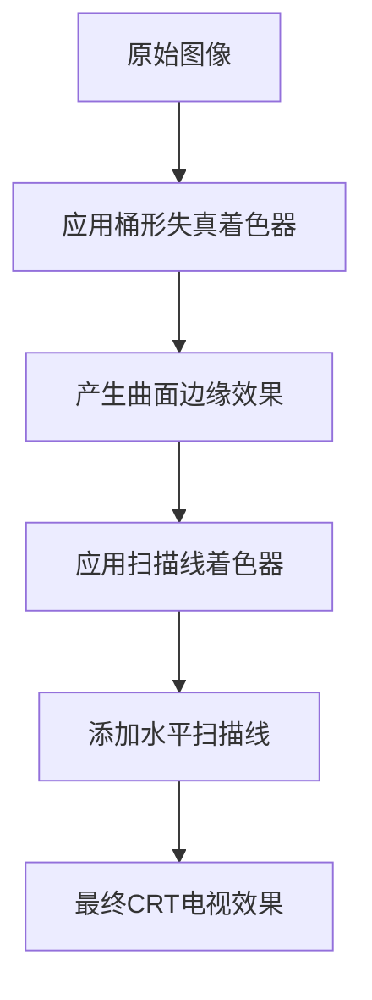
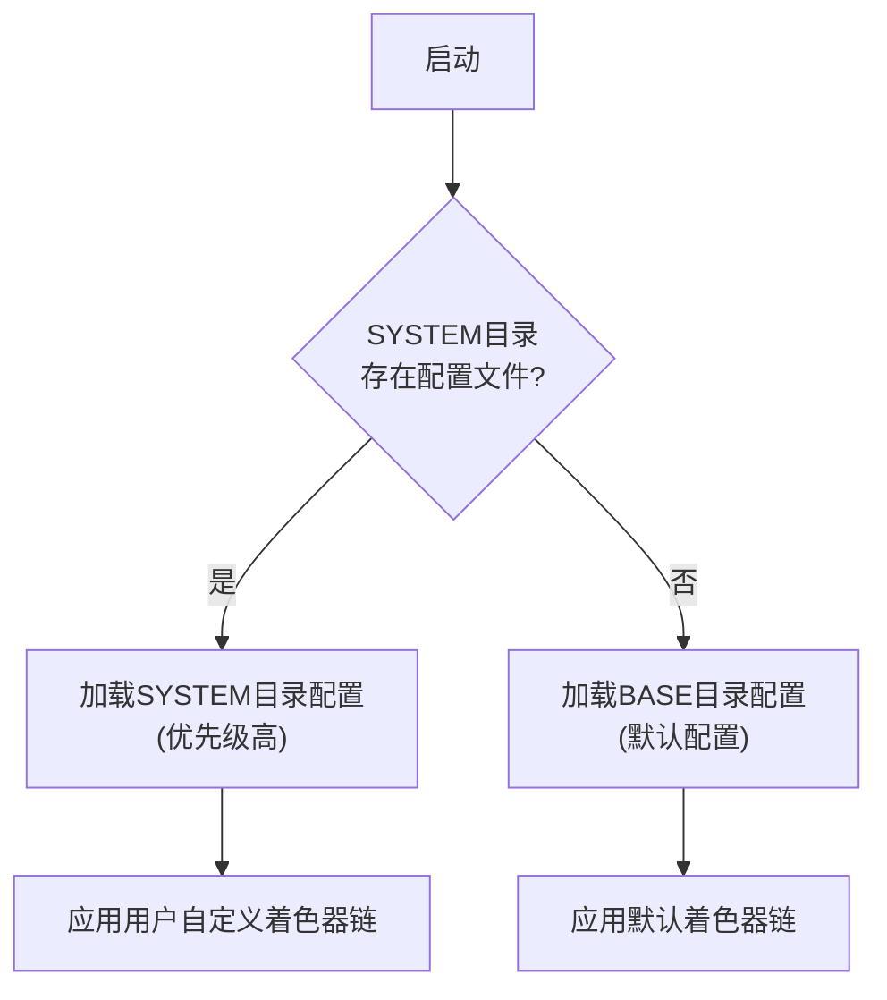

# 着色器配置与应用

<cite>
**本文档引用文件**  
- [old-tv.cfg](file://skeleton/BASE/Shaders/old-tv.cfg)
- [real-gameboy.cfg](file://skeleton/BASE/Shaders/real-gameboy.cfg)
- [real-gba.cfg](file://skeleton/BASE/Shaders/real-gba.cfg)
- [system.cfg](file://skeleton/SYSTEM/system.cfg)
- [system-brick.cfg](file://skeleton/SYSTEM/system-brick.cfg)
- [barrel-distortion.glsl](file://skeleton/BASE/Shaders/glsl/barrel-distortion.glsl)
- [res-independent-scanlines.glsl](file://skeleton/BASE/Shaders/glsl/res-independent-scanlines.glsl)
- [pixellate.glsl](file://skeleton/BASE/Shaders/glsl/pixellate.glsl)
- [lcd3x.glsl](file://skeleton/BASE/Shaders/glsl/lcd3x.glsl)
</cite>

## 目录
1. [引言](#引言)  
2. [着色器配置文件结构](#着色器配置文件结构)  
3. [多层着色器链的定义与应用](#多层着色器链的定义与应用)  
4. [BASE与SYSTEM目录的配置优先级机制](#base与system目录的配置优先级机制)  
5. [为特定模拟器定制着色器配置](#为特定模拟器定制着色器配置)  
6. [调试配置错误的常见方法](#调试配置错误的常见方法)  
7. [结论](#结论)

## 引言
本文档深入解析如何通过`.cfg`配置文件定义和应用着色器链（shader chain），重点分析`old-tv.cfg`中模拟CRT电视效果的多层着色器堆叠方式。同时，阐述配置文件的结构，包括`shaders`数量、每个着色器的`filter`、`wrap`、`scale`等参数设置。此外，说明`BASE`与`SYSTEM`目录下着色器配置的加载优先级机制，并演示如何为特定模拟器（如GBA或SFC）定制专属着色器配置，通过`system.cfg`全局启用。最后提供调试配置错误的实用方法。

## 着色器配置文件结构
着色器配置文件（`.cfg`）用于定义渲染过程中应用的着色器链。其核心结构包括：

- **minarch_nrofshaders**: 指定着色器链中着色器的数量。
- **minarch_shaderN**: 指定第N个着色器的GLSL文件名（N从1开始）。
- **minarch_shaderN_filter**: 定义第N个着色器的纹理过滤方式，如`NEAREST`（最近邻）或`LINEAR`（线性）。
- **minarch_shaderN_srctype**: 定义输入源类型，如`source`（原始输入）或`relative`（相对上一阶段）。
- **minarch_shaderN_scaletype**: 定义缩放类型，如`source`（基于源分辨率）或`relative`（基于上一阶段输出）。
- **minarch_shaderN_upscale**: 定义放大倍数，可为具体数值或`screen`（全屏）。
- **minarch_scale_filter**: 全局缩放过滤器设置。

这些参数共同决定了图像处理的流程和最终视觉效果。

**Section sources**
- [old-tv.cfg](file://skeleton/BASE/Shaders/old-tv.cfg#L1-L11)
- [real-gameboy.cfg](file://skeleton/BASE/Shaders/real-gameboy.cfg#L1-L17)

## 多层着色器链的定义与应用
### old-tv.cfg中的CRT电视效果模拟
`old-tv.cfg`文件通过堆叠两个着色器来模拟CRT电视的视觉效果：

```ini
minarch_nrofshaders = 2
minarch_shader1 = barrel-distortion.glsl
minarch_shader1_filter = NEAREST
minarch_shader1_srctype = source
minarch_shader1_scaletype = source
minarch_shader1_upscale = screen
minarch_shader2 = res-independent-scanlines.glsl
minarch_shader2_filter = NEAREST
minarch_shader2_srctype = source
minarch_shader2_scaletype = source
minarch_shader2_upscale = screen
```

#### 第一层：桶形失真（Barrel Distortion）
- **着色器**: `barrel-distortion.glsl`
- **功能**: 模拟CRT电视屏幕的曲面边缘，产生轻微的向外弯曲效果。
- **参数分析**:
  - `minarch_shader1_upscale = screen`: 确保失真效果覆盖整个屏幕。
  - `minarch_shader1_filter = NEAREST`: 保持像素的锐利边缘，避免模糊。

该着色器通过修改纹理坐标，将中心区域轻微拉伸，边缘区域压缩，从而实现桶形失真。

#### 第二层：独立分辨率扫描线（Resolution-Independent Scanlines）
- **着色器**: `res-independent-scanlines.glsl`
- **功能**: 添加水平扫描线，模拟CRT电视的电子束扫描效果。
- **参数分析**:
  - `minarch_shader2_upscale = screen`: 扫描线覆盖全屏。
  - `minarch_shader2_filter = NEAREST`: 保持线条清晰。

此着色器利用正弦函数生成周期性变暗的行，其`#pragma parameter`允许在运行时调整振幅、相位和线宽，实现高度可定制的扫描线效果。



**Diagram sources**
- [old-tv.cfg](file://skeleton/BASE/Shaders/old-tv.cfg#L1-L11)
- [barrel-distortion.glsl](file://skeleton/BASE/Shaders/glsl/barrel-distortion.glsl#L1-L61)
- [res-independent-scanlines.glsl](file://skeleton/BASE/Shaders/glsl/res-independent-scanlines.glsl#L1-L139)

**Section sources**
- [old-tv.cfg](file://skeleton/BASE/Shaders/old-tv.cfg#L1-L11)

## BASE与SYSTEM目录的配置优先级机制
系统采用分层配置加载机制，确保用户自定义设置可以覆盖默认值。

### 目录结构与加载逻辑
- **BASE目录**: 存放默认的、通用的配置文件（如`old-tv.cfg`、`real-gameboy.cfg`）。
- **SYSTEM目录**: 存放系统级的、用户可修改的配置文件（如`system.cfg`、`system-brick.cfg`）。

当系统启动时，会优先加载`SYSTEM`目录下的配置文件。如果`SYSTEM`目录中存在同名配置，则完全覆盖`BASE`目录中的默认配置。这种机制允许用户在不修改原始文件的情况下，全局性地更改着色器行为。

### system.cfg的全局控制
`system.cfg`文件定义了系统的全局渲染设置：

```ini
minarch_screen_scaling = Fullscreen
minarch_nrofshaders = 0
minarch_shader1 = stock.glsl
minarch_shader1_filter = NEAREST
...
```

- **覆盖机制**: 即使`BASE`中有更复杂的着色器链，`SYSTEM/system.cfg`中的`minarch_nrofshaders = 0`会强制禁用所有着色器，使用`stock.glsl`作为默认着色器。
- **灵活性**: 用户可以通过编辑`system.cfg`来统一所有模拟器的显示效果，而无需为每个模拟器单独配置。



**Diagram sources**
- [system.cfg](file://skeleton/SYSTEM/system.cfg#L1-L21)
- [system-brick.cfg](file://skeleton/SYSTEM/system-brick.cfg#L1-L21)

**Section sources**
- [system.cfg](file://skeleton/SYSTEM/system.cfg#L1-L21)

## 为特定模拟器定制着色器配置
### 使用专用配置文件
项目提供了针对特定设备的预设配置：
- **real-gameboy.cfg**: 为Game Boy模拟器优化。
- **real-gba.cfg**: 为Game Boy Advance模拟器优化。

以`real-gameboy.cfg`为例：
```ini
minarch_nrofshaders = 2
minarch_shader1 = pixellate.glsl
minarch_shader2 = lcd3x.glsl
gambatte_gb_internal_palette = TWB64 - Pack 2
...
```
- **pixellate.glsl**: 确保像素化处理，避免模糊。
- **lcd3x.glsl**: 模拟Game Boy原始LCD屏幕的3倍放大效果和色彩滤镜。
- **gambatte_gb_internal_palette**: 指定精确的内部调色板，还原经典绿色屏幕。

### 启用配置
要为特定模拟器（如GBA）启用`real-gba.cfg`，需在模拟器的启动脚本或配置中引用该文件。虽然项目结构中未直接展示模拟器配置文件的引用，但标准做法是将`real-gba.cfg`的路径设置为该模拟器实例的着色器配置源。

**Section sources**
- [real-gameboy.cfg](file://skeleton/BASE/Shaders/real-gameboy.cfg#L1-L17)
- [real-gba.cfg](file://skeleton/BASE/Shaders/real-gba.cfg#L1-L12)

## 调试配置错误的常见方法
正确配置着色器链可能遇到问题，以下是有效的调试策略：

### 1. 检查日志输出
- **启用详细日志**: 确保模拟器或前端应用的日志级别设置为`DEBUG`或`VERBOSE`。
- **查找关键信息**: 在日志中搜索`shader`、`GLSL`、`compile`、`error`等关键字，定位着色器编译失败或文件加载错误的具体原因。

### 2. 逐层禁用策略
当最终效果不符合预期时，采用二分法排查：
1. 将`minarch_nrofshaders`设置为`0`，确认基础图像是否正常。
2. 逐一启用每个着色器（`minarch_nrofshaders = 1`，然后`2`，依此类推）。
3. 观察每一步的效果变化，即可精确定位是哪个着色器引入了问题。

### 3. 验证文件路径与名称
- 确保`.cfg`文件中引用的`.glsl`文件名与`BASE/Shaders/glsl/`目录下的实际文件名**完全一致**（包括大小写）。
- 检查文件路径是否正确，避免因路径错误导致着色器加载失败。

### 4. 参数值验证
- 确认`minarch_shaderN_upscale`等参数的值在有效范围内（如`screen`、`1`、`2`等）。
- 参考着色器代码中的`#pragma parameter`，确保配置文件中的参数名和值类型匹配。

**Section sources**
- [old-tv.cfg](file://skeleton/BASE/Shaders/old-tv.cfg#L1-L11)
- [system.cfg](file://skeleton/SYSTEM/system.cfg#L1-L21)

## 结论
通过`.cfg`配置文件，系统实现了强大而灵活的着色器链管理。`BASE`目录提供了一系列高质量的默认效果（如`old-tv.cfg`的CRT模拟），而`SYSTEM`目录的覆盖机制则赋予了用户全局自定义的能力。为特定模拟器（如GBA、SFC）创建专用配置文件，并通过系统配置进行管理，是实现个性化视觉体验的有效途径。掌握日志检查和逐层禁用等调试方法，是确保配置正确应用的关键。这种分层、模块化的配置设计，极大地提升了系统的可维护性和可扩展性。