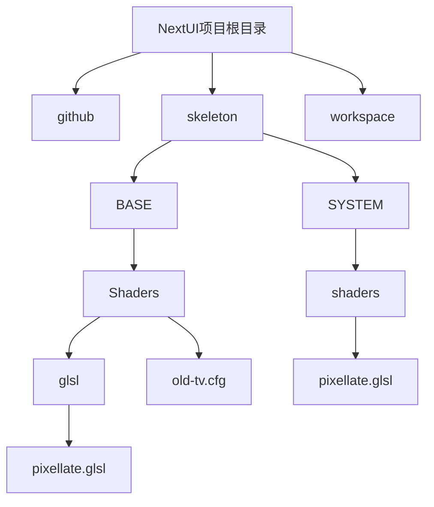
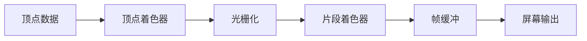
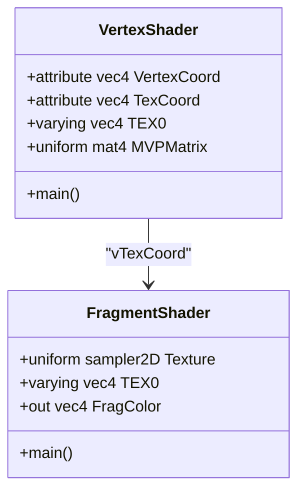
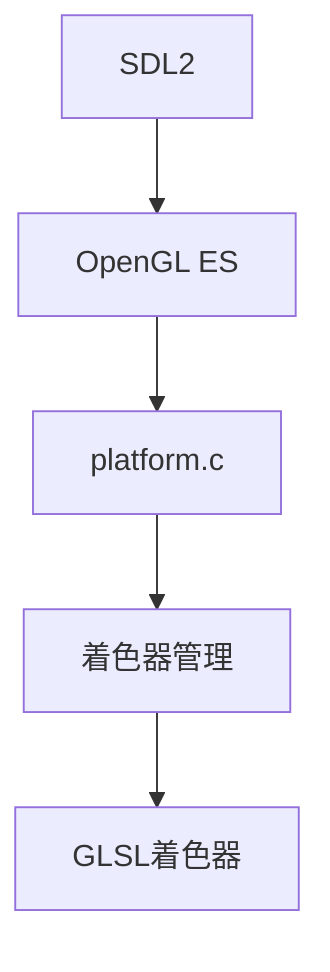

# 自定义着色器开发指南

<cite>
**本文档中引用的文件**  
- [pixellate.glsl](file://skeleton/BASE/Shaders/glsl/pixellate.glsl)
- [old-tv.cfg](file://skeleton/BASE/Shaders/old-tv.cfg)
- [pixelperfect-sharp.cfg](file://skeleton/BASE/Shaders/pixelperfect-sharp.cfg)
- [platform.c](file://workspace/lib/libcommon/platform.c)
- [minarch.c](file://workspace/apps/minarch/minarch.c)
- [colorfix.glsl](file://skeleton/SYSTEM/shaders/colorfix.glsl)
- [overlay.glsl](file://skeleton/SYSTEM/shaders/overlay.glsl)
- [default.glsl](file://skeleton/SYSTEM/shaders/default.glsl)
- [noshader.glsl](file://skeleton/SYSTEM/shaders/noshader.glsl)
- [stock.glsl](file://skeleton/BASE/Shaders/glsl/stock.glsl)
</cite>

## 目录
1. [简介](#简介)
2. [项目结构](#项目结构)
3. [核心组件](#核心组件)
4. [渲染管线架构](#渲染管线架构)
5. [详细组件分析](#详细组件分析)
6. [依赖分析](#依赖分析)
7. [性能考量](#性能考量)
8. [故障排除指南](#故障排除指南)
9. [结论](#结论)

## 简介
本文档旨在为开发者提供从零开始编写和集成自定义GLSL着色器的完整流程。文档详细说明了NextUI渲染管线对GLSL版本的要求、输入输出变量的规范，并以`pixellate.glsl`为例解析其采样逻辑和坐标变换公式。同时，文档指导开发者如何在本地测试新着色器，如何将其部署到系统目录，并提供常见问题的解决方案。

## 项目结构
NextUI项目的文件组织清晰，主要分为`github`、`skeleton`、`workspace`等目录。着色器文件主要位于`skeleton/BASE/Shaders/glsl/`和`skeleton/SYSTEM/shaders/`目录下，配置文件位于`skeleton/BASE/Shaders/`目录。开发者自定义的着色器应放置在`SYSTEM/shaders`目录下。



**图示来源**
- [pixellate.glsl](file://skeleton/BASE/Shaders/glsl/pixellate.glsl)
- [old-tv.cfg](file://skeleton/BASE/Shaders/old-tv.cfg)
- [pixellate.glsl](file://skeleton/SYSTEM/shaders/pixellate.glsl)

## 核心组件
NextUI的核心组件包括着色器管理、渲染管线和配置系统。着色器管理负责加载和编译GLSL着色器，渲染管线处理顶点和片段着色，配置系统管理着色器的参数和设置。

**组件来源**
- [platform.c](file://workspace/lib/libcommon/platform.c)
- [minarch.c](file://workspace/apps/minarch/minarch.c)

## 渲染管线架构
NextUI的渲染管线基于OpenGL ES，使用顶点着色器和片段着色器处理图形渲染。顶点着色器负责坐标变换，片段着色器负责颜色计算和纹理采样。



**图示来源**
- [platform.c](file://workspace/lib/libcommon/platform.c)

## 详细组件分析

### 着色器输入输出规范
NextUI渲染管线使用`COMPAT_ATTRIBUTE`和`COMPAT_VARYING`宏来定义输入输出变量。顶点着色器接收`VertexCoord`和`TexCoord`作为输入，通过`vTexCoord`传递给片段着色器。片段着色器使用`COMPAT_TEXTURE`宏进行纹理采样，并将结果写入`FragColor`。



**图示来源**
- [pixellate.glsl](file://skeleton/BASE/Shaders/glsl/pixellate.glsl)
- [platform.c](file://workspace/lib/libcommon/platform.c)

### pixellate.glsl着色器分析
`pixellate.glsl`着色器实现像素化效果，通过计算纹理坐标范围，对四个角的像素进行采样和插值。

```glsl
void main()
{
   vec2 texelSize = SourceSize.zw;
   vec2 range = vec2(abs(InputSize.x / (outsize.x * SourceSize.x)), abs(InputSize.y / (outsize.y * SourceSize.y)));
   range = range / 2.0 * 0.999;

   float left   = vTexCoord.x - range.x;
   float top    = vTexCoord.y + range.y;
   float right  = vTexCoord.x + range.x;
   float bottom = vTexCoord.y - range.y;
   
   vec3 topLeftColor     = COMPAT_TEXTURE(Source, (floor(vec2(left, top)     / texelSize) + 0.5) * texelSize).rgb;
   vec3 bottomRightColor = COMPAT_TEXTURE(Source, (floor(vec2(right, bottom) / texelSize) + 0.5) * texelSize).rgb;
   vec3 bottomLeftColor  = COMPAT_TEXTURE(Source, (floor(vec2(left, bottom)  / texelSize) + 0.5) * texelSize).rgb;
   vec3 topRightColor    = COMPAT_TEXTURE(Source, (floor(vec2(right, top)    / texelSize) + 0.5) * texelSize).rgb;

   // 插值计算
   vec2 border = clamp(floor((vTexCoord / texelSize) + vec2(0.5)) * texelSize, vec2(left, bottom), vec2(right, top));
   float totalArea = 4.0 * range.x * range.y;

   vec3 averageColor;
   averageColor  = ((border.x - left)  * (top - border.y)    / totalArea) * topLeftColor;
   averageColor += ((right - border.x) * (border.y - bottom) / totalArea) * bottomRightColor;
   averageColor += ((border.x - left)  * (border.y - bottom) / totalArea) * bottomLeftColor;
   averageColor += ((right - border.x) * (top - border.y)    / totalArea) * topRightColor;

   FragColor = (INTERPOLATE_IN_LINEAR_GAMMA > 0.5) ? vec4(pow(averageColor, vec3(1.0 / 2.2)), 1.0) : vec4(averageColor, 1.0);
} 
```

**组件来源**
- [pixellate.glsl](file://skeleton/BASE/Shaders/glsl/pixellate.glsl)

### 着色器配置文件分析
着色器配置文件（如`old-tv.cfg`）定义了着色器链和参数。每个配置文件可以指定多个着色器及其过滤器、源类型、缩放类型等。

```ini
minarch_nrofshaders = 2
minarch_shader1 = barrel-distortion.glsl
minarch_shader1_filter = NEAREST
minarch_shader1_srctype = source
minarch_shader1_scaletype = source
minarch_shader1_upscale = screen
minarch_shader2 = res-independent-scanlines.glsl
minarch_shader2_filter = NEAREST
minarch_shader2_srctype = source
minarch_shader2_scaletype = source
minarch_shader2_upscale = screen
```

**组件来源**
- [old-tv.cfg](file://skeleton/BASE/Shaders/old-tv.cfg)

## 依赖分析
NextUI的着色器系统依赖于SDL2和OpenGL ES。`platform.c`文件中的`PLAT_initShaders`函数负责初始化默认着色器，`PLAT_updateShader`函数负责加载和编译新的着色器。



**图示来源**
- [platform.c](file://workspace/lib/libcommon/platform.c)

## 性能考量
在编写自定义着色器时，应注意避免复杂的计算和过多的纹理采样，以确保渲染性能。使用`#pragma parameter`可以定义可调参数，方便在运行时调整效果。

## 故障排除指南
### 着色器编译失败
检查GLSL语法是否正确，确保使用正确的版本和宏定义。查看日志输出中的编译错误信息。

### 画面异常
检查纹理坐标和采样逻辑，确保坐标变换正确。使用RenderDoc等工具进行GPU调试。

### 性能下降
减少片段着色器中的计算量，避免分支和循环。使用简单的过滤器和缩放类型。

**组件来源**
- [platform.c](file://workspace/lib/libcommon/platform.c)
- [minarch.c](file://workspace/apps/minarch/minarch.c)

## 结论
通过本文档，开发者可以全面了解NextUI的着色器系统，从编写、测试到部署自定义GLSL着色器。遵循文档中的规范和最佳实践，可以创建高效且视觉效果出色的着色器。