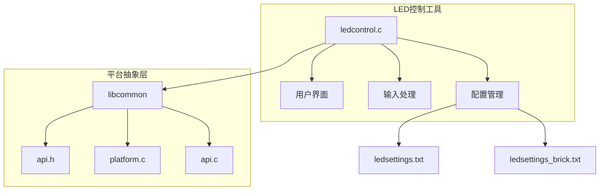
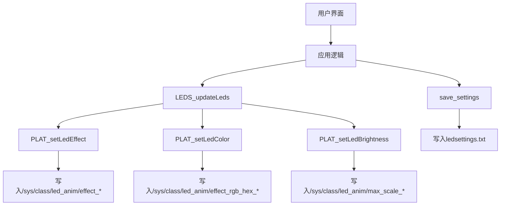
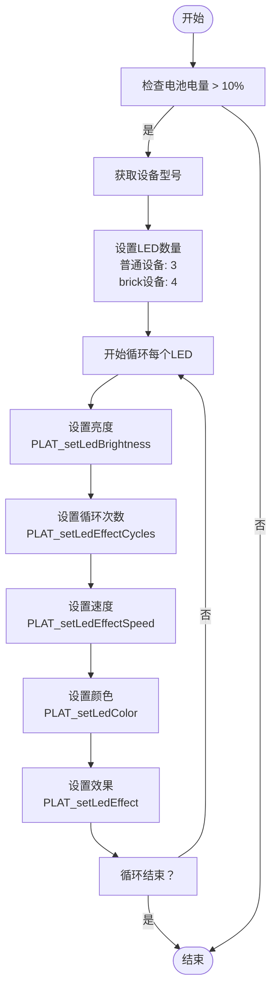
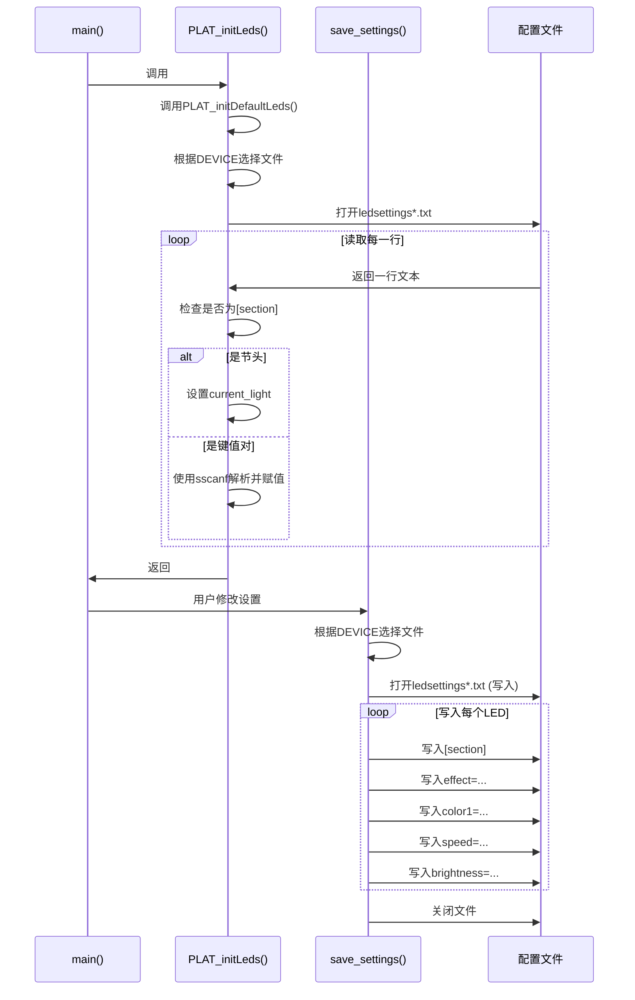
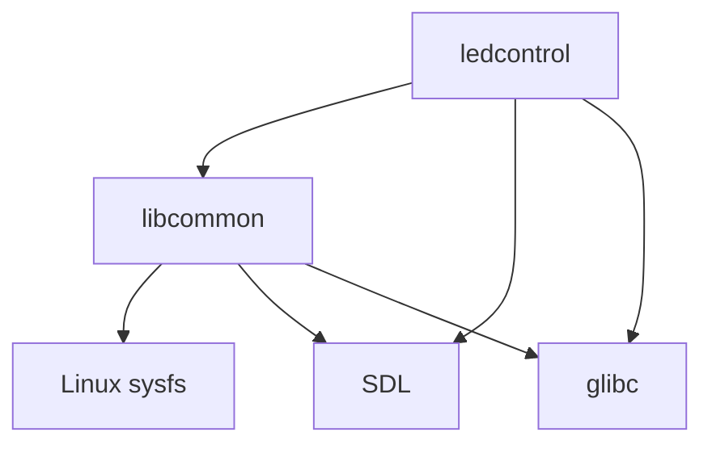

# LED控制工具

<cite>
**本文档中引用的文件**   
- [ledcontrol.c](file://workspace/tools/ledcontrol/ledcontrol.c)
- [api.h](file://workspace/lib/libcommon/api.h)
- [platform.c](file://workspace/lib/libcommon/platform.c)
- [api.c](file://workspace/lib/libcommon/api.c)
- [platform.h](file://workspace/lib/libcommon/platform.h)
- [ledsettings.txt](file://skeleton/EXTRAS/Tools/LedControl.pak/ledsettings.txt)
- [ledsettings brick.txt](file://skeleton/EXTRAS/Tools/LedControl.pak/ledsettings brick.txt)
</cite>

## 目录
1. [简介](#简介)
2. [项目结构](#项目结构)
3. [核心组件](#核心组件)
4. [架构概述](#架构概述)
5. [详细组件分析](#详细组件分析)
6. [依赖分析](#依赖分析)
7. [性能考虑](#性能考虑)
8. [故障排除指南](#故障排除指南)
9. [结论](#结论)

## 简介
LED控制工具（ledcontrol）是一个用于管理设备LED灯效的软件组件，它允许用户通过图形界面自定义设备上多个LED灯的视觉效果。该工具支持多种灯光模式，包括呼吸、常亮、闪烁等，并允许用户调整颜色、速度、亮度等参数。ledcontrol通过libcommon平台抽象层与底层硬件进行交互，确保了在不同设备型号上的兼容性。工具的配置通过文本文件持久化存储，支持在设备重启后恢复设置。用户可以通过方向键和按钮在菜单中导航，实时预览和修改LED效果。本工具是NextUI系统的一部分，为用户提供个性化的设备外观体验。

## 项目结构
LED控制工具作为NextUI项目的一部分，其源代码位于`workspace/tools/ledcontrol/`目录下，主要由`ledcontrol.c`一个源文件构成。该工具依赖于`libcommon`库提供的平台抽象功能，通过该库实现与硬件的交互。配置文件`ledsettings.txt`和`ledsettings_brick.txt`位于`EXTRAS/Tools/LedControl.pak/`目录中，用于存储用户的LED设置。`libcommon`库位于`workspace/lib/libcommon/`目录，包含了硬件访问、系统控制等核心功能的实现。整个项目采用模块化设计，将用户界面、硬件控制和平台适配分离，提高了代码的可维护性和可移植性。

**图源**
- [ledcontrol.c](file://workspace/tools/ledcontrol/ledcontrol.c)
- [api.h](file://workspace/lib/libcommon/api.h)
- [platform.c](file://workspace/lib/libcommon/platform.c)
- [ledsettings.txt](file://skeleton/EXTRAS/Tools/LedControl.pak/ledsettings.txt)
- [ledsettings brick.txt](file://skeleton/EXTRAS/Tools/LedControl.pak/ledsettings brick.txt)

**本节来源**
- [ledcontrol.c](file://workspace/tools/ledcontrol/ledcontrol.c)
- [platform.c](file://workspace/lib/libcommon/platform.c)

## 核心组件
LED控制工具的核心组件包括用户界面渲染、输入事件处理、LED状态管理和配置文件持久化。用户界面使用SDL库进行渲染，通过`GFX_init`和`GFX_flip`等函数管理显示。输入处理通过`PAD_poll`和`PAD_justPressed`函数检测用户按键，并根据按键更新当前选中的LED和设置项。LED状态管理通过`LightSettings`结构体数组`lightsDefault`存储所有LED的配置，并通过`LEDS_updateLeds`函数将这些配置应用到硬件。配置文件持久化通过`save_settings`函数实现，该函数将当前的LED设置写入文本文件，以便在下次启动时读取。所有与硬件的交互都通过`libcommon`库提供的`PLAT_*`系列函数进行，实现了硬件访问的抽象化。

**本节来源**
- [ledcontrol.c](file://workspace/tools/ledcontrol/ledcontrol.c#L0-L416)
- [api.h](file://workspace/lib/libcommon/api.h#L200-L399)
- [api.c](file://workspace/lib/libcommon/api.c#L3262-L3461)

## 架构概述
LED控制工具采用分层架构，上层为用户界面和应用逻辑，下层为平台抽象层和硬件驱动。应用层负责处理用户输入、渲染界面和管理LED配置。平台抽象层（libcommon）提供了一组统一的API，屏蔽了不同硬件平台的差异。当应用层需要控制LED时，它调用`LEDS_updateLeds`函数，该函数遍历所有LED设置，并通过`PLAT_setLed*`系列函数将配置传递给平台层。平台层根据当前设备型号（通过`DEVICE`环境变量判断）读取相应的配置文件，并通过写入Linux sysfs接口（如`/sys/class/led_anim/`）来实际控制硬件。这种架构使得LED控制逻辑与具体硬件解耦，只需为新设备实现相应的`PLAT_*`函数和配置文件即可支持。

**图源**
- [ledcontrol.c](file://workspace/tools/ledcontrol/ledcontrol.c#L200-L416)
- [api.c](file://workspace/lib/libcommon/api.c#L3330-L3364)
- [platform.c](file://workspace/lib/libcommon/platform.c#L2861-L2976)

## 详细组件分析

### 用户界面与输入处理分析
LED控制工具的用户界面和输入处理在`main`函数的主循环中实现。程序初始化后进入一个持续运行的循环，循环中首先调用`PAD_poll`检测输入事件。当检测到方向键或L/R键时，程序更新当前选中的LED或设置项，并标记界面为“脏”（dirty），以便在下一帧重新渲染。当检测到左/右键时，调用`handle_light_input`函数根据当前选中的设置项调整其值。例如，当调整颜色时，程序在预定义的`bright_colors`数组中循环切换。界面渲染由`GFX_clear`、`GFX_blitPill`等函数完成，根据当前状态绘制LED名称、设置标签和值。这种设计将输入处理、状态更新和界面渲染分离，确保了程序的响应性和可维护性。

**本节来源**
- [ledcontrol.c](file://workspace/tools/ledcontrol/ledcontrol.c#L200-L416)

### LED状态管理分析
LED状态管理的核心是`LEDS_updateLeds`函数。该函数首先检查电池电量（`pwr.charge > PWR_LOW_CHARGE`），只有在电量充足时才更新LED，以防止低电量下耗尽电池。然后，函数根据设备型号确定LED的数量（普通设备3个，brick设备4个）。对于每个LED，函数依次调用`PLAT_setLedBrightness`、`PLAT_setLedEffectCycles`、`PLAT_setLedEffectSpeed`、`PLAT_setLedColor`和`PLAT_setLedEffect`，将`lightsDefault`数组中的配置应用到硬件。这种顺序调用确保了所有参数都被正确设置。`LEDS_updateLeds`在每次用户修改设置后被调用，实现了配置的实时生效。

**图源**
- [api.c](file://workspace/lib/libcommon/api.c#L3330-L3364)

**本节来源**
- [api.c](file://workspace/lib/libcommon/api.c#L3330-L3364)

### 配置文件管理分析
配置文件管理由`save_settings`和`PLAT_initLeds`两个函数共同完成。`save_settings`函数根据设备型号选择配置文件路径（`ledsettings.txt`或`ledsettings_brick.txt`），然后以INI文件格式写入每个LED的配置，包括效果、颜色、速度等。`PLAT_initLeds`函数在程序启动时被调用，它首先调用`PLAT_initDefaultLeds`设置默认值，然后尝试打开相应的配置文件。如果文件存在，函数逐行解析，当遇到`[section]`时，开始解析该LED的配置，并使用`sscanf`将值填充到`lightsDefault`数组中。这种机制允许用户自定义设置，并在重启后保持，同时提供了合理的默认值以保证程序的健壮性。

**图源**
- [ledcontrol.c](file://workspace/tools/ledcontrol/ledcontrol.c#L0-L199)
- [platform.c](file://workspace/lib/libcommon/platform.c#L2653-L2852)

**本节来源**
- [ledcontrol.c](file://workspace/tools/ledcontrol/ledcontrol.c#L0-L199)
- [platform.c](file://workspace/lib/libcommon/platform.c#L2653-L2852)

## 依赖分析
LED控制工具的主要依赖是`libcommon`库，该库提供了平台抽象、硬件控制和系统服务。通过`api.h`头文件，ledcontrol使用了`PLAT_*`和`LEDS_*`系列函数。`PLAT_*`函数（如`PLAT_initLeds`、`PLAT_setLedColor`）直接与硬件交互，而`LEDS_*`函数（如`LEDS_updateLeds`）则封装了更高级的操作。此外，工具依赖SDL库进行图形渲染和输入处理，依赖标准C库进行文件操作。`libcommon`库本身又依赖于Linux内核的sysfs接口来控制LED硬件。这种依赖关系清晰地分层，使得ledcontrol可以专注于应用逻辑，而将平台相关的复杂性交给`libcommon`处理。

**图源**
- [api.h](file://workspace/lib/libcommon/api.h)
- [platform.c](file://workspace/lib/libcommon/platform.c)

**本节来源**
- [api.h](file://workspace/lib/libcommon/api.h)
- [platform.c](file://workspace/lib/libcommon/platform.c)

## 性能考虑
LED控制工具的性能主要受图形渲染和硬件I/O的影响。在主循环中，程序使用`dirty`标志来避免不必要的渲染，只有当状态改变时才重新绘制界面，这减少了CPU和GPU的负载。与硬件的通信通过写入sysfs文件实现，这是一个相对轻量的操作，但频繁调用仍可能影响性能。因此，`LEDS_updateLeds`函数只在用户明确修改设置后被调用，而不是在每一帧都执行。此外，程序在低电量时禁用LED更新，这既是节能措施，也避免了在低电量模式下进行不必要的I/O操作。整体而言，该工具的性能开销较低，适合在嵌入式设备上运行。

## 故障排除指南
当LED控制工具无法正常工作时，可以按照以下步骤进行排查：
1.  **检查配置文件**：确认`ledsettings.txt`或`ledsettings_brick.txt`文件存在且格式正确。文件应包含`[section]`和`key=value`对。
2.  **检查环境变量**：确认`DEVICE`环境变量已正确设置，其值应为`brick`或其它有效值，以确保程序选择正确的配置文件和LED数量。
3.  **检查硬件路径**：确认Linux系统中存在`/sys/class/led_anim/`目录，且其中包含`effect_*`、`effect_rgb_hex_*`等文件。这些文件是`PLAT_setLed*`函数写入的目标。
4.  **检查权限**：确认程序有权限写入sysfs文件。可能需要`chmod`操作来临时提升权限（如代码中`PLAT_chmod`所示）。
5.  **查看日志**：检查系统日志（如`dmesg`或`LOG_info`输出）是否有错误信息，例如"Unable to open led settings file"。
6.  **检查电池电量**：如果电池电量低于10%，LED更新将被禁用。请充电后重试。

**本节来源**
- [ledcontrol.c](file://workspace/tools/ledcontrol/ledcontrol.c)
- [platform.c](file://workspace/lib/libcommon/platform.c)

## 结论
LED控制工具是一个设计良好、结构清晰的嵌入式应用。它通过`libcommon`平台抽象层有效地隔离了硬件差异，实现了跨设备的兼容性。工具的配置管理机制简单而有效，使用INI格式的文本文件存储设置，易于用户理解和修改。用户界面直观，通过方向键即可完成所有操作。代码结构遵循了单一职责原则，将用户界面、输入处理、状态管理和硬件交互分离。为了进一步改进，可以考虑将`bright_colors`数组和`effect_names`数组移到配置文件中，以支持更灵活的自定义。总体而言，该工具为NextUI系统提供了一个稳定、可配置的LED控制解决方案。