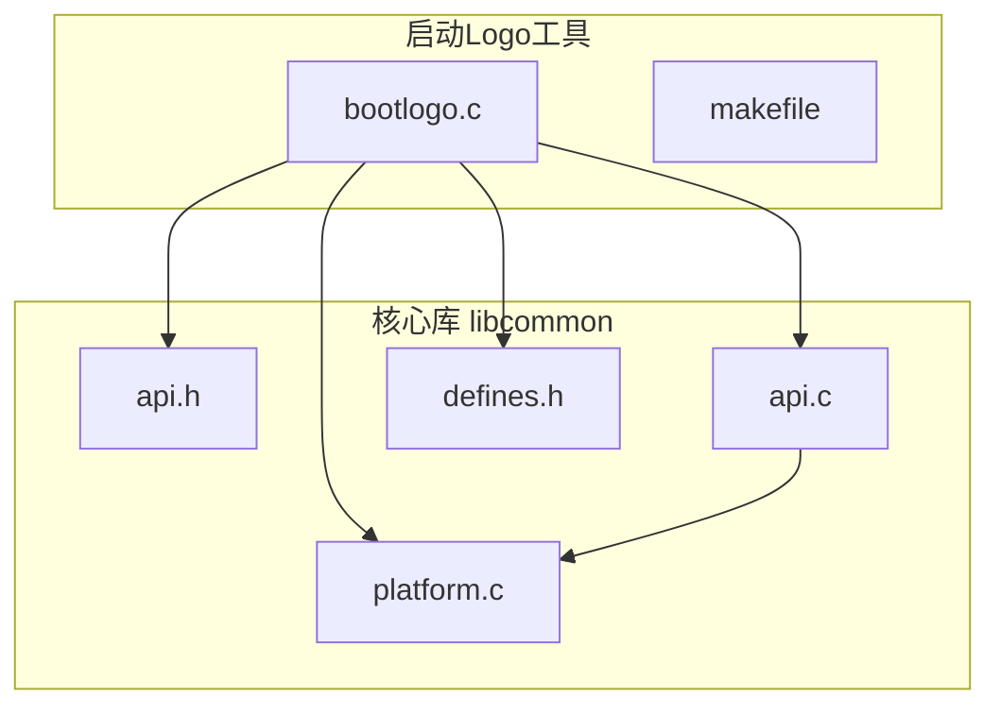
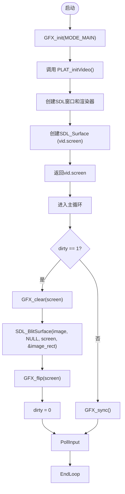
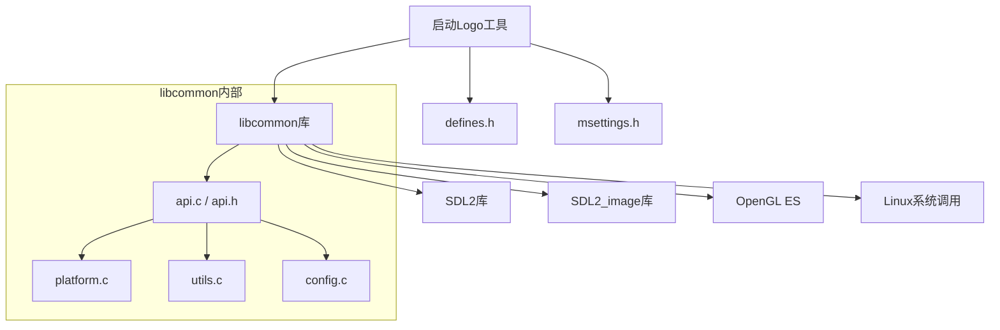

# 启动Logo工具

<cite>
**本文档引用的文件**   
- [bootlogo.c](file://workspace/tools/bootlogo/bootlogo.c)
- [defines.h](file://workspace/lib/libcommon/defines.h)
- [platform.c](file://workspace/lib/libcommon/platform.c)
- [api.c](file://workspace/lib/libcommon/api.c)
- [api.h](file://workspace/lib/libcommon/api.h)
</cite>

## 目录
1. [简介](#简介)
2. [项目结构](#项目结构)
3. [核心组件](#核心组件)
4. [架构概述](#架构概述)
5. [详细组件分析](#详细组件分析)
6. [依赖分析](#依赖分析)
7. [性能考虑](#性能考虑)
8. [故障排除指南](#故障排除指南)
9. [结论](#结论)

## 简介
本文档详细记录了NextUI系统中“启动Logo工具”（Bootlogo）的实现原理。该工具允许用户在设备启动时显示自定义的启动画面。文档分析了其代码实现，包括如何通过SDL库直接操作帧缓冲区来显示图像，支持的图像格式（BMP），以及其作为系统初始化工具的调用时机。同时，文档还提供了Logo替换方法和解决常见显示问题（如颜色失真或显示偏移）的方案。

## 项目结构
启动Logo工具是NextUI系统的一个独立工具，其代码位于项目的`workspace/tools/bootlogo/`目录下。该工具主要由一个C源文件`bootlogo.c`和一个`makefile`构成。它依赖于系统核心库`libcommon`，该库提供了图形渲染（GFX）、平台抽象（PLAT）、输入处理（PAD）、电源管理（PWR）等通用功能。



**图示来源**
- [bootlogo.c](file://workspace/tools/bootlogo/bootlogo.c)
- [platform.c](file://workspace/lib/libcommon/platform.c)
- [api.h](file://workspace/lib/libcommon/api.h)

## 核心组件
启动Logo工具的核心功能围绕图像加载、用户交互和系统操作展开。其主要组件包括：
*   **图像加载与管理**：从指定目录加载BMP格式的图像文件，并在内存中管理这些图像。
*   **图形渲染**：使用SDL库初始化图形模式，并将选中的图像居中渲染到屏幕上。
*   **用户输入处理**：监听方向键和A/B按钮的输入，以实现图像切换和应用操作。
*   **系统集成**：在用户确认后，执行系统命令将选中的Logo复制到启动分区并重启设备。

**本节来源**
- [bootlogo.c](file://workspace/tools/bootlogo/bootlogo.c#L1-L195)

## 架构概述
启动Logo工具的架构遵循一个简单的事件循环模式。程序启动后，首先进行初始化，包括设置信号处理器、初始化图形和输入系统。随后进入主循环，在循环中持续轮询用户输入。根据输入的不同，程序会更新内部状态（如选中的图像索引）或执行特定操作（如应用Logo）。当需要更新屏幕时，程序会清除屏幕，将当前选中的图像绘制到屏幕中央，并显示操作提示，最后翻转缓冲区以显示新画面。

```mermaid
sequenceDiagram
participant Main as main()
participant Init as 初始化
participant Loop as 主循环
participant Render as 渲染
participant System as 系统命令
Main->>Init : InitSettings()
Main->>Init : GFX_init()
Main->>Init : PAD_init()
Main->>Init : loadImages()
Init-->>Main : 初始化完成
loop 事件循环
Main->>Loop : while(!quit)
Loop->>Loop : PAD_poll()
alt 用户按下左/右键
Loop->>Loop : selected +=/- 1
Loop->>Loop : dirty = 1
else 用户按下A键
Loop->>System : 执行系统命令
System->>System : mkdir, mount, cp, sync, umount, reboot
else 用户按下B键
Loop->>Loop : quit = 1
end
alt dirty == 1
Loop->>Render : GFX_clear()
Loop->>Render : SDL_BlitSurface()
Loop->>Render : GFX_blitButtonGroup()
Loop->>Render : GFX_flip()
Loop->>Loop : dirty = 0
else
Loop->>Loop : GFX_sync()
end
end
Main->>Main : unloadImages()
Main->>Main : QuitSettings(), GFX_quit()
```

**图示来源**
- [bootlogo.c](file://workspace/tools/bootlogo/bootlogo.c#L1-L195)

## 详细组件分析

### 图像加载与路径解析
`loadImages()`函数负责从文件系统加载所有可用的BMP图像。它首先根据环境变量`DEVICE`的值（如"brick"或"smartpro"）确定图像的搜索路径。路径由`TOOLS_PATH`宏（定义在`defines.h`中）和具体的子目录（`brick/`或`smartpro/`）拼接而成。函数使用`opendir`和`readdir`遍历该目录，查找所有以".bmp"结尾的文件。对于每个找到的BMP文件，它调用`IMG_Load`（SDL_image库函数）将其加载为`SDL_Surface`对象，并将该对象和文件路径分别存储在动态分配的数组`images`和`image_paths`中。

**本节来源**
- [bootlogo.c](file://workspace/tools/bootlogo/bootlogo.c#L38-L88)
- [defines.h](file://workspace/lib/libcommon/defines.h#L1-L234)

### 图形初始化与渲染
工具通过调用`GFX_init(MODE_MAIN)`来初始化图形系统。`GFX_init`是一个封装函数，其内部调用了平台相关的`PLAT_initVideo()`函数。`PLAT_initVideo()`在`platform.c`中实现，它使用SDL2库创建一个OpenGL窗口和渲染器，并设置一个与设备屏幕分辨率（由`FIXED_WIDTH`和`FIXED_HEIGHT`定义）相匹配的`SDL_Surface`作为主屏幕表面。在主循环中，当`dirty`标志被置位时，程序会调用`GFX_clear`清除屏幕，然后使用`SDL_BlitSurface`将`images[selected]`中的图像数据复制到主屏幕表面的中心位置，最后通过`GFX_flip`翻转前后缓冲区，将图像显示在屏幕上。



**图示来源**
- [bootlogo.c](file://workspace/tools/bootlogo/bootlogo.c#L107-L195)
- [platform.c](file://workspace/lib/libcommon/platform.c#L400-L599)
- [api.c](file://workspace/lib/libcommon/api.c#L328-L350)

### 系统Logo应用流程
当用户按下A键时，程序会执行一个关键的系统操作：将选中的Logo应用到启动分区。这通过`system()`函数执行一个复合的shell命令来实现。该命令的流程如下：
1.  **创建挂载点**：使用`mkdir -p`确保`/mnt/boot/`目录存在。
2.  **挂载启动分区**：使用`mount -t vfat /dev/mmcblk0p1 /mnt/boot/`将设备的启动分区（通常是FAT32格式的eMMC分区）挂载到`/mnt/boot/`。
3.  **复制Logo文件**：使用`cp`命令将用户选中的BMP文件（`image_paths[selected]`）复制到挂载点下的`bootlogo.bmp`。
4.  **同步数据**：调用`sync`命令确保所有缓存的数据都写入物理存储。
5.  **卸载分区**：使用`umount`命令安全地卸载启动分区。
6.  **重启设备**：最后执行`reboot`命令重启设备，使新的Logo生效。

**本节来源**
- [bootlogo.c](file://workspace/tools/bootlogo/bootlogo.c#L143-L152)

## 依赖分析
启动Logo工具的正常运行依赖于多个系统组件和库。其依赖关系清晰，层次分明。



**图示来源**
- [bootlogo.c](file://workspace/tools/bootlogo/bootlogo.c)
- [api.h](file://workspace/lib/libcommon/api.h)
- [platform.c](file://workspace/lib/libcommon/platform.c)

## 性能考虑
由于启动Logo工具是一个简单的图像查看器，其性能开销极低。图形渲染使用了硬件加速的OpenGL后端，图像的Blit操作非常高效。主循环中，当没有用户输入或屏幕不需要更新时，程序会调用`GFX_sync()`，这通常会引入一个短暂的延迟（约16ms），以保持60fps的帧率，避免CPU空转。整体而言，该工具对系统资源的占用可以忽略不计。

## 故障排除指南
在使用启动Logo工具时，可能会遇到以下常见问题：

*   **问题：无法加载任何Logo图像**
    *   **原因**：指定的路径（`TOOLS_PATH/Bootlogo.pak/brick/` 或 `TOOLS_PATH/Bootlogo.pak/smartpro/`）不存在，或者该目录下没有BMP文件。
    *   **解决方案**：检查`DEVICE`环境变量的值，并确保在正确的子目录下放置了BMP格式的Logo文件。确认文件路径和权限正确。

*   **问题：显示颜色失真或为绿色/紫色**
    *   **原因**：BMP文件的像素格式与系统帧缓冲区的格式不匹配。系统期望的是`SDL_PIXELFORMAT_RGBA8888`格式。
    *   **解决方案**：使用图像编辑软件将BMP文件另存为24位或32位真彩色格式，并确保其颜色通道顺序正确。

*   **问题：图像显示偏移或未居中**
    *   **原因**：`GFX_init`或`PLAT_initVideo`未能正确获取屏幕的分辨率。
    *   **解决方案**：检查`FIXED_WIDTH`和`FIXED_HEIGHT`宏的定义是否与实际设备屏幕分辨率一致。这通常在平台相关的头文件中定义。

*   **问题：应用Logo后重启，Logo未改变**
    *   **原因**：系统命令执行失败，可能是因为启动分区设备名（`/dev/mmcblk0p1`）不正确，或者挂载点`/mnt/boot/`被占用。
    *   **解决方案**：确认设备的启动分区设备名。可以在终端中使用`lsblk`命令进行检查。同时，确保`/mnt/boot/`目录是空闲的。

**本节来源**
- [bootlogo.c](file://workspace/tools/bootlogo/bootlogo.c)
- [platform.c](file://workspace/lib/libcommon/platform.c)

## 结论
启动Logo工具是一个功能明确、实现简洁的系统工具。它通过利用SDL2和SDL2_image库，实现了对帧缓冲区的安全、直接的图像写入操作。其代码结构清晰，依赖关系明确，易于维护和扩展。通过分析其源码，我们深入了解了其从图像加载、用户交互到系统集成的完整工作流程。该工具为用户提供了自定义设备启动画面的能力，是NextUI系统个性化功能的一个重要组成部分。