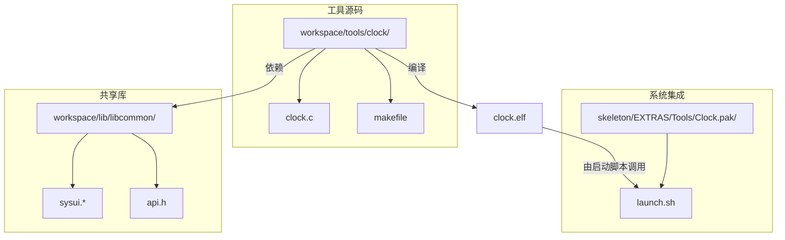
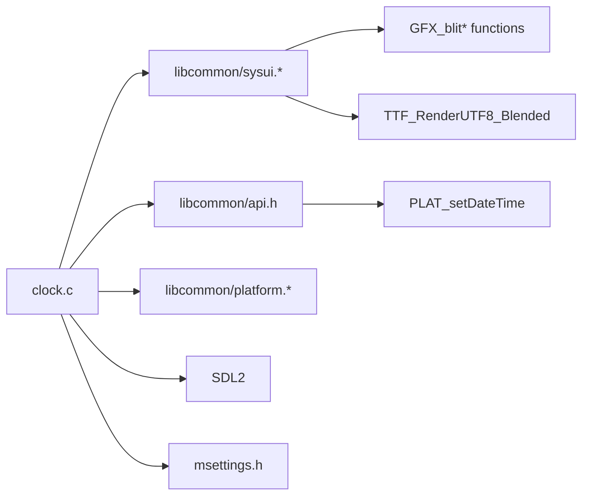

# 时钟工具

<cite>
**本文档引用的文件**   
- [clock.c](file://workspace/tools/clock/clock.c)
- [clock.pak/launch.sh](file://skeleton/EXTRAS/Tools/Clock.pak/launch.sh)
- [sysui.h](file://workspace/lib/libcommon/sysui.h)
- [sysui.c](file://workspace/lib/libcommon/sysui.c)
- [api.h](file://workspace/lib/libcommon/api.h)
</cite>

## 目录
1. [简介](#简介)
2. [项目结构](#项目结构)
3. [核心组件](#核心组件)
4. [架构概述](#架构概述)
5. [详细组件分析](#详细组件分析)
6. [依赖分析](#依赖分析)
7. [性能考虑](#性能考虑)
8. [故障排除指南](#故障排除指南)
9. [结论](#结论)

## 简介
本文档深入解析了NextUI项目中的时钟工具（Clock）的功能实现。该工具作为一个独立的Pak包集成在系统中，提供日期和时间设置界面。文档详细分析了其核心功能，包括本地时间获取、显示格式化、UI渲染逻辑以及与系统时间的同步机制。重点解析了`clock.c`中的时间更新循环和SDL2图形绘制代码，说明了其如何支持24/12小时制切换，并为开发者提供了扩展功能的接口建议。

## 项目结构
时钟工具在项目中以模块化的方式组织，其代码、构建脚本和分发包分布在不同的目录中。



**Diagram sources**
- [clock.c](file://workspace/tools/clock/clock.c)
- [clock.pak/launch.sh](file://skeleton/EXTRAS/Tools/Clock.pak/launch.sh)
- [sysui.c](file://workspace/lib/libcommon/sysui.c)

**Section sources**
- [clock.c](file://workspace/tools/clock/clock.c)
- [clock.pak/launch.sh](file://skeleton/EXTRAS/Tools/Clock.pak/launch.sh)

## 核心组件
时钟工具的核心功能由`clock.c`文件实现，其主要组件包括：
*   **时间数据模型**：使用`struct tm`和`time_t`来表示和操作日期时间。
*   **用户界面 (UI) 渲染引擎**：利用SDL2库和预渲染的数字精灵图（sprite sheet）来绘制时钟显示。
*   **输入处理系统**：通过`PAD_poll()`和`PAD_justPressed()`等函数处理用户按钮输入。
*   **系统服务接口**：通过`PLAT_setDateTime()`函数与底层系统进行交互，以设置实际时间。

**Section sources**
- [clock.c](file://workspace/tools/clock/clock.c)

## 架构概述
时钟工具采用了一个简单的事件循环架构，其核心流程如下：初始化系统资源 -> 进入主循环 -> 处理用户输入 -> 更新UI状态 -> 渲染画面 -> 同步系统时间。

```mermaid
sequenceDiagram
participant Main as main()
participant Loop as 主循环
participant Input as 输入处理
participant UI as UI渲染
participant System as 系统服务
Main->>Main : PWR_setCPUSpeed()
Main->>Main : GFX_init(), PAD_init()
Main->>Main : SysUI_Init()
Main->>Loop : 初始化时间变量
loop 主循环
Loop->>Input : PAD_poll()
Input->>Input : 检查BTN_UP/BTN_DOWN等
alt 用户输入
Input->>Loop : 设置dirty=1
end
alt 用户按SELECT
Input->>Loop : 切换show_24hour标志
Loop->>Loop : 更新option_count
end
alt 用户按A或B
Input->>Loop : 设置quit=1, save_changes=?
end
alt dirty=1
Loop->>UI : validate() 校验日期
Loop->>UI : GFX_clear()
Loop->>UI : SysUI_SetTitle/BottomHints()
Loop->>UI : blitNumber() 渲染数字
Loop->>UI : SysUI_Render(), GFX_flip()
Loop->>Loop : dirty=0
else
Loop->>Loop : GFX_sync()
end
end
Loop->>System : PLAT_setDateTime()
Loop->>Main : 返回EXIT_SUCCESS
```

**Diagram sources**
- [clock.c](file://workspace/tools/clock/clock.c#L25-L254)

## 详细组件分析

### 时间获取与初始化分析
时钟工具在启动时通过标准C库函数获取当前系统时间，并将其分解为可编辑的字段。

```c
time_t t = time(NULL);
struct tm tm = *localtime(&t);
int32_t day_selected = tm.tm_mday;
int32_t month_selected = tm.tm_mon + 1; // 月份从0开始，需+1
uint32_t year_selected = tm.tm_year + 1900; // 年份从1900年开始，需+1900
// ... 其他时间字段
```
此代码片段展示了如何从系统获取当前时间，并将其转换为用户友好的格式（如月份1-12，年份1970-2100）。`show_24hour`标志通过检查用户数据目录下是否存在`show_24hour`文件来确定，这提供了一种持久化的用户偏好设置。

**Section sources**
- [clock.c](file://workspace/tools/clock/clock.c#L35-L45)

### UI渲染与格式化分析
UI渲染是时钟工具的核心，它通过预渲染一个包含所有数字和符号的精灵图来高效地绘制界面。

#### 数字精灵图创建
```c
SDL_Surface* digits = SDL_CreateRGBSurface(SDL_SWSURFACE, SCALE2(120,16), FIXED_DEPTH,RGBA_MASK_AUTO);
SDL_FillRect(digits, NULL, RGB_BLACK);
char* chars[] = { "0","1","2","3","4","5","6","7","8","9","/",":", NULL };
// ... 遍历chars数组，使用TTF_RenderUTF8_Blended渲染每个字符并Blit到digits表面
```
此过程创建了一个包含0-9、/、:等字符的横向精灵图，后续的`blit()`和`blitNumber()`函数通过指定精灵图上的X坐标来快速绘制所需字符。

#### 24/12小时制切换逻辑
```c
if (show_24hour) {
     x = blitNumber(hour_selected, x,y);
} else {
    int hour = hour_selected;
    if (hour==0) hour = 12;
    else if (hour>12) hour -= 12;
    x = blitNumber(hour, x,y);
}
// ... 渲染AM/PM文本
```
当`show_24hour`为假时，代码会将24小时制的小时数转换为12小时制，并在右侧渲染"AM"或"PM"文本。`BTN_SELECT`按钮的按下事件会通过`system("touch ...")`或`system("rm ...")`命令来创建或删除`show_24hour`文件，从而持久化用户的切换选择。

**Section sources**
- [clock.c](file://workspace/tools/clock/clock.c#L20-L34)
- [clock.c](file://workspace/tools/clock/clock.c#L180-L195)

### 系统集成与时间同步分析
时钟工具作为一个独立的Pak包，通过一个简单的Shell脚本启动，并在退出时将修改后的时间同步到系统。

#### Pak包集成方式
时钟工具被打包为`Clock.pak`，其内部包含一个`launch.sh`脚本：
```sh
#!/bin/sh
cd $(dirname "$0")
./clock.elf # &> ./log.txt
```
该脚本首先切换到自身所在目录，然后执行编译好的`clock.elf`可执行文件。这种结构使得工具可以独立分发和运行，而无需修改主程序。

#### 与主界面的时间同步机制
时钟工具通过`libcommon`库提供的`SysUI`模块与主界面的UI风格保持一致。`SysUI_Init()`、`SysUI_SetTitle()`和`SysUI_SetBottomHints()`等函数确保了时钟工具的标题栏和底部提示与系统其他应用风格统一。时间同步发生在用户确认修改后：
```c
if (save_changes) {
    PLAT_setDateTime(year_selected, month_selected, day_selected, hour_selected, minute_selected, seconds_selected);
}
```
`PLAT_setDateTime`是一个平台相关的函数（通过`api.h`中的宏`#define PLAT_setDateTime PLAT_setDateTime`声明），它负责将用户设置的时间写入系统时钟。

**Section sources**
- [clock.pak/launch.sh](file://skeleton/EXTRAS/Tools/Clock.pak/launch.sh)
- [clock.c](file://workspace/tools/clock/clock.c#L245-L250)
- [sysui.h](file://workspace/lib/libcommon/sysui.h#L25-L32)
- [api.h](file://workspace/lib/libcommon/api.h#L484)

## 依赖分析
时钟工具的运行依赖于项目中的多个核心库和系统服务。



**Diagram sources**
- [clock.c](file://workspace/tools/clock/clock.c)
- [sysui.c](file://workspace/lib/libcommon/sysui.c)
- [api.h](file://workspace/lib/libcommon/api.h)

## 性能考虑
时钟工具的性能设计主要体现在以下几个方面：
1.  **双缓冲与脏标记**：通过`dirty`标志位控制渲染，只有在用户输入导致界面变化时才进行完整的清屏和重绘，否则调用`GFX_sync()`进行屏幕同步，避免了不必要的CPU和GPU开销。
2.  **精灵图优化**：将所有数字和符号预渲染到一张精灵图上，减少了字体渲染的调用次数，提高了绘制效率。
3.  **CPU降频**：在程序开始时调用`PWR_setCPUSpeed(CPU_SPEED_MENU)`，将CPU设置为菜单模式的较低速度，以节省电量。

## 故障排除指南
*   **问题：时钟工具无法启动或立即崩溃。**
    *   **检查**：确认`clock.elf`可执行文件存在于`Clock.pak`目录中。
    *   **检查**：查看`launch.sh`脚本的权限是否为可执行。
*   **问题：时间设置后未生效。**
    *   **检查**：`PLAT_setDateTime`函数的实现是否正确，确保底层平台支持时间设置。
    *   **检查**：程序是否以足够的权限运行。
*   **问题：UI显示异常或乱码。**
    *   **检查**：`sysui`库是否正确初始化，`GFX_init()`和`SysUI_Init()`调用是否成功。
    *   **检查**：字体文件是否加载正常。

**Section sources**
- [clock.pak/launch.sh](file://skeleton/EXTRAS/Tools/Clock.pak/launch.sh)
- [clock.c](file://workspace/tools/clock/clock.c#L25-L30)

## 结论
时钟工具是一个功能完整、设计清晰的独立应用模块。它成功地利用了SDL2进行图形渲染，并通过`libcommon`库与主系统UI无缝集成。其24/12小时制的切换机制简单而有效，通过文件系统来持久化用户偏好。对于开发者而言，扩展此工具的功能是可行的：
*   **添加闹钟功能**：可以在`clock.c`中增加一个状态机，用于管理闹钟的设置和触发。需要新增一个`struct`来存储闹钟时间，并在主循环中增加对闹钟时间的检查逻辑。
*   **添加网络时间同步功能**：可以引入网络库（如`libwifid`），在程序启动时或用户手动触发时，通过NTP协议从网络服务器获取精确时间，并调用`PLAT_setDateTime`进行同步。这需要处理网络连接和错误状态。