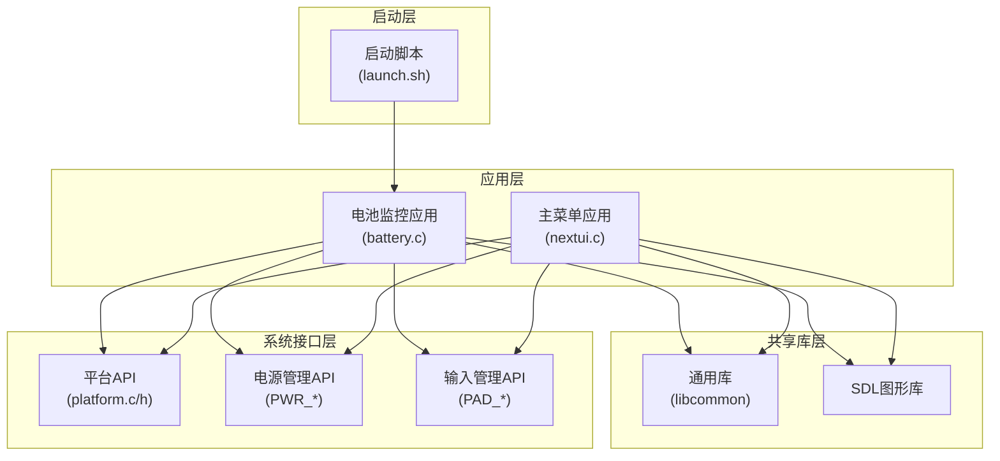
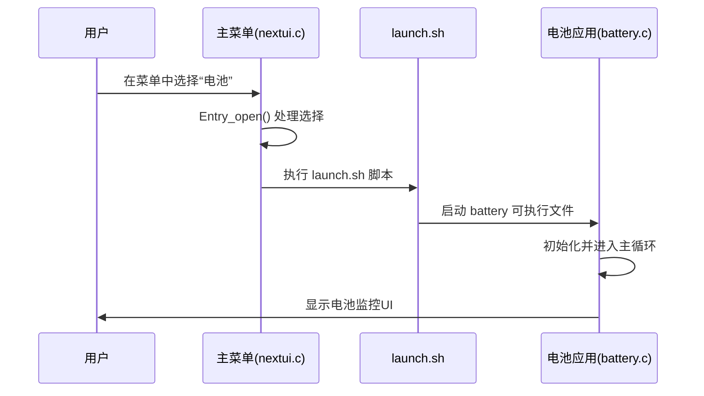
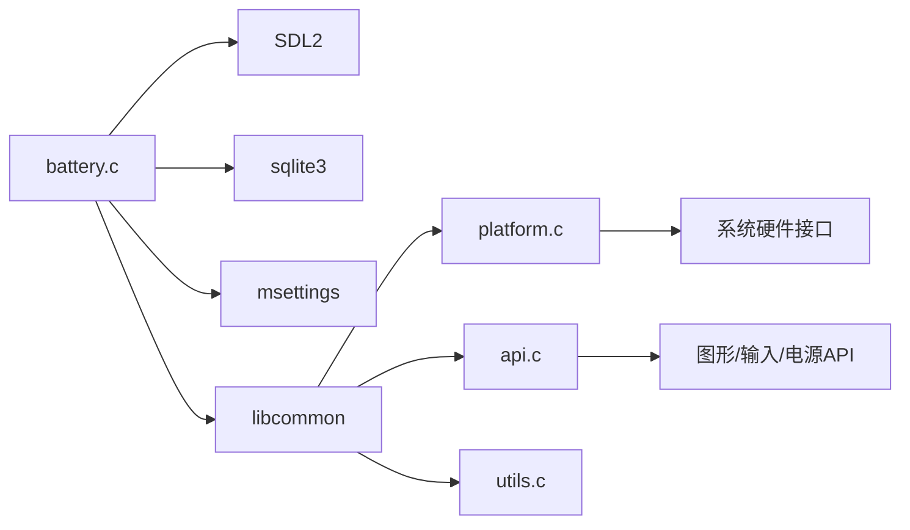

# 电池监控工具

<cite>
**本文档引用的文件**   
- [battery.c](file://workspace/tools/battery/battery.c)
- [runtrimui.sh](file://skeleton/BOOT/trimui/app/runtrimui.sh)
- [nextui.c](file://workspace/apps/nextui/nextui.c)
- [platform.c](file://workspace/lib/libcommon/platform.c)
- [platform.h](file://workspace/lib/libcommon/platform.h)
</cite>

## 目录
1. [简介](#简介)
2. [项目结构](#项目结构)
3. [核心组件](#核心组件)
4. [架构概述](#架构概述)
5. [详细组件分析](#详细组件分析)
6. [依赖分析](#依赖分析)
7. [性能考量](#性能考量)
8. [故障排除指南](#故障排除指南)
9. [结论](#结论)

## 简介
本文档详细记录了NextUI系统中电池监控工具（battery）的实现机制。该工具通过系统接口读取电池电压、充电状态等信息，并在用户界面中实时显示历史使用数据和剩余时间预测。文档将深入分析其核心函数的工作流程，解释其如何作为独立应用集成到主菜单中，并与libcommon库交互获取平台信息。同时提供配置选项和常见问题的排查方法。

## 项目结构
电池监控工具是NextUI系统中的一个独立应用，其代码位于`workspace/tools/battery/`目录下。它通过`EXTRAS/Tools/Battery.pak/launch.sh`脚本启动，并与主菜单应用`nextui`共享底层库和UI组件。



**图示来源**
- [battery.c](file://workspace/tools/battery/battery.c)
- [nextui.c](file://workspace/apps/nextui/nextui.c)
- [platform.c](file://workspace/lib/libcommon/platform.c)
- [platform.h](file://workspace/lib/libcommon/platform.h)

**本节来源**
- [battery.c](file://workspace/tools/battery/battery.c)
- [nextui.c](file://workspace/apps/nextui/nextui.c)

## 核心组件
电池监控工具的核心功能由`battery.c`文件实现，主要包括三个部分：数据读取、图形计算和UI渲染。

1.  **数据读取**：通过`libcommon`库提供的`PLAT_getModel()`获取设备型号，并使用`batmondb`库（`batmondb.h`）从SQLite数据库`bat_activity`表中查询历史电池使用数据。
2.  **图形计算**：`compute_graph()`函数是核心，它处理数据库中的时间序列数据，将其转换为屏幕上的像素坐标，并计算剩余使用时间的预测线。
3.  **UI渲染**：`renderPage()`函数负责绘制图表的网格、标签、电池图标和实际的数据线。

**本节来源**
- [battery.c](file://workspace/tools/battery/battery.c#L1-L777)

## 架构概述
电池监控工具采用事件驱动的单线程架构。程序启动后，初始化SDL图形界面和输入系统，然后进入主循环。在循环中，它持续监听用户输入（方向键、L/R键、B键等），根据输入更新视图状态（缩放、滚动），并在需要时重新渲染整个UI。

```mermaid
graph TD
A[程序启动] --> B[初始化设置]
B --> C[初始化图形和输入]
C --> D[初始化布局]
D --> E[计算图表数据]
E --> F[首次渲染]
F --> G[进入主循环]
G --> H{用户输入?}
H --> |是| I[处理输入事件]
I --> J[更新状态<br/>(缩放/滚动/退出)]
J --> K[标记为脏]
H --> |否| L{需要更新?}
L --> |是| M[清除屏幕]
M --> N[绘制标题栏]
N --> O[渲染图表]
O --> P[绘制按钮提示]
P --> Q[翻转屏幕]
Q --> G
L --> |否| R[同步帧率]
R --> G
J --> |请求退出| S[清理资源]
S --> T[程序结束]
```

**图示来源**
- [battery.c](file://workspace/tools/battery/battery.c#L577-L776)

**本节来源**
- [battery.c](file://workspace/tools/battery/battery.c#L1-L777)

## 详细组件分析

### 核心函数分析

#### `read_battery_level()` 函数
在`battery.c`文件中，虽然没有一个名为`read_battery_level()`的独立函数，但读取电池信息的逻辑分散在`compute_graph()`函数中。它通过以下步骤实现：

1.  **打开数据库**：调用`open_battery_log_db()`打开存储电池活动记录的SQLite数据库。
2.  **执行查询**：使用`sqlite3_prepare_v2`和`sqlite3_step`执行SQL查询，从`bat_activity`表中按设备序列号（通过`PLAT_getModel()`获取）和时间倒序读取数据。
3.  **处理数据**：在查询结果的循环中，通过`sqlite3_column_int()`提取每一行的电池百分比（第3列）、持续时间（第4列）和充电状态（第5列）。

```c
// 从数据库中读取电池数据的核心代码段
sqlite3_bind_text(stmt, 1, device_model, -1, SQLITE_STATIC);
while ((sqlite3_step(stmt) == SQLITE_ROW) && (!b_quit)) {
    int bat_perc = sqlite3_column_int(stmt, 2); // 电池百分比
    int duration = sqlite3_column_int(stmt, 3); // 持续时间(秒)
    bool is_charging = sqlite3_column_int(stmt, 4); // 充电状态
    // ... 处理数据
}
```

**本节来源**
- [battery.c](file://workspace/tools/battery/battery.c#L250-L280)

#### `update_battery_display()` 函数
同样，`update_battery_display()`的功能由`renderPage()`函数实现。该函数负责将计算好的数据绘制到屏幕上。

1.  **绘制网格**：使用`drawLine()`函数绘制图表的垂直和水平网格线。
2.  **绘制标签**：使用`renderText()`和`drawBatteryIcon()`函数在X轴和Y轴上绘制时间标签和不同电量的电池图标。
3.  **绘制数据线**：通过`SDL_LockSurface`锁定屏幕表面，直接操作像素数据，根据`graph.graphic`数组中的`pixel_height`和`is_charging`等信息，绘制出代表电池电量变化的彩色线条。

```c
// 绘制数据线的核心代码段
for (int i = 0; i < graph.layout.graph_max_size - current_index; i += zoom_level) {
    x = graph.layout.graph_display_start_x + (int)(i / zoom_level);
    y = graph.graphic[i + current_index].pixel_height;
    // ... 根据充电/放电/预测状态设置颜色
    if (x < graph_display_right && y > 0) {
        // 绘制线条像素
        for (int k = -half_line_width; k <= half_line_width; k++) {
            int index = (graph_display_bottom - y + k) * screen->pitch + x * screen->format->BytesPerPixel;
            *((Uint32 *)((Uint8 *)screen->pixels + index)) = pixel_color;
        }
    }
}
```

**本节来源**
- [battery.c](file://workspace/tools/battery/battery.c#L400-L576)

### 应用集成分析
电池监控工具作为一个独立的`.pak`包（`Battery.pak`）集成到主菜单中。其启动流程如下：

1.  **主菜单加载**：主菜单应用`nextui`在启动时会扫描`EXTRAS/Tools/`目录下的所有`.pak`文件。
2.  **启动脚本调用**：当用户在主菜单中选择“电池”工具时，系统会执行该工具包内的`launch.sh`脚本。
3.  **执行应用**：`launch.sh`脚本负责调用编译好的`battery`可执行文件。

虽然`runtrimui.sh`是主菜单的启动入口，但`nextui.c`才是实际的主菜单应用逻辑。`nextui.c`中的`Entry_open()`函数是打开任何应用（包括电池工具）的关键，它会根据条目的类型执行相应的启动命令。



**图示来源**
- [nextui.c](file://workspace/apps/nextui/nextui.c#L400-L450)
- [battery.c](file://workspace/tools/battery/battery.c#L577-L776)

**本节来源**
- [nextui.c](file://workspace/apps/nextui/nextui.c#L1-L1211)
- [battery.c](file://workspace/tools/battery/battery.c#L577-L776)

### 与libcommon库的交互
电池监控工具通过包含`libcommon`的头文件（如`api.h`, `utils.h`）来使用其提供的功能。

1.  **平台信息**：通过`PLAT_getModel()`获取设备型号，用于数据库查询。
2.  **图形和输入**：使用`GFX_*`系列函数（如`GFX_init`, `GFX_blitAsset`）进行图形初始化和绘制，使用`PAD_*`系列函数（如`PAD_poll`, `PAD_justPressed`）处理用户输入。
3.  **电源管理**：调用`PWR_*`系列函数（如`PWR_init`, `PWR_update`）来管理CPU速度和电源状态。

```c
// battery.c 中与 libcommon 交互的代码示例
device_model = PLAT_getModel(); // 获取平台信息
screen = GFX_init(MODE_MAIN);  // 初始化图形
PAD_init();                    // 初始化输入
PWR_init();                    // 初始化电源管理
```

**本节来源**
- [battery.c](file://workspace/tools/battery/battery.c#L1-L50)
- [platform.h](file://workspace/lib/libcommon/platform.h)
- [api.h](file://workspace/lib/libcommon/api.h)

## 依赖分析
电池监控工具的依赖关系清晰，主要依赖于系统库和项目内的共享库。



**图示来源**
- [battery.c](file://workspace/tools/battery/battery.c#L1-L20)
- [platform.c](file://workspace/lib/libcommon/platform.c)
- [api.c](file://workspace/lib/libcommon/api.c)

**本节来源**
- [battery.c](file://workspace/tools/battery/battery.c#L1-L777)
- [platform.c](file://workspace/lib/libcommon/platform.c)

## 性能考量
该工具的性能主要受以下因素影响：

1.  **数据库查询**：`compute_graph()`函数在每次启动或数据更新时都会执行一次完整的数据库查询。对于长时间使用后积累的大量数据，查询可能会变慢。
2.  **像素级渲染**：`renderPage()`函数在绘制数据线时直接操作像素，虽然提供了精确的控制，但在高分辨率或复杂图表下可能成为性能瓶颈。
3.  **内存使用**：`graph.graphic`数组的大小与屏幕宽度和`GRAPH_MAX_FULL_PAGES`成正比，会占用一定的内存。

优化建议：可以考虑对数据库查询结果进行缓存，或使用更高效的图形绘制方法（如OpenGL纹理）来替代直接的像素操作。

## 故障排除指南

### 配置选项
*   **低电量警告阈值**：在当前代码中，低电量警告（显示`ASSET_BATTERY_LOW`图标）是基于预测线的结束位置自动触发的，没有直接的配置选项。该逻辑在`renderPage()`函数中实现。
*   **传感器读取失败**：如果数据库为空或查询失败，`compute_graph()`函数会使用默认值（如`current_percentage`为0%），并显示“calculating”等占位符文本。程序不会崩溃，但显示的数据不准确。

### 常见问题
1.  **问题：启动时应用立即退出。**
    *   **排查**：检查`battery`可执行文件是否已正确编译并存在于`EXTRAS/Tools/Battery.pak/`目录下。确认`launch.sh`脚本具有可执行权限。

2.  **问题：图表显示为空或数据不更新。**
    *   **排查**：检查`batmon`系统服务是否正在运行，因为它负责向`bat_activity`数据库写入数据。确认数据库文件路径和权限是否正确。

3.  **问题：无法通过方向键滚动或缩放图表。**
    *   **排查**：检查`PAD_poll()`和`PAD_justRepeated()`等输入函数是否正常工作。可能是输入设备驱动或配置问题。

**本节来源**
- [battery.c](file://workspace/tools/battery/battery.c#L250-L350)
- [battery.c](file://workspace/tools/battery/battery.c#L400-L576)

## 结论
电池监控工具是一个功能完整的独立应用，它有效地利用了NextUI系统的共享库来实现数据读取、图形渲染和用户交互。其代码结构清晰，通过`compute_graph()`和`renderPage()`两个核心函数分离了数据处理和UI渲染的逻辑。该工具通过标准的`.pak`包机制无缝集成到主菜单中，为用户提供了直观的电池使用情况视图。未来可以通过优化数据库查询和图形渲染来进一步提升性能。