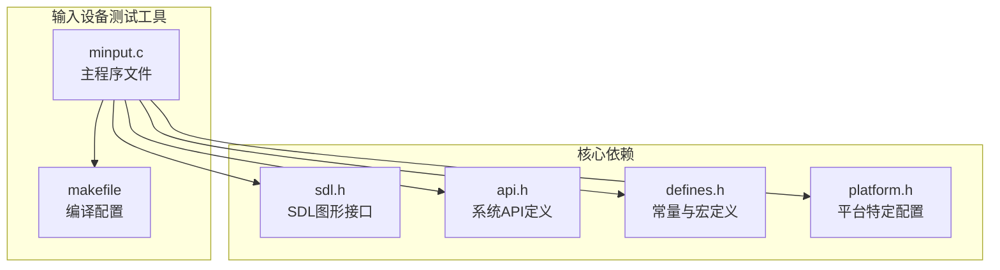
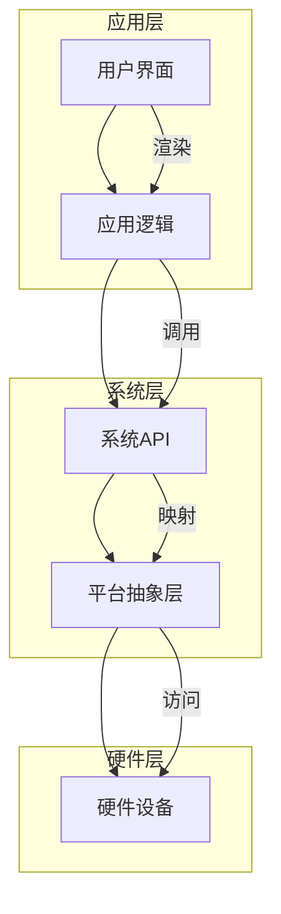
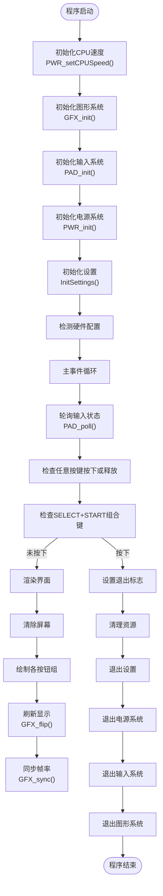
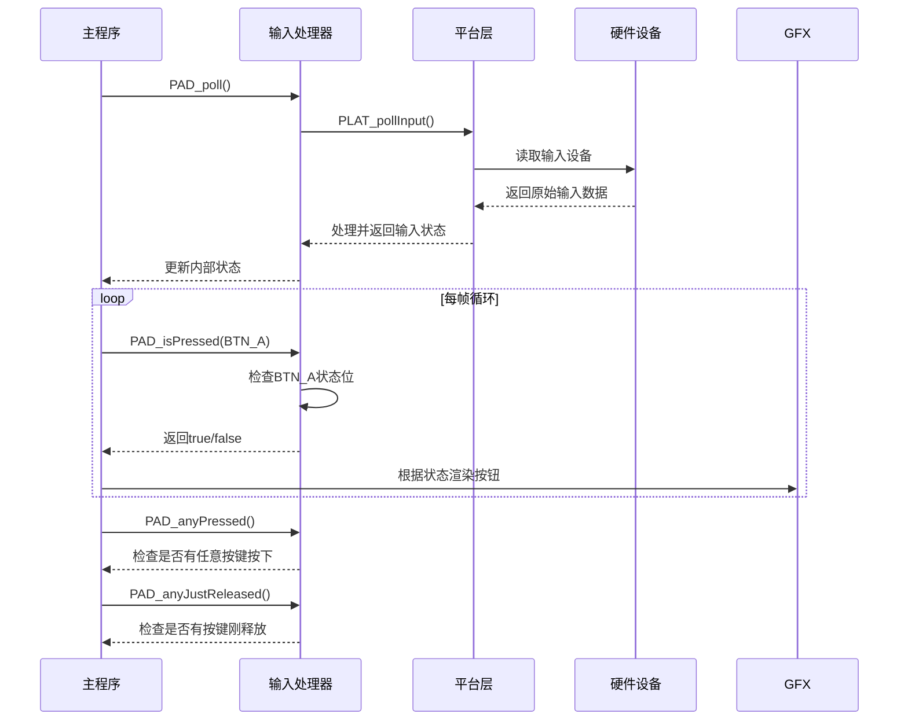
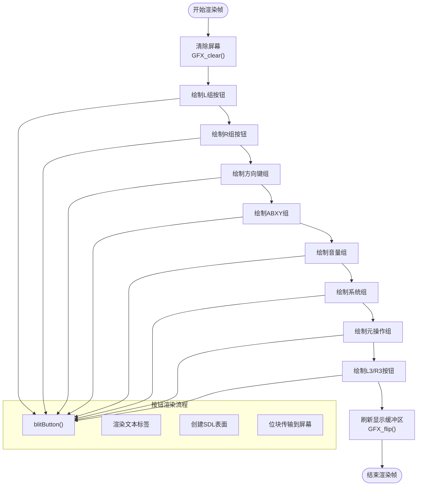
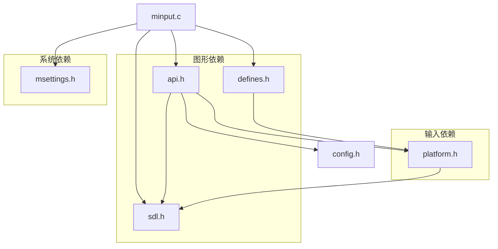

# 输入设备测试工具

<cite>
**本文档引用的文件**   
- [minput.c](file://workspace/tools/minput/minput.c)
- [sdl.h](file://workspace/lib/libcommon/sdl.h)
- [defines.h](file://workspace/lib/libcommon/defines.h)
- [api.h](file://workspace/lib/libcommon/api.h)
- [platform.h](file://workspace/lib/libcommon/platform.h)
- [makefile](file://workspace/tools/minput/makefile)
</cite>

## 目录
1. [简介](#简介)
2. [项目结构](#项目结构)
3. [核心组件](#核心组件)
4. [架构概述](#架构概述)
5. [详细组件分析](#详细组件分析)
6. [依赖分析](#依赖分析)
7. [性能考虑](#性能考虑)
8. [故障排除指南](#故障排除指南)
9. [结论](#结论)

## 简介
输入设备测试工具（minput）是一个用于调试和验证输入设备（如按键、手柄）响应情况的实用程序。该工具通过SDL图形库实时捕获并可视化输入事件，帮助开发者在固件开发和用户故障排查中快速识别输入问题。本工具在NextUI系统中作为诊断工具存在，通过图形界面实时显示各个按钮的状态变化，支持多种输入设备类型，并可根据硬件配置动态调整界面布局。

## 项目结构
输入设备测试工具位于项目仓库的`workspace/tools/minput/`目录下，是NextUI系统工具集的一部分。该工具采用C语言编写，依赖于SDL图形库和系统级输入处理API，通过模块化设计实现了输入事件的捕获、处理和可视化。

**图源**
- [minput.c](file://workspace/tools/minput/minput.c)
- [sdl.h](file://workspace/lib/libcommon/sdl.h)
- [api.h](file://workspace/lib/libcommon/api.h)
- [defines.h](file://workspace/lib/libcommon/defines.h)
- [platform.h](file://workspace/lib/libcommon/platform.h)
- [makefile](file://workspace/tools/minput/makefile)

**本节来源**
- [minput.c](file://workspace/tools/minput/minput.c)
- [makefile](file://workspace/tools/minput/makefile)

## 核心组件
输入设备测试工具的核心功能由`minput.c`文件实现，主要包括输入事件监听循环、按钮状态渲染和退出机制。工具通过调用系统级API初始化图形界面和输入子系统，然后进入主事件循环，持续监控输入设备的状态变化。

工具的核心组件包括：
- **输入事件处理器**：通过`PAD_poll()`函数轮询输入设备状态
- **图形渲染器**：使用SDL库在屏幕上绘制按钮状态
- **状态管理器**：跟踪各个按钮的按下、释放和重复状态
- **配置检测器**：根据硬件配置动态调整界面元素

工具通过`PAD_isPressed()`等API函数查询按钮状态，并根据`platform.h`中的宏定义确定当前设备支持的输入类型，实现了对不同硬件配置的自适应支持。

**本节来源**
- [minput.c](file://workspace/tools/minput/minput.c#L1-L276)
- [api.h](file://workspace/lib/libcommon/api.h#L403-L406)

## 架构概述
输入设备测试工具采用分层架构设计，从底层硬件抽象到上层应用逻辑清晰分离。工具通过平台抽象层访问硬件资源，确保了代码的可移植性和可维护性。

**图源**
- [minput.c](file://workspace/tools/minput/minput.c)
- [api.h](file://workspace/lib/libcommon/api.h)
- [platform.h](file://workspace/lib/libcommon/platform.h)

## 详细组件分析

### 主程序分析
`minput.c`文件的`main()`函数是整个工具的入口点，负责初始化系统资源、设置事件循环并处理用户输入。

**图源**
- [minput.c](file://workspace/tools/minput/minput.c#L50-L276)

**本节来源**
- [minput.c](file://workspace/tools/minput/minput.c#L50-L276)

### 输入事件处理分析
输入事件处理机制是本工具的核心功能，通过`PAD_poll()`和`PAD_isPressed()`等函数实现。

**图源**
- [minput.c](file://workspace/tools/minput/minput.c#L76-L80)
- [api.h](file://workspace/lib/libcommon/api.h#L405-L406)
- [platform.h](file://workspace/lib/libcommon/platform.h)

**本节来源**
- [minput.c](file://workspace/tools/minput/minput.c#L76-L80)
- [api.h](file://workspace/lib/libcommon/api.h#L403-L406)

### 图形渲染分析
图形渲染组件负责在屏幕上可视化显示各个按钮的状态，通过SDL库实现高效的2D图形绘制。

**图源**
- [minput.c](file://workspace/tools/minput/minput.c#L100-L250)
- [api.h](file://workspace/lib/libcommon/api.h#L272-L273)

**本节来源**
- [minput.c](file://workspace/tools/minput/minput.c#L100-L250)

## 依赖分析
输入设备测试工具依赖于多个系统级组件和头文件，形成了清晰的依赖关系链。

**图源**
- [minput.c](file://workspace/tools/minput/minput.c#L1-L10)
- [api.h](file://workspace/lib/libcommon/api.h#L3-L10)
- [defines.h](file://workspace/lib/libcommon/defines.h#L3-L10)
- [platform.h](file://workspace/lib/libcommon/platform.h#L3-L10)

**本节来源**
- [minput.c](file://workspace/tools/minput/minput.c#L1-L10)
- [api.h](file://workspace/lib/libcommon/api.h)
- [defines.h](file://workspace/lib/libcommon/defines.h)
- [platform.h](file://workspace/lib/libcommon/platform.h)

## 性能考虑
输入设备测试工具在设计时考虑了性能优化，通过条件渲染和帧同步机制确保流畅的用户体验。

工具采用"脏标记"（dirty flag）机制，仅在输入状态发生变化时重新渲染界面，避免了不必要的图形处理开销。`dirty`变量在检测到按键状态变化时被设置为1，触发完整的界面重绘；否则调用`GFX_sync()`保持60fps的帧率而不进行重绘。

CPU性能方面，工具通过`PWR_setCPUSpeed(CPU_SPEED_MENU)`将处理器设置为菜单模式的性能水平，在保证响应速度的同时控制功耗。图形渲染使用预定义的资产（如按钮、 pill 形状）和字体缓存，减少了运行时的计算负担。

## 故障排除指南
当输入设备测试工具无法正常工作时，可按照以下步骤进行排查：

1. **检查编译配置**：确保`makefile`正确配置了所有依赖项
2. **验证硬件支持**：确认`platform.h`中的宏定义与实际硬件匹配
3. **检查输入初始化**：确保`PAD_init()`成功初始化输入子系统
4. **验证图形上下文**：确认`GFX_init()`正确创建了SDL图形上下文
5. **测试基本功能**：使用SELECT+START组合键验证退出功能是否正常

常见问题包括：
- 按钮状态不更新：检查`PAD_poll()`是否在主循环中被正确调用
- 界面不显示：验证`GFX_flip()`是否被调用以刷新显示缓冲区
- 特定按钮无响应：检查`platform.h`中对应按钮的宏定义是否正确

**本节来源**
- [minput.c](file://workspace/tools/minput/minput.c#L76-L80)
- [platform.h](file://workspace/lib/libcommon/platform.h)

## 结论
输入设备测试工具（minput）是一个功能完整、架构清晰的诊断工具，为NextUI系统的输入设备调试提供了有力支持。通过SDL图形库和系统级API的结合，工具实现了跨平台的输入事件可视化，帮助开发者快速识别和解决输入相关的问题。

工具的设计体现了良好的软件工程实践：清晰的分层架构、有效的状态管理、合理的性能优化。其模块化设计使得扩展支持新的输入设备类型成为可能，只需在`platform.h`中添加相应的宏定义即可。该工具不仅在固件开发阶段具有重要价值，也为最终用户的故障排查提供了直观的界面支持。