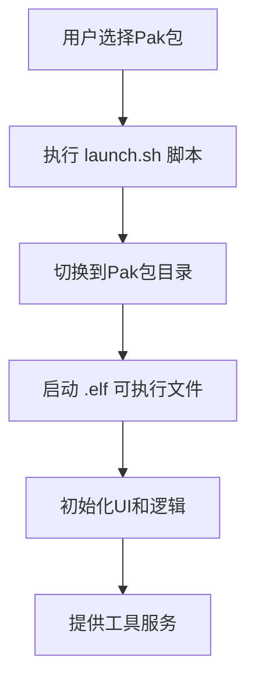
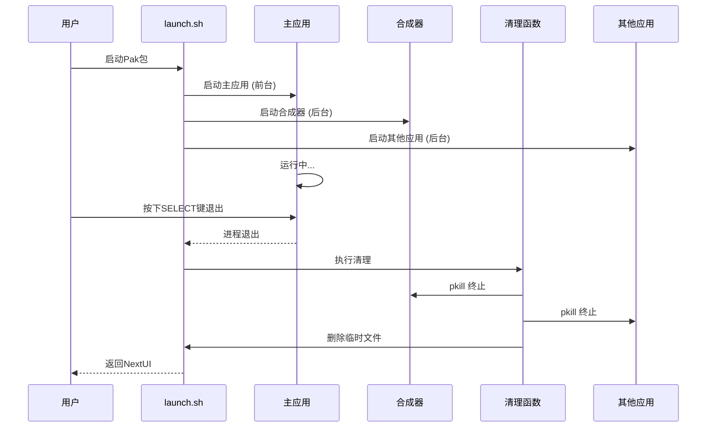
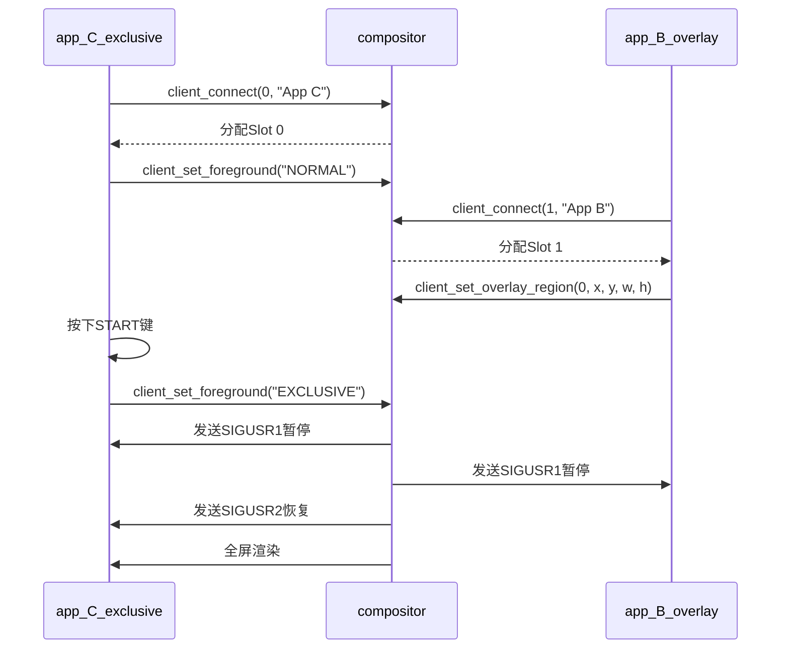

# 工具类Pak包

<cite>
**本文档引用的文件**   
- [FileManager.pak](file://skeleton/EXTRAS/Tools/FileManager.pak/launch.sh)
- [Exclusive.pak](file://skeleton/EXTRAS/Tools/Exclusive.pak/launch.sh)
- [file_manager.c](file://workspace/tools/filemanager/file_manager.c)
- [compositor.c](file://workspace/system/compositor/compositor.c)
- [app_C_exclusive.c](file://workspace/system/compositor/apps/app_C_exclusive.c)
- [app_B_overlay.c](file://workspace/system/compositor/apps/app_B_overlay.c)
- [app_D_overlay.c](file://workspace/system/compositor/apps/app_D_overlay.c)
- [client_lib.c](file://workspace/system/compositor/client_lib/client_lib.c)
- [client_lib.h](file://workspace/system/compositor/client_lib/client_lib.h)
- [protocol.h](file://workspace/system/compositor/protocol.h)
</cite>

## 目录
1. [引言](#引言)
2. [工具类Pak包与模拟器类Pak包的区别](#工具类pak包与模拟器类pak包的区别)
3. [设计目的与通用启动流程](#设计目的与通用启动流程)
4. [生命周期管理](#生命周期管理)
5. [FileManager.pak文件管理功能详解](#filemanagerpak文件管理功能详解)
6. [Exclusive.pak多应用叠加演示功能详解](#exclusivepak多应用叠加演示功能详解)
7. [结论](#结论)

## 引言
工具类Pak包是NextUI系统中一类特殊的应用程序包，与用于运行游戏的模拟器类Pak包不同，它们旨在提供系统级工具和增强的用户界面功能。本文档将深入探讨工具类Pak包的核心特性，重点分析`FileManager.pak`的文件管理能力和`Exclusive.pak`的多应用叠加演示功能，阐明其设计原理、启动流程和生命周期管理机制。

## 工具类Pak包与模拟器类Pak包的区别
工具类Pak包和模拟器类Pak包在功能定位、用户交互和系统集成上存在根本性差异。

**功能定位**：模拟器类Pak包（如`GBA.pak`、`MD.pak`）的核心功能是加载和运行特定平台的游戏ROM，其本质是一个游戏模拟器。而工具类Pak包（如`FileManager.pak`、`Clock.pak`）则提供系统工具或UI增强功能，例如文件浏览、时钟显示或多应用叠加。

**用户交互**：模拟器类Pak包在启动后通常会独占整个屏幕，用户的输入直接传递给模拟器核心以控制游戏。工具类Pak包的交互模式更为多样，`FileManager.pak`提供一个完整的文件浏览器界面，而`Exclusive.pak`则通过一个主应用控制多个叠加应用的显示模式。

**系统集成**：两者都通过`launch.sh`脚本启动，但其底层实现和与系统服务的交互方式不同。模拟器类Pak包主要与音频、视频和输入子系统交互，而工具类Pak包，特别是`Exclusive.pak`，深度依赖于`compositor`（合成器）服务来管理复杂的多应用窗口布局。

**Section sources**
- [FileManager.pak](file://skeleton/EXTRAS/Tools/FileManager.pak/launch.sh)
- [32X.pak](file://skeleton/EXTRAS/Emus/32X.pak/launch.sh)

## 设计目的与通用启动流程
工具类Pak包的设计目的是扩展NextUI系统的功能性，为用户提供便捷的系统工具和创新的交互体验。其通用启动流程遵循一个标准化的模式。

**设计目的**：
1.  **功能扩展**：在不修改核心系统的情况下，通过独立的Pak包添加新功能，如文件管理、电池监控等。
2.  **模块化**：每个工具功能被封装在独立的Pak包中，便于开发、维护和更新。
3.  **用户体验提升**：提供直观、高效的工具，简化用户操作，例如通过`FileManager.pak`直接管理SD卡文件。

**通用启动流程**：
1.  **脚本执行**：当用户选择一个工具类Pak包时，系统会执行其根目录下的`launch.sh`脚本。
2.  **环境准备**：`launch.sh`脚本首先使用`cd $(dirname "$0")`命令切换到Pak包所在的目录，确保后续操作的路径正确。
3.  **程序调用**：脚本随后调用该工具的实际可执行文件（通常为`.elf`文件），并可能将标准输出和错误重定向到日志文件。
4.  **功能执行**：可执行文件启动后，初始化其UI和业务逻辑，开始提供服务。



**Diagram sources**
- [FileManager.pak](file://skeleton/EXTRAS/Tools/FileManager.pak/launch.sh)
- [Exclusive.pak](file://skeleton/EXTRAS/Tools/Exclusive.pak/launch.sh)

**Section sources**
- [FileManager.pak](file://skeleton/EXTRAS/Tools/FileManager.pak/launch.sh)
- [Exclusive.pak](file://skeleton/EXTRAS/Tools/Exclusive.pak/launch.sh)

## 生命周期管理
工具类Pak包的生命周期管理涉及启动、运行和清理三个阶段，其中`Exclusive.pak`的管理尤为复杂，因为它需要协调多个应用程序。

**启动阶段**：如上所述，由`launch.sh`脚本触发，加载主程序。

**运行阶段**：程序在前台运行，响应用户输入。对于`Exclusive.pak`，其主应用`app_C_exclusive.elf`负责监听用户按键（如START键）来改变显示模式。

**清理阶段**：这是确保系统资源不被泄露的关键。`Exclusive.pak`的`launch.sh`脚本中定义了一个`cleanup`函数，并通过`trap`命令将其绑定到`INT`（中断）和`TERM`（终止）信号。当主应用`app_C_exclusive.elf`退出时，脚本会捕获到这一事件，然后执行`cleanup`函数。

`cleanup`函数的核心操作是使用`pkill`命令杀死所有相关的后台进程，包括`compositor.elf`、`app_B_overlay.elf`等，确保所有由该Pak包启动的服务都被彻底终止，最后删除临时的PID文件。



**Diagram sources**
- [Exclusive.pak](file://skeleton/EXTRAS/Tools/Exclusive.pak/launch.sh)

**Section sources**
- [Exclusive.pak](file://skeleton/EXTRAS/Tools/Exclusive.pak/launch.sh)

## FileManager.pak文件管理功能详解
`FileManager.pak`提供了一个功能完整的文件浏览器，允许用户在设备上浏览、复制、移动、重命名和删除文件。

**核心功能**：
-   **目录浏览**：用户可以使用方向键在文件和目录间导航，按`A`键进入目录，按`B`键返回上级目录。
-   **文件操作**：按`Y`键打开上下文菜单，提供“复制”、“剪切”、“粘贴”、“删除”、“重命名”和“新建文件夹”等功能。
-   **排序与显示**：文件列表按目录优先、文件名排序的方式显示，目录以`[D]`标记，文件以`[F]`标记，并显示文件大小。

**技术实现**：
`file_manager.c`是其核心实现。它使用`opendir`和`readdir`等系统调用读取目录内容，并将文件信息存储在`FileInfo`结构体数组中。通过`qsort`函数和`compare_file_info`比较函数实现排序。UI渲染基于SDL库，使用`GFX_blitPill`等函数绘制列表项。上下文菜单的实现通过一个状态机来处理`Y`键的输入，并在`handle_file_operations`函数中根据菜单选择执行相应的文件系统操作（如`rename`、`mkdir`）。

```mermaid
classDiagram
class FileManager {
+screen : SDL_Surface*
+quit_app : bool
+file_list : FileInfo*
+file_count : int
+current_path : char[MAX_PATH]
+selected_index : int
+scroll_offset : int
+show_context_menu : bool
+menu_selected_index : int
+clipboard_op : ClipboardOperation
+clipboard_path : char[MAX_PATH]
+populate_file_list(path)
+free_file_list()
+render_file_list()
+render_context_menu()
+handle_context_menu_input()
+handle_file_operations()
+compare_file_info(a, b)
+format_file_size(size, is_dir)
+show_confirm_dialog(message)
+copy_recursive(src, dst)
+delete_recursive(path)
}
class FileInfo {
+name : char[MAX_PATH]
+is_dir : bool
+size : size_t
}
enum ClipboardOperation {
OP_NONE
OP_COPY
OP_CUT
}
FileManager --> FileInfo : "包含"
```

**Diagram sources**
- [file_manager.c](file://workspace/tools/filemanager/file_manager.c)

**Section sources**
- [file_manager.c](file://workspace/tools/filemanager/file_manager.c)
- [FileManager.pak](file://skeleton/EXTRAS/Tools/FileManager.pak/launch.sh)

## Exclusive.pak多应用叠加演示功能详解
`Exclusive.pak`是一个复杂的演示工具，它展示了NextUI系统强大的多应用叠加和窗口管理能力。

**核心功能**：
-   **多应用叠加**：它同时启动一个主应用（`app_C_exclusive.elf`）和多个叠加应用（`app_B_overlay.elf`, `app_D_overlay.elf`等）。
-   **模式切换**：主应用通过`START`键在两种模式间切换：
    1.  **NORMAL模式**：主应用在前台运行，其他叠加应用在后台暂停。
    2.  **EXCLUSIVE模式**：主应用进入后台，指定的叠加应用（在代码中为`app_C_exclusive`自身）被提升到独占模式，全屏显示。
-   **区域叠加**：叠加应用可以在屏幕的指定区域（如右上角、左上角）渲染内容，实现画中画效果。

**技术实现**：
该功能的核心是`compositor`（合成器）服务。`compositor.c`创建一个共享的EGL/OpenGL上下文，并通过`client_lib`库与各个客户端应用通信。

1.  **客户端连接**：每个应用（`app_B_overlay.c`, `app_C_exclusive.c`等）在启动时调用`client_connect`，向合成器注册自己，并获取一个`ClientConnection`句柄。
2.  **IPC通信**：合成器与客户端之间通过Unix域套接字和共享内存进行通信。共享内存（`ClientControlBlock`）用于传递客户端元数据，套接字用于发送帧数据和管理命令。
3.  **叠加层管理**：客户端通过`client_set_overlay_region`函数向合成器发送`SET_OVERLAY`命令，请求在特定区域显示。合成器在`process_management_command`函数中处理此命令，并在`render_regional_slot`函数中将该客户端的纹理渲染到指定的屏幕区域。
4.  **模式切换**：当主应用调用`client_set_foreground("EXCLUSIVE")`时，它会发送`SET_FOREGROUND`命令。合成器收到后，会暂停所有其他客户端，只恢复指定的独占客户端，从而实现模式切换。



**Diagram sources**
- [compositor.c](file://workspace/system/compositor/compositor.c)
- [app_C_exclusive.c](file://workspace/system/compositor/apps/app_C_exclusive.c)
- [app_B_overlay.c](file://workspace/system/compositor/apps/app_B_overlay.c)
- [client_lib.c](file://workspace/system/compositor/client_lib/client_lib.c)
- [protocol.h](file://workspace/system/compositor/protocol.h)

**Section sources**
- [Exclusive.pak](file://skeleton/EXTRAS/Tools/Exclusive.pak/launch.sh)
- [compositor.c](file://workspace/system/compositor/compositor.c)
- [app_C_exclusive.c](file://workspace/system/compositor/apps/app_C_exclusive.c)

## 结论
工具类Pak包是NextUI系统灵活性和可扩展性的关键体现。`FileManager.pak`通过一个直观的界面为用户提供了强大的文件管理能力，而`Exclusive.pak`则作为一个技术演示，展示了系统底层强大的多应用合成与窗口管理架构。两者都遵循了通过`launch.sh`启动、独立运行和妥善清理的生命周期模式。理解这些Pak包的工作原理，不仅有助于用户更好地利用这些工具，也为开发者创建新的系统级应用提供了宝贵的参考。