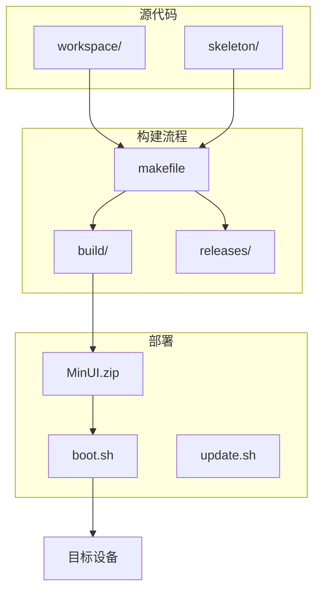
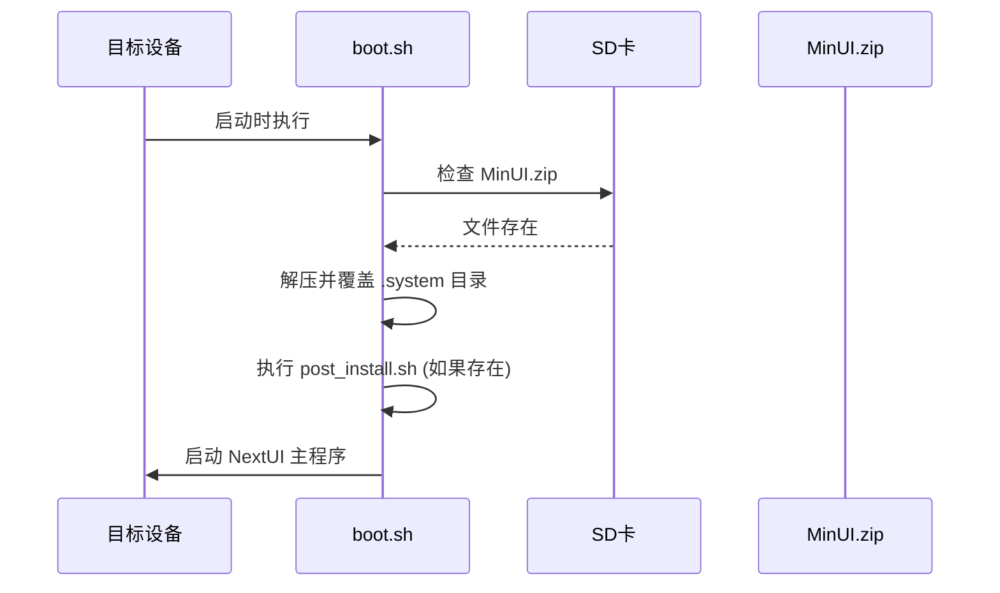

# 快速入门

<cite>
**本文档中引用的文件**   
- [README.md](file://README.md)
- [makefile](file://makefile)
- [workspace/other/install/boot.sh](file://workspace/other/install/boot.sh)
- [workspace/other/install/update.sh](file://workspace/other/install/update.sh)
- [workspace/apps/nextui/nextui.c](file://workspace/apps/nextui/nextui.c)
</cite>

## 目录
1. [项目概述](#项目概述)
2. [项目结构](#项目结构)
3. [构建与编译](#构建与编译)
4. [固件部署](#固件部署)
5. [首次启动与基本操作](#首次启动与基本操作)
6. [常见问题排查](#常见问题排查)

## 项目概述

NextUI 是一个基于 MinUI 的定制固件（CFW），专为 TrimUI Brick 和 Smart Pro 设备设计。它通过重建模拟器引擎核心，解决了原生 MinUI 存在的屏幕撕裂和同步卡顿问题，并引入了大量新功能，如高质量音频、游戏切换器菜单、OpenGL/GPU 加速、WiFi 支持、游戏时间追踪、LED 控制等。

**Section sources**
- [README.md](file://README.md#L1-L147)

## 项目结构

NextUI 项目采用模块化设计，主要目录结构如下：
- `skeleton/`: 包含固件的初始文件结构，编译时会复制到构建目录。
- `workspace/`: 核心源代码目录。
  - `apps/`: 应用程序，如主界面 `nextui` 和基础库 `minarch`。
  - `cores/`: 模拟器核心的源代码。
  - `lib/`: 共享库，如 `libcommon`、`libwifid`。
  - `system/`: 系统级服务和守护进程。
  - `tools/`: 各种工具应用。
- `workspace/other/install/`: 包含设备启动和更新脚本 `boot.sh` 和 `update.sh`。
- `makefile`: 项目的主构建脚本。



**Diagram sources **
- [makefile](file://makefile#L106-L305)
- [workspace/other/install/boot.sh](file://workspace/other/install/boot.sh#L0-L86)

**Section sources**
- [makefile](file://makefile#L1-L105)

## 构建与编译

构建 NextUI 固件需要使用 `makefile` 提供的命令。以下是完整的编译步骤：

1.  **克隆项目仓库**:
    ```bash
    git clone https://github.com/LoveRetro/NextUI.git
    cd NextUI
    ```

2.  **安装依赖**:
    项目依赖 SDL2、libsamplerate 和 sqlite3 等库。在 Ubuntu/Debian 系统上，可以通过以下命令安装：
    ```bash
    sudo apt-get update
    sudo apt-get install libsdl2-dev libsamplerate0-dev libsqlite3-dev
    ```

3.  **执行完整构建**:
    使用 `make all-cores` 命令可以一次性完成所有内容的构建，包括模拟器核心。
    ```bash
    make all-cores
    ```
    此命令会自动执行 `setup`、`build`、`special`、`package` 和 `done` 等目标，最终在 `releases/` 目录下生成 `NextUI-<版本号>-all.zip` 文件。

4.  **构建流程详解**:
    - `setup`: 初始化构建目录，清理旧文件，并从 `skeleton/` 复制初始文件结构。
    - `build`: 编译 `workspace/` 目录下的应用程序、库和系统服务。
    - `cores`: 编译所有模拟器核心（如 fceumm、gambatte 等）。
    - `cpfile`: 将编译好的二进制文件和库复制到构建目录的相应位置。
    - `package`: 将构建好的文件打包成 `MinUI.zip` 更新包，并生成最终的发布压缩包。

**Section sources**
- [makefile](file://makefile#L1-L305)

## 固件部署

构建完成后，需要将生成的固件部署到目标硬件设备上。部署过程主要通过 `boot.sh` 脚本完成。

1.  **准备设备**:
    将目标设备（TrimUI Brick/Smart Pro）通过 USB 线连接到电脑，并确保其处于可被识别的状态。

2.  **复制更新包**:
    将 `releases/` 目录下生成的 `MinUI.zip` 文件复制到设备 SD 卡的根目录。

3.  **触发更新**:
    设备在启动时会自动执行 `boot.sh` 脚本。该脚本会检查 SD 卡根目录是否存在 `MinUI.zip` 文件。
    - 如果存在，脚本会调用 `unzip` 命令解压该文件，覆盖 `.system` 目录下的旧文件，完成固件更新。
    - 如果是首次安装，脚本会创建 `.system` 目录并进行完整安装。

4.  **更新脚本功能**:
    `update.sh` 脚本主要用于处理从旧版本（如 Brick 版本）升级到新版本时的配置文件迁移。它会将旧的配置文件（如 `tg3040`）复制并重命名为新版本兼容的格式（如 `tg5040-brick.cfg`），然后删除旧文件并重启设备。



**Diagram sources **
- [workspace/other/install/boot.sh](file://workspace/other/install/boot.sh#L0-L86)
- [workspace/other/install/update.sh](file://workspace/other/install/update.sh#L0-L54)

**Section sources**
- [workspace/other/install/boot.sh](file://workspace/other/install/boot.sh#L0-L86)
- [workspace/other/install/update.sh](file://workspace/other/install/update.sh#L0-L54)

## 首次启动与基本操作

固件成功部署并首次启动后，您将进入 NextUI 的主界面。

1.  **主界面导航**:
    - 使用方向键 `上/下/左/右` 在游戏列表中移动光标。
    - 按 `A` 键进入选中的文件夹或启动游戏。
    - 按 `B` 键返回上一级目录。

2.  **游戏启动**:
    在游戏列表中选择一个游戏，按 `A` 键即可启动。游戏启动后，按 `Menu` 键可以打开游戏内选项菜单，进行控制、缩放等设置。

3.  **快捷菜单与游戏切换器**:
    - **快捷菜单**: 在主界面或游戏中，短按 `Menu` 键可以打开快捷菜单，提供 WiFi、设置、重启等快捷操作。
    - **游戏切换器**: 在主界面或游戏中，短按 `Select` 键可以打开游戏切换器，快速在最近玩过的游戏之间切换。

4.  **系统设置**:
    在快捷菜单中选择“设置”可以进入系统设置界面，进行显示、音频、LED、网络等各项配置。

**Section sources**
- [README.md](file://README.md#L1-L147)

## 常见问题排查

在构建和使用过程中，可能会遇到一些常见问题，以下是解决方案：

1.  **构建失败**:
    - **错误信息**: `!! 错误：模拟器核心未编译。`
    - **原因**: 执行 `make all` 时，模拟器核心尚未编译。
    - **解决方案**: 改用 `make all-cores` 命令进行完整构建。

2.  **设备无法启动或卡在启动画面**:
    - **检查点**: 确认 `MinUI.zip` 文件已正确放置在 SD 卡根目录。
    - **检查点**: 检查 `boot.sh` 脚本是否具有可执行权限。
    - **解决方案**: 尝试重新烧录固件或检查 SD 卡是否损坏。

3.  **游戏无法启动或运行异常**:
    - **检查点**: 确认游戏 ROM 文件格式正确，并放置在正确的目录下。
    - **检查点**: 检查游戏的核心配置文件（`.cfg`）是否存在且配置正确。
    - **解决方案**: 尝试更新或重新安装对应的模拟器核心。

4.  **WiFi 连接失败**:
    - **检查点**: 在快捷菜单中确认 WiFi 功能已开启。
    - **检查点**: 确认输入的 WiFi 密码正确。
    - **解决方案**: 重启设备或在设置中重置网络配置。

**Section sources**
- [makefile](file://makefile#L1-L305)
- [workspace/other/install/boot.sh](file://workspace/other/install/boot.sh#L0-L86)