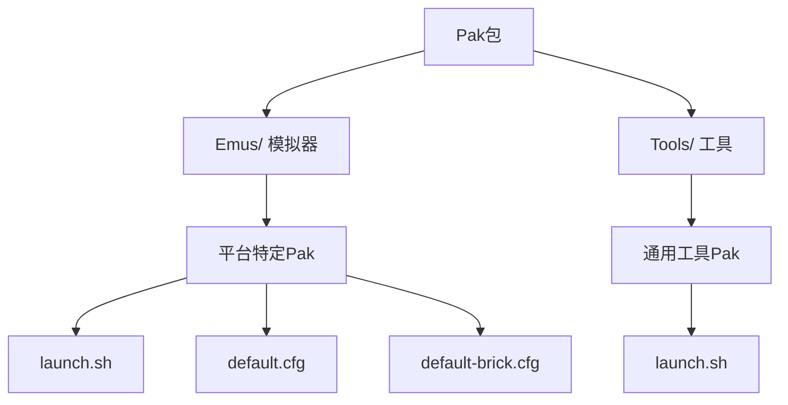
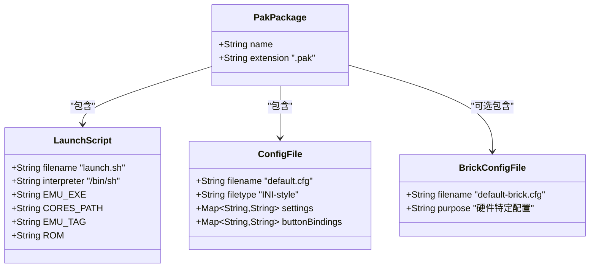
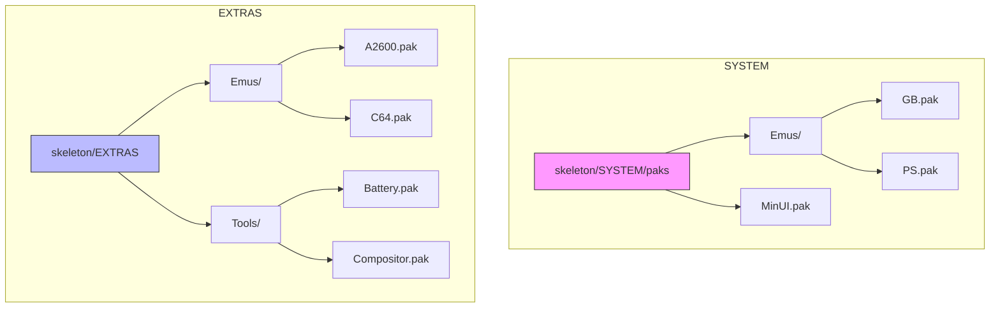
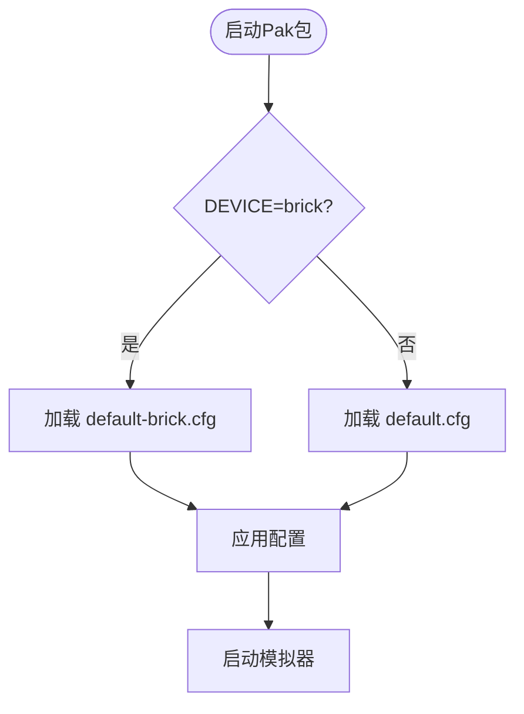
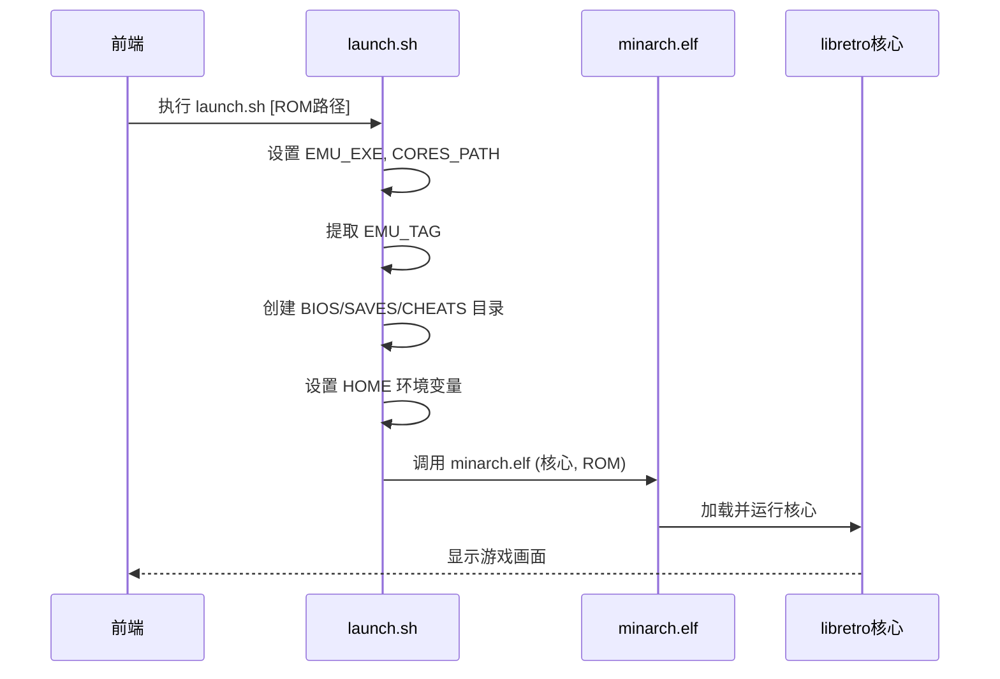

# Pak包结构概述

<cite>
**本文档引用的文件**  
- [PAKS.md](file://PAKS.md)
- [skeleton/EXTRAS/Emus/A2600.pak/launch.sh](file://skeleton/EXTRAS/Emus/A2600.pak/launch.sh)
- [skeleton/EXTRAS/Emus/C64.pak/launch.sh](file://skeleton/EXTRAS/Emus/C64.pak/launch.sh)
- [skeleton/EXTRAS/Emus/C64.pak/default.cfg](file://skeleton/EXTRAS/Emus/C64.pak/default.cfg)
- [skeleton/EXTRAS/Emus/C64.pak/default-brick.cfg](file://skeleton/EXTRAS/Emus/C64.pak/default-brick.cfg)
- [skeleton/SYSTEM/paks/Emus/GB.pak/launch.sh](file://skeleton/SYSTEM/paks/Emus/GB.pak/launch.sh)
- [skeleton/SYSTEM/paks/Emus/GB.pak/default.cfg](file://skeleton/SYSTEM/paks/Emus/GB.pak/default.cfg)
- [skeleton/SYSTEM/paks/Emus/PS.pak/launch.sh](file://skeleton/SYSTEM/paks/Emus/PS.pak/launch.sh)
- [skeleton/SYSTEM/paks/Emus/PS.pak/default-brick.cfg](file://skeleton/SYSTEM/paks/Emus/PS.pak/default-brick.cfg)
- [skeleton/EXTRAS/Tools/Battery.pak/launch.sh](file://skeleton/EXTRAS/Tools/Battery.pak/launch.sh)
- [skeleton/EXTRAS/Tools/Compositor.pak/launch.sh](file://skeleton/EXTRAS/Tools/Compositor.pak/launch.sh)
- [skeleton/SYSTEM/paks/MinUI.pak/launch.sh](file://skeleton/SYSTEM/paks/MinUI.pak/launch.sh)
- [skeleton/SYSTEM/system.cfg](file://skeleton/SYSTEM/system.cfg)
- [skeleton/SYSTEM/system-brick.cfg](file://skeleton/SYSTEM/system-brick.cfg)
</cite>

## 目录
1. [Pak包结构概述](#pak包结构概述)
2. [核心组件详解](#核心组件详解)
3. [EXTRAS与SYSTEM目录布局](#extras与system目录布局)
4. [配置文件差异分析](#配置文件差异分析)
5. [启动脚本工作机制](#启动脚本工作机制)
6. [实际示例分析](#实际示例分析)

## Pak包结构概述

NextUI系统中的Pak包是一种以".pak"为扩展名的特殊文件夹，其核心功能是封装模拟器或工具的运行环境。每个Pak包必须包含一个名为`launch.sh`的启动脚本，这是其作为可执行单元的基础。Pak包主要分为两类：位于`Emus`文件夹中的模拟器包和位于`Tools`文件夹中的工具包。这些包不应放置在SD卡根目录下的隐藏`.system`文件夹中，因为该文件夹会在系统更新时被完全替换。

Pak包具有平台特定性，其内部结构需根据目标设备进行适配。平台文件夹的命名方式多样，可能基于设备型号（如"rgb30"）、内部代号（如"tg5040"）或自定义简称（如"trimui"），且全部为小写字母。系统通过`DEVICE`环境变量来区分同一平台下的不同硬件变体，例如"rg35xxplus"平台下的"cube"和"wide"设备。



**图示来源**
- [PAKS.md](file://PAKS.md)

## 核心组件详解

每个Pak包都必须包含两个核心组件：`launch.sh`启动脚本和`default.cfg`配置文件。这两个组件共同定义了Pak包的行为和配置。

**launch.sh** 是Pak包的入口点，一个标准的Shell脚本，负责初始化环境变量、创建必要的目录结构，并最终调用底层的模拟器核心。脚本通过`EMU_EXE`变量指定要加载的libretro核心名称（不包含`_libretro.so`后缀）。对于捆绑了自定义核心的Pak包，会通过`CORES_PATH=$(dirname "$0")`将核心路径指向自身目录。

**default.cfg** 是Pak包的默认配置文件，存储了模拟器的核心设置和控制器按键映射。配置文件中的`bind`指令定义了物理按键到虚拟按键的映射关系，例如`bind A Button = A`表示将设备的A键映射为游戏中的A按钮。以`-`开头的配置项（如`-gambatte_audio_resampler = sinc`）表示该选项将被设置但不在用户界面中显示，常用于禁用特定平台上性能不佳的功能。



**图示来源**
- [skeleton/EXTRAS/Emus/A2600.pak/launch.sh](file://skeleton/EXTRAS/Emus/A2600.pak/launch.sh)
- [skeleton/EXTRAS/Emus/C64.pak/default.cfg](file://skeleton/EXTRAS/Emus/C64.pak/default.cfg)

## EXTRAS与SYSTEM目录布局

Pak包在`EXTRAS`和`SYSTEM`目录下遵循完全一致的布局规范，确保了系统架构的统一性和可维护性。

`EXTRAS`目录位于`skeleton/EXTRAS`路径下，包含了用户可自定义和扩展的Pak包。其结构清晰地分为`Emus`（模拟器）和`Tools`（工具）两个子目录。`Emus`目录下包含了如`A2600.pak`、`C64.pak`等经典游戏机的模拟器包，而`Tools`目录则包含了`Battery.pak`、`Compositor.pak`等系统工具。

`SYSTEM`目录位于`skeleton/SYSTEM/paks`路径下，包含了系统核心的Pak包。其结构与`EXTRAS`完全镜像，同样包含`Emus`和`MinUI.pak`。`Emus`目录下包含了`GB.pak`、`PS.pak`等核心模拟器，这些是系统运行所必需的基础组件。

这种布局的一致性意味着开发者为`EXTRAS`编写的Pak包可以无缝迁移到`SYSTEM`，反之亦然，极大地简化了开发和维护流程。



**图示来源**
- [project_structure](file://project_structure)

## 配置文件差异分析

`default.cfg`与`default-brick.cfg`是两种不同用途的配置文件，它们的命名和内容反映了对特定硬件变体的支持策略。

**default.cfg** 是通用配置文件，适用于该Pak包支持的所有平台。它包含了模拟器的核心功能设置和标准的按键映射。例如，在`GB.pak`中，`default.cfg`设置了Game Boy的内部调色板和音频重采样器。

**default-brick.cfg** 是针对特定硬件变体（如Trimui Brick）的专用配置文件。当系统检测到`DEVICE="brick"`环境变量时，会优先加载此文件以覆盖`default.cfg`中的设置。例如，在`PS.pak`中，`default-brick.cfg`启用了抖动（dithering）并禁用了显示内部帧率的功能，这些是针对Brick设备的性能优化。

这种双配置机制允许开发者在保持通用配置的同时，为特定硬件提供精细化的调优，实现了配置的灵活性和针对性。



**图示来源**
- [skeleton/EXTRAS/Emus/C64.pak/default.cfg](file://skeleton/EXTRAS/Emus/C64.pak/default.cfg)
- [skeleton/EXTRAS/Emus/C64.pak/default-brick.cfg](file://skeleton/EXTRAS/Emus/C64.pak/default-brick.cfg)
- [skeleton/SYSTEM/paks/Emus/PS.pak/default-brick.cfg](file://skeleton/SYSTEM/paks/Emus/PS.pak/default-brick.cfg)

## 启动脚本工作机制

`launch.sh`脚本作为Pak包的入口点，其工作机制遵循一个标准化的流程，确保了不同Pak包之间的一致性。

脚本首先定义`EMU_EXE`变量来指定要使用的libretro核心。对于使用系统内置核心的Pak包（如`GB.pak`），`CORES_PATH`保持默认；对于捆绑了自定义核心的Pak包（如`A2600.pak`），则通过`CORES_PATH=$(dirname "$0")`将其指向Pak包自身目录。

脚本的核心逻辑位于`###`分隔符之后，这部分是高度标准化的“样板代码”：
1.  **提取标签**：`EMU_TAG=$(basename "$(dirname "$0")" .pak)` 从Pak包文件夹名中提取标签（如"GB"）。
2.  **接收ROM路径**：`ROM="$1"` 接收从前端传递过来的ROM文件路径。
3.  **创建目录**：使用`mkdir -p`命令创建BIOS、存档和金手指文件所需的目录。
4.  **设置环境**：将`HOME`环境变量设置为用户数据路径。
5.  **执行核心**：调用`minarch.elf`加载器，传入核心路径和ROM路径，并将输出重定向到日志文件。

对于Anbernic RG*XX系列设备，由于其默认Shell的限制，日志重定向语法需从`&>`改为`> ... 2>&1`。



**图示来源**
- [skeleton/EXTRAS/Emus/A2600.pak/launch.sh](file://skeleton/EXTRAS/Emus/A2600.pak/launch.sh)
- [skeleton/SYSTEM/paks/Emus/GB.pak/launch.sh](file://skeleton/SYSTEM/paks/Emus/GB.pak/launch.sh)

## 实际示例分析

通过对比`A2600.pak`和`GB.pak`的实现，可以清晰地看到Pak包的共性与定制化逻辑。

**A2600.pak (EXTRAS)**:
```bash
#!/bin/sh
EMU_EXE=stella2014
CORES_PATH=$(dirname "$0") # 使用自定义核心
# ... 标准化样板代码 ...
minarch.elf "$CORES_PATH/${EMU_EXE}_libretro.so" "$ROM" > "$LOGS_PATH/$EMU_TAG.txt" 2>&1
```
此Pak包位于`EXTRAS`，用于Atari 2600模拟。它通过`CORES_PATH=$(dirname "$0")`指明使用自身目录下的`stella2014_libretro.so`核心，日志重定向语法适配了特定设备。

**GB.pak (SYSTEM)**:
```bash
#!/bin/sh
EMU_EXE=gambatte
# ... 标准化样板代码 ...
minarch.elf "$CORES_PATH/${EMU_EXE}_libretro.so" "$ROM" &> "$LOGS_PATH/$EMU_TAG.txt"
```
此Pak包位于`SYSTEM`，用于Game Boy模拟。它依赖系统内置的`gambatte`核心，因此无需重定义`CORES_PATH`，使用了标准的日志重定向语法。

这两个示例展示了开发者如何通过复用标准化的`launch.sh`模板，仅需修改`EMU_EXE`和`CORES_PATH`等少数变量，即可快速为新系统创建Pak包，极大地提高了开发效率。

**本节来源**
- [skeleton/EXTRAS/Emus/A2600.pak/launch.sh](file://skeleton/EXTRAS/Emus/A2600.pak/launch.sh)
- [skeleton/SYSTEM/paks/Emus/GB.pak/launch.sh](file://skeleton/SYSTEM/paks/Emus/GB.pak/launch.sh)
- [skeleton/SYSTEM/paks/Emus/GB.pak/default.cfg](file://skeleton/SYSTEM/paks/Emus/GB.pak/default.cfg)