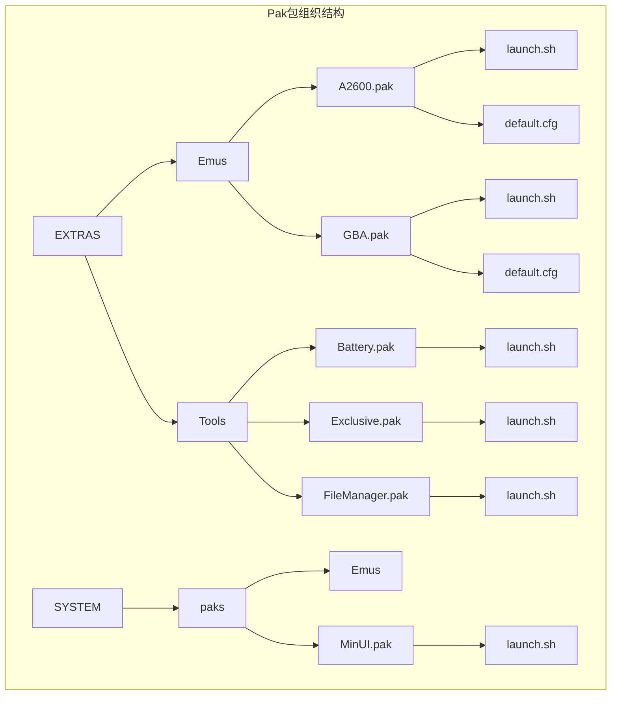
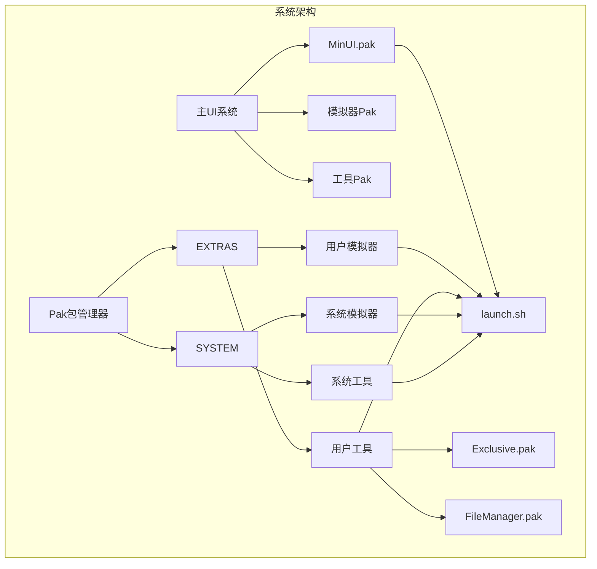
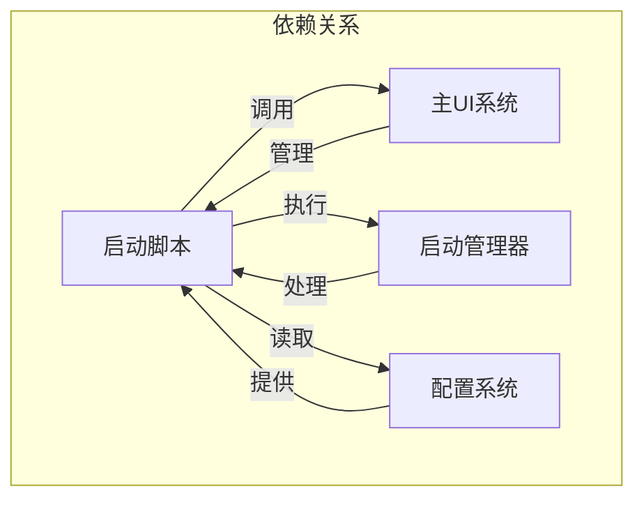

# Pak扩展包

<cite>
**本文档引用的文件**   
- [A2600.pak/launch.sh](file://skeleton/EXTRAS/Emus/A2600.pak/launch.sh)
- [A2600.pak/default.cfg](file://skeleton/EXTRAS/Emus/A2600.pak/default.cfg)
- [GBA.pak/launch.sh](file://skeleton/SYSTEM/paks/Emus/GBA.pak/launch.sh)
- [GBA.pak/default.cfg](file://skeleton/SYSTEM/paks/Emus/GBA.pak/default.cfg)
- [Battery.pak/launch.sh](file://skeleton/EXTRAS/Tools/Battery.pak/launch.sh)
- [MinUI.pak/launch.sh](file://skeleton/SYSTEM/paks/MinUI.pak/launch.sh)
- [old-tv.cfg](file://skeleton/BASE/Shaders/old-tv.cfg)
- [system.cfg](file://skeleton/SYSTEM/system.cfg)
- [PAKS.md](file://PAKS.md)
- [nextui.c](file://workspace/apps/nextui/nextui.c)
- [launcher.c](file://workspace/apps/nextui/launcher.c)
- [uimanager.c](file://workspace/apps/nextui/uimanager.c)
- [globals.h](file://workspace/apps/nextui/include/globals.h)
- [launcher.h](file://workspace/apps/nextui/include/launcher.h)
- [uimanager.h](file://workspace/apps/nextui/include/uimanager.h)
- [Exclusive.pak/launch.sh](file://skeleton/EXTRAS/Tools/Exclusive.pak/launch.sh) - *在提交20d657e中新增*
- [FileManager.pak/launch.sh](file://skeleton/EXTRAS/Tools/FileManager.pak/launch.sh) - *在提交bd90e04中新增*
- [compositor.c](file://workspace/system/compositor/compositor.c) - *在提交20d657e中更新*
- [app_C_exclusive.c](file://workspace/system/compositor/apps/app_C_exclusive.c) - *在提交20d657e中更新*
- [file_manager.c](file://workspace/tools/filemanager/file_manager.c) - *在提交bd90e04中新增*
</cite>

## 更新摘要
**已更改内容**   
- 在“项目结构”部分添加了对新工具包`Exclusive.pak`和`FileManager.pak`的说明
- 在“核心组件”部分扩展了对工具类Pak包的描述
- 新增“工具扩展包详解”章节，详细分析`Exclusive.pak`和`FileManager.pak`
- 更新了“架构概述”中的Mermaid图，以反映新的工具组件
- 更新了“详细组件分析”中的启动脚本示例，包含新的工具包实现
- 在文档引用文件列表中添加了新引入的源文件

## 目录
1. [简介](#简介)
2. [项目结构](#项目结构)
3. [核心组件](#核心组件)
4. [架构概述](#架构概述)
5. [详细组件分析](#详细组件分析)
6. [工具扩展包详解](#工具扩展包详解)
7. [依赖分析](#依赖分析)
8. [性能考虑](#性能考虑)
9. [故障排除指南](#故障排除指南)
10. [结论](#结论)

## 简介
Pak扩展包是NextUI系统中用于扩展模拟器和工具功能的核心机制。它通过简单的目录结构和脚本文件，实现了对各种模拟器和系统工具的无缝集成。本文档将深入分析Pak包的目录结构、启动机制、配置文件格式以及其在系统中的作用，为开发者提供完整的开发指南。

## 项目结构
NextUI项目的Pak扩展包主要分布在两个目录中：`EXTRAS`和`SYSTEM`。`EXTRAS`目录存放用户可自定义的扩展包，而`SYSTEM`目录则包含系统内置的核心功能。每个Pak包都是一个以`.pak`为扩展名的目录，内部包含`launch.sh`启动脚本和`default.cfg`配置文件。



**图示来源**
- [A2600.pak/launch.sh](file://skeleton/EXTRAS/Emus/A2600.pak/launch.sh)
- [A2600.pak/default.cfg](file://skeleton/EXTRAS/Emus/A2600.pak/default.cfg)
- [GBA.pak/launch.sh](file://skeleton/SYSTEM/paks/Emus/GBA.pak/launch.sh)
- [GBA.pak/default.cfg](file://skeleton/SYSTEM/paks/Emus/GBA.pak/default.cfg)
- [Battery.pak/launch.sh](file://skeleton/EXTRAS/Tools/Battery.pak/launch.sh)
- [MinUI.pak/launch.sh](file://skeleton/SYSTEM/paks/MinUI.pak/launch.sh)
- [Exclusive.pak/launch.sh](file://skeleton/EXTRAS/Tools/Exclusive.pak/launch.sh) - *新增*
- [FileManager.pak/launch.sh](file://skeleton/EXTRAS/Tools/FileManager.pak/launch.sh) - *新增*

**本节来源**
- [PAKS.md](file://PAKS.md)

## 核心组件
Pak扩展包的核心组件包括启动脚本`launch.sh`和配置文件`default.cfg`。`launch.sh`负责调用底层模拟器核心并传递参数，而`default.cfg`则定义了图形着色器、输入映射和音频设置等用户界面选项。对于工具类Pak包，如`Exclusive.pak`和`FileManager.pak`，它们可能不包含`default.cfg`文件，其功能主要通过`launch.sh`脚本和可执行文件实现。

**本节来源**
- [A2600.pak/launch.sh](file://skeleton/EXTRAS/Emus/A2600.pak/launch.sh)
- [A2600.pak/default.cfg](file://skeleton/EXTRAS/Emus/A2600.pak/default.cfg)
- [Exclusive.pak/launch.sh](file://skeleton/EXTRAS/Tools/Exclusive.pak/launch.sh)
- [FileManager.pak/launch.sh](file://skeleton/EXTRAS/Tools/FileManager.pak/launch.sh)

## 架构概述
NextUI的Pak扩展包架构采用分层设计，将用户扩展与系统内置功能分离。`EXTRAS`目录下的Pak包允许用户自由添加和修改，而`SYSTEM`目录下的Pak包则由系统维护，确保核心功能的稳定性。



**图示来源**
- [MinUI.pak/launch.sh](file://skeleton/SYSTEM/paks/MinUI.pak/launch.sh)
- [A2600.pak/launch.sh](file://skeleton/EXTRAS/Emus/A2600.pak/launch.sh)
- [Battery.pak/launch.sh](file://skeleton/EXTRAS/Tools/Battery.pak/launch.sh)
- [Exclusive.pak/launch.sh](file://skeleton/EXTRAS/Tools/Exclusive.pak/launch.sh)
- [FileManager.pak/launch.sh](file://skeleton/EXTRAS/Tools/FileManager.pak/launch.sh)

## 详细组件分析
### 启动脚本分析
Pak包的`launch.sh`脚本是其核心执行逻辑。以下是一个典型的启动脚本实现：

```bash
#!/bin/sh

EMU_EXE=stella2014
CORES_PATH=$(dirname "$0")

###############################

EMU_TAG=$(basename "$(dirname "$0")" .pak)
ROM="$1"
mkdir -p "$BIOS_PATH/$EMU_TAG"
mkdir -p "$SAVES_PATH/$EMU_TAG"
mkdir -p "$CHEATS_PATH/$EMU_TAG"
HOME="$USERDATA_PATH"
cd "$HOME"
minarch.elf "$CORES_PATH/${EMU_EXE}_libretro.so" "$ROM" > "$LOGS_PATH/$EMU_TAG.txt" 2>&1
```

该脚本首先定义模拟器可执行文件名称和核心路径，然后创建必要的目录结构，最后调用`minarch.elf`加载指定的Libretro核心并运行ROM文件。

**本节来源**
- [A2600.pak/launch.sh](file://skeleton/EXTRAS/Emus/A2600.pak/launch.sh)
- [GBA.pak/launch.sh](file://skeleton/SYSTEM/paks/Emus/GBA.pak/launch.sh)

### 配置文件分析
Pak包的`default.cfg`文件定义了用户界面的默认设置。以下是一个典型的输入映射配置：

```
bind Up = UP
bind Down = DOWN
bind Left = LEFT
bind Right = RIGHT
bind Select = SELECT
bind Start = START
bind X Button = X
bind Y Button = Y
bind B Button = B
bind A Button = A
bind L1 Button = L1
bind L2 Button = L2
bind R1 Button = R1
bind R2 Button = R2
```

该配置文件使用`bind`指令将模拟器按钮映射到物理控制器的按键上，确保用户操作的一致性。

**本节来源**
- [A2600.pak/default.cfg](file://skeleton/EXTRAS/Emus/A2600.pak/default.cfg)
- [GBA.pak/default.cfg](file://skeleton/SYSTEM/paks/Emus/GBA.pak/default.cfg)

### 图形着色器配置
图形着色器通过`.cfg`文件进行配置，以下是一个典型的旧电视效果配置：

```
minarch_nrofshaders = 2
minarch_shader1 = barrel-distortion.glsl
minarch_shader1_filter = NEAREST
minarch_shader1_srctype = source
minarch_shader1_scaletype = source
minarch_shader1_upscale = screen
minarch_shader2 = res-independent-scanlines.glsl
minarch_shader2_filter = NEAREST
minarch_shader2_srctype = source
minarch_shader2_scaletype = source
minarch_shader2_upscale = screen
```

该配置文件定义了两个着色器层，分别实现桶形失真和独立分辨率扫描线效果，为用户提供复古的视觉体验。

**本节来源**
- [old-tv.cfg](file://skeleton/BASE/Shaders/old-tv.cfg)
- [system.cfg](file://skeleton/SYSTEM/system.cfg)

## 工具扩展包详解
### Exclusive.pak 分析
`Exclusive.pak`是一个新的工具扩展包，用于演示多区域叠加和合成器功能。其`launch.sh`脚本负责启动一个合成器服务和多个客户端应用。

```bash
#!/bin/sh

# 1. 定义日志文件和IPC路径
COMPOSITOR_LOG="./compositor_log.txt"
APP_B_LOG="./app_B_log.txt"
APP_C_LOG="./app_C_log.txt"
# --- 新增: App D 和 E 的日志文件 ---
APP_D_LOG="./app_D_log.txt"
APP_E_LOG="./app_E_log.txt"
COMPOSITOR_PID_FILE="/tmp/compositor.pid"

# 2. 进入.pak包所在的目录
cd $(dirname "$0")

# 3. 清理旧的文件
rm -f $COMPOSITOR_LOG $APP_B_LOG $APP_C_LOG $APP_D_LOG $APP_E_LOG $COMPOSITOR_PID_FILE

# 4. 定义清理函数
cleanup() {
    echo "\n--- Cleaning up background processes... ---"
    # 使用 pkill 更可靠，可以杀死所有实例
    pkill compositor.elf
    pkill app_B_overlay.elf
    pkill app_C_exclusive.elf
    pkill app_D_overlay.elf
    pkill app_E_overlay.elf
    rm -f $COMPOSITOR_PID_FILE
}
trap cleanup INT TERM

# 5. 在后台启动合成器和所有叠加层客户端
echo "Starting compositor service... (Log: $COMPOSITOR_LOG)"
./compositor.elf --home-slot 0 > $COMPOSITOR_LOG 2>&1 &
COMPOSITOR_PID=$!
echo $COMPOSITOR_PID > $COMPOSITOR_PID_FILE
echo "Compositor running with PID: $COMPOSITOR_PID"
sleep 1 

echo "Starting overlay client app_B (slot 1)... (Log: $APP_B_LOG)"
./app_B_overlay.elf 1 > $APP_B_LOG 2>&1 &

# --- 新增: 启动 App D 和 E ---
echo "Starting overlay client app_D (slot 2)... (Log: $APP_D_LOG)"
./app_D_overlay.elf 2 > $APP_D_LOG 2>&1 &

echo "Starting overlay client app_E (slot 3)... (Log: $APP_E_LOG)"
./app_E_overlay.elf 3 > $APP_E_LOG 2>&1 &


# 6. 在前台运行主交互程序 (app_C)
echo "Starting main interactive app_C (slot 0)... (Log: $APP_C_LOG)"
echo "--- Press [START] to switch modes, [SELECT] to exit ---"
./app_C_exclusive.elf 0 > $APP_C_LOG 2>&1

# 7. 当 app_C 退出后，执行清理工作
echo "Main app exited. Cleaning up services..."
cleanup

echo "Cleanup complete. Returning to NextUI."
exit 0
```

该脚本启动了一个`compositor.elf`作为核心服务，并启动了`app_B_overlay.elf`、`app_D_overlay.elf`和`app_E_overlay.elf`作为后台叠加层客户端，最后在前台运行`app_C_exclusive.elf`作为主交互程序。它通过信号陷阱（trap）确保在退出时能正确清理所有后台进程。

**本节来源**
- [Exclusive.pak/launch.sh](file://skeleton/EXTRAS/Tools/Exclusive.pak/launch.sh)
- [compositor.c](file://workspace/system/compositor/compositor.c)
- [app_C_exclusive.c](file://workspace/system/compositor/apps/app_C_exclusive.c)

### FileManager.pak 分析
`FileManager.pak`是一个文件管理工具扩展包，提供了一个简单的文件浏览和管理界面。

```bash
#!/bin/sh

cd $(dirname "$0")

./file_manager.elf &> ./log.txt
```

该脚本非常简洁，它进入Pak包目录后直接执行`file_manager.elf`可执行文件，并将所有输出重定向到`log.txt`日志文件。`file_manager.elf`本身实现了完整的文件管理功能，包括目录浏览、文件操作（复制、剪切、粘贴、删除、重命名、新建文件夹）和上下文菜单。

**本节来源**
- [FileManager.pak/launch.sh](file://skeleton/EXTRAS/Tools/FileManager.pak/launch.sh)
- [file_manager.c](file://workspace/tools/filemanager/file_manager.c)

## 依赖分析
Pak扩展包的实现依赖于NextUI系统的多个核心组件，包括主UI系统、启动管理器和配置系统。这些组件通过清晰的接口进行交互，确保了系统的稳定性和可扩展性。



**图示来源**
- [nextui.c](file://workspace/apps/nextui/nextui.c)
- [launcher.c](file://workspace/apps/nextui/launcher.c)
- [uimanager.c](file://workspace/apps/nextui/uimanager.c)

**本节来源**
- [nextui.c](file://workspace/apps/nextui/nextui.c)
- [launcher.c](file://workspace/apps/nextui/launcher.c)
- [uimanager.c](file://workspace/apps/nextui/uimanager.c)

## 性能考虑
Pak扩展包的设计充分考虑了性能因素。通过使用轻量级的Shell脚本作为启动器，避免了额外的运行时开销。同时，系统通过环境变量和预创建的目录结构，减少了每次启动时的文件系统操作，提高了整体响应速度。

## 故障排除指南
当Pak扩展包无法正常工作时，可以按照以下步骤进行排查：
1. 检查`launch.sh`脚本的权限是否为可执行
2. 确认`default.cfg`文件中的路径和配置项是否正确
3. 查看`$LOGS_PATH/$EMU_TAG.txt`日志文件中的错误信息
4. 验证核心文件是否存在且完整

**本节来源**
- [A2600.pak/launch.sh](file://skeleton/EXTRAS/Emus/A2600.pak/launch.sh)
- [A2600.pak/default.cfg](file://skeleton/EXTRAS/Emus/A2600.pak/default.cfg)

## 结论
Pak扩展包是NextUI系统中实现功能扩展的核心机制。通过简单的目录结构和脚本文件，开发者可以轻松地集成新的模拟器和工具，为用户提供丰富的功能体验。本文档详细介绍了Pak包的结构、实现和使用方法，为开发者提供了完整的开发指南。