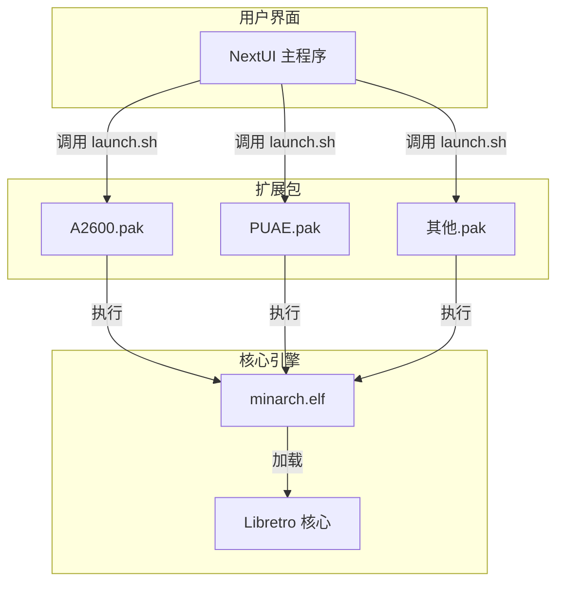
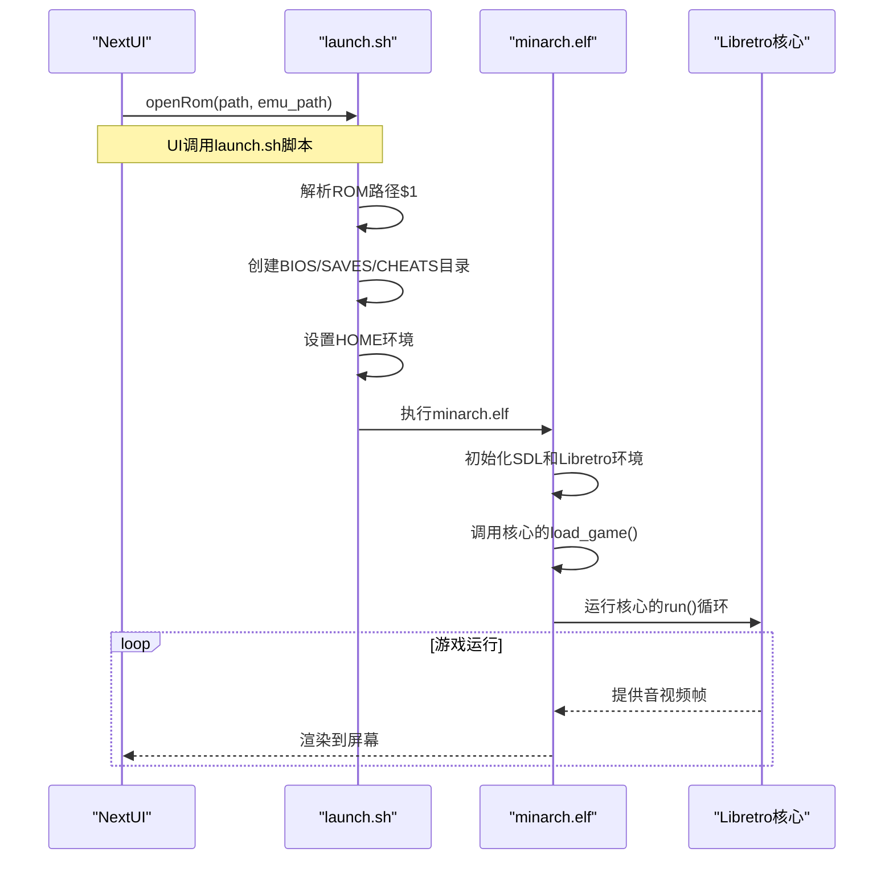
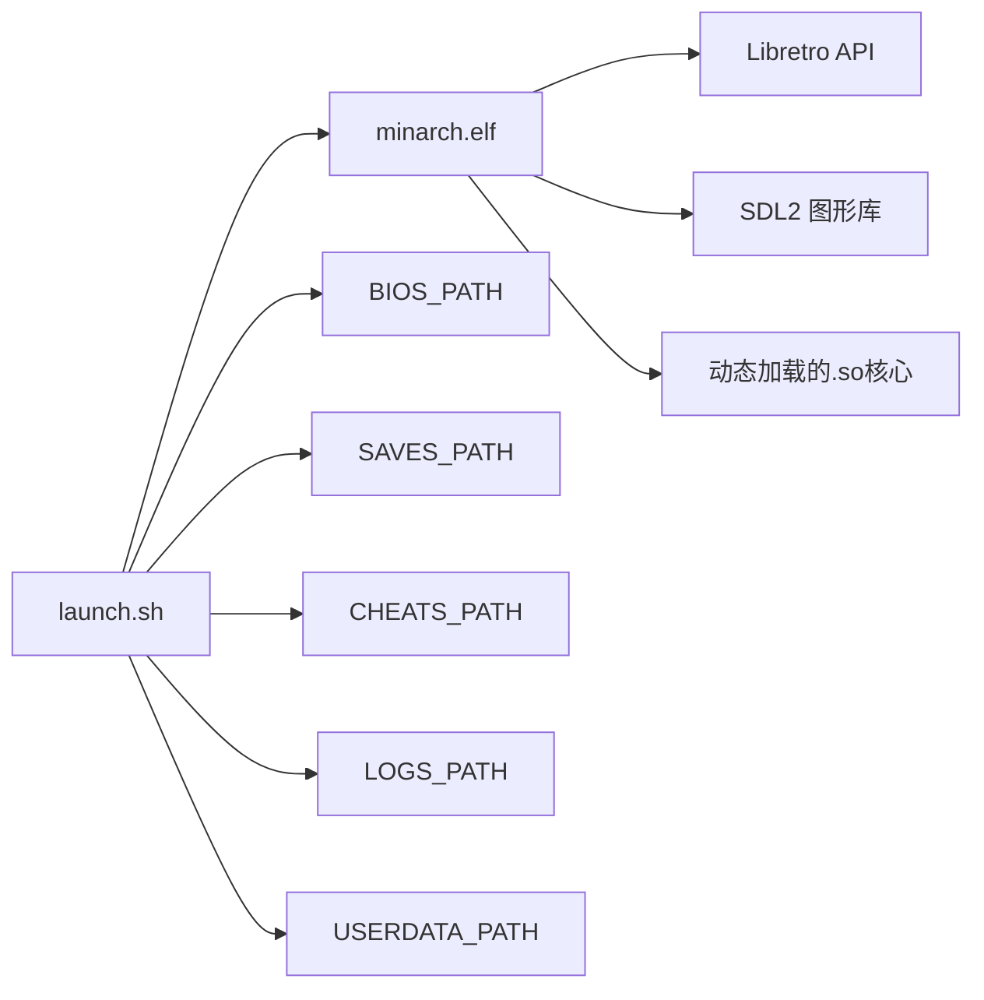

# 启动脚本开发

<cite>
**本文档引用的文件**  
- [A2600.pak/launch.sh](file://skeleton/EXTRAS/Emus/A2600.pak/launch.sh)
- [PUAE.pak/launch.sh](file://skeleton/EXTRAS/Emus/PUAE.pak/launch.sh)
- [launcher.c](file://workspace/apps/nextui/launcher.c)
- [minarch.c](file://workspace/apps/minarch/minarch.c)
</cite>

## 目录
1. [简介](#简介)
2. [项目结构](#项目结构)
3. [核心组件](#核心组件)
4. [架构概览](#架构概览)
5. [详细组件分析](#详细组件分析)
6. [依赖分析](#依赖分析)
7. [性能考量](#性能考量)
8. [故障排除指南](#故障排除指南)
9. [结论](#结论)

## 简介
本文档深入分析NextUI Pak扩展包中的`launch.sh`启动脚本，旨在为开发者提供关于如何构建健壮、可移植且与主UI系统兼容的模拟器启动逻辑的全面指导。通过研究A2600和PUAE等核心的实际实现，我们将揭示从简单ROM加载到复杂环境配置（如Amiga内存设置）的设计模式。文档涵盖命令行参数解析、环境变量配置、错误处理、日志记录以及与底层模拟器二进制文件（`minarch.elf`）的交互机制。

## 项目结构
NextUI项目采用模块化设计，将模拟器核心、工具和系统组件封装在独立的`.pak`扩展包中。这些包位于`skeleton/EXTRAS/Emus/`目录下，每个包包含一个`launch.sh`脚本作为其执行入口。主UI应用（`nextui`）通过调用这些脚本并传递ROM路径来启动模拟器。底层模拟器引擎`minarch.elf`负责加载Libretro核心并执行游戏。



**图示来源**
- [A2600.pak/launch.sh](file://skeleton/EXTRAS/Emus/A2600.pak/launch.sh)
- [launcher.c](file://workspace/apps/nextui/launcher.c)
- [minarch.c](file://workspace/apps/minarch/minarch.c)

**本节来源**
- [skeleton/EXTRAS/Emus/](file://skeleton/EXTRAS/Emus/)
- [workspace/apps/nextui/](file://workspace/apps/nextui/)
- [workspace/apps/minarch/](file://workspace/apps/minarch/)

## 核心组件
`launch.sh`脚本是连接NextUI前端与底层模拟器的核心组件。其主要职责包括：
- **环境初始化**：创建必要的目录（BIOS、存档、金手指）。
- **参数解析**：接收并处理命令行传入的ROM文件路径。
- **环境变量设置**：为模拟器配置运行时环境。
- **核心调用**：执行`minarch.elf`并传递核心路径和ROM路径。
- **日志重定向**：将执行输出重定向到指定日志文件。

**本节来源**
- [A2600.pak/launch.sh](file://skeleton/EXTRAS/Emus/A2600.pak/launch.sh)
- [PUAE.pak/launch.sh](file://skeleton/EXTRAS/Emus/PUAE.pak/launch.sh)

## 架构概览
整个启动流程遵循一个清晰的控制流：用户在NextUI中选择一个游戏，UI应用调用对应模拟器包的`launch.sh`脚本，该脚本配置好环境后启动`minarch.elf`，最终由`minarch.elf`加载Libretro核心并运行游戏。



**图示来源**
- [launcher.c](file://workspace/apps/nextui/launcher.c#L200-L250)
- [A2600.pak/launch.sh](file://skeleton/EXTRAS/Emus/A2600.pak/launch.sh)
- [minarch.c](file://workspace/apps/minarch/minarch.c#L7000-L7400)

## 详细组件分析

### A2600启动脚本分析
Atari 2600的`launch.sh`脚本展示了最基础的启动模式，适用于大多数简单核心。

```bash
#!/bin/sh

EMU_EXE=stella2014
CORES_PATH=$(dirname "$0")

###############################

EMU_TAG=$(basename "$(dirname "$0")" .pak) # 提取包名 (A2600)
ROM="$1" # 接收第一个命令行参数作为ROM路径
mkdir -p "$BIOS_PATH/$EMU_TAG" # 确保BIOS目录存在
mkdir -p "$SAVES_PATH/$EMU_TAG" # 确保存档目录存在
mkdir -p "$CHEATS_PATH/$EMU_TAG" # 确保存档目录存在
HOME="$USERDATA_PATH" # 设置用户数据目录为HOME
cd "$HOME" # 切换到工作目录
minarch.elf "$CORES_PATH/${EMU_EXE}_libretro.so" "$ROM" > "$LOGS_PATH/$EMU_TAG.txt" 2>&1 # 执行核心并重定向日志
```

该脚本的关键特点是简洁和可复用。通过`$(dirname "$0")`获取脚本自身路径，确保了在任何位置调用都能正确找到核心文件。`$1`直接捕获传入的ROM路径。

**本节来源**
- [A2600.pak/launch.sh](file://skeleton/EXTRAS/Emus/A2600.pak/launch.sh)

### PUAE启动脚本分析
尽管当前PUAE脚本与A2600脚本内容相同，但其设计意图是处理更复杂的配置，如Amiga的内存模型和设备类型。一个健壮的PUAE启动脚本应包含以下增强功能：

```bash
#!/bin/sh

EMU_EXE=puae2021
CORES_PATH=$(dirname "$0")

###############################

EMU_TAG=$(basename "$(dirname "$0")" .pak)
ROM="$1"

# 增强的路径验证
if [ ! -f "$ROM" ]; then
    echo "错误: ROM文件不存在: $ROM" >&2
    exit 1
fi

# 创建必要的目录
mkdir -p "$BIOS_PATH/$EMU_TAG"
mkdir -p "$SAVES_PATH/$EMU_TAG"
mkdir -p "$CHEATS_PATH/$EMU_TAG"

# 设置Amiga特定的环境变量
export AMIGA_MODEL="A1200" # 可从配置文件读取
export AMIGA_MEMORY="8MB" # 可配置的内存设置
export LIBRETRO_DEVICE="RETRO_DEVICE_JOYPAD" # 显式设置输入设备

HOME="$USERDATA_PATH"
cd "$HOME"

# 调用核心，包含更详细的日志记录
echo "启动PUAE模拟器: $ROM" > "$LOGS_PATH/$EMU_TAG.txt"
echo "核心路径: $CORES_PATH/${EMU_EXE}_libretro.so" >> "$LOGS_PATH/$EMU_TAG.txt"
minarch.elf "$CORES_PATH/${EMU_EXE}_libretro.so" "$ROM" >> "$LOGS_PATH/$EMU_TAG.txt" 2>&1

# 检查退出状态
if [ $? -ne 0 ]; then
    echo "警告: 模拟器非正常退出" >> "$LOGS_PATH/$EMU_TAG.txt"
fi
```

此增强版本展示了最佳实践，包括错误检查、环境变量配置和详细的日志记录。

**本节来源**
- [PUAE.pak/launch.sh](file://skeleton/EXTRAS/Emus/PUAE.pak/launch.sh)

### 主UI调用机制分析
NextUI的`launcher.c`文件中的`openRom`函数负责启动流程的起点。

```c
void openRom(char* path, char* last) {
    LOG_info("openRom(%s,%s)\n", path, last);
    
    char sd_path[256];
    strcpy(sd_path, path);
    
    char emu_name[256];
    getEmuName(sd_path, emu_name); // 从ROM路径推断模拟器名称
    
    char emu_path[256];
    getEmuPath(emu_name, emu_path); // 构建.pak包的路径
    
    if (!exists(emu_path)) return; // 安全检查
    
    char cmd[256];
    sprintf(cmd, "'%s/launch.sh'", escapeSingleQuotes(emu_path)); // 构造调用launch.sh的命令
    queueNext(cmd); // 将命令排队，准备执行
}
```

此代码展示了如何从用户选择的ROM路径动态确定并调用正确的`launch.sh`脚本。

**本节来源**
- [launcher.c](file://workspace/apps/nextui/launcher.c#L150-L200)

### 底层模拟器引擎分析
`minarch.elf`是整个系统的基石，其`main`函数处理核心的加载和执行。

```c
int main(int argc, char *argv[]) {
    // ... 初始化SDL、日志等 ...
    
    if (argc < 2) {
        LOG_error("用法: %s <核心路径> [ROM路径]\n", argv[0]);
        return -1;
    }
    
    const char* core_path = argv[1]; // 第一个参数是核心.so文件路径
    const char* rom_path = argc > 2 ? argv[2] : NULL; // 第二个参数是ROM路径
    
    // 加载核心动态库
    core.handle = dlopen(core_path, RTLD_LAZY);
    if (!core.handle) {
        LOG_error("无法加载核心: %s\n", dlerror());
        return -1;
    }
    
    // 获取核心函数指针
    core.init = dlsym(core.handle, "retro_init");
    core.get_system_info = dlsym(core.handle, "retro_get_system_info");
    // ... 其他函数指针 ...
    
    // 初始化核心
    core.init();
    
    // 加载游戏
    struct retro_game_info game_info;
    if (rom_path && core.load_game) {
        FILE* f = fopen(rom_path, "rb");
        // ... 读取ROM数据并填充game_info ...
        if (!core.load_game(&game_info)) {
            LOG_error("核心拒绝加载游戏\n");
            return -1;
        }
    }
    
    // 主循环
    while (!quit) {
        core.run(); // 执行核心的一个帧
        // ... 处理输入、渲染 ...
    }
    
    return 0;
}
```

这解释了`launch.sh`脚本为何能通过`minarch.elf <core.so> <rom>`的格式成功启动游戏。

**本节来源**
- [minarch.c](file://workspace/apps/minarch/minarch.c#L7000-L7455)

## 依赖分析
`launch.sh`脚本的成功执行依赖于多个环境变量和系统组件的正确配置。



**图示来源**
- [A2600.pak/launch.sh](file://skeleton/EXTRAS/Emus/A2600.pak/launch.sh)
- [minarch.c](file://workspace/apps/minarch/minarch.c)

**本节来源**
- [minarch.c](file://workspace/apps/minarch/minarch.c)
- [launcher.c](file://workspace/apps/nextui/launcher.c)

## 性能考量
启动脚本本身对性能影响极小，但其设计会影响用户体验。最佳实践包括：
- **最小化脚本执行时间**：避免在`launch.sh`中进行耗时的计算或I/O操作。
- **异步日志记录**：使用`> file.log 2>&1`重定向日志，避免阻塞主进程。
- **预加载优化**：`minarch.elf`在启动时预加载核心和资源，确保游戏能快速开始。

## 故障排除指南
当启动脚本失败时，应按以下步骤排查：

1.  **检查日志文件**：查看`$LOGS_PATH/<EMU_TAG>.txt`中的输出，这是最直接的诊断信息来源。
2.  **验证路径**：确保`ROM`、`CORES_PATH`和所有环境变量（如`BIOS_PATH`）指向正确的、可访问的目录。
3.  **检查文件权限**：确认`launch.sh`脚本和`minarch.elf`具有可执行权限。
4.  **核心兼容性**：确认`.so`核心文件与当前系统架构（ARM, x86等）兼容。
5.  **环境变量**：使用`printenv`在脚本中打印关键环境变量，确认其值正确。

**本节来源**
- [A2600.pak/launch.sh](file://skeleton/EXTRAS/Emus/A2600.pak/launch.sh)
- [minarch.c](file://workspace/apps/minarch/minarch.c)

## 结论
`launch.sh`脚本是NextUI生态系统中一个看似简单却至关重要的组件。它不仅是模拟器的入口点，更是连接用户界面与底层引擎的桥梁。通过遵循本文档中阐述的最佳实践——包括健壮的错误处理、清晰的日志记录、可移植的路径处理和与`minarch.elf`的正确交互——开发者可以创建出稳定、可靠且易于维护的模拟器启动逻辑。未来的开发应着眼于在保持简洁的同时，为更复杂的模拟器（如Amiga）提供灵活的配置能力。