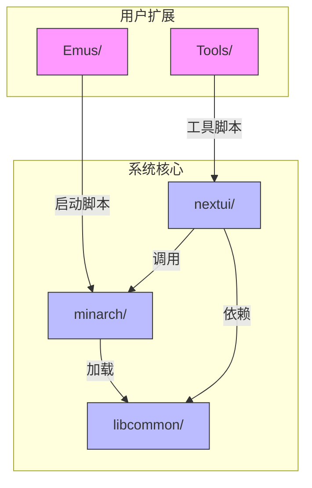

# 模拟器集成模式

<cite>
**本文档引用文件**  
- [PAKS.md](file://PAKS.md)
- [A2600.pak/launch.sh](file://skeleton/EXTRAS/Emus/A2600.pak/launch.sh)
- [PUAE.pak/launch.sh](file://skeleton/EXTRAS/Emus/PUAE.pak/launch.sh)
- [MGBA.pak/launch.sh](file://skeleton/EXTRAS/Emus/MGBA.pak/launch.sh)
- [A2600.pak/default.cfg](file://skeleton/EXTRAS/Emus/A2600.pak/default.cfg)
- [PUAE.pak/default.cfg](file://skeleton/EXTRAS/Emus/PUAE.pak/default.cfg)
- [workspace/apps/minarch/minarch.c](file://workspace/apps/minarch/minarch.c)
- [workspace/apps/nextui/launcher.c](file://workspace/apps/nextui/launcher.c)
- [workspace/lib/libcommon/utils.c](file://workspace/lib/libcommon/utils.c)
</cite>

## 目录
1. [引言](#引言)
2. [项目结构概览](#项目结构概览)
3. [核心集成模式分析](#核心集成模式分析)
4. [libretro核心统一接口机制](#libretro核心统一接口机制)
5. [模拟器与ROM的映射机制](#模拟器与rom的映射机制)
6. [配置与输入管理](#配置与输入管理)
7. [集成检查清单](#集成检查清单)
8. [结论](#结论)

## 引言
本文档旨在深入分析NextUI平台中不同类型模拟器的集成模式。通过对比基于libretro的核心（如MGBA）与原生独立模拟器（如PUAE）在Pak包中的实现差异，揭示其在依赖管理、启动流程和用户体验上的不同策略。文档将详细阐述从轻量级集成（如A2600.pak）到复杂环境配置（如PUAE.pak）的适配方案，并提供一套完整的集成检查清单，以确保所有模拟器在NextUI环境下稳定、高效地运行。

## 项目结构概览
NextUI的项目结构清晰地划分了系统组件、用户扩展和核心代码。主要集成文件位于`skeleton/EXTRAS`目录下，其中`Emus`文件夹存放所有模拟器Pak包，`Tools`文件夹存放系统工具。每个Pak包是一个以`.pak`为扩展名的目录，内含`launch.sh`启动脚本和`default.cfg`配置文件。核心逻辑代码位于`workspace`目录，包括`minarch`前端、`nextui`主应用和`libcommon`等共享库。



**图示来源**
- [PAKS.md](file://PAKS.md)
- [workspace/apps/nextui/nextui.c](file://workspace/apps/nextui/nextui.c)

## 核心集成模式分析

### 基于libretro核心的轻量级集成
此类集成模式利用NextUI内置的libretro核心，通过统一的`minarch.elf`前端加载。其特点是集成简单、维护成本低，且能无缝继承NextUI的全局功能，如快速保存、自动恢复和一致的菜单体验。

以 **A2600.pak** 为例，其`launch.sh`脚本展示了典型的轻量级集成：
```bash
#!/bin/sh
EMU_EXE=stella2014
CORES_PATH=$(dirname "$0")
# ... (boilerplate) ...
minarch.elf "$CORES_PATH/${EMU_EXE}_libretro.so" "$ROM" > "$LOGS_PATH/$EMU_TAG.txt" 2>&1
```
该脚本通过设置`EMU_EXE`变量指定核心名称，并利用`minarch.elf`加载对应的`_libretro.so`动态库。`CORES_PATH`被重定向到Pak包自身目录，允许Pak包携带自定义核心。

**A2600.pak集成模式来源**
- [A2600.pak/launch.sh](file://skeleton/EXTRAS/Emus/A2600.pak/launch.sh)
- [PAKS.md](file://PAKS.md)

### 自包含libretro核心的集成
此模式允许Pak包捆绑其专属的libretro核心，从而支持NextUI基础包未包含的新系统或特定版本的核心。它在保持NextUI高级功能的同时，提供了最大的灵活性。

**MGBA.pak** 是一个典型示例，其`launch.sh`脚本与A2600.pak几乎完全相同，唯一的区别是`EMU_EXE=mgba`。这表明，无论是使用内置核心还是自定义核心，其集成接口是统一的。

**MGBA.pak集成模式来源**
- [MGBA.pak/launch.sh](file://skeleton/EXTRAS/Emus/MGBA.pak/launch.sh)
- [PAKS.md](file://PAKS.md)

### 原生独立模拟器的复杂集成
这种模式直接启动一个独立的可执行文件，绕过`minarch`前端。其优势在于可能获得更高的性能或使用特定功能，但代价是失去NextUI的大部分集成特性，如无法从菜单恢复、无快速保存等。

**PUAE.pak** 的`launch.sh`脚本虽然当前也使用`minarch.elf`加载`puae2021_libretro.so`，但根据文档，它代表了更复杂的配置需求。其`default.cfg`文件包含了比A2600更复杂的按钮映射，暗示了Amiga系统更丰富的输入需求。

**PUAE.pak集成模式来源**
- [PUAE.pak/launch.sh](file://skeleton/EXTRAS/Emus/PUAE.pak/launch.sh)
- [PUAE.pak/default.cfg](file://skeleton/EXTRAS/Emus/PUAE.pak/default.cfg)

## libretro核心统一接口机制
NextUI通过`minarch`应用程序作为libretro核心的统一宿主。其核心加载机制在`minarch.c`中实现，通过动态链接库（dlopen）加载`.so`文件，并解析一系列标准的libretro API函数指针。

```c
void Core_open(const char* core_path, const char* tag_name) {
    core.handle = dlopen(core_path, RTLD_LAZY);
    // 解析libretro API函数指针
    core.init = dlsym(core.handle, "retro_init");
    core.deinit = dlsym(core.handle, "retro_deinit");
    core.get_system_info = dlsym(core.handle, "retro_get_system_info");
    core.load_game = dlsym(core.handle, "retro_load_game");
    core.run = dlsym(core.handle, "retro_run");
    // ... 其他函数 ...
    
    // 设置回调函数
    set_environment_callback(environment_callback);
    set_video_refresh_callback(video_refresh_callback);
    set_input_poll_callback(input_poll_callback);
    // ...
}
```
这一机制确保了所有符合libretro规范的核心都能以相同的方式被加载和运行，实现了“一次集成，处处运行”的效果。`minarch`负责处理图形、音频、输入等系统级交互，并将这些服务通过回调函数提供给核心。

**libretro接口机制来源**
- [workspace/apps/minarch/minarch.c](file://workspace/apps/minarch/minarch.c)

## 模拟器与ROM的映射机制
NextUI通过ROM文件夹名称中的标签来确定使用哪个Pak包。例如，路径`/Roms/Game Boy (GB)/`中的`(GB)`标签会匹配`GB.pak`。

该逻辑在`utils.c`的`getEmuName`函数中实现：
```c
void getEmuName(const char* in_name, char* out_name) {
    char* tmp = strrchr(in_name, '(');
    if (tmp) {
        char* end = strchr(tmp, ')');
        if (end && end != tmp+1) {
            int len = end - tmp - 1;
            strncpy(out_name, tmp+1, len);
            out_name[len] = '\0';
            return;
        }
    }
    strcpy(out_name, "unknown");
}
```
此函数从路径中提取括号内的标签作为模拟器名称。`launcher.c`中的`openRom`函数在启动游戏前会调用`getEmuName`来获取正确的Pak包路径，从而实现自动匹配。

**映射机制来源**
- [workspace/lib/libcommon/utils.c](file://workspace/lib/libcommon/utils.c)
- [workspace/apps/nextui/launcher.c](file://workspace/apps/nextui/launcher.c)

## 配置与输入管理
### 配置文件（default.cfg）
每个Pak包的`default.cfg`文件定义了默认的选项和按钮绑定。NextUI遵循标准实践，仅绑定原始系统控制器上存在的物理按钮。

- **A2600.pak/default.cfg**: 配置简洁，仅包含基本方向键、选择、开始和ABXY按钮。
- **PUAE.pak/default.cfg**: 配置更复杂，映射了Amiga手柄的四个按钮（A/B/X/Y）以及肩部按钮（L1/R1等），反映了更复杂的输入需求。

### 输入设备映射
按钮绑定遵循统一格式：`bind <标签> = <映射>`。标签是菜单中显示的名称，映射是系统定义的按键码（如`UP`, `A`, `L1`）。使用`NONE`表示默认不绑定，保留原始核心的默认设置。

## 集成检查清单
为确保模拟器在NextUI中稳定运行，请遵循以下检查清单：

**依赖声明**
- [ ] 明确声明是使用内置核心、自定义libretro核心还是原生模拟器。
- [ ] 若为自定义核心，确保`.so`文件已正确打包在Pak目录中。

**性能调优**
- [ ] 在`default.cfg`中，使用`-`前缀禁用在目标平台上性能不佳的功能（如`-video_scale_integer = true`）。
- [ ] 对于原生模拟器，考虑使用`syncsettings.elf`守护进程来同步亮度和音量。

**输入设备映射**
- [ ] 使用`bind`指令配置所有必要的按钮。
- [ ] 按钮标签应标准化（如`Up`, `A Button`）。
- [ ] 未使用的按钮应设为`NONE`，并保留原始映射（如`bind Turbo = NONE:T`）。

**状态保存路径配置**
- [ ] 确保`launch.sh`脚本中的`SAVES_PATH`、`BIOS_PATH`和`CHEATS_PATH`目录已通过`mkdir -p`创建。
- [ ] 理解`minarch`会自动管理`$SHARED_USERDATA_PATH/.minui/<EMU_TAG>-<CORE_NAME>/`下的状态保存文件。

**日志与调试**
- [ ] 确保`minarch.elf`的输出被重定向到`"$LOGS_PATH/$EMU_TAG.txt"`，便于问题排查。
- [ ] 对于Anbernic设备，使用`> "$LOGS_PATH/$EMU_TAG.txt" 2>&1`而非`&>`。

## 结论
NextUI提供了灵活且分层的模拟器集成框架。开发者应优先选择基于libretro核心的集成模式，以充分利用平台的高级功能和一致性。轻量级集成（如A2600）适用于简单系统，而自包含核心（如MGBA）则为新系统提供了扩展能力。原生模拟器集成应作为最后的选择，仅在性能或功能需求无法通过libretro满足时使用。通过遵循本文档的分析和检查清单，可以确保任何模拟器都能在NextUI中实现稳定、高效的集成。