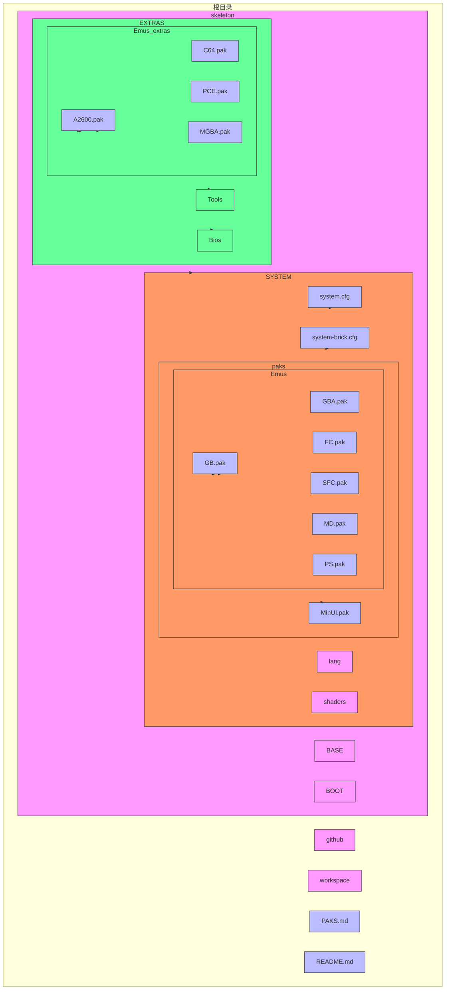
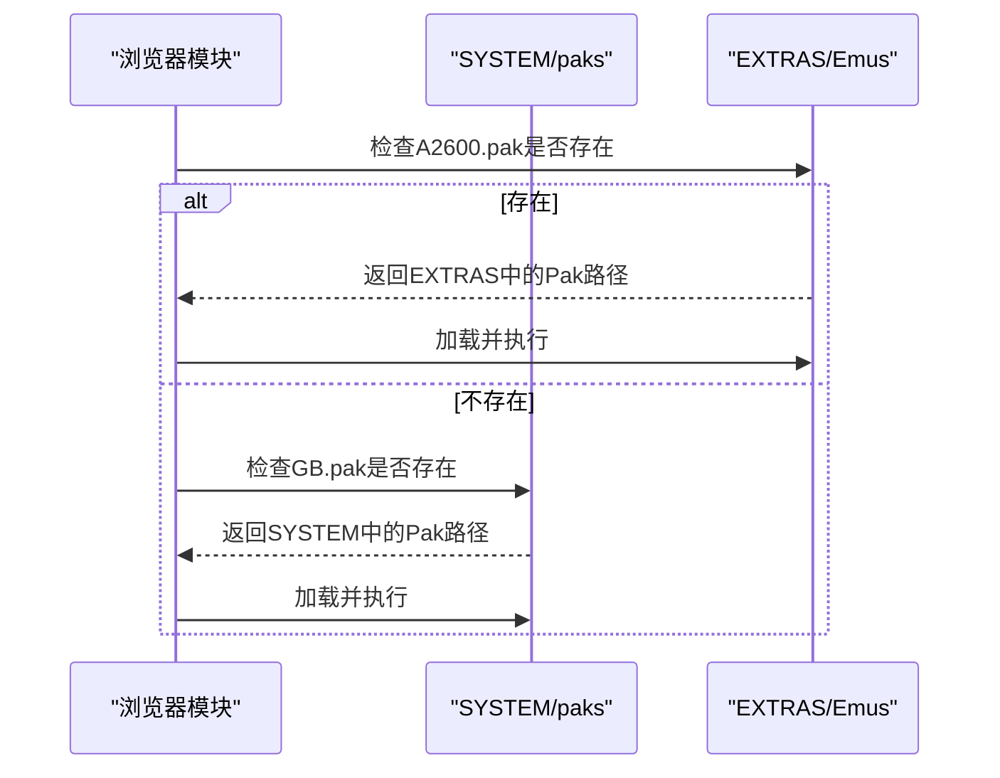

# 系统与扩展Pak包对比

<cite>
**本文档引用文件**   
- [PAKS.md](file://PAKS.md)
- [defines.h](file://workspace/lib/libcommon/defines.h)
- [browser.c](file://workspace/apps/nextui/browser.c)
- [GB.pak/launch.sh](file://skeleton/SYSTEM/paks/Emus/GB.pak/launch.sh)
- [A2600.pak/launch.sh](file://skeleton/EXTRAS/Emus/A2600.pak/launch.sh)
- [GB.pak/default.cfg](file://skeleton/SYSTEM/paks/Emus/GB.pak/default.cfg)
- [A2600.pak/default.cfg](file://skeleton/EXTRAS/Emus/A2600.pak/default.cfg)
- [PS.pak/default-brick.cfg](file://skeleton/SYSTEM/paks/Emus/PS.pak/default-brick.cfg)
- [C128.pak/default-brick.cfg](file://skeleton/EXTRAS/Emus/C128.pak/default-brick.cfg)
- [system.cfg](file://skeleton/SYSTEM/system.cfg)
- [system-brick.cfg](file://skeleton/SYSTEM/system-brick.cfg)
</cite>

## 目录
1. [引言](#引言)
2. [项目结构分析](#项目结构分析)
3. [核心组件分析](#核心组件分析)
4. [系统与扩展Pak包架构对比](#系统与扩展pak包架构对比)
5. [详细组件分析](#详细组件分析)
6. [依赖关系分析](#依赖关系分析)
7. [配置策略与优化](#配置策略与优化)
8. [开发指导与最佳实践](#开发指导与最佳实践)
9. [结论](#结论)

## 引言
本文档旨在深入分析NextUI系统中SYSTEM与EXTRAS目录下的Pak扩展包，详细阐述系统内置核心功能与用户可选扩展模拟器之间的技术差异。通过对比两者在更新机制、存储位置和加载优先级上的不同，结合GB.pak与A2600.pak的文件结构分析，揭示其技术实现的一致性与差异性。文档还将指导开发者如何创建既符合系统标准又能作为独立扩展分发的Pak包，为NextUI生态的扩展开发提供全面的技术参考。

## 项目结构分析
NextUI项目采用模块化设计，核心功能与扩展功能分离。系统核心功能存储于SYSTEM目录，而用户可选的扩展功能则位于EXTRAS目录。这种设计确保了系统稳定性与用户扩展性的平衡。



**图示来源**
- [PAKS.md](file://PAKS.md)
- [defines.h](file://workspace/lib/libcommon/defines.h)

## 核心组件分析
NextUI的核心组件包括系统级Pak包、扩展Pak包、核心加载器和配置管理系统。系统级Pak包（如GB.pak）位于SYSTEM/paks/Emus目录，随固件预装，代表核心支持的模拟器。扩展Pak包（如A2600.pak）位于EXTRAS/Emus目录，代表用户可选的扩展功能。核心加载器通过minarch.elf执行Pak包中的launch.sh脚本，而配置管理系统则通过default.cfg和default-brick.cfg文件管理模拟器设置。

**中文分析**
- **系统级Pak包**: 位于SYSTEM/paks/Emus，如GB.pak、GBA.pak，是系统内置的核心功能。
- **扩展Pak包**: 位于EXTRAS/Emus，如A2600.pak、C64.pak，是用户可选的扩展功能。
- **核心加载器**: minarch.elf，负责加载和执行libretro核心。
- **配置管理系统**: 通过default.cfg和default-brick.cfg管理模拟器配置。

**中文来源**
- [GB.pak/launch.sh](file://skeleton/SYSTEM/paks/Emus/GB.pak/launch.sh)
- [A2600.pak/launch.sh](file://skeleton/EXTRAS/Emus/A2600.pak/launch.sh)

## 系统与扩展Pak包架构对比
系统Pak包与扩展Pak包在架构上遵循相同的基本模式，但存在关键差异。系统Pak包存储在SYSTEM目录，随固件更新而替换，确保了核心功能的稳定性和一致性。扩展Pak包存储在EXTRAS目录，用户可自由添加或移除，提供了高度的灵活性和可扩展性。

### 存储位置与更新机制
系统Pak包位于`/.system/paks/Emus`目录，该目录在固件更新时会被完全替换，因此系统包具有最高的更新优先级和稳定性。扩展Pak包位于SD卡根目录的`Emus`文件夹，不受系统更新影响，允许用户独立管理扩展功能。

```mermaid
graph TD
A[用户设备] --> B[SD卡]
B --> C[/.system]
B --> D[Emus]
B --> E[Tools]
C --> F[paks]
F --> G[Emus]
G --> H[GB.pak]
G --> I[GBA.pak]
D --> J[A2600.pak]
D --> K[C64.pak]
C --> L[system.cfg]
C --> M[system-brick.cfg]
style C fill:#f96,stroke:#333
style D fill:#6f9,stroke:#333
style E fill:#6f9,stroke:#333
style F fill:#f96,stroke:#333
style G fill:#f96,stroke:#333
style H fill:#bbf,stroke:#333
style I fill:#bbf,stroke:#333
style J fill:#bbf,stroke:#333
style K fill:#bbf,stroke:#333
style L fill:#bbf,stroke:#333
style M fill:#bbf,stroke:#333
```

**图示来源**
- [defines.h](file://workspace/lib/libcommon/defines.h#L21-L22)
- [PAKS.md](file://PAKS.md#L4-L6)

### 加载优先级与路径解析
Pak包的加载优先级由代码中的路径搜索顺序决定。系统首先检查EXTRAS/Emus目录，然后是SYSTEM/paks/Emus目录。这种设计允许用户通过在EXTRAS目录放置同名Pak包来覆盖系统默认行为。



**图示来源**
- [browser.c](file://workspace/apps/nextui/browser.c#L30-L45)

## 详细组件分析
### GB.pak系统包分析
GB.pak是系统内置的Game Boy模拟器包，位于SYSTEM/paks/Emus目录。其技术实现体现了系统核心功能的标准化和优化。

#### 启动脚本分析
GB.pak的启动脚本`launch.sh`展示了系统包的标准启动流程：

```bash
#!/bin/sh

EMU_EXE=gambatte

###############################

EMU_TAG=$(basename "$(dirname "$0")" .pak)
ROM="$1"
mkdir -p "$BIOS_PATH/$EMU_TAG"
mkdir -p "$SAVES_PATH/$EMU_TAG"
mkdir -p "$CHEATS_PATH/$EMU_TAG"
HOME="$USERDATA_PATH"
cd "$HOME"
minarch.elf "$CORES_PATH/${EMU_EXE}_libretro.so" "$ROM" &> "$LOGS_PATH/$EMU_TAG.txt"
```

**关键分析点**:
- **EMU_EXE**: 指定使用的libretro核心为gambatte。
- **CORES_PATH**: 继承自系统环境变量，指向预装的核心库。
- **日志重定向**: 使用`&>`将输出重定向到日志文件，捕获所有输出流。

**中文来源**
- [GB.pak/launch.sh](file://skeleton/SYSTEM/paks/Emus/GB.pak/launch.sh)

#### 配置文件分析
GB.pak的`default.cfg`文件包含针对Game Boy的特定配置：

```ini
gambatte_gb_colorization = internal
gambatte_gb_internal_palette = TWB64 - Pack 1
gambatte_gb_palette_twb64_1 = TWB64 038 - Pokemon mini Ver.
gambatte_gb_bootloader = disabled
-gambatte_audio_resampler = sinc

bind Up = UP
bind Down = DOWN
bind Left = LEFT
bind Right = RIGHT
bind Select = SELECT
bind Start = START
bind A Button = A
bind B Button = B
bind A Turbo = NONE:X
bind B Turbo = NONE:Y
bind Prev. Palette = NONE:L1
bind Next Palette = NONE:R1
```

**配置特点**:
- **核心特定设置**: 配置了gambatte核心的内部调色板和颜色化选项。
- **输入绑定**: 定义了标准的Game Boy按钮映射。
- **隐藏选项**: 使用`-`前缀禁用音频重采样功能，可能出于性能考虑。

**中文来源**
- [GB.pak/default.cfg](file://skeleton/SYSTEM/paks/Emus/GB.pak/default.cfg)

### A2600.pak扩展包分析
A2600.pak是用户可选的Atari 2600模拟器包，位于EXTRAS/Emus目录。其技术实现展示了扩展包的灵活性和独立性。

#### 启动脚本分析
A2600.pak的启动脚本`launch.sh`与系统包类似，但有一个关键差异：

```bash
#!/bin/sh

EMU_EXE=stella2014
CORES_PATH=$(dirname "$0")

###############################

EMU_TAG=$(basename "$(dirname "$0")" .pak)
ROM="$1"
mkdir -p "$BIOS_PATH/$EMU_TAG"
mkdir -p "$SAVES_PATH/$EMU_TAG"
mkdir -p "$CHEATS_PATH/$EMU_TAG"
HOME="$USERDATA_PATH"
cd "$HOME"
minarch.elf "$CORES_PATH/${EMU_EXE}_libretro.so" "$ROM" > "$LOGS_PATH/$EMU_TAG.txt" 2>&1
```

**关键差异**:
- **CORES_PATH重定义**: `CORES_PATH=$(dirname "$0")`将核心路径指向Pak包自身目录，允许扩展包携带自己的核心库。
- **日志重定向语法**: 使用`> ... 2>&1`而非`&>`，这是为了兼容某些设备的shell环境。

**中文来源**
- [A2600.pak/launch.sh](file://skeleton/EXTRAS/Emus/A2600.pak/launch.sh)

#### 配置文件分析
A2600.pak的`default.cfg`文件相对简单，仅包含输入绑定：

```ini
bind Up = UP
bind Down = DOWN
bind Left = LEFT
bind Right = RIGHT
bind Select = SELECT
bind Start = START
bind X Button = X
bind Y Button = Y
bind B Button = B
bind A Button = A
bind L1 Button = L1
bind L2 Button = L2
bind R1 Button = R1
bind R2 Button = R2
```

**配置特点**:
- **最小化配置**: 仅定义必要的输入映射，不包含核心特定设置。
- **通用性**: 配置适用于大多数Atari 2600游戏，不进行深度优化。

**中文来源**
- [A2600.pak/default.cfg](file://skeleton/EXTRAS/Emus/A2600.pak/default.cfg)

## 依赖关系分析
Pak包的依赖关系主要体现在核心库的加载路径和系统环境变量的使用上。系统包依赖于预装在`/.system/bin`目录下的核心库，而扩展包可以依赖于自身携带的核心库或系统预装库。

```mermaid
graph TD
Pak[.pak包] --> |launch.sh| Shell[Shell环境]
Shell --> |CORES_PATH| CorePath[核心库路径]
CorePath --> |系统包| SystemCore[/.system/bin]
CorePath --> |扩展包| PakCore[.pak包内]
Shell --> |BIOS_PATH| Bios[BIOS文件]
Shell --> |SAVES_PATH| Saves[存档文件]
Shell --> |CHEATS_PATH| Cheats[金手指文件]
Shell --> |USERDATA_PATH| UserData[用户数据]
Shell --> |LOGS_PATH| Logs[日志文件]
style SystemCore fill:#f96,stroke:#333
style PakCore fill:#6f9,stroke:#333
style Bios fill:#bbf,stroke:#333
style Saves fill:#bbf,stroke:#333
style Cheats fill:#bbf,stroke:#333
style UserData fill:#bbf,stroke:#333
style Logs fill:#bbf,stroke:#333
```

**图示来源**
- [defines.h](file://workspace/lib/libcommon/defines.h)
- [browser.c](file://workspace/apps/nextui/browser.c)

## 配置策略与优化
### 系统级优化配置
系统Pak包可能包含针对特定硬件的优化配置，通过`default-brick.cfg`文件实现。例如，PS.pak的`default-brick.cfg`文件包含针对特定设备的性能优化：

```ini
-minarch_prevent_tearing = Strict
-pcsx_rearmed_display_internal_fps = disabled
-pcsx_rearmed_show_input_settings = disabled
pcsx_rearmed_dithering = enabled

minarch_gamepad_type = 1
bind Up = UP
bind Down = DOWN
bind Left = LEFT
bind Right = RIGHT
bind Select = SELECT
bind Start = START
bind Circle = A
bind Cross = B
bind Triangle = X
bind Square = Y
bind L1 Button = L1
bind R1 Button = R1
bind L2 Button = L2
bind R2 Button = R2
```

**优化特点**:
- **性能优化**: 禁用内部FPS显示和输入设置显示，减少CPU负载。
- **视觉优化**: 启用抖动以改善画面质量。
- **防撕裂**: 启用严格的防撕裂模式，确保画面流畅。

**中文来源**
- [PS.pak/default-brick.cfg](file://skeleton/SYSTEM/paks/Emus/PS.pak/default-brick.cfg)

### 扩展包硬件优化
扩展包同样可以使用`default-brick.cfg`进行硬件优化。例如，C128.pak的`default-brick.cfg`文件：

```ini
minarch_screen_scaling = Fullscreen
```

**优化特点**:
- **屏幕缩放**: 强制全屏显示，适配特定设备的屏幕比例。

**中文来源**
- [C128.pak/default-brick.cfg](file://skeleton/EXTRAS/Emus/C128.pak/default-brick.cfg)

### 系统级配置文件
系统级配置文件`system.cfg`和`system-brick.cfg`为所有Pak包提供全局默认设置：

```ini
minarch_screen_scaling = Fullscreen
minarch_nrofshaders = 0
minarch_shader1 = stock.glsl
minarch_shader1_filter = NEAREST
...
-minarch_prevent_tearing = Strict
-minarch_thread_video = Off
```

**配置特点**:
- **全局缩放**: 默认全屏显示。
- **着色器设置**: 默认不使用着色器。
- **性能优化**: 禁用视频线程，可能为了稳定性。

**中文来源**
- [system.cfg](file://skeleton/SYSTEM/system.cfg)
- [system-brick.cfg](file://skeleton/SYSTEM/system-brick.cfg)

## 开发指导与最佳实践
### 创建兼容的Pak包
开发者应遵循以下最佳实践来创建既兼容系统标准又能作为独立扩展分发的Pak包：

1. **命名规范**: 使用大写字母的标签名，优先采用RetroArch或EmulationStation等前端的通用缩写。
2. **启动脚本**: 遵循标准的`launch.sh`模板，仅在需要时重定义`CORES_PATH`。
3. **配置文件**: 仅包含用户自定义的设置，删除未修改的选项。
4. **输入绑定**: 仅绑定原始系统物理控制器上存在的按钮。
5. **日志记录**: 正确处理日志重定向，兼容不同设备的shell环境。

### 三种Pak包类型
根据PAKS.md文档，存在三种基本类型的模拟器Pak包：

1. **复用系统核心型**: 使用系统预装的libretro核心，仅自定义默认选项。例如GG.pak使用picodrive核心。
2. **自带核心型**: 捆绑自己的libretro核心，支持新系统同时保持NextUI集成。例如MGBA.pak。
3. **独立模拟器型**: 启动独立的模拟器程序，性能可能更高但失去NextUI集成。应作为最后选择。

**中文来源**
- [PAKS.md](file://PAKS.md#L20-L40)

## 结论
系统Pak包与扩展Pak包在技术实现上保持高度一致性，均采用`.pak`目录结构和`launch.sh`启动脚本。主要差异体现在存储位置、更新机制和加载优先级上。系统包位于`/.system`目录，随固件更新而替换，确保核心功能的稳定性。扩展包位于SD卡根目录，允许用户自由管理，提供扩展灵活性。开发者在创建Pak包时，应遵循系统标准，合理利用`default.cfg`和`default-brick.cfg`进行配置，既能保证兼容性，又能实现针对特定硬件的优化。通过理解这些差异和最佳实践，开发者可以创建出高质量的扩展包，丰富NextUI的生态系统。