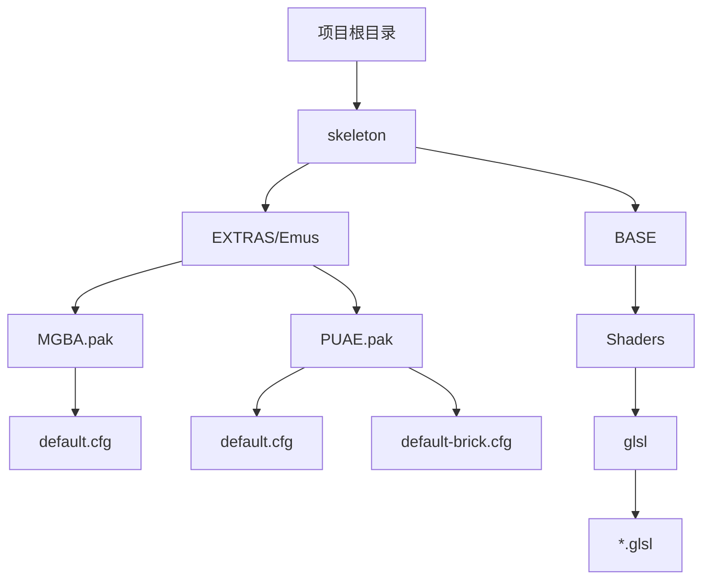
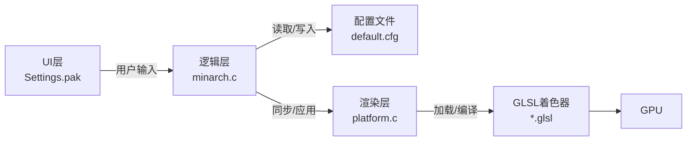
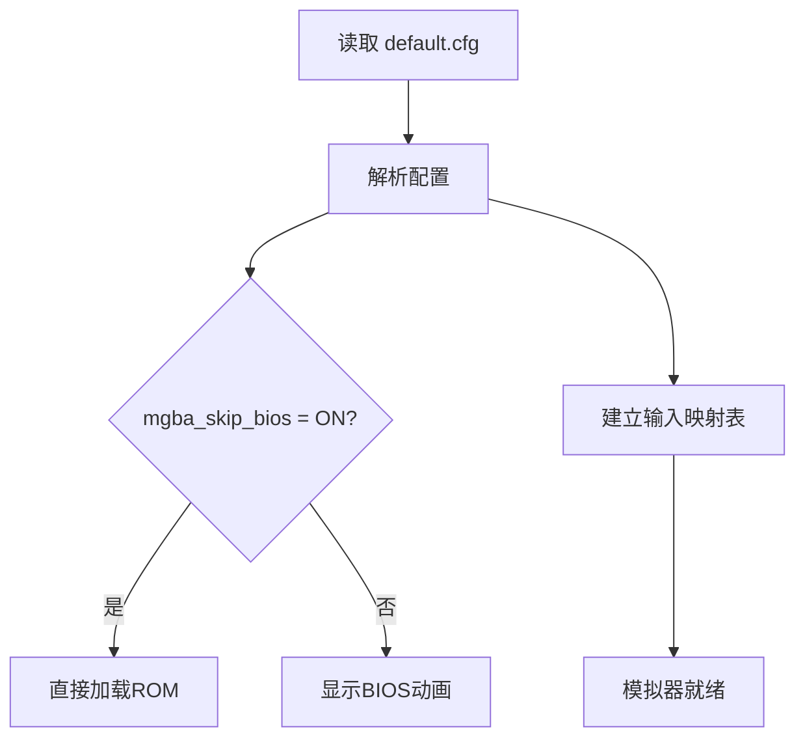
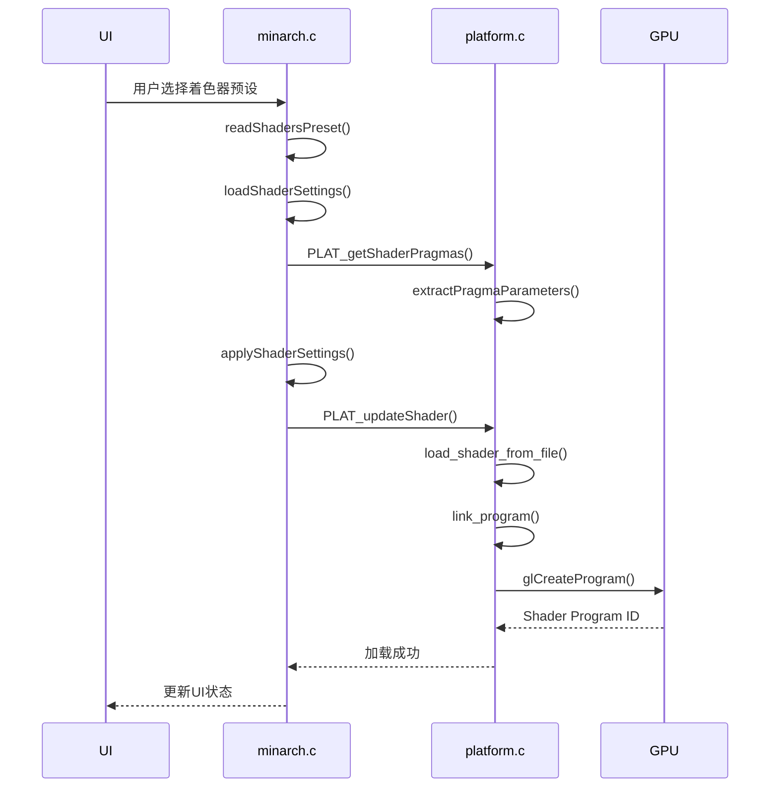
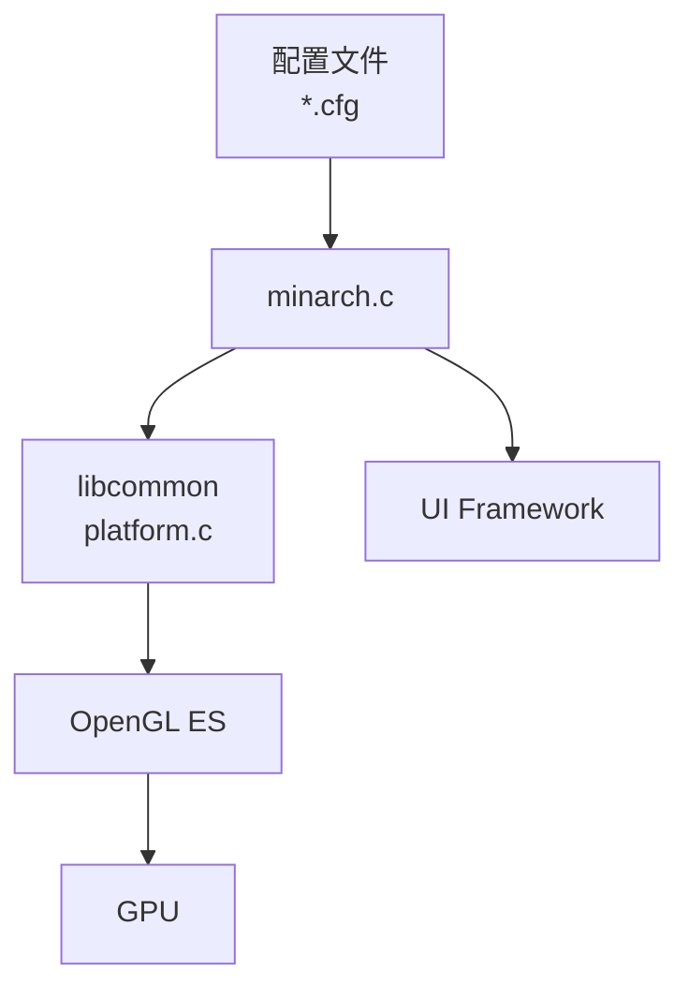

# 配置文件管理

<cite>
**本文档引用的文件**  
- [default.cfg](file://skeleton/EXTRAS/Emus/MGBA.pak/default.cfg)
- [default.cfg](file://skeleton/EXTRAS/Emus/PUAE.pak/default.cfg)
- [default-brick.cfg](file://skeleton/EXTRAS/Emus/PUAE.pak/default-brick.cfg)
- [platform.c](file://workspace/lib/libcommon/platform.c)
- [minarch.c](file://workspace/apps/minarch/minarch.c)
</cite>

## 目录
1. [引言](#引言)
2. [项目结构](#项目结构)
3. [核心组件](#核心组件)
4. [架构概述](#架构概述)
5. [详细组件分析](#详细组件分析)
6. [依赖分析](#依赖分析)
7. [性能考量](#性能考量)
8. [故障排除指南](#故障排除指南)
9. [结论](#结论)

## 引言
本文档旨在全面解析NextUI Pak扩展包中的`default.cfg`和`default-brick.cfg`配置文件，重点阐述其在模拟器图形渲染（如着色器选择）、音频参数（采样率、缓冲区大小）、输入映射及核心特定选项中的作用。通过对比GBA模拟器（MGBA.pak）与Amiga模拟器（PUAE.pak）的配置差异，揭示简单配置与复杂硬件模拟配置之间的复杂度鸿沟。同时，为开发者提供调整视频分辨率、启用扫描线效果或配置CRT着色器的指导，并提供配置语法示例，确保配置文件能与系统UI的设置层正确交互。

## 项目结构
NextUI项目采用模块化设计，其核心配置文件分散在`EXTRAS/Emus`目录下的各个`.pak`扩展包中。每个模拟器（如MGBA、PUAE）都有独立的`default.cfg`文件用于定义基础行为。此外，`BASE/Shaders/glsl`目录存放了所有GLSL着色器脚本，这些脚本通过配置文件被动态加载，以实现丰富的视觉效果。系统级配置则位于`SYSTEM`目录下。



**图示来源**
- [project_structure](file://project_structure)

**本节来源**
- [project_structure](file://project_structure)

## 核心组件
配置系统的核心由`libcommon`库中的`platform.c`和`minarch`应用中的`minarch.c`共同构成。`platform.c`负责底层着色器的加载、编译和参数解析，而`minarch.c`则提供了配置的读取、同步和应用逻辑，实现了从UI设置到底层渲染的完整链路。

**本节来源**
- [platform.c](file://workspace/lib/libcommon/platform.c)
- [minarch.c](file://workspace/apps/minarch/minarch.c)

## 架构概述
配置管理系统的架构分为三层：UI层、逻辑层和渲染层。UI层（如Settings.pak）允许用户修改设置；逻辑层（minarch.c）处理配置的读写、同步和回调；渲染层（platform.c）则根据配置加载着色器并更新GPU程序。`default.cfg`文件作为配置的源头，其内容被解析后注入到逻辑层的配置结构中。



**图示来源**
- [platform.c](file://workspace/lib/libcommon/platform.c#L594-L682)
- [minarch.c](file://workspace/apps/minarch/minarch.c#L2595-L2679)

## 详细组件分析

### MGBA与PUAE配置对比分析
本节深入分析GBA和Amiga模拟器的配置文件，揭示其设计哲学的差异。

#### MGBA.pak/default.cfg 分析
该配置文件极其简洁，主要聚焦于输入映射和一个核心选项`mgba_skip_bios`。这反映了GBA模拟器相对简单的硬件架构。

```ini
mgba_skip_bios = ON

bind Up = UP
bind Down = DOWN
bind Left = LEFT
bind Right = RIGHT
bind Select = SELECT
bind Start = START
bind A Button = A
bind B Button = B
...
```

**关键配置项**:
- **mgba_skip_bios**: 控制是否跳过启动时的BIOS动画。
- **bind**: 定义了控制器按键到模拟器功能的映射关系。



**图示来源**
- [default.cfg](file://skeleton/EXTRAS/Emus/MGBA.pak/default.cfg)

**本节来源**
- [default.cfg](file://skeleton/EXTRAS/Emus/MGBA.pak/default.cfg)

#### PUAE.pak/default.cfg 与 default-brick.cfg 分析
Amiga模拟器的配置复杂得多，`default.cfg`定义了基础输入，而`default-brick.cfg`则包含了大量与Amiga硬件相关的精细设置。

**default.cfg 内容摘要**:
```ini
bind Up = UP
bind Down = DOWN
...
bind A / 2nd fire / Blue = A
bind B / Fire / Red = B
...
```
此文件仅处理输入映射。

**default-brick.cfg 内容摘要**:
```ini
minarch_screen_scaling = Aspect
minarch__resampling_quality = Low
minarch_screen_effect = None
...
puae_model_fd = A500
puae_model_hd = A1200
puae_cpu_multiplier = 0
puae_video_resolution = lores
puae_sound_filter = emulated
...
```

**关键配置项**:
- **minarch_***: 前缀的选项属于NextUI框架的通用图形和性能设置。
- **puae_***: 前缀的选项是PUAE核心特有的，用于模拟Amiga的CPU、内存、磁盘、声音和视频硬件。

```mermaid
classDiagram
class minarchSettings {
+screen_scaling : String
+resampling_quality : String
+cpu_speed : String
+prevent_tearing : String
}
class puaeSettings {
+model_fd : String
+model_hd : String
+cpu_multiplier : Int
+video_resolution : String
+sound_filter : String
+collision_level : String
}
minarchSettings <|-- default-brick.cfg : "包含"
puaeSettings <|-- default-brick.cfg : "包含"
note right of default-brick.cfg
配置文件 default-brick.cfg
同时继承了 minarch 和 puae
两类设置，体现了配置的分层。
end note
```

**图示来源**
- [default.cfg](file://skeleton/EXTRAS/Emus/PUAE.pak/default.cfg)
- [default-brick.cfg](file://skeleton/EXTRAS/Emus/PUAE.pak/default-brick.cfg)

**本节来源**
- [default.cfg](file://skeleton/EXTRAS/Emus/PUAE.pak/default.cfg)
- [default-brick.cfg](file://skeleton/EXTRAS/Emus/PUAE.pak/default-brick.cfg)

### 着色器系统分析
着色器系统是图形渲染的核心，其配置和加载流程如下。

#### 着色器加载流程
当用户在UI中选择一个着色器预设（如`real-gba.cfg`）时，系统会执行以下流程：



**图示来源**
- [minarch.c](file://workspace/apps/minarch/minarch.c#L2595-L2637)
- [platform.c](file://workspace/lib/libcommon/platform.c#L594-L628)

#### 着色器参数解析
着色器源码（`.glsl`）中的`#pragma parameter`指令定义了可在UI中调节的参数。`platform.c`中的`extractPragmaParameters`函数负责解析这些指令。

**示例GLSL代码片段**:
```glsl
#pragma parameter SCANLINE_INTENSITY "Scanline Intensity" 0.3 0.0 1.0 0.05
#pragma parameter CRT_CURVATURE "CRT Curvature" 0.1 0.0 0.3 0.01
```

**解析逻辑**:
```c
// platform.c: extractPragmaParameters
if (strncmp(line, "#pragma parameter", 17) == 0) {
    sscanf(start, "%127s \"%127[^\"]\" %f %f %f %f",
           p->name, p->label, &p->def, &p->min, &p->max, &p->step);
}
```
此函数将`#pragma`行解析为`ShaderParam`结构体，包含名称、标签、默认值、最小值、最大值和步长，这些信息被传递给UI以生成滑块或下拉菜单。

**本节来源**
- [platform.c](file://workspace/lib/libcommon/platform.c#L137-L177)
- [platform.c](file://workspace/lib/libcommon/platform.c#L553-L597)

## 依赖分析
配置系统各组件间存在明确的依赖关系。`minarch`应用依赖`libcommon`库提供的平台抽象接口（如`PLAT_getShaderPragmas`），而`libcommon`库又依赖于OpenGL ES进行着色器编译。配置文件（`.cfg`）是数据依赖的源头，它们被`minarch`读取并影响`platform`的行为。



**图示来源**
- [minarch.c](file://workspace/apps/minarch/minarch.c)
- [platform.c](file://workspace/lib/libcommon/platform.c)

**本节来源**
- [minarch.c](file://workspace/apps/minarch/minarch.c)
- [platform.c](file://workspace/lib/libcommon/platform.c)

## 性能考量
配置选择对性能有显著影响。启用复杂的CRT着色器或高分辨率缩放算法会大幅增加GPU负载。`minarch_cpu_speed`和`minarch_thread_video`等选项允许用户在性能和画质之间进行权衡。着色器缓存（`/mnt/SDCARD/.shadercache/`）机制通过缓存编译后的二进制程序来减少首次加载的延迟。

## 故障排除指南
- **问题**: 着色器无法加载或显示异常。
  - **检查**: 确认`.glsl`文件存在于`Shaders/glsl`目录。
  - **检查**: 查看日志中是否有`Shader Program Linking Failed`错误，这通常意味着着色器代码有语法错误或不兼容。
- **问题**: 配置更改未生效。
  - **检查**: 确认`applyShaderSettings()`函数被正确调用。
  - **检查**: 检查`shadersreload`标志是否被置位以触发重新加载。
- **问题**: 输入映射不工作。
  - **检查**: 确认`default.cfg`中的`bind`指令语法正确，且按键名称与系统定义一致。

**本节来源**
- [platform.c](file://workspace/lib/libcommon/platform.c#L630-L682)
- [minarch.c](file://workspace/apps/minarch/minarch.c#L2754-L2800)

## 结论
NextUI的配置系统通过分层的`.cfg`文件和强大的着色器支持，为不同复杂度的模拟器提供了灵活的定制能力。从MGBA的简单输入映射到PUAE的精细硬件模拟，配置文件是连接用户意图与模拟器行为的桥梁。理解`minarch`和`puae`前缀的配置项区别，以及着色器参数的解析机制，是有效管理和优化模拟体验的关键。