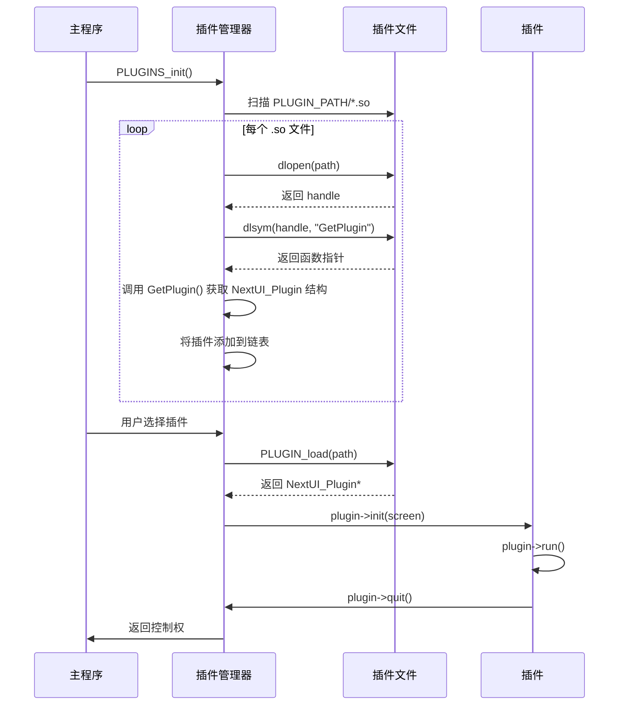
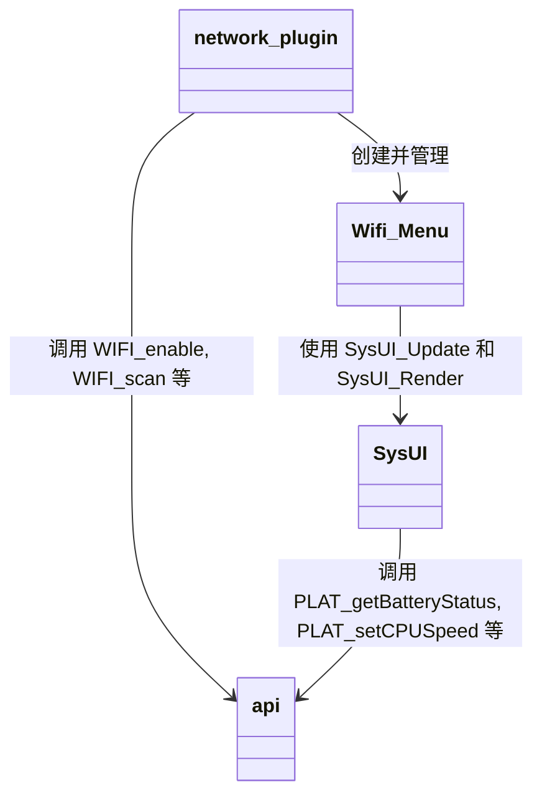

<docs>
# 扩展系统

<cite>
**本文档中引用的文件**   
- [PAKS.md](file://PAKS.md) - *在最近的提交中更新*
- [plugin.h](file://workspace/lib/libcommon/plugin.h) - *在最近的提交中更新*
- [plugin.c](file://workspace/lib/libcommon/plugin.c) - *在最近的提交中更新*
- [uimanager.c](file://workspace/apps/nextui/uimanager.c) - *在最近的提交中更新*
- [config.h](file://workspace/lib/libcommon/config.h) - *在最近的提交中更新*
- [config.c](file://workspace/lib/libcommon/config.c) - *在最近的提交中更新*
- [lang.h](file://workspace/lib/libcommon/lang.h) - *在最近的提交中更新*
- [lang.c](file://workspace/lib/libcommon/lang.c) - *在最近的提交中更新*
- [defines.h](file://workspace/lib/libcommon/defines.h) - *在最近的提交中更新*
- [api.h](file://workspace/lib/libcommon/api.h) - *在最近的提交中更新*
- [gametime.c](file://workspace/plugins/gametime/gametime.c) - *新增的游戏时间追踪插件*
- [gametimedb.c](file://workspace/lib/libgametimedb/gametimedb.c) - *游戏时间数据存储库*
- [gametimectl.c](file://workspace/system/gametimectl/gametimectl.c) - *游戏时间跟踪控制程序*
- [launcher.c](file://workspace/apps/nextui/launcher.c) - *启动器逻辑，包含游戏时间跟踪调用*
- [network.cpp](file://workspace/plugins/network/network.cpp) - *新增的网络插件*
- [wifimenu.hpp](file://workspace/plugins/network/wifimenu.hpp) - *网络插件的菜单头文件*
- [sysui.h](file://workspace/lib/libcommon/sysui.h) - *系统UI组件*
- [terminal.c](file://workspace/plugins/terminal/terminal.c) - *重构的终端插件，支持真实终端会话*
- [compositor.c](file://workspace/system/compositor/compositor.c) - *新增的合成器服务*
- [protocol.h](file://workspace/system/compositor/protocol.h) - *合成器IPC协议定义*
- [client_lib.c](file://workspace/system/compositor/client_lib/client_lib.c) - *合成器客户端库*
- [client_lib.h](file://workspace/system/compositor/client_lib/client_lib.h) - *合成器客户端头文件*
- [app_B_overlay.c](file://workspace/system/compositor/apps/app_B_overlay.c) - *叠加层客户端示例*
- [app_C_exclusive.c](file://workspace/system/compositor/apps/app_C_exclusive.c) - *独占模式客户端示例*
- [app_D_overlay.c](file://workspace/system/compositor/apps/app_D_overlay.c) - *新增的叠加层客户端*
- [app_E_overlay.c](file://workspace/system/compositor/apps/app_E_overlay.c) - *新增的叠加层客户端*
- [Exclusive.pak/launch.sh](file://skeleton/EXTRAS/Tools/Exclusive.pak/launch.sh) - *新增的Exclusive工具包启动脚本*
- [FileManager.pak/launch.sh](file://skeleton/EXTRAS/Tools/FileManager.pak/launch.sh) - *新增的文件管理器工具包启动脚本*
</cite>

## 更新摘要
**已做更改**   
- 在“Pak扩展包系统”部分新增了“工具Pak”子章节，详细介绍了`Exclusive.pak`和`FileManager.pak`的功能与集成方式。
- 新增了“合成器系统”章节，全面介绍了`compositor`服务、IPC协议、客户端库及多区域叠加功能。
- 更新了“插件系统”部分，以反映新引入的`display_path`字段。
- 在“开发指南”部分增加了关于开发`terminal`类型插件和合成器客户端的指导。
- 更新了所有受影响的“Section sources”和“Diagram sources”标签，以包含新文件的状态注释。

## 目录
1. [简介](#简介)
2. [Pak扩展包系统](#pak扩展包系统)
3. [插件系统](#插件系统)
4. [配置文件系统](#配置文件系统)
5. [合成器系统](#合成器系统)
6. [开发指南](#开发指南)
7. [最佳实践与注意事项](#最佳实践与注意事项)

## 简介
NextUI是一个模块化的用户界面系统，支持通过Pak扩展包和插件机制进行功能扩展。本文档详细介绍了其扩展系统的架构和实现，包括Pak扩展包的结构、插件系统的动态加载机制以及配置文件的语法和作用。文档旨在为开发者提供全面的指导，帮助他们安全地扩展系统功能，无论是添加新的模拟器还是开发复杂工具。

## Pak扩展包系统

Pak扩展包是NextUI系统的核心扩展机制，允许用户添加新的模拟器或工具。一个Pak本质上是一个以".pak"为扩展名的文件夹，其中包含一个名为"launch.sh"的shell脚本。Pak分为两种类型：模拟器Pak和工具Pak，分别存放在SD卡根目录下的"Emus"和"Tools"文件夹中。

### Pak类型与集成级别
NextUI支持三种不同集成级别的模拟器Pak：

1.  **重用内置核心型**：这种Pak利用NextUI基础安装中已包含的libretro核心，允许自定义默认选项并分离用户配置。例如，额外的GG.pak就使用了默认的picodrive核心。
2.  **自带核心型**：这种Pak捆绑了其自己的libretro核心，允许支持全新的系统，同时仍能利用NextUI的标准功能，如从菜单恢复、快速保存和自动恢复、一致的游戏内菜单、行为和选项。例如，额外的MGBA.pak就捆绑了它自己的mgba核心。
3.  **独立模拟器型**：这种Pak启动一个捆绑的独立模拟器，可能在特定硬件上提供比libretro核心更好的性能，但代价是与NextUI完全不集成。这意味着没有从菜单恢复、快速保存和自动恢复、一致的游戏内菜单、行为或选项。在这种情况下，MENU（以及可用的POWER）按钮可能无法按预期工作。这种类型的Pak应作为最后的选择。

**Section sources**
- [PAKS.md](file://PAKS.md#L0-L106) - *在最近的提交中更新*

### Pak命名与识别
NextUI通过ROM父文件夹名称末尾括号内的标签来映射ROM到Pak。例如，路径`/Roms/Game Boy (GB)/Dr. Mario (World).gb`将启动"GB.pak"。标签应为全大写。选择标签时，应从其他模拟前端（如Retroarch或EmulationStation）使用的常见缩写开始（例如，FC代表Famicom/Nintendo，MD代表MegaDrive/Genesis）。如果该标签已被另一个Pak使用，则可以使用核心名称（如果较短）、核心名称的缩写或截断。

**Section sources**
- [PAKS.md](file://PAKS.md#L0-L106) - *在最近的提交中更新*

### launch.sh脚本详解
`launch.sh`是Pak的核心，负责启动模拟器或工具。以下是一个典型的示例：

```sh
#!/bin/sh

EMU_EXE=picodrive

###############################

EMU_TAG=$(basename "$(dirname "$0")" .pak)
ROM="$1"
mkdir -p "$BIOS_PATH/$EMU_TAG"
mkdir -p "$SAVES_PATH/$EMU_TAG"
mkdir -p "$CHEATS_PATH/$EMU_TAG"
HOME="$USERDATA_PATH"
cd "$HOME"
minarch.elf "$CORES_PATH/${EMU_EXE}_libretro.so" "$ROM" &> "$LOGS_PATH/$EMU_TAG.txt"
```

此脚本使用基础NextUI安装中包含的"picodrive_libretro.so"核心打开请求的ROM。要使用不同的核心，只需将`EMU_EXE`的值更改为另一个核心名称（去掉"_libretro.so"）。如果该核心捆绑在Pak中，则需要在`EMU_EXE`行之后添加`CORES_PATH=$(dirname "$0")`。

脚本中`#`行以下的部分是样板代码，它会从Pak的文件夹名称中提取标签，创建相应的BIOS和保存文件夹，将`HOME`环境变量设置为"/.userdata/[platform]/"，启动游戏，并将minarch和核心的任何输出记录到"/.userdata/[platform]/logs/[TAG].txt"。

**Section sources**
- [PAKS.md](file://PAKS.md#L0-L106) - *在最近的提交中更新*

### 工具Pak
`Exclusive.pak`和`FileManager.pak`是新增的工具Pak，用于提供系统级功能。

**Exclusive.pak**：
- **功能**：启动一个合成器服务，管理多个客户端应用的显示模式，支持独占模式和叠加层。
- **架构**：`launch.sh`脚本启动`compositor.elf`作为后台服务，并启动多个客户端应用（`app_B_overlay.elf`, `app_D_overlay.elf`, `app_E_overlay.elf`）作为叠加层，同时在前台运行`app_C_exclusive.elf`作为主交互应用。
- **工作流程**：
  1. 启动合成器服务，监听IPC套接字。
  2. 启动所有叠加层客户端，它们通过IPC注册并设置渲染区域。
  3. 在前台运行主应用，用户可以通过START键在NORMAL和EXCLUSIVE模式间切换。
  4. 当主应用退出时，清理所有后台进程。

**FileManager.pak**：
- **功能**：提供一个简单的文件管理器应用。
- **实现**：`launch.sh`脚本直接执行`file_manager.elf`二进制文件，所有输出重定向到`log.txt`。

**Section sources**
- [Exclusive.pak/launch.sh](file://skeleton/EXTRAS/Tools/Exclusive.pak/launch.sh#L0-L59) - *新增的Exclusive工具包启动脚本*
- [FileManager.pak/launch.sh](file://skeleton/EXTRAS/Tools/FileManager.pak/launch.sh#L0-L4) - *新增的文件管理器工具包启动脚本*

## 插件系统

NextUI的插件系统允许动态加载和执行外部功能模块，为系统提供了极大的灵活性。插件以共享库（.so文件）的形式存在，并通过定义的接口与主程序通信。

### 插件接口定义
插件系统的核心接口在`plugin.h`中定义。它包含两个主要结构：

1.  **PluginEntry**：一个链表结构，用于管理已加载的插件。
    ```c
    typedef struct PluginEntry {
        char* path;
        char* name;
        char* display_path; // 新增：插件要显示的路径
        struct PluginEntry* next;
    } PluginEntry;
    ```

2.  **NextUI_Plugin**：定义了插件的生命周期函数接口，新增了`display_path`字段用于指定插件在文件系统中的显示路径。
    ```c
    typedef struct {
        const char* name;
        const char* display_path; // 新增：插件开发者在此定义路径
        int (*init)(void* screen);
        int (*run)(void);
        void (*quit)(void);
    } NextUI_Plugin;
    ```

每个插件必须导出一个名为`GetPlugin`的符号，该符号返回一个指向`NextUI_Plugin`结构的函数。

**Section sources**
- [plugin.h](file://workspace/lib/libcommon/plugin.h#L0-L22) - *在最近的提交中更新*

### 插件加载与管理
插件的加载和管理由`plugin.c`中的函数实现。

-   **PLUGINS_init**：在程序启动时调用，扫描`PLUGIN_PATH`（定义为`/.system/plugins`）目录下的所有`.so`文件。它使用`dlopen`尝试打开每个文件，并通过`dlsym`查找`GetPlugin`符号。如果成功，该插件被视为有效并被添加到全局插件链表中。
-   **PLUGIN_load**：在用户选择运行某个插件时调用。它接收插件的完整路径，使用`dlopen`打开共享库，并调用`GetPlugin`符号来获取`NextUI_Plugin`结构的实例。
-   **PLUGINS_quit**：在程序退出时调用，负责释放所有已加载插件的资源，遍历插件链表并清理内存。



**Diagram sources**
- [plugin.c](file://workspace/lib/libcommon/plugin.c#L0-L100) - *在最近的提交中更新*
- [plugin.h](file://workspace/lib/libcommon/plugin.h#L0-L22) - *在最近的提交中更新*

### 网络插件
`network`插件是一个新增的系统工具，用于管理和配置设备的WiFi网络连接。

**核心功能**：
- **WiFi开关**：提供一个菜单项来启用或禁用WiFi。
- **诊断模式**：提供一个开关来启用或禁用WiFi诊断日志。
- **网络扫描与连接**：能够扫描可用的WiFi网络，并允许用户连接到已知或新的网络。
- **凭证管理**：支持存储和遗忘网络凭证。

**架构与依赖**：
- **核心库**：依赖于`libcommon`中的`api.h`、`config.h`、`lang.h`、`sysui.h`和`plugin.h`等头文件。
- **系统UI**：使用`SysUI`组件来渲染标题栏、底部提示和硬件覆盖层（如音量、亮度）。
- **WiFi后端**：通过`api.h`中的`WIFI_enable`、`WIFI_scan`等宏调用`PLAT_wifiEnable`、`PLAT_wifiScan`等平台特定的底层函数。

**工作流程**：
1.  **初始化** (`plugin_init`)：初始化SDL屏幕，加载`SysUI`，设置标题为“Network”，并创建`Wifi::Menu`实例。
2.  **运行** (`plugin_run`)：在主循环中，首先调用`SysUI_Update`处理硬件覆盖层的输入。如果输入未被处理，则将输入传递给`networkMenu->handleInput`。当`quit_plugin`标志被设置时，循环结束。
3.  **清理** (`plugin_quit`)：设置`quit_plugin`标志以通知`Wifi::Menu`的工作线程安全退出，然后删除`networkMenu`对象，调用`CFG_sync()`保存可能更改的设置，并清理`SysUI`。



**Diagram sources**
- [network.cpp](file://workspace/plugins/network/network.cpp#L0-L131) - *新增的网络插件*
- [wifimenu.hpp](file://workspace/plugins/network/wifimenu.hpp#L0-L71) - *网络插件的菜单头文件*
- [sysui.h](file://workspace/lib/libcommon/sysui.h#L0-L48) - *系统UI组件*
- [api.h](file://workspace/lib/libcommon/api.h#L565-L764) - *系统API接口*

**Section sources**
- [network.cpp](file://workspace/plugins/network/network.cpp#L0-L131) - *新增的网络插件*
- [wifimenu.hpp](file://workspace/plugins/network/wifimenu.hpp#L0-L71) - *网络插件的菜单头文件*
- [sysui.h](file://workspace/lib/libcommon/sysui.h#L0-L48) - *系统UI组件*
- [api.h](file://workspace/lib/libcommon/api.h#L565-L764) - *系统API接口*

### 游戏时间追踪插件
`gametime`插件是一个新增的系统工具，用于追踪用户的游戏时长。它通过与`gametimectl`工具和`libgametimedb`库的协同工作来实现数据的持久化存储。

**核心功能**：
- **数据展示**：以列表形式展示所有游戏的总时长、平均时长和游玩次数。
- **数据源**：从`/.userdata/shared/game_logs.sqlite`数据库中读取游戏活动记录。
- **数据结构**：使用`PlayActivities`和`PlayActivity`结构体来组织数据，包含`play_time_total`（总时长）和`play_time_average`（平均时长）等字段。

**工作流程**：
1.  **初始化** (`plugin_init`)