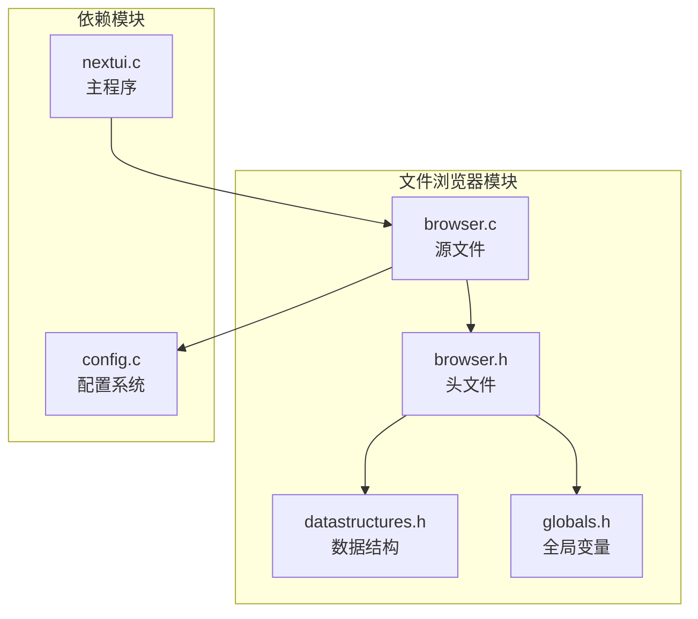
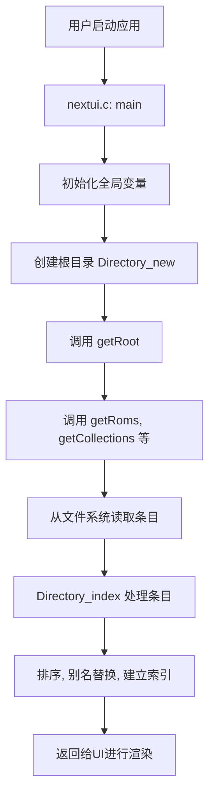
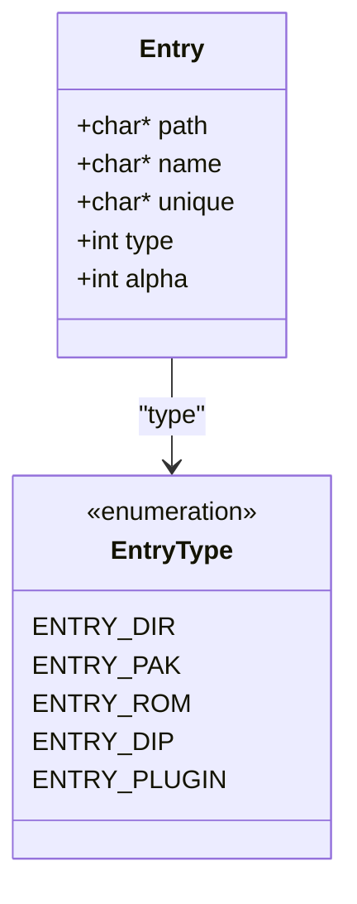
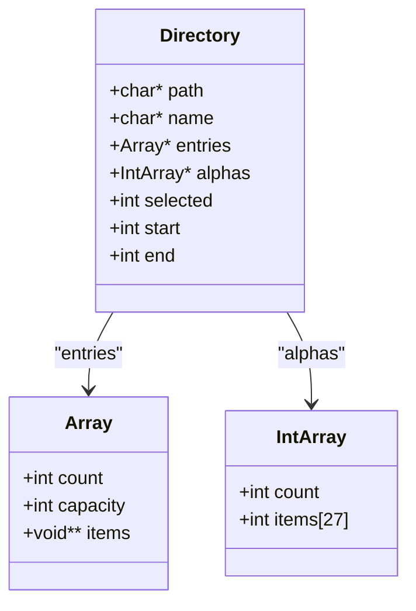
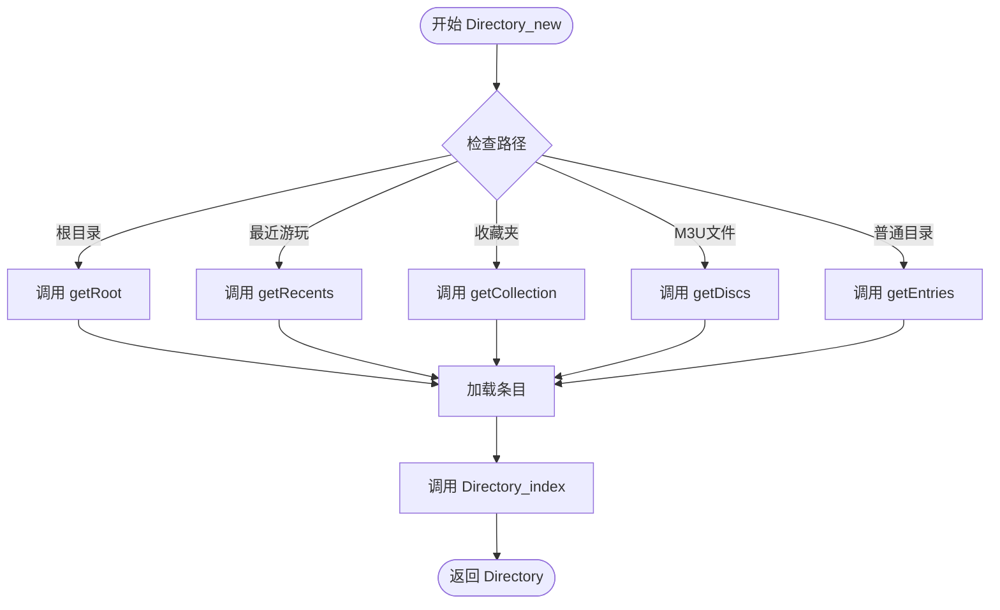
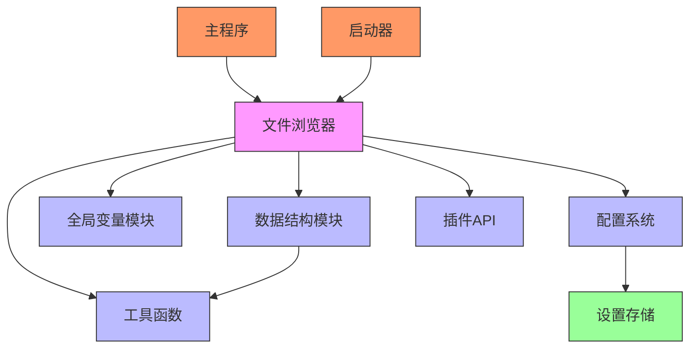

# 文件浏览器

<cite>
**本文档中引用的文件**   
- [browser.h](file://workspace/apps/nextui/include/browser.h)
- [browser.c](file://workspace/apps/nextui/browser.c)
- [datastructures.h](file://workspace/apps/nextui/include/datastructures.h)
- [globals.h](file://workspace/apps/nextui/include/globals.h)
- [config.c](file://workspace/lib/libcommon/config.c)
- [nextui.c](file://workspace/apps/nextui/nextui.c)
</cite>

## 目录
1. [简介](#简介)
2. [项目结构](#项目结构)
3. [核心组件](#核心组件)
4. [架构概述](#架构概述)
5. [详细组件分析](#详细组件分析)
6. [依赖分析](#依赖分析)
7. [性能考虑](#性能考虑)
8. [故障排除指南](#故障排除指南)
9. [结论](#结论)

## 简介
文件浏览器模块是NextUI系统的核心组件，负责扫描存储设备上的游戏文件、解析元数据，并构建用户可交互的浏览界面。该模块通过递归遍历目录结构，识别ROM文件、模拟器包（.pak）和工具应用，同时整合最近游玩记录与收藏夹功能。它利用自定义数据结构高效管理文件条目，并通过配置系统实现灵活的显示过滤规则。本分析将深入解析其扫描逻辑、缓存策略及与数据结构模块的协同工作机制。

## 项目结构
文件浏览器模块的代码主要分布在`workspace/apps/nextui/`目录下，其核心实现由头文件与源文件分离构成。`include/`子目录存放接口定义，而`browser.c`则包含具体的业务逻辑。



**图源**
- [browser.h](file://workspace/apps/nextui/include/browser.h)
- [browser.c](file://workspace/apps/nextui/browser.c)
- [datastructures.h](file://workspace/apps/nextui/include/datastructures.h)
- [globals.h](file://workspace/apps/nextui/include/globals.h)
- [config.c](file://workspace/lib/libcommon/config.c)
- [nextui.c](file://workspace/apps/nextui/nextui.c)

**本节来源**
- [browser.h](file://workspace/apps/nextui/include/browser.h)
- [browser.c](file://workspace/apps/nextui/browser.c)

## 核心组件
文件浏览器的核心在于`Entry`和`Directory`两个数据结构，以及`browser_scan`（由`Directory_new`和`Directory_index`实现）和`browser_load_entries`（由`getEntries`系列函数实现）等操作函数。`Entry`结构体代表文件系统中的一个条目，可以是目录、ROM、模拟器包或插件。`Directory`结构体则代表一个目录节点，包含其路径、名称、子条目列表以及用于快速索引的字母索引数组。全局变量`top`指向当前显示的目录，`stack`数组用于实现目录导航的回退功能。

**本节来源**
- [datastructures.h](file://workspace/apps/nextui/include/datastructures.h#L70-L102)
- [browser.h](file://workspace/apps/nextui/include/browser.h#L15-L26)
- [globals.h](file://workspace/apps/nextui/include/globals.h#L10-L11)

## 架构概述
文件浏览器采用分层架构，上层为UI管理层，下层为数据访问层。当用户启动应用时，`nextui.c`中的`main`函数会初始化全局状态，然后通过`Directory_new`创建根目录对象。该对象的构建过程会触发一系列`get*`函数，这些函数负责从文件系统加载原始数据。加载后的条目列表会经过`Directory_index`进行排序、去重和别名替换等处理，最终形成一个可供UI渲染的有序列表。整个过程通过全局配置（如`CFG_getShowRecents`）进行控制，实现了功能与配置的解耦。



**图源**
- [nextui.c](file://workspace/apps/nextui/nextui.c#L100-L150)
- [browser.c](file://workspace/apps/nextui/browser.c#L500-L700)
- [browser.h](file://workspace/apps/nextui/include/browser.h#L20-L21)

## 详细组件分析
### 数据结构分析
文件浏览器模块定义了多个关键数据结构，它们是整个功能实现的基础。

#### Entry 结构体
`Entry`结构体是文件系统条目的基本单元，它封装了路径、显示名称、唯一标识符、类型和索引信息。



**图源**
- [datastructures.h](file://workspace/apps/nextui/include/datastructures.h#L50-L60)

#### Directory 结构体
`Directory`结构体代表一个目录节点，它不仅包含自身的路径和名称，还管理着其子条目列表和UI导航状态。



**图源**
- [datastructures.h](file://workspace/apps/nextui/include/datastructures.h#L80-L90)

### 扫描与加载逻辑分析
文件浏览器的扫描和加载逻辑是其最核心的功能，它决定了用户能看到哪些内容。

#### 目录扫描流程
`Directory_new`函数是目录扫描的入口点。它根据传入的路径，决定调用哪个`get*`函数来加载条目。例如，当路径为根目录时，会调用`getRoot`；当路径为ROMs目录时，会调用`getRoms`。这些`get*`函数通过`opendir`和`readdir`系统调用遍历目录，创建`Entry`对象，并将其添加到`Array`中。



**图源**
- [browser.c](file://workspace/apps/nextui/browser.c#L520-L550)

#### 条目处理与索引
`Directory_index`函数负责对加载的条目进行后处理。它首先检查是否存在`map.txt`文件，如果存在，则读取其中的别名映射，并更新条目的显示名称。然后，它会对条目进行排序，并为每个条目分配一个`alpha`值，该值代表其在字母索引中的位置，从而实现快速跳转。

```mermaid
sequenceDiagram
participant DI as Directory_index
participant FS as 文件系统
participant Map as map.txt
DI->>Map : 检查 map.txt 是否存在
alt 存在
Map-->>DI : 读取映射
DI->>DI : 遍历条目，应用别名
DI->>DI : 重新排序
end
DI->>DI : 遍历条目进行去重
DI->>DI : 为每个条目计算 alpha 值
DI->>DI : 建立 alphas 索引数组
DI-->> : 处理完成
```

**图源**
- [browser.c](file://workspace/apps/nextui/browser.c#L600-L720)

## 依赖分析
文件浏览器模块与多个其他模块紧密协作，形成了一个完整的生态系统。



**图源**
- [browser.h](file://workspace/apps/nextui/include/browser.h)
- [datastructures.h](file://workspace/apps/nextui/include/datastructures.h)
- [globals.h](file://workspace/apps/nextui/include/globals.h)
- [config.c](file://workspace/lib/libcommon/config.c)
- [nextui.c](file://workspace/apps/nextui/nextui.c)

**本节来源**
- [browser.h](file://workspace/apps/nextui/include/browser.h)
- [datastructures.h](file://workspace/apps/nextui/include/datastructures.h)
- [globals.h](file://workspace/apps/nextui/include/globals.h)
- [config.c](file://workspace/lib/libcommon/config.c)

## 性能考虑
文件浏览器的性能主要受I/O操作影响。其设计中包含了一些优化策略：
1.  **缓存策略**：最近游玩记录（`recents`）在程序启动时一次性加载到内存中，并在整个会话期间复用，避免了重复的文件I/O。
2.  **延迟加载**：`Directory`对象的`entries`列表是在`Directory_new`时才创建和填充的，这意味着只有用户访问的目录才会被扫描，减少了不必要的系统调用。
3.  **内存管理**：使用自定义的`Array`和`Hash`结构体进行内存管理，避免了频繁的`malloc`/`free`调用，提高了效率。
尽管如此，仍存在优化空间，例如可以实现异步加载缩略图，避免在扫描大型目录时阻塞UI线程。

## 故障排除指南
常见问题及解决方案：
- **问题**：文件浏览器中未显示某些游戏。
  - **原因**：可能被`hide`函数过滤，或`map.txt`文件中的别名导致名称为空。
  - **解决方案**：检查`utils.h`中的`hide`函数规则，或检查`map.txt`文件中对应条目的别名是否为空。
- **问题**：最近游玩记录不更新。
  - **原因**：`RECENT_PATH`文件权限问题，或`saveRecents`函数未被调用。
  - **解决方案**：检查文件路径和权限，并确保在适当的位置调用保存函数。
- **问题**：启动时卡顿。
  - **原因**：首次扫描大型ROM目录耗时过长。
  - **解决方案**：考虑实现目录扫描结果的缓存机制，或在后台线程中进行扫描。

**本节来源**
- [browser.c](file://workspace/apps/nextui/browser.c#L150-L200)
- [browser.c](file://workspace/apps/nextui/browser.c#L600-L720)
- [utils.h](file://workspace/lib/libcommon/utils.h)

## 结论
文件浏览器模块通过清晰的分层设计和高效的数据结构，成功实现了对复杂文件系统的浏览功能。它与配置系统和数据结构模块的紧密结合，使其具备了高度的灵活性和可维护性。未来可通过引入异步I/O和更智能的缓存策略，进一步提升其在大型游戏库下的响应速度和用户体验。