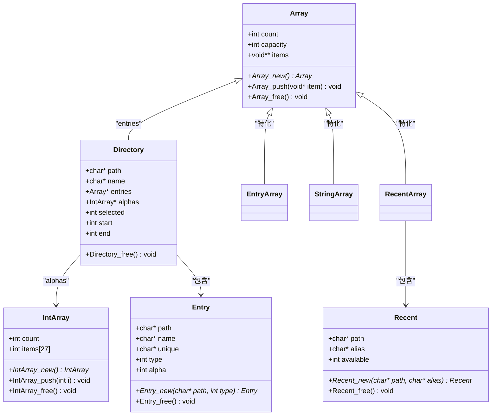
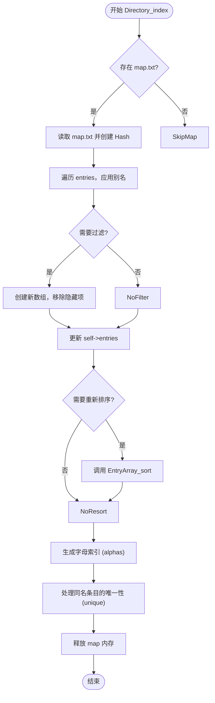

# 核心数据结构

<cite>
**本文档引用的文件**   
- [datastructures.h](file://workspace/apps/nextui/include/datastructures.h)
- [datastructures.c](file://workspace/apps/nextui/datastructures.c)
- [browser.h](file://workspace/apps/nextui/include/browser.h)
- [browser.c](file://workspace/apps/nextui/browser.c)
- [globals.h](file://workspace/apps/nextui/include/globals.h)
- [defines.h](file://workspace/apps/nextui/include/defines.h)
</cite>

## 目录
1. [简介](#简介)
2. [核心数据结构概览](#核心数据结构概览)
3. [动态数组（Array）](#动态数组array)
4. [文件系统条目（Entry）](#文件系统条目entry)
5. [目录表示（Directory）](#目录表示directory)
6. [最近记录（Recent）](#最近记录recent)
7. [数据结构共享与系统集成](#数据结构共享与系统集成)
8. [内存管理与最佳实践](#内存管理与最佳实践)

## 简介
本文档全面解析了NextUI项目中的核心数据结构设计。这些数据结构构成了整个用户界面和文件浏览系统的基础，包括用于存储任意对象的动态数组（Array）、表示文件系统中各类条目的条目结构（Entry）、用于管理目录内容的目录结构（Directory），以及用于追踪最近游戏的记录结构（Recent）。通过分析`datastructures.h`和`datastructures.c`中的定义与实现，我们将深入探讨其内存布局、操作接口、内存管理策略以及在整个系统中的共享模式。

## 核心数据结构概览
NextUI的核心数据结构设计围绕一个通用的动态数组`Array`构建，其他复杂结构（如`Directory`、`Recent`）都依赖于它。这种设计提供了灵活性和代码复用性。`Entry`结构是系统中的核心实体，代表了文件系统中的一个项目，如游戏ROM、模拟器包（PAK）或目录。`Directory`结构则用于组织和管理一组`Entry`对象，形成层次化的浏览界面。`Recent`结构用于记录用户最近访问的游戏。



**图示来源**
- [datastructures.h](file://workspace/apps/nextui/include/datastructures.h#L15-L102)
- [datastructures.c](file://workspace/apps/nextui/datastructures.c#L42-L241)

## 动态数组（Array）

### 结构与内存布局
`Array`结构是整个数据结构体系的基石，它是一个可以存储任意类型指针的动态数组。其内存布局如下：
- **count**: 当前数组中元素的数量。
- **capacity**: 数组当前的容量，即`items`数组可以容纳的元素总数。
- **items**: 一个指向`void*`指针数组的指针，实际存储所有元素。

这种设计允许`Array`作为通用容器，通过`void**`可以存储任何类型的对象指针。

### 操作接口与实现
`Array`提供了一套完整的操作接口：
- **Array_new()**: 创建一个新的`Array`实例。初始容量为8，当元素数量超过容量时，容量会自动翻倍。
- **Array_push()**: 将一个元素添加到数组末尾。如果容量不足，会调用`realloc`进行扩容。
- **Array_pop()**: 移除并返回数组末尾的元素。
- **Array_remove()**: 通过遍历查找并移除指定的元素，后续元素前移。
- **Array_free()**: 释放`Array`本身及其`items`数组的内存。**注意**：此函数不负责释放`items`数组中每个元素指向的内存，这需要由调用者或特定的`free`函数（如`EntryArray_free`）来完成。

```c
void Array_push(Array* self, void* item) {
    if (self->count >= self->capacity) {
        self->capacity *= 2;
        self->items = realloc(self->items, sizeof(void*) * self->capacity);
    }
    self->items[self->count++] = item;
}
```

### 特化数组
基于`Array`，系统定义了几个特化类型：
- **StringArray**: 用于存储字符串（`char*`）的数组。`StringArray_free`函数会先遍历并释放每个字符串的内存，再调用`Array_free`。
- **EntryArray**: 用于存储`Entry*`的数组。`EntryArray_free`函数会先遍历并调用`Entry_free`释放每个`Entry`对象，再调用`Array_free`。
- **RecentArray**: 用于存储`Recent*`的数组。`RecentArray_free`函数会先遍历并调用`Recent_free`释放每个`Recent`对象，再调用`Array_free`。

这种分层释放的策略确保了内存的正确管理。

**本节来源**
- [datastructures.h](file://workspace/apps/nextui/include/datastructures.h#L15-L35)
- [datastructures.c](file://workspace/apps/nextui/datastructures.c#L42-L74)

## 文件系统条目（Entry）

### 字段含义
`Entry`结构代表文件系统中的一个条目，其字段含义如下：
- **path**: 条目的完整路径（相对于SD卡根目录）。
- **name**: 条目的显示名称，通常是从文件名或路径中提取的。
- **unique**: 一个唯一的名称，当有多个条目具有相同的`name`时，用于区分它们（例如，通过添加文件扩展名或平台标签）。
- **type**: 条目的类型，由`EntryType`枚举定义。
- **alpha**: 一个索引，用于快速跳转到按字母排序的列表中的特定位置。

### EntryType 枚举
`EntryType`枚举定义了条目的所有可能类型：
- `ENTRY_DIR`: 目录
- `ENTRY_PAK`: 模拟器包（.pak文件）
- `ENTRY_ROM`: 游戏ROM文件
- `ENTRY_DIP`: 快捷操作（如Wi-Fi开关、重启）
- `ENTRY_PLUGIN`: 插件

### 操作接口
- **Entry_new()**: 根据路径和类型创建一个新的`Entry`。它会调用`getDisplayName`函数来生成显示名称。
- **Entry_newNamed()**: 创建一个`Entry`，并允许指定自定义的显示名称。
- **Entry_free()**: 释放`Entry`对象及其所有成员（`path`, `name`, `unique`）的内存。

```c
void Entry_free(Entry* self) {
    free(self->path);
    free(self->name);
    if (self->unique) free(self->unique);
    free(self);
}
```

### 数据一致性
`Entry`对象的`name`和`unique`字段在`Directory_index`函数中被处理。该函数会读取目录下的`map.txt`文件，根据映射关系更新条目的`name`，并为同名条目生成`unique`名称，从而保证了用户界面显示的一致性和唯一性。

**本节来源**
- [datastructures.h](file://workspace/apps/nextui/include/datastructures.h#L37-L61)
- [datastructures.c](file://workspace/apps/nextui/datastructures.c#L122-L145)
- [browser.c](file://workspace/apps/nextui/browser.c#L595-L626)

## 目录表示（Directory）

### 结构与功能
`Directory`结构用于表示一个目录及其状态，其字段含义如下：
- **path**: 目录的路径。
- **name**: 目录的显示名称。
- **entries**: 一个`Array`，存储该目录下的所有`Entry`对象。
- **alphas**: 一个`IntArray`，存储按字母排序后，每个新字母首次出现时在`entries`中的索引，用于快速导航。
- **selected**: 当前选中的条目在`entries`中的索引。
- **start** 和 **end**: 用于UI渲染，表示当前可视窗口中条目的起始和结束索引。

### 创建与初始化
`Directory_new`是创建`Directory`的核心函数。它根据传入的`path`决定如何填充`entries`数组：
- 如果是根目录，则调用`getRoot()`。
- 如果是“最近”目录，则调用`getRecents()`。
- 如果是ROM目录，则调用`getRoms()`。
- 对于其他路径，则调用`getEntries()`来扫描文件系统。

创建后，会调用`Directory_index`函数进行索引和处理。

### Directory_index 函数
此函数是数据一致性保障的关键：
1.  **读取映射文件**: 如果存在`map.txt`，则读取其中的别名映射。
2.  **应用别名**: 遍历`entries`，根据`map.txt`中的映射更新条目的`name`。
3.  **过滤隐藏项**: 如果有条目被`hide()`函数标记为隐藏，则将其从`entries`中移除。
4.  **重新排序**: 如果应用了别名，则对`entries`进行重新排序。
5.  **生成字母索引**: 遍历排序后的`entries`，为每个新字母记录其在数组中的位置，并存储在`alphas`中。



**本节来源**
- [datastructures.h](file://workspace/apps/nextui/include/datastructures.h#L63-L77)
- [datastructures.c](file://workspace/apps/nextui/datastructures.c#L176-L188)
- [browser.c](file://workspace/apps/nextui/browser.c#L541-L593)
- [browser.c](file://workspace/apps/nextui/browser.c#L595-L626)

## 最近记录（Recent）

### 结构与功能
`Recent`结构用于记录用户最近访问的游戏，其字段含义如下：
- **path**: 游戏ROM的相对路径。
- **alias**: 游戏的别名，如果在`recents`文件中指定了的话。
- **available**: 一个标志，表示与该游戏关联的模拟器（PAK）是否可用。

### 创建与管理
- **Recent_new()**: 创建一个新的`Recent`记录。它会检查`path`对应的模拟器是否存在，以设置`available`标志。
- **RecentArray_free()**: 释放整个`Recent`数组，包括每个`Recent`对象及其成员的内存。

`Recent`对象存储在全局的`recents`数组中，该数组在`hasRecents()`函数中被初始化和填充，从`RECENT_PATH`文件中读取历史记录。

**本节来源**
- [datastructures.h](file://workspace/apps/nextui/include/datastructures.h#L79-L90)
- [datastructures.c](file://workspace/apps/nextui/datastructures.c#L213-L241)
- [browser.c](file://workspace/apps/nextui/browser.c#L62-L150)

## 数据结构共享与系统集成

### 全局状态
系统通过`globals.h`中的全局变量来共享核心数据结构：
- **top**: 指向当前活动的`Directory`。
- **stack**: 一个`DirectoryArray`，用于实现目录导航的堆栈。
- **recents**: 一个`RecentArray`，存储最近的游戏记录。
- **quick**: 一个`EntryArray`，存储快捷菜单项。

这些全局变量使得`browser`、`launcher`和`uimanager`等不同模块可以访问和操作相同的数据。

### 浏览器与启动器的共享
`Entry`对象是浏览器和启动器之间共享的关键。当用户在浏览器中选择一个游戏（`ENTRY_ROM`或`ENTRY_PAK`）时，`uimanager.c`中的`Entry_open`函数会被调用。该函数直接将选中的`Entry`对象传递给`GFX_showLauncherTransition`和`openRom`/`openPak`函数。

```c
void Entry_open(SDL_Surface* screen, int* dirty, Entry* self) {
    // ...
    if (self->type==ENTRY_ROM || self->type==ENTRY_PAK) {
        GFX_showLauncherTransition(screen, self); // 直接传递 Entry 对象
        if (self->type==ENTRY_ROM) {
            openRom(self->path, last);
        }
        else { // ENTRY_PAK
            openPak(self->path);
        }
    }
    // ...
}
```

这种设计避免了数据的重复和不一致，确保了从浏览到启动的流程中，游戏信息是统一的。

**本节来源**
- [globals.h](file://workspace/apps/nextui/include/globals.h#L7-L20)
- [uimanager.c](file://workspace/apps/nextui/uimanager.c#L276-L341)
- [browser.c](file://workspace/apps/nextui/browser.c#L541-L593)

## 内存管理与最佳实践

### 内存管理策略
NextUI的数据结构采用了**手动内存管理**策略，没有使用引用计数或延迟释放机制。其核心原则是：
1.  **所有权明确**: 每个数据结构负责释放其直接拥有的内存。
2.  **分层释放**: 复合结构（如`Directory`）的`free`函数会先递归释放其成员（如`entries`、`alphas`），再释放自身。
3.  **特化释放函数**: 为`Array`的特化类型（`EntryArray`, `RecentArray`）提供专门的`free`函数，这些函数会先释放每个元素的内存，再释放数组本身。

### 避免内存泄漏
要避免内存泄漏，必须严格遵守以下规则：
- **成对调用**: 每次调用`malloc`或`strdup`，都必须有且仅有一次对应的`free`调用。
- **使用正确的释放函数**: 释放`EntryArray`时，必须使用`EntryArray_free`，而不是`Array_free`，否则会导致`Entry`对象的内存泄漏。
- **及时释放**: 在不再需要某个数据结构时，应立即调用其`free`函数。

### 线程安全注意事项
当前的数据结构设计**不是线程安全的**。所有的操作都假设在单线程环境中进行。如果需要在多线程环境中使用，必须添加互斥锁（mutex）来保护对共享数据结构（如`top`, `stack`, `recents`）的访问。

### 扩展指导
要创建自定义的数据容器，建议遵循以下模式：
1.  **继承Array**: 定义一个新的结构体，其中包含一个`Array*`字段来存储数据。
2.  **实现特化函数**: 创建`new`、`push`、`free`等函数。`free`函数应负责释放所有子元素和自身。
3.  **保持接口一致性**: 使新容器的接口风格与现有容器保持一致。

**本节来源**
- [datastructures.c](file://workspace/apps/nextui/datastructures.c#L42-L241)
- [datastructures.h](file://workspace/apps/nextui/include/datastructures.h#L15-L102)