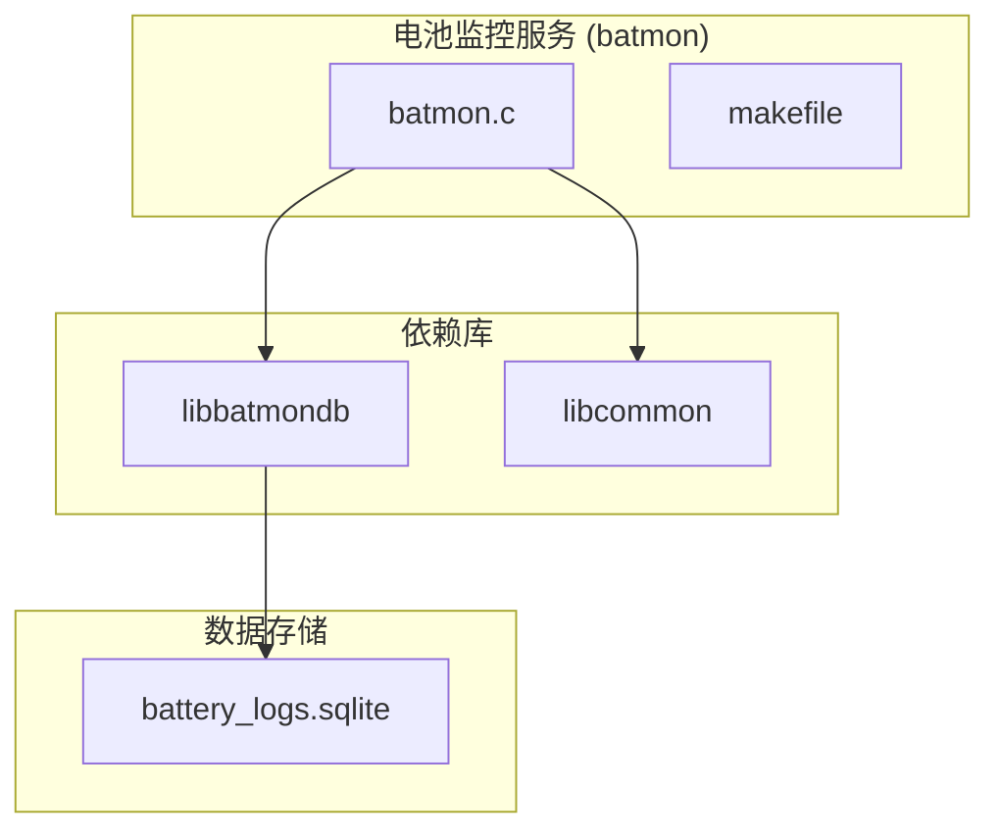
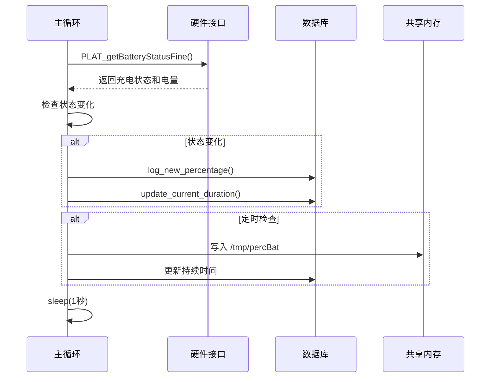
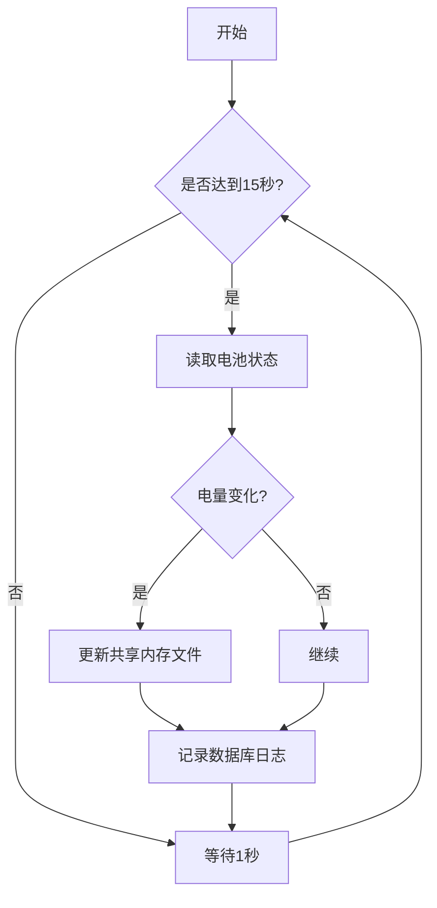
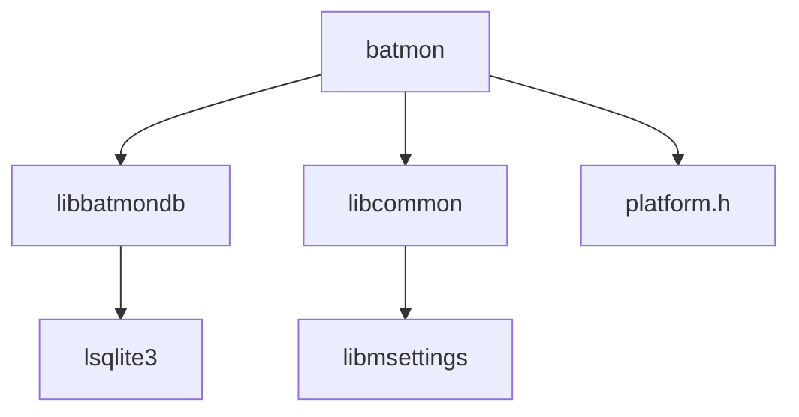

# 电池监控服务 (batmon)

<cite>
**本文档引用的文件**   
- [batmon.c](file://workspace/system/batmon/batmon.c)
- [batmondb.c](file://workspace/lib/libbatmondb/batmondb.c)
- [defines.h](file://workspace/lib/libcommon/defines.h)
- [api.h](file://workspace/lib/libcommon/api.h)
- [makefile](file://workspace/system/batmon/makefile)
</cite>

## 目录
1. [简介](#简介)
2. [项目结构](#项目结构)
3. [核心组件](#核心组件)
4. [架构概述](#架构概述)
5. [详细组件分析](#详细组件分析)
6. [依赖分析](#依赖分析)
7. [性能考虑](#性能考虑)
8. [故障排除指南](#故障排除指南)
9. [结论](#结论)

## 简介
电池监控服务（batmon）是一个后台守护进程，负责定期读取设备的电池状态信息，包括电量百分比、充电状态等，并将这些数据持久化到数据库中。该服务还负责将当前电池电量写入共享内存文件，供主用户界面应用读取显示。batmon通过信号处理机制响应系统挂起和恢复事件，并在程序退出时执行清理操作。

## 项目结构
电池监控服务的代码位于`workspace/system/batmon/`目录下，其主要文件包括`batmon.c`源文件和`makefile`构建脚本。该服务依赖于`libbatmondb`库进行数据库操作，并使用`libcommon`库提供的通用工具函数和平台抽象接口。数据库文件存储在`SDCARD_PATH/.userdata/shared/battery_logs.sqlite`路径下。



**Diagram sources**
- [batmon.c](file://workspace/system/batmon/batmon.c)
- [batmondb.c](file://workspace/lib/libbatmondb/batmondb.c)

**Section sources**
- [batmon.c](file://workspace/system/batmon/batmon.c)
- [batmondb.c](file://workspace/lib/libbatmondb/batmondb.c)

## 核心组件
电池监控服务的核心功能由`batmon.c`中的`main`函数实现。该函数包含一个主循环，每隔15秒检查一次电池状态。服务通过`PLAT_getBatteryStatusFine`函数获取电池的充电状态和电量百分比，并将这些数据与时间戳一起记录到SQLite数据库中。当检测到充电状态变化时，服务会记录新的充电会话。此外，服务还会将当前电量写入`/tmp/percBat`文件，供其他应用读取。

**Section sources**
- [batmon.c](file://workspace/system/batmon/batmon.c#L150-L349)

## 架构概述
电池监控服务采用单线程循环架构，通过信号处理机制响应外部事件。服务启动时初始化数据库连接和设备型号信息，然后进入主循环。主循环中，服务定期读取电池状态，检测充电状态变化，并根据需要更新数据库和共享内存文件。服务使用SQLite数据库持久化电池使用历史，包括每次充电的开始时间、持续时间和电量变化。



**Diagram sources**
- [batmon.c](file://workspace/system/batmon/batmon.c#L150-L349)

## 详细组件分析

### 主循环逻辑分析
`batmon.c`中的主循环是服务的核心，它每秒执行一次，但只在达到`CHECK_BATTERY_TIMEOUT_S`（15秒）的间隔时才进行完整的电池状态检查。循环中首先调用`PLAT_getBatteryStatusFine`获取当前电池的充电状态和电量百分比。然后比较当前状态与之前的状态，如果检测到充电状态变化（开始充电或停止充电），则记录新的日志条目并更新会话持续时间。

```c
while (!quit)
{
    PLAT_getBatteryStatusFine(&pwr.is_charging, &pwr.charge);
    if (pwr.is_charging)
    {
        if (!was_charging)
        {
            // 充电开始
            was_charging = true;
            update_current_duration();
            log_new_percentage(pwr.charge, was_charging);
        }
    }
    else if (was_charging)
    {
        // 充电停止
        was_charging = false;
        update_current_duration();
        log_new_percentage(pwr.charge, was_charging);
    }
    // ... 其他逻辑
    sleep(1);
}
```

**Section sources**
- [batmon.c](file://workspace/system/batmon/batmon.c#L150-L349)

### 采样频率与低电量预警
电池监控服务的采样频率由`CHECK_BATTERY_TIMEOUT_S`常量定义，当前设置为15秒。这个值在代码中是硬编码的，没有提供配置文件或命令行参数来修改。服务本身不直接实现低电量预警功能，而是通过将当前电量写入`/tmp/percBat`文件，由主UI应用读取并根据预设阈值（如20%）触发低电量警告。



**Diagram sources**
- [batmon.c](file://workspace/system/batmon/batmon.c#L200-L250)

**Section sources**
- [batmon.c](file://workspace/system/batmon/batmon.c#L200-L250)

### 与libbatmondb的交互
电池监控服务通过`libbatmondb`库提供的API与SQLite数据库交互。主要的交互函数包括`open_battery_log_db`用于打开数据库连接，`close_battery_log_db`用于关闭连接，`log_new_percentage`用于记录新的电池状态，以及`get_best_session_time`和`set_best_session_time`用于管理最佳游戏会话时间。数据库包含两个表：`bat_activity`存储每次电池状态变化的记录，`device_specifics`存储设备特定的信息，如最佳会话时间。

```c
// 记录新的电池百分比
void log_new_percentage(int new_bat_value, int is_charging)
{
    sqlite3 *bat_log_db = open_battery_log_db();
    if (bat_log_db != NULL)
    {
        char *sql = sqlite3_mprintf("INSERT INTO bat_activity(device_serial, bat_level, duration, is_charging) VALUES(%Q, %d, %d, %d);", device_model, new_bat_value, 0, is_charging);
        sqlite3_exec(bat_log_db, sql, NULL, NULL, NULL);
        sqlite3_free(sql);
        // ... FILO逻辑
    }
    close_battery_log_db(bat_log_db);
}
```

**Section sources**
- [batmon.c](file://workspace/system/batmon/batmon.c#L80-L120)
- [batmondb.c](file://workspace/lib/libbatmondb/batmondb.c#L30-L76)

## 依赖分析
电池监控服务依赖于多个库和系统组件。它直接依赖`libbatmondb`库进行数据库操作，依赖`libcommon`库提供的通用工具、日志记录和平台抽象功能。服务通过`platform.h`中的`PLAT_getBatteryStatusFine`和`PLAT_getModel`函数与底层硬件交互，这些函数的具体实现由平台特定的代码提供。构建系统通过`makefile`管理依赖关系，链接`libmsettings`、`lbatmondb`和`lsqlite3`等库。



**Diagram sources**
- [makefile](file://workspace/system/batmon/makefile#L20-L40)
- [batmon.c](file://workspace/system/batmon/batmon.c#L10-L15)

**Section sources**
- [makefile](file://workspace/system/batmon/makefile#L20-L40)

## 性能考虑
电池监控服务的性能主要受采样频率和数据库操作的影响。当前15秒的采样间隔在功耗和响应性之间提供了良好的平衡。频繁的数据库写入操作可能会对存储寿命产生影响，但服务通过FILO（先进先出）机制限制日志条目数量（`FILO_MIN_SIZE`为1000条）来缓解这一问题。为了进一步优化功耗，可以考虑在设备挂起时完全停止采样，或在电量较低时动态降低采样频率。

## 故障排除指南
**问题：电池读数漂移**
**可能原因**：硬件传感器校准问题或`PLAT_getBatteryStatusFine`函数实现不准确。
**解决方案**：检查平台特定的电池读取代码，确保ADC读数正确转换为百分比。可以在不同电量下手动校准读数。

**问题：无法识别充电状态**
**可能原因**：`PLAT_getBatteryStatusFine`函数未能正确检测充电引脚状态。
**解决方案**：验证硬件连接和GPIO配置。检查函数返回的`is_charging`值是否与实际充电状态一致。

**问题：数据库文件损坏**
**可能原因**：异常关机导致SQLite写入不完整。
**解决方案**：实现数据库连接的优雅关闭，并在启动时检查数据库完整性。可以使用`PRAGMA integrity_check`命令。

**Section sources**
- [batmon.c](file://workspace/system/batmon/batmon.c#L80-L120)
- [batmondb.c](file://workspace/lib/libbatmondb/batmondb.c#L30-L76)

## 结论
电池监控服务（batmon）是一个功能完整、结构清晰的后台守护进程，有效地管理了设备的电池状态监控和数据持久化。通过分析其代码，我们了解了其主循环逻辑、数据库交互模式和系统集成方式。虽然采样频率目前是硬编码的，但服务的整体设计允许通过修改常量或引入配置文件来轻松调整参数。对于未来的优化，建议实现动态采样频率调整以进一步降低功耗，并增强错误处理机制以提高服务的健壮性。