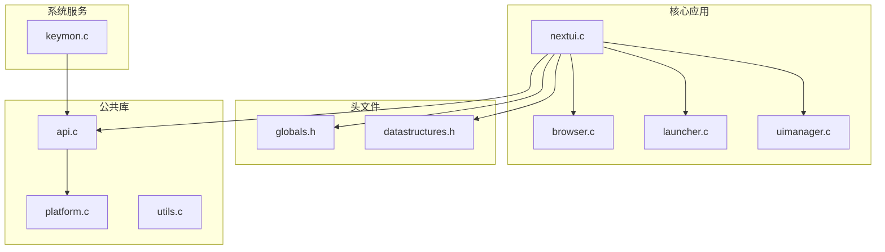
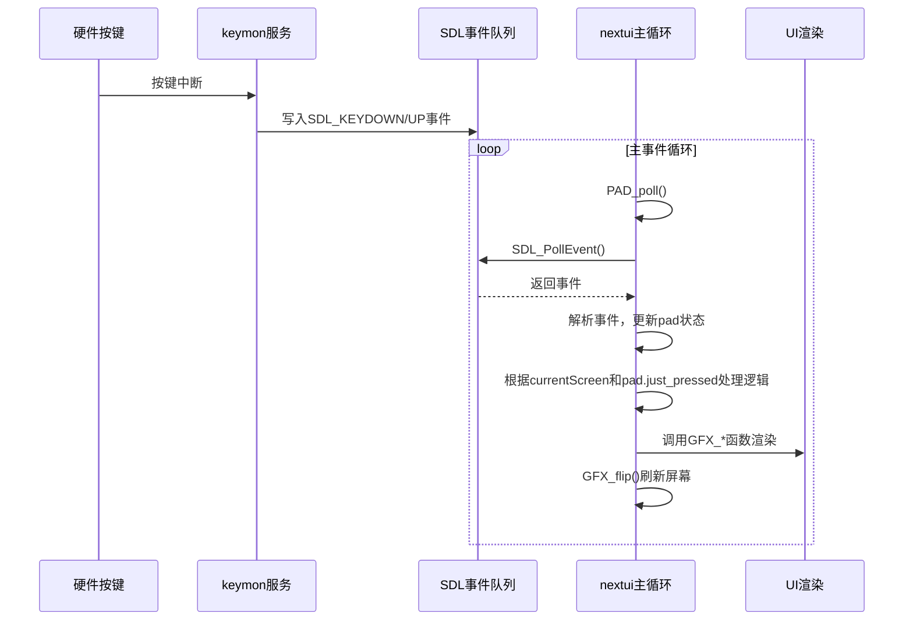
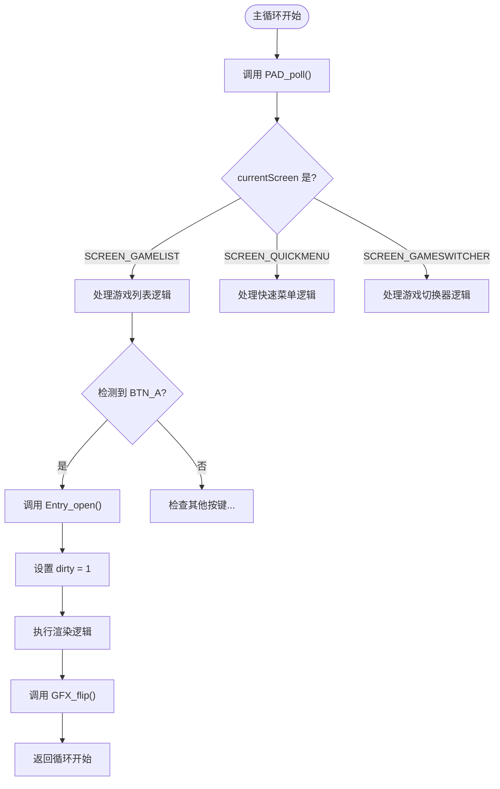
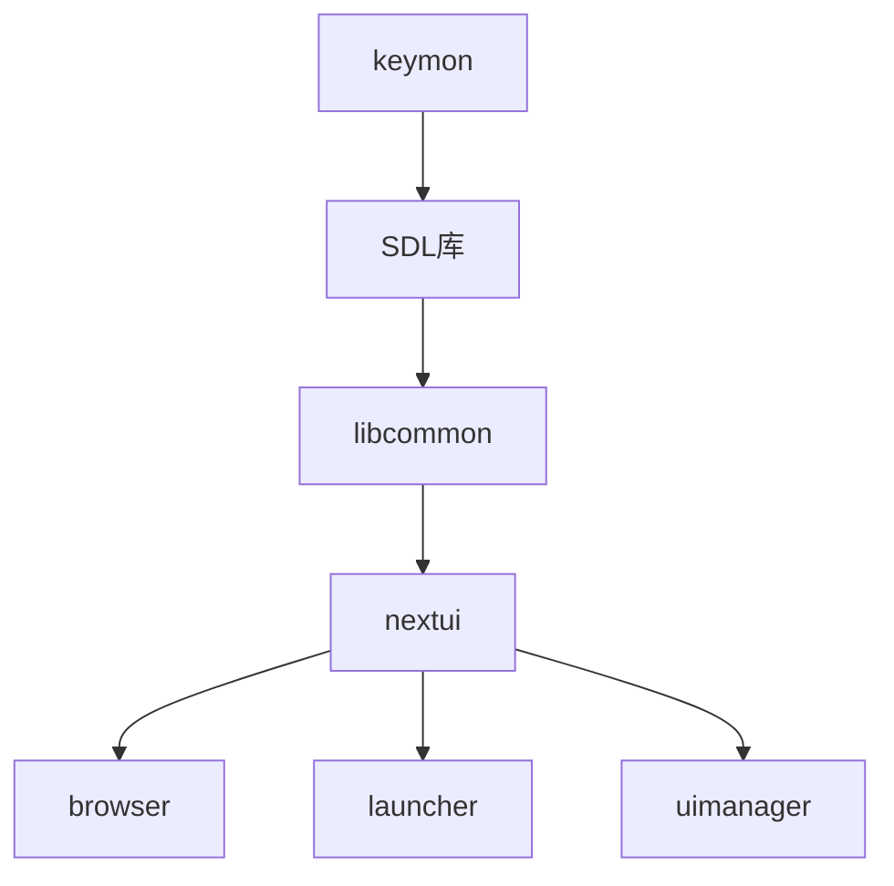

# 事件驱动架构

<cite>
**本文档中引用的文件**  
- [nextui.c](file://workspace/apps/nextui/nextui.c)
- [globals.h](file://workspace/apps/nextui/include/globals.h)
- [keymon.c](file://workspace/system/keymon/keymon.c)
- [api.c](file://workspace/lib/libcommon/api.c)
- [platform.c](file://workspace/lib/libcommon/platform.c)
</cite>

## 目录
1. [简介](#简介)
2. [项目结构](#项目结构)
3. [核心组件](#核心组件)
4. [架构概述](#架构概述)
5. [详细组件分析](#详细组件分析)
6. [依赖分析](#依赖分析)
7. [性能考量](#性能考量)
8. [故障排除指南](#故障排除指南)
9. [结论](#结论)

## 简介
NextUI 是一个基于事件驱动架构的用户界面系统，专为嵌入式游戏设备设计。其核心设计围绕一个主事件循环展开，该循环持续监听并处理来自不同事件源的输入，如硬件按键、定时器和系统信号。本文件全面解析其事件驱动机制，涵盖事件生成、分发、处理优先级、状态管理和性能优化策略。

## 项目结构
NextUI 的代码库采用模块化分层设计。核心应用逻辑位于 `workspace/apps/nextui/` 目录下，包含主程序 `nextui.c` 和多个功能模块（如 `browser.c`, `launcher.c`）。全局状态和数据结构定义在 `include/` 子目录中。输入事件的底层处理由独立的 `keymon` 服务（位于 `workspace/system/keymon/`）提供。平台无关的通用功能（如输入、图形、配置）被抽象到 `workspace/lib/libcommon/` 库中，实现了良好的代码复用和可维护性。

**图源**
- [nextui.c](file://workspace/apps/nextui/nextui.c)
- [globals.h](file://workspace/apps/nextui/include/globals.h)
- [keymon.c](file://workspace/system/keymon/keymon.c)
- [api.c](file://workspace/lib/libcommon/api.c)
- [platform.c](file://workspace/lib/libcommon/platform.c)

## 核心组件
NextUI 的核心组件包括主事件循环、事件源、事件分发器和全局状态管理器。主事件循环 (`nextui.c` 中的 `main` 函数) 是系统的中枢，它通过调用 `PAD_poll()` 轮询输入事件，并根据当前UI状态和用户输入执行相应的操作，如导航、启动应用或更新界面。全局状态变量（定义在 `globals.h` 中）在所有模块间共享，确保了状态的一致性。

**节源**
- [nextui.c](file://workspace/apps/nextui/nextui.c#L0-L199)
- [globals.h](file://workspace/apps/nextui/include/globals.h#L0-L32)

## 架构概述
NextUI 采用经典的事件驱动架构。其工作流程如下：硬件事件（如按键）首先被 `keymon` 服务捕获并转换为标准化的系统事件。主应用通过 `SDL_PollEvent` 接收这些事件。在主循环中，`PLAT_pollInput` 函数负责解析这些原始事件，更新内部的按键状态机，并生成“刚按下”、“刚释放”等瞬态事件。主循环的主体逻辑根据这些瞬态事件和当前UI状态 (`currentScreen`) 来决定执行哪个分支，从而驱动UI状态的转换和视觉反馈。

**图源**
- [nextui.c](file://workspace/apps/nextui/nextui.c#L200-L500)
- [keymon.c](file://workspace/system/keymon/keymon.c#L0-L199)
- [api.c](file://workspace/lib/libcommon/api.c#L2520-L2719)

## 详细组件分析

### 主事件循环分析
`nextui.c` 中的 `main` 函数实现了一个无限循环，构成了整个系统的主事件循环。循环的每次迭代都遵循“处理输入 -> 更新状态 -> 渲染UI”的模式。

#### 事件处理与状态转换
循环的核心是 `PAD_poll()` 调用，它更新了全局的 `pad` 结构体。随后，代码通过检查 `currentScreen` 变量的值来进入不同的UI模式分支（如游戏列表、快速菜单、游戏切换器）。在每个分支中，代码检查 `pad.justPressed` 等标志来判断用户意图。例如，当 `currentScreen` 为 `SCREEN_GAMELIST` 时，检测到 `BTN_A` 被按下，就会调用 `Entry_open` 来启动选中的游戏。

**图源**
- [nextui.c](file://workspace/apps/nextui/nextui.c#L200-L500)

#### 全局状态管理
`globals.h` 定义了所有跨模块共享的全局变量。这些变量是事件处理的“记忆”。例如，`top` 指针指向当前浏览的目录，`stack` 数组记录了目录导航的历史，`recents` 存储了最近运行的游戏。当用户进行导航时，这些全局变量被直接修改，从而改变了系统的整体状态。这种设计简化了模块间的通信，但要求开发者严格遵守约定，避免在多线程环境下产生竞态条件。

**节源**
- [globals.h](file://workspace/apps/nextui/include/globals.h#L0-L32)
- [nextui.c](file://workspace/apps/nextui/nextui.c#L0-L199)

### 事件源分析
`keymon.c` 是一个独立的守护进程，负责监控 `/dev/input/event*` 设备文件。它通过 `read()` 系统调用非阻塞地读取内核生成的 `input_event` 结构。该程序将特定的硬件扫描码（如 `CODE_MENU0`, `CODE_PLUS`）映射到逻辑按键，并通过 `SetMute()`、`SetBrightness()` 等函数将事件传递给系统。这实现了硬件抽象，使得主应用无需关心底层硬件细节。

**节源**
- [keymon.c](file://workspace/system/keymon/keymon.c#L0-L199)

### 事件分发与渲染分析
`PLAT_pollInput` (在 `api.c` 中实现) 是事件分发的关键。它从SDL事件队列中取出事件，根据扫描码将其转换为NextUI内部的按键ID（如 `BTN_A`, `BTN_MENU`），并维护一个状态机。该函数不仅记录按键的当前状态 (`is_pressed`)，还通过 `just_pressed` 和 `just_released` 标志来生成瞬时事件，这极大地简化了主循环中的逻辑判断。渲染由 `GFX_flip()` 函数完成，它最终调用SDL的 `SDL_Flip()` 或 `SDL_GL_SwapWindow()` 来交换前后缓冲区，实现画面的更新。

**节源**
- [api.c](file://workspace/lib/libcommon/api.c#L2520-L2719)
- [nextui.c](file://workspace/apps/nextui/nextui.c#L799-L1210)

## 依赖分析
NextUI 的组件间依赖关系清晰。主应用 (`nextui.c`) 依赖于 `libcommon` 库提供的API（输入、图形、配置）。`libcommon` 库又依赖于SDL等第三方库。`keymon` 服务与主应用通过SDL事件队列进行松耦合通信。这种分层依赖确保了核心逻辑的独立性，便于单元测试和功能替换。

**图源**
- [nextui.c](file://workspace/apps/nextui/nextui.c)
- [api.c](file://workspace/lib/libcommon/api.c)

## 性能考量
主循环通过 `GFX_sync_fixed_rate(60.0)` 限制在60FPS，保证了流畅的动画效果。然而，在非脏状态时使用 `SDL_Delay(17)` 进行忙等待，这会浪费CPU资源。更优的方案是使用基于 `SDL_GetTicks()` 的精确延迟或事件驱动的唤醒机制。此外，`GFX_flip()` 调用前的大量条件渲染逻辑可能导致帧时间不稳定，建议对复杂的动画进行性能剖析和优化。

## 故障排除指南
*   **UI无响应**: 检查 `keymon` 服务是否正常运行 (`ps | grep keymon`)。确认 `/dev/input/event*` 设备文件存在且可读。
*   **按键失灵**: 在 `keymon.c` 中添加日志，确认硬件事件是否被捕获。检查扫描码 (`ev.code`) 是否与代码中定义的 `CODE_*` 常量匹配。
*   **画面撕裂**: 确认 `GFX_setVsync(VSYNC_STRICT)` 已启用，并检查底层图形驱动是否支持垂直同步。
*   **内存泄漏**: 注意在 `nextui.c` 的渲染循环中，`IMG_Load()` 加载的图片表面 (`bmp`) 在使用后必须通过 `SDL_FreeSurface()` 释放，否则会导致内存持续增长。

**节源**
- [nextui.c](file://workspace/apps/nextui/nextui.c#L500-L800)
- [keymon.c](file://workspace/system/keymon/keymon.c)

## 结论
NextUI 的事件驱动架构设计高效且清晰。通过将事件源、分发器和处理器分离，系统实现了良好的模块化。主事件循环作为控制中心，协调全局状态的变更和UI的渲染。尽管存在一些性能优化空间，但其基于状态机的UI导航和基于瞬时事件的输入处理模式，为构建响应迅速的嵌入式UI提供了坚实的基础。未来的优化方向包括实现事件合并、引入非阻塞I/O以及更精细的功耗管理。