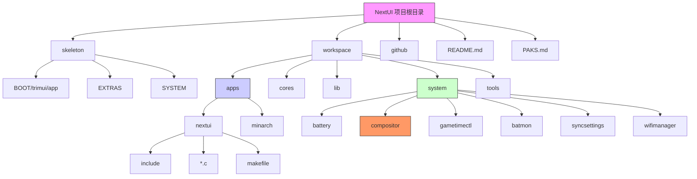
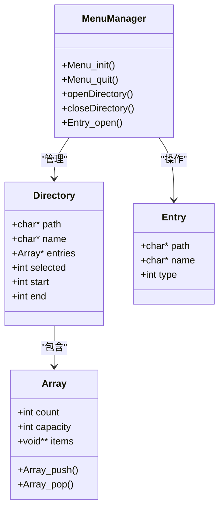
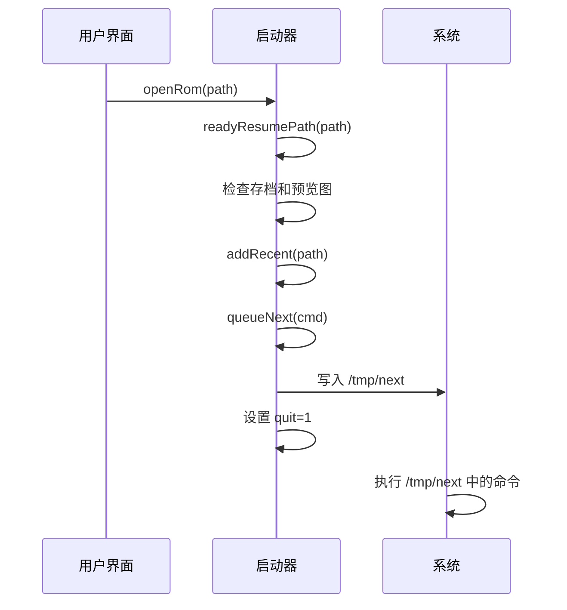
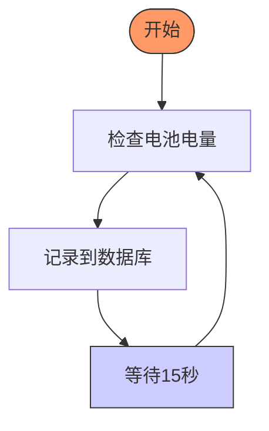
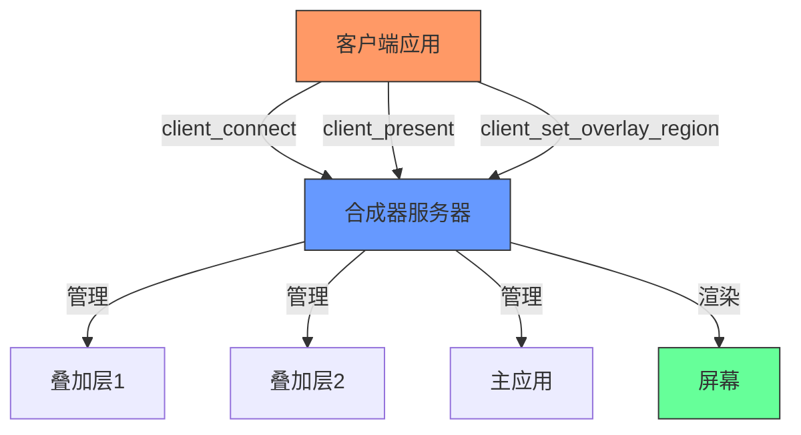
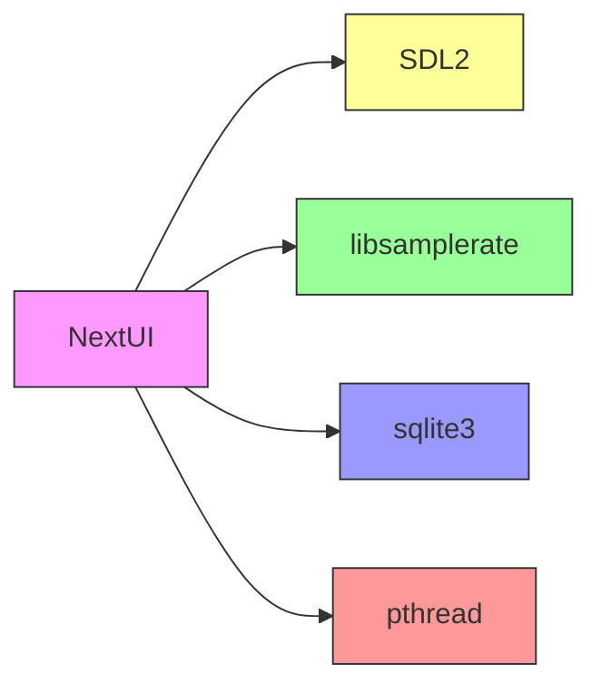

<docs>
# 项目概述

<cite>
**本文档引用的文件**   
- [README.md](file://README.md)
- [PAKS.md](file://PAKS.md)
- [nextui.c](file://workspace/apps/nextui/nextui.c)
- [globals.h](file://workspace/apps/nextui/include/globals.h)
- [uimanager.c](file://workspace/apps/nextui/uimanager.c)
- [uimanager.h](file://workspace/apps/nextui/include/uimanager.h)
- [launcher.c](file://workspace/apps/nextui/launcher.c)
- [launcher.h](file://workspace/apps/nextui/include/launcher.h)
- [datastructures.c](file://workspace/apps/nextui/datastructures.c)
- [datastructures.h](file://workspace/apps/nextui/include/datastructures.h)
- [minarch.c](file://workspace/apps/minarch/minarch.c)
- [sysui.c](file://workspace/lib/libcommon/sysui.c)
- [sysui.h](file://workspace/lib/libcommon/sysui.h)
- [gametimectl.c](file://workspace/system/gametimectl/gametimectl.c)
- [batmon.c](file://workspace/system/batmon/batmon.c)
- [syncsettings.c](file://workspace/system/syncsettings/syncsettings.c)
- [compositor/README.md](file://workspace/system/compositor/README.md) - *新增，详细说明合成器系统*
- [compositor.c](file://workspace/system/compositor/compositor.c) - *新增，合成器核心实现*
- [client_lib.h](file://workspace/system/compositor/client_lib/client_lib.h) - *新增，客户端库接口*
</cite>

## 更新摘要
**已更新内容**
- 在“项目结构”和“架构概览”部分新增了对合成器（Compositor）系统的描述。
- 在“核心组件”部分新增了 `compositor` 作为关键系统服务。
- 在“详细组件分析”部分新增了“合成器系统分析”章节。
- 更新了架构图，以反映新的合成器层。

**新增部分**
- 新增“合成器系统分析”章节，详细介绍了其设计、协议和使用方法。
- 新增了合成器系统的架构图。

**已弃用/移除部分**
- 无

**来源跟踪系统更新**
- 在文档开头的引用文件列表中添加了 `compositor` 相关的新文件。
- 为新的“合成器系统分析”章节和图表添加了详细的来源。

## 目录
1. [简介](#简介)
2. [项目结构](#项目结构)
3. [核心组件](#核心组件)
4. [架构概览](#架构概览)
5. [详细组件分析](#详细组件分析)
6. [依赖分析](#依赖分析)
7. [性能考量](#性能考量)
8. [故障排除指南](#故障排除指南)
9. [结论](#结论)

## 简介
NextUI 是一个为 TrimUI Brick 和 Smart Pro 设备设计的自定义固件（CFW），它基于 MinUI 进行了深度重构，旨在解决原生固件存在的诸多问题并提供丰富的功能扩展。该项目的核心目标是通过重建模拟器引擎来消除屏幕撕裂和同步卡顿问题，同时引入一系列现代化特性，如高质量音频重采样、低延迟输入、OpenGL/GPU 加速、WiFi 集成、游戏时间追踪和可定制的用户界面。NextUI 不仅是一个用户界面，更是一个完整的系统解决方案，集成了电池监控、LED 控制、动态 CPU 频率调节等系统级服务，为复古游戏爱好者提供了卓越的用户体验。

## 项目结构
NextUI 项目采用模块化设计，其文件结构清晰地反映了其功能划分。项目根目录包含关键的文档文件（如 README.md 和 PAKS.md），以及用于构建和管理的顶层 Makefile。核心代码位于 `workspace` 目录下，分为 `apps`、`cores`、`lib`、`system` 等子目录。`skeleton` 目录则包含了固件的初始文件系统结构，其中 `SYSTEM` 目录存放系统配置和语言文件，`EXTRAS` 目录则预置了各种模拟器和工具的 `.pak` 扩展包。值得注意的是，`workspace/system/compositor` 目录是新引入的合成器系统的核心，它包含服务端（`compositor.elf`）、客户端库（`client_lib`）和协议定义（`protocol.h`）。



**图源**
- [README.md](file://README.md)
- [workspace/apps/nextui/nextui.c](file://workspace/apps/nextui/nextui.c)
- [workspace/system/gametimectl/gametimectl.c](file://workspace/system/gametimectl/gametimectl.c)
- [workspace/system/compositor/compositor.c](file://workspace/system/compositor/compositor.c) - *新增*

## 核心组件
NextUI 的核心功能由几个关键组件协同实现。主用户界面由 `nextui` 应用负责，它使用 SDL2 进行图形渲染和事件处理。底层的模拟器引擎是 `minarch`，一个轻量级的 libretro 前端，负责加载和运行各种模拟器核心。系统级服务，如电池监控（`batmon`）和游戏时间追踪（`gametimectl`），作为独立的守护进程在后台运行。此外，`libcommon` 库提供了跨组件的通用功能，如配置管理、平台抽象和用户界面渲染。**新增的关键组件是 `compositor`（合成器）**，它是一个基于客户端/服务器架构的图形合成器，负责管理多个应用的窗口和UI，支持叠加层和双模应用，极大地增强了系统的灵活性和多任务处理能力。

**组件源**
- [nextui.c](file://workspace/apps/nextui/nextui.c)
- [minarch.c](file://workspace/apps/minarch/minarch.c)
- [gametimectl.c](file://workspace/system/gametimectl/gametimectl.c)
- [batmon.c](file://workspace/system/batmon/batmon.c)
- [sysui.c](file://workspace/lib/libcommon/sysui.c)
- [compositor.c](file://workspace/system/compositor/compositor.c) - *新增*

## 架构概览
NextUI 的整体架构遵循分层设计原则。最上层是用户界面层（`nextui`），负责与用户交互和展示内容。中间层是应用逻辑层，处理导航、启动游戏和管理扩展包（Paks）。底层是系统服务层和模拟器执行层。`nextui` 通过调用 `minarch` 来启动游戏，并通过系统调用与后台守护进程（如 `batmon` 和 `gametimectl`）进行通信。**新增的合成器层（`compositor`）位于系统服务层之上，为 `nextui` 和其他“叠加层”应用（如状态栏、图标）提供了一个统一的窗口管理和图形合成环境**。这种架构确保了各组件的职责分离，提高了代码的可维护性和可扩展性。

```mermaid
graph TD
UI[用户界面 (nextui)] --> AL[应用逻辑]
AL --> SS[系统服务]
AL --> ME[模拟器引擎 (minarch)]
SS --> BM[电池监控 (batmon)]
SS --> GT[游戏时间追踪 (gametimectl)]
SS --> WS[WiFi管理]
SS --> LC[LED控制]
ME --> LR[Libretro 模拟器核心]
SS --> COMP[合成器 (compositor)]
COMP --> OVERLAY[叠加层应用]
COMP --> NEXTUI[主应用 (nextui)]
style UI fill:#f96,stroke:#333
style SS fill:#6f9,stroke:#333
style ME fill:#69f,stroke:#333
style COMP fill:#9f9,stroke:#333
```

**图源**
- [nextui.c](file://workspace/apps/nextui/nextui.c)
- [minarch.c](file://workspace/apps/minarch/minarch.c)
- [gametimectl.c](file://workspace/system/gametimectl/gametimectl.c)
- [batmon.c](file://workspace/system/batmon/batmon.c)
- [compositor.c](file://workspace/system/compositor/compositor.c) - *新增*

## 详细组件分析
### 用户界面管理器分析
用户界面管理器（`uimanager`）是 `nextui` 应用的核心，负责管理目录堆栈、快速菜单和导航逻辑。它通过 `Menu_init` 函数初始化，创建一个包含根目录的堆栈，并加载最近的游戏列表。`openDirectory` 函数用于进入新的目录，它会创建一个新的 `Directory` 对象并将其压入堆栈。`Entry_open` 函数则根据条目类型决定是打开一个 ROM、一个 `.pak` 文件还是一个系统工具。



**图源**
- [uimanager.c](file://workspace/apps/nextui/uimanager.c)
- [uimanager.h](file://workspace/apps/nextui/include/uimanager.h)
- [datastructures.h](file://workspace/apps/nextui/include/datastructures.h)

### 启动器模块分析
启动器模块（`launcher`）负责游戏和应用的启动流程。`openRom` 函数处理 ROM 文件的启动，它会检查是否存在 `.m3u` 播放列表，并调用 `readyResumePath` 函数来准备恢复状态。`readyResumePath` 会检查存档文件和预览图是否存在，从而决定是否可以恢复游戏。`queueNext` 函数是启动的关键，它将启动命令写入 `/tmp/next` 文件，然后设置 `quit` 标志，使主循环退出，从而让系统执行新的命令。



**图源**
- [launcher.c](file://workspace/apps/nextui/launcher.c)
- [launcher.h](file://workspace/apps/nextui/include/launcher.h)

### 系统服务分析
NextUI 的系统服务是其强大功能的基石。`gametimectl` 是一个命令行工具，用于跟踪游戏的游玩时间。它通过 `start`、`stop` 和 `resume` 等子命令来管理游戏会话，并将数据存储在 SQLite 数据库中。`batmon` 是一个常驻后台的守护进程，它定期（每15秒）检查电池电量，并将数据记录到数据库中，用于生成电池使用历史图表和预测剩余时间。`syncsettings` 则是一个简单的工具，用于在启动第三方应用后同步恢复 NextUI 的亮度和音量设置。



**图源**
- [gametimectl.c](file://workspace/system/gametimectl/gametimectl.c)
- [batmon.c](file://workspace/system/batmon/batmon.c)
- [syncsettings.c](file://workspace/system/syncsettings/syncsettings.c)

### 合成器系统分析
合成器系统是 NextUI 中一个新引入的、至关重要的组件，它为系统带来了多窗口和叠加层支持。该系统采用客户端/服务器架构，由 `compositor.elf` 服务端和 `client_lib` 客户端库组成。

**核心设计**:
- **双模应用**: 应用程序可以设计为“双模”，即在有合成器时作为客户端运行，在没有合成器时独立运行。这通过 `client_connect()` 函数的返回值来判断。
- **叠加层 (Overlay)**: 合成器支持最多4个叠加层，每个叠加层可以被设置在屏幕的任意矩形区域内。客户端通过 `client_set_overlay_region()` API 来请求一个叠加层位置。
- **协议通信**: 客户端与合成器通过 Unix 域套接字和共享内存进行通信。`protocol.h` 定义了注册、帧提交和管理命令等消息格式。

**关键API**:
- `client_connect(slot_hint, app_name, type)`: 连接到合成器，获取连接句柄。
- `client_get_render_buffer()`: 获取用于渲染的帧缓冲区指针。
- `client_present(buffer_ptr)`: 将渲染完成的帧提交给合成器。
- `client_set_overlay_region(overlay_index, x, y, w, h)`: 将当前客户端设置为指定区域的叠加层。



**图源**
- [compositor/README.md](file://workspace/system/compositor/README.md) - *主要设计文档*
- [compositor.c](file://workspace/system/compositor/compositor.c) - *服务端实现*
- [client_lib.h](file://workspace/system/compositor/client_lib/client_lib.h) - *客户端API定义*

## 依赖分析
NextUI 项目依赖于多个外部库和框架。其图形渲染基于 SDL2 库，提供了跨平台的窗口、输入和图形上下文管理。音频处理依赖于 `libsamplerate` 库，以实现高质量的音频重采样。系统服务使用 `sqlite3` 库来持久化存储游戏时间和电池数据。项目还大量使用了 POSIX 线程（`pthread`）来实现并发，例如在 `batmon` 中运行一个独立的线程来监控电池。这些依赖关系通过 `Makefile` 进行管理，确保了构建过程的自动化。



**图源**
- [workspace/apps/nextui/nextui.c](file://workspace/apps/nextui/nextui.c)
- [workspace/apps/minarch/minarch.c](file://workspace/apps/minarch/minarch.c)
- [workspace/system/batmon/batmon.c](file://workspace/system/batmon/batmon.c)
- [workspace/system/gametimectl/gametimectl.c](file://workspace/system/gametimectl/gametimectl.c)

## 性能考量
NextUI 在性能方面进行了精心优化。通过使用 OpenGL/GPU 进行全图形加速，显著提升了界面渲染速度。`minarch` 引擎实现了严格的垂直同步（VSYNC_STRICT），有效解决了屏幕撕裂问题，并将平均延迟降低到 20ms 左右。动态 CPU 频率调节功能（Dynamic CPU Speed Scaling